# MarketFlip - POC Documentation

---

## Table of Contents

1. [System Overview](#system-overview)
2. [Authentication Flow](#authentication-flow)
3. [Buyer Flow](#buyer-flow)
4. [Shop Owner Flow](#shop-owner-flow)
5. [Bid Selection Flow](#bid-selection-flow)
6. [API Endpoints Summary](#api-endpoints-summary)
7. [Database Schema](#database-schema)
8. [RLS Policies](#rls-policies)
9. [Error Handling](#error-handling)

---

## System Overview

MarketFlip is a two-sided marketplace connecting buyers and shop owners. Buyers post requests for products, and shop owners bid on those requests. The system handles the complete lifecycle from request creation to bid selection.

### System Architecture Flow

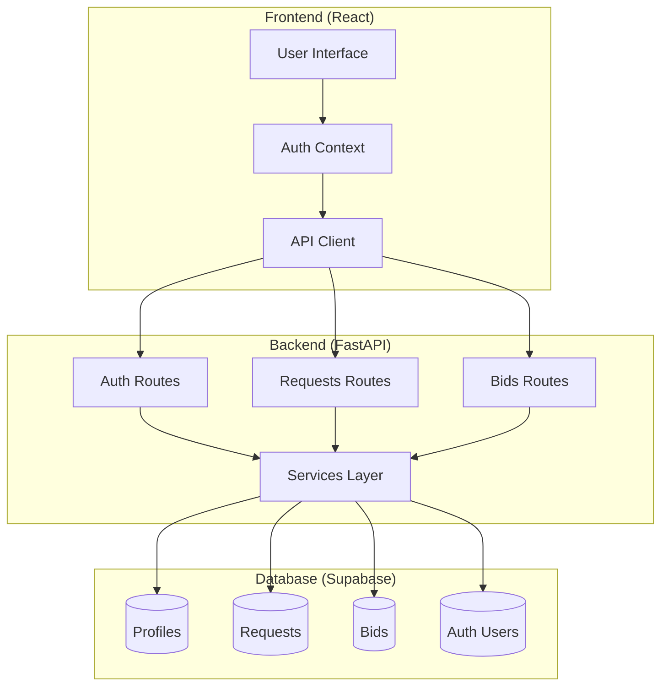

### User Roles

| Role | Description | Capabilities |
|------|-------------|--------------|
| **Buyer** | User looking to purchase products | Post requests, view bids, select bids, delete own requests |
| **Shop Owner** | User looking to sell products | Browse requests, place bids, manage own bids |

### Core Workflow

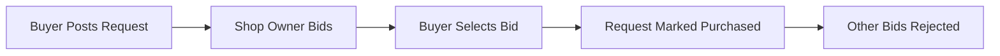

---

## Authentication Flow

### 1. User Registration (Signup)

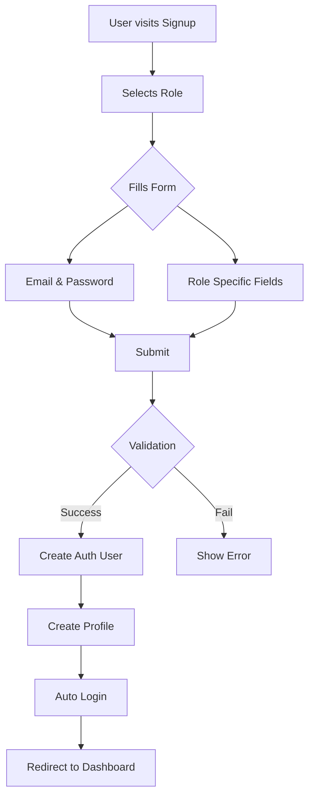

**Request Payload:**

```json
{
  "email": "buyer@example.com",
  "password": "TestPass123!",
  "role": "buyer",
  "address": "123 Main Street",
  "pincode": "110001",
  "phone": "9876543210",
  "shop_name": null  // Required for shop_owner
}
```

**Response:**

```json
{
  "user_id": "uuid_here",
  "email": "buyer@example.com",
  "role": "buyer",
  "pincode": "110001"
}
```

**Redirect:**
- Buyer → `/buyer/dashboard`
- Shop Owner → `/shop/dashboard`

---

### 2. User Login

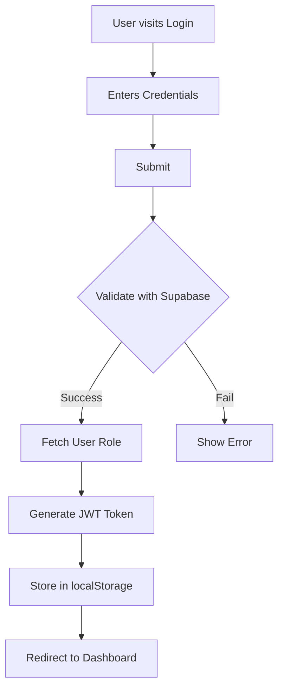

**Request Payload:**

```json
{
  "email": "buyer@example.com",
  "password": "TestPass123!"
}
```

**Response:**

```json
{
  "access_token": "eyJhbGciOiJFUzI1NiIs...",
  "role": "buyer",
  "user_id": "uuid_here"
}
```

**Redirect:**
- Buyer → `/buyer/dashboard`
- Shop Owner → `/shop/dashboard`

---

### 3. Authentication State Management

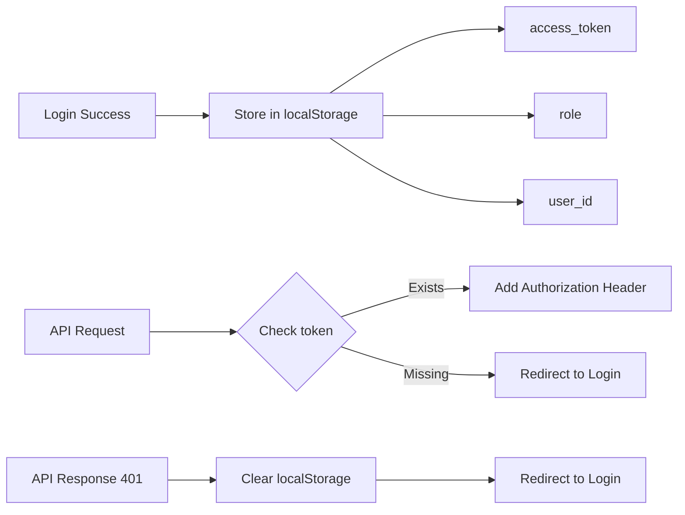

---

## Buyer Flow

### 1. Buyer Dashboard

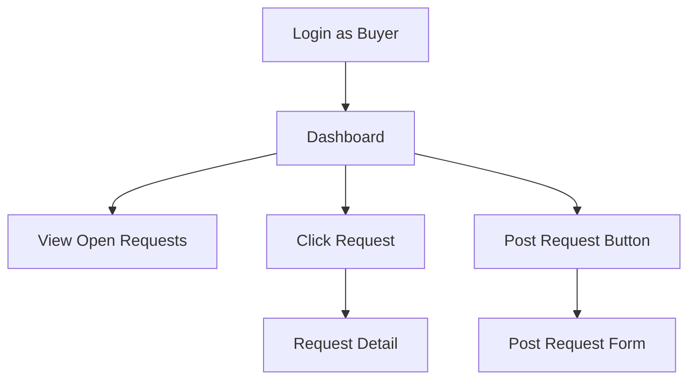

### 2. Post Request

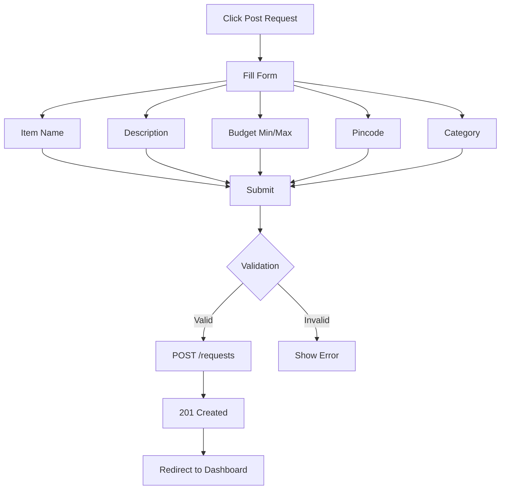

**Request Payload:**

```json
{
  "item_name": "iPhone 15 Pro",
  "description": "Looking for new iPhone 15 Pro, 256GB",
  "budget_min": 80000,
  "budget_max": 100000,
  "pincode": "110001",
  "category": "electronics"
}
```

**Response:**

```json
{
  "id": "request_uuid",
  "buyer_id": "buyer_uuid",
  "item_name": "iPhone 15 Pro",
  "budget_min": 80000,
  "budget_max": 100000,
  "pincode": "110001",
  "status": "open",
  "created_at": "2026-08-05T...",
  "expires_at": "2026-08-12T..."
}
```

---

### 3. Request Detail & Bid Selection

```mermaid
flowchart TD
    A[Click Request] --> B[Request Detail]
    B --> C[View Request Info]
    B --> D[View Bids]
    B --> E[Delete Request]
    
    D --> F[Select Bid]
    F --> G{Confirm Selection?}
    G -->|Yes| H[PATCH /bids/{id}/select]
    G -->|No| I[Cancel]
    
    H --> J[Update Selected Bid → selected]
    H --> K[Update Other Bids → rejected]
    H --> L[Update Request → purchased]
    J --> M[Show Shop Contact]
    K --> M
    L --> M
```

**Select Bid Payload:**

```json
// PATCH /bids/{bid_id}/select
// No request body required
```

**Select Bid Response:**

```json
{
  "bid_id": "bid_uuid",
  "request_id": "request_uuid",
  "status": "selected",
  "selected_bid": {
    "id": "bid_uuid",
    "price": 85000,
    "note": "Available in black",
    "status": "selected",
    "shop_name": "Tech Store",
    "shop_phone": "9876543211",
    "shop_address": "456 Market Road"
  },
  "shop_contact": {
    "shop_name": "Tech Store",
    "phone": "9876543211",
    "address": "456 Market Road"
  }
}
```

**Delete Request:**

```http
DELETE /requests/{request_id}
Authorization: Bearer {token}
```

**Delete Response:** `204 No Content`

---

## Shop Owner Flow

### 1. Shop Owner Dashboard

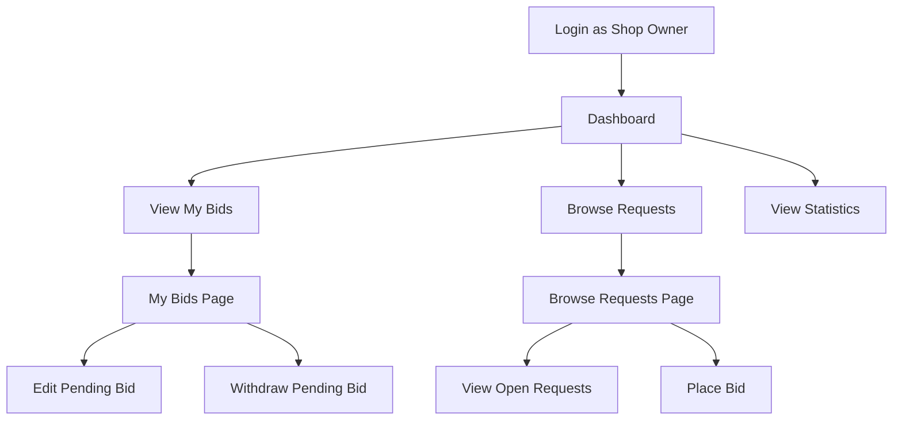

---

### 2. Browse & Place Bid

```mermaid
flowchart TD
    A[Browse Requests] --> B[Apply Filters]
    B --> C[Pincode]
    B --> D[Category]
    B --> E[Status]
    
    C --> F[View Requests]
    D --> F
    E --> F
    
    F --> G{Has Pending Bid?}
    G -->|Yes| H[Show Already Bid]
    G -->|No| I[Show Bid Form]
    
    I --> J[Enter Price]
    I --> K[Enter Note]
    J --> L[Submit]
    K --> L
    
    L --> M[POST /requests/{id}/bids]
    M --> N[201 Created]
    N --> O[Refresh View]
```

**Bid Request Payload:**

```json
// POST /requests/{request_id}/bids
{
  "price": 85000,
  "note": "Available in black, 1 year warranty"
}
```

**Bid Response:**

```json
{
  "id": "bid_uuid",
  "request_id": "request_uuid",
  "shop_id": "shop_uuid",
  "price": 85000,
  "note": "Available in black, 1 year warranty",
  "status": "pending",
  "created_at": "2026-08-05T..."
}
```

---

### 3. My Bids Management

```mermaid
flowchart TD
    A[My Bids] --> B[View All Bids]
    B --> C{Status?}
    
    C -->|Pending| D[Edit Bid]
    C -->|Pending| E[Withdraw Bid]
    C -->|Selected| F[View Only]
    C -->|Rejected| F[View Only]
    
    D --> G[Update Price]
    D --> H[Update Note]
    G --> I[PATCH /bids/{id}]
    H --> I
    I --> J[200 OK]
    
    E --> K[DELETE /bids/{id}]
    K --> L[204 No Content]
```

**Update Bid Payload:**

```json
// PATCH /bids/{bid_id}
{
  "price": 82000,
  "note": "Updated: Available with 2 year warranty"
}
```

**Update Bid Response:**

```json
{
  "id": "bid_uuid",
  "request_id": "request_uuid",
  "shop_id": "shop_uuid",
  "price": 82000,
  "note": "Updated: Available with 2 year warranty",
  "status": "pending",
  "created_at": "2026-08-05T..."
}
```

---

## Bid Selection Flow

### Complete Bid Lifecycle

```mermaid
flowchart TD
    A[Shop Owner Places Bid] --> B[Status: Pending]
    B --> C{Decision}
    
    C -->|Buyer Selects| D[PATCH /bids/{id}/select]
    D --> E[Status: Selected]
    D --> F[Other Bids: Rejected]
    D --> G[Request: Purchased]
    
    C -->|Buyer Rejects| H[Status: Rejected]
    
    C -->|Shop Owner Withdraws| I[DELETE /bids/{id}]
    I --> J[Bid Removed]
    
    C -->|Shop Owner Updates| K[PATCH /bids/{id}]
    K --> L[Status: Pending]
    K --> M[Updated Price/Note]
```

### Bid Selection Transaction Flow

```mermaid
flowchart TD
    A[Buyer Clicks Select Bid] --> B[Confirm Selection]
    B --> C{Confirmed?}
    C -->|No| D[Cancel]
    C -->|Yes| E[PATCH /bids/{id}/select]
    
    E --> F[Update Selected Bid to 'selected']
    E --> G[Update Other Bids to 'rejected']
    E --> H[Update Request to 'purchased']
    E --> I[Get Shop Contact Info]
    
    F --> J[Return Response]
    G --> J
    H --> J
    I --> J
    
    J --> K[Show Shop Contact]
    K --> L[Request Details Updated]
```

---

## API Endpoints Summary

### Auth Endpoints

| Method | Endpoint | Description | Auth | Payload |
|--------|----------|-------------|------|---------|
| POST | `/auth/signup` | Register new user | ❌ | `{email, password, role, address, pincode, phone, shop_name?}` |
| POST | `/auth/login` | Login user | ❌ | `{email, password}` |

### Requests Endpoints (Buyer)

| Method | Endpoint | Description | Auth | Payload |
|--------|----------|-------------|------|---------|
| POST | `/requests` | Create new request | ✅ Buyer | `{item_name, description?, budget_min, budget_max, pincode, category?}` |
| GET | `/requests` | List all open requests | ✅ All | Query: `?status=open&pincode=&category=` |
| GET | `/requests/{id}` | Get request details with bids | ✅ All | - |
| DELETE | `/requests/{id}` | Soft delete request | ✅ Buyer | - |

### Bids Endpoints (Shop Owner)

| Method | Endpoint | Description | Auth | Payload |
|--------|----------|-------------|------|---------|
| POST | `/requests/{id}/bids` | Place bid on request | ✅ Shop | `{price, note?}` |
| GET | `/requests/{id}/bids` | Get bids for a request | ✅ All | - |
| GET | `/bids` | Get all bids for current user | ✅ All | Query: `?request_id=` |
| PATCH | `/bids/{id}` | Update pending bid | ✅ Shop | `{price?, note?}` |
| DELETE | `/bids/{id}` | Withdraw bid | ✅ Shop | - |
| PATCH | `/bids/{id}/select` | Select a bid | ✅ Buyer | - |

---

## Database Schema

### Entity Relationship Diagram

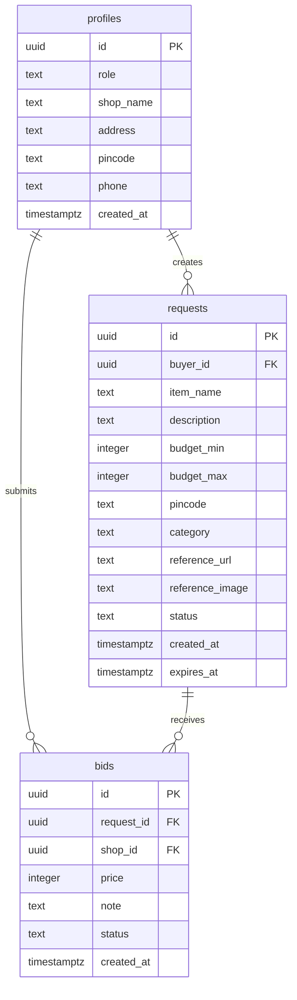

### Profiles Table

```sql
profiles:
- id: uuid (PK, references auth.users)
- role: text (buyer/shop_owner)
- shop_name: text (nullable, shop_owner only)
- address: text
- pincode: text (6 chars)
- phone: text
- created_at: timestamptz
```

### Requests Table

```sql
requests:
- id: uuid (PK)
- buyer_id: uuid (FK → profiles.id)
- item_name: text
- description: text (nullable)
- budget_min: integer
- budget_max: integer
- pincode: text (6 chars)
- category: text (default: electronics)
- reference_url: text (nullable)
- reference_image: text (nullable)
- status: text (open/purchased/deleted/expired)
- created_at: timestamptz
- expires_at: timestamptz (default: now() + 7 days)
```

### Bids Table

```sql
bids:
- id: uuid (PK)
- request_id: uuid (FK → requests.id)
- shop_id: uuid (FK → profiles.id)
- price: integer
- note: text (nullable)
- status: text (pending/selected/rejected)
- created_at: timestamptz
```

---

## Status Flow Diagrams

### Request Status Lifecycle

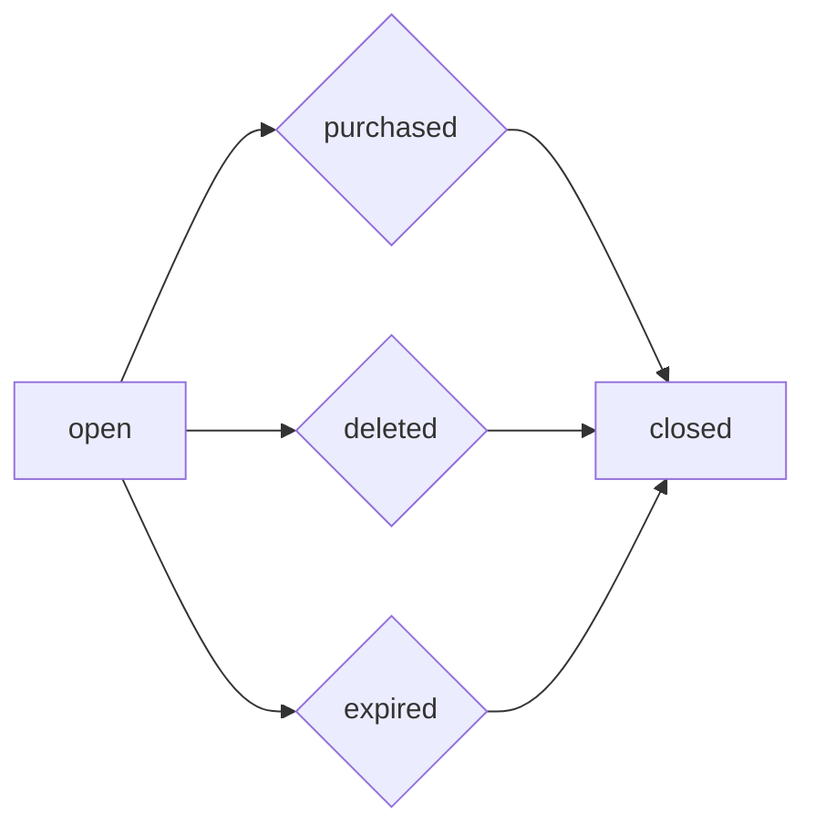

### Bid Status Lifecycle

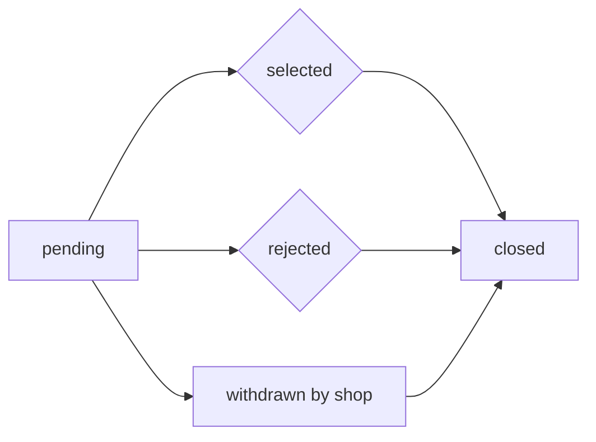

---

## Error Handling

### Common Error Codes

| Status | Description | Solution |
|--------|-------------|----------|
| 200 | Success | - |
| 201 | Created | - |
| 204 | No Content (Delete Success) | - |
| 400 | Bad Request | Check validation errors |
| 401 | Unauthorized | Login again |
| 403 | Forbidden | Check user role/permissions |
| 404 | Not Found | Verify ID exists |
| 422 | Validation Error | Check request body |

### Error Messages

| Error | Meaning | Resolution |
|-------|---------|------------|
| "Only buyers can create requests" | Non-buyer trying to post | Check user role |
| "Only shop owners can place bids" | Non-shop trying to bid | Check user role |
| "Only buyers can select bids" | Non-buyer trying to select | Check user role |
| "Request is not open for bidding" | Request already purchased/deleted | Create new request |
| "You already have a pending bid on this request" | Duplicate bid | Withdraw existing bid |
| "Cannot update a bid that is not pending" | Bid already selected/rejected | Create new bid |
| "Bid is no longer pending" | Bid already selected/rejected | Create new bid |
| "You don't have permission" | User doesn't own resource | Check ownership |

---

## Frontend Routes

| Route | Page | Access |
|-------|------|--------|
| `/` | Landing | Public |
| `/login` | Login | Public |
| `/signup` | Signup | Public |
| `/buyer/dashboard` | Buyer Dashboard | Buyer only |
| `/buyer/post-request` | Post Request | Buyer only |
| `/buyer/request/{id}` | Request Detail | Buyer only |
| `/shop/dashboard` | Shop Dashboard | Shop Owner only |
| `/shop/browse` | Browse Requests | Shop Owner only |
| `/shop/my-bids` | My Bids | Shop Owner only |

---

## Testing Credentials

### Buyer Account
```
Email: buyer_test@example.com
Password: TestPass123!
```

### Shop Owner Account
```
Email: shop_owner@example.com
Password: TestPass123!
```

---

## Deployment Checklist

- [ ] Update API base URL in `api/client.js`
- [ ] Configure CORS for production domain
- [ ] Update Supabase credentials in `.env`
- [ ] Build frontend for production
- [ ] Set up database indexes for performance
- [ ] Configure email confirmation (if required)
- [ ] Set up monitoring and logging

---

## Version History

| Version | Date | Changes |
|---------|------|---------|
| 1.0.0 | 2026-08-05 | Initial release |
| 1.0.1 | 2026-08-05 | Added bid selection flow |
| 1.0.2 | 2026-08-05 | Fixed RLS issues with supabase_admin |
| 1.0.3 | 2026-08-05 | Completed buyer and shop flows |
| 1.0.4 | 2026-08-05 | Added flowcharts and diagrams |

---

## Support

For issues or questions, please refer to:
- API Documentation: `http://localhost:8000/docs`
- Supabase Dashboard: `https://app.supabase.com`
- Frontend: `http://localhost:5173`

---

**MarketFlip - Documentation**
