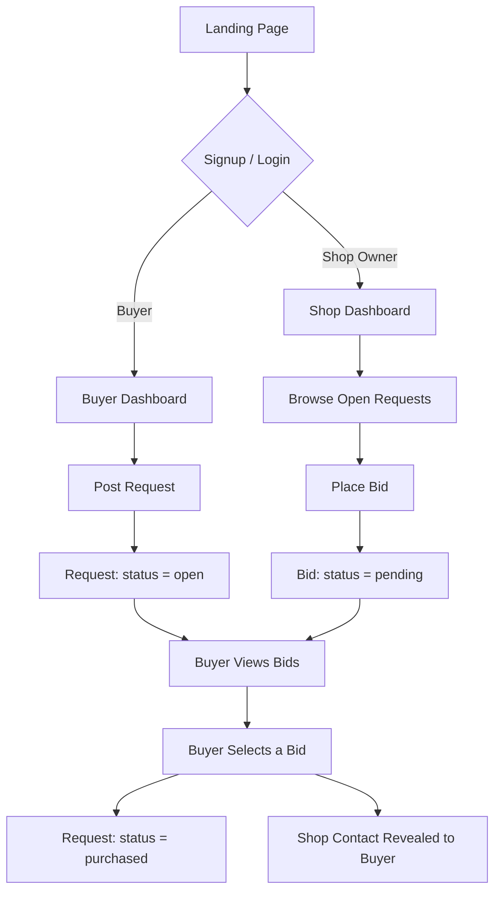
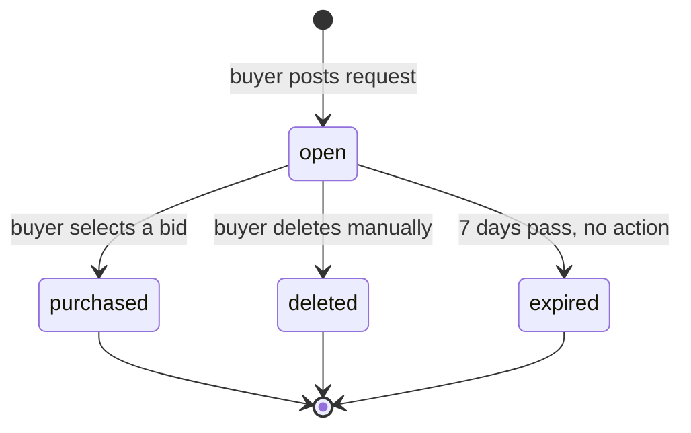
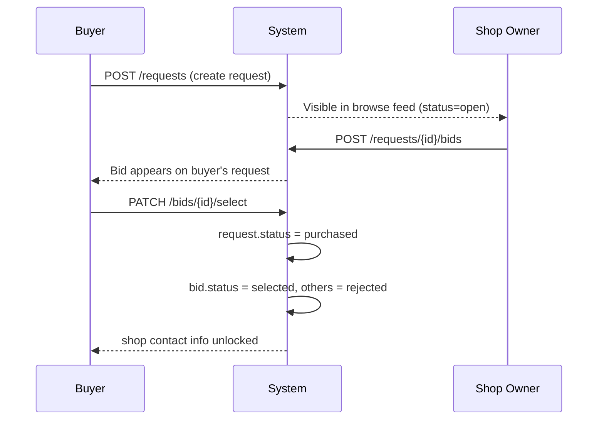

# MarketFlip
### Reverse Marketplace — POC Technical Documentation

| | |
|---|---|
| **Product** | MarketFlip |
| **Repository** | `mfx-core` (backend) · `mfx-web` (frontend) · `mfx-docs` (documentation) |
| **Status** | POC / Pre-development |
| **Category (v1)** | Electronics |
| **Owner** | Prateek |
| **Version** | 0.2 |

---

## 1. Overview

Buyer posts what they want to buy → Shop owners bid with their price → Buyer picks the best fit → Contact is revealed. No payments, no chat — the app only connects the two sides; the deal itself happens offline.

**Problem it solves:** offline price discovery is inefficient — buyer has no way to compare prices across local shops before visiting them. This flips the model: sellers compete for the buyer instead of the buyer hunting shop to shop.

**Geographic scope (POC):** Bhilai, Chhattisgarh only. Only shop owners registered with a Bhilai address can bid. Not a hard app restriction — just how signups/onboarding are limited during POC.

**Location matching:** address is collected at signup for credential/verification purposes (proves the shop is real, gives buyer confidence). Matching between buyers and shop owners is done via **pincode** (6-digit) — simpler and more precise than a free-text area field, no maps API needed.

---

## 2. Core Flow — 🔒 LOCKED SCOPE

> **Rule:** nothing outside this section gets built until this entire flow works end-to-end, tested, for both roles. This is the only thing that defines whether the POC is a success or failure.

### 2.1 User Journey



### 2.2 Request Lifecycle (State Diagram)



### 2.3 Bidding Sequence



---

## 3. Roles

| Role | Can do |
|---|---|
| **Buyer** | Post request, view own requests, view bids, select a bid, delete a request |
| **Shop Owner** | Register with address (Bhilai only, for POC), browse open requests within matching pincode, place bid, edit/withdraw own pending bid |

One account = one role, chosen at signup. Both roles provide address at signup (used for credential/verification, and to derive pincode for matching).

---

## 4. Screens (Core Flow Only)

1. Landing page
2. Signup / Login (role select)
3. Buyer Dashboard → My Requests
4. Post Request form
5. Shop Dashboard → Browse Requests
6. Bid form/modal
7. Request detail (buyer view, with bid list + select action)

---

## 5. API Contract

Base URL: `/api/v1`
Auth: Bearer token (Supabase JWT) in `Authorization` header for all routes below except signup/login.

### 5.1 Auth

**POST `/auth/signup`**
```json
// Request
{
  "email": "user@example.com",
  "password": "••••••••",
  "role": "buyer",              // "buyer" | "shop_owner"
  "address": "Street, Bhilai, Chhattisgarh",
  "pincode": "490001"             // used for matching, not shown publicly
}

// Response 201
{
  "user_id": "uuid",
  "email": "user@example.com",
  "role": "buyer",
  "pincode": "490001"
}
```

**POST `/auth/login`**
```json
// Request
{ "email": "user@example.com", "password": "••••••••" }

// Response 200
{
  "access_token": "jwt...",
  "role": "buyer",
  "user_id": "uuid"
}
```

### 5.2 Requests

**POST `/requests`** *(buyer only)*
```json
// Request
{
  "item_name": "Bluetooth Headphones",
  "description": "Over-ear, noise cancelling preferred",
  "budget_min": 1500,
  "budget_max": 3000,
  "pincode": "490001",
  "category": "electronics",
  "reference_url": "https://amazon.in/...",   // optional
  "reference_image": null                       // optional, storage path
}

// Response 201
{
  "request_id": "uuid",
  "status": "open",
  "created_at": "2026-08-01T10:00:00Z",
  "expires_at": "2026-08-08T10:00:00Z"
}
```

**GET `/requests?pincode=490001&category=electronics&status=open`** *(shop owner — browse feed, matches on exact pincode or nearby range)*
```json
// Response 200
{
  "requests": [
    {
      "request_id": "uuid",
      "item_name": "Bluetooth Headphones",
      "budget_min": 1500,
      "budget_max": 3000,
      "pincode": "490001",
      "bid_count": 3,
      "created_at": "2026-08-01T10:00:00Z"
    }
  ]
}
```

**GET `/requests/{id}`** *(detail, includes bids if owner)*
```json
// Response 200
{
  "request_id": "uuid",
  "item_name": "Bluetooth Headphones",
  "description": "Over-ear, noise cancelling preferred",
  "budget_min": 1500,
  "budget_max": 3000,
  "pincode": "490001",
  "status": "open",
  "bids": [
    {
      "bid_id": "uuid",
      "shop_name": "Sharma Electronics",
      "price": 1800,
      "note": "Have it in stock, JBL brand",
      "status": "pending"
    }
  ]
}
```

**DELETE `/requests/{id}`** *(buyer only, own request)* → `204 No Content`

### 5.3 Bids

**POST `/requests/{id}/bids`** *(shop owner only)*
```json
// Request
{ "price": 1800, "note": "Have it in stock, JBL brand" }

// Response 201
{
  "bid_id": "uuid",
  "request_id": "uuid",
  "price": 1800,
  "status": "pending",
  "created_at": "2026-08-01T11:00:00Z"
}
```

**PATCH `/bids/{id}`** *(shop owner, edit own pending bid)*
```json
// Request
{ "price": 1750, "note": "Updated: can do 1750 if picked up today" }
```

**DELETE `/bids/{id}`** *(shop owner, withdraw)* → `204 No Content`

**PATCH `/bids/{id}/select`** *(buyer only)*
```json
// Response 200
{
  "bid_id": "uuid",
  "status": "selected",
  "shop_contact": {
    "name": "Sharma Electronics",
    "phone": "+91XXXXXXXXXX"
  }
}
```

### 5.4 Standard Error Shape
```json
{
  "error": {
    "code": "REQUEST_NOT_FOUND",
    "message": "Request does not exist or has been deleted"
  }
}
```

---

## 6. Project Structure

**Repo split:**
- `mfx-core` — backend (FastAPI)
- `mfx-web` — frontend (React + Vite)
- `mfx-docs` — this documentation, ADRs, API contract, changelog

### Backend — `mfx-core` (FastAPI)
```
mfx-core/
├── main.py
├── config.py
├── auth/
│   ├── routes.py
│   └── dependencies.py
├── requests/
│   ├── routes.py
│   ├── schemas.py
│   └── service.py
├── bids/
│   ├── routes.py
│   ├── schemas.py
│   └── service.py
├── jobs/
│   └── expire_requests.py
└── requirements.txt
```

### Frontend — `mfx-web` (React + Vite)
```
mfx-web/src/
├── pages/
│   ├── Landing.jsx
│   ├── Login.jsx
│   ├── buyer/{Dashboard,PostRequest}.jsx
│   └── shop/{Dashboard,BrowseRequests}.jsx
├── components/     # Navbar, RequestCard, BidCard, BidModal
├── api/             # auth.js, requests.js, bids.js
├── context/          # AuthContext
└── App.jsx
```

**Rule going forward:** every new feature gets its own folder on both ends — never mixed into existing files. This is what makes it upgrade-friendly.

---

## 7. Stack (Free Tier Only)

| Layer | Tool | Tier |
|---|---|---|
| Frontend | React + Vite → Vercel | Free |
| Backend | FastAPI → Render | Free |
| DB / Auth / Storage | Supabase | Free |
| Cron | Supabase `pg_cron` / Edge Function | Free |

---

## 8. Risk Assessment

| Risk | Type | Notes |
|---|---|---|
| Chicken-egg problem | Product | No shops → empty requests → buyers leave. Manually onboard 5–10 shops before opening to buyers. |
| No trust/verification | Product | Buyer can't verify a shop before contact reveal. Acceptable for POC, flag for v2. |
| Free-tier cold starts | Technical | Render/Supabase free tier sleeps — expect slow first load in POC. Set expectations when demoing. |
| Auth/role redirect bugs | Technical | Common early failure point — test both roles fully before adding anything else. |
| Cron job silently not running | Technical | Verify auto-expire actually fires on Supabase free tier before relying on it. |
| Too few pincodes covered | Product | Bhilai-only for POC means low pincode diversity — if shop onboarding is thin, some pincodes may have zero matching shops. Fine for POC, note for later. |
| Scope creep | Process | Biggest real risk. Lock to Section 2 flow until it fully works — no exceptions. |
| Split focus across projects | Process | Running this alongside RAG_v2 risks losing track of both. Pick one active project at a time. |
| No training data for ML feature | Data | Price-suggestion model has nothing to learn from until real closed requests exist — expected, not a blocker. |

---

## 9. Explicitly Out of Scope (POC)
Payments · In-app chat · Ratings/reviews · Shop verification · Push notifications · Multiple categories

---

## 10. Things Worth Adding (cheap, still POC-friendly)
- Pincode-based matching — no maps API needed, just exact/nearby pincode lookup
- `category` field stored even though only "electronics" is used now
- Basic report/flag field on requests & shops (no full moderation system)
- Bid count badge on buyer's request card
- Generic "closed" message to shop owners on requests they bid on but weren't selected

---

## 11. Suggested Build Order
1. DB schema (users, requests, bids)
2. Auth + role redirect
3. Landing page
4. Post request (buyer)
5. Browse + bid (shop owner)
6. Review + select bid (buyer)
7. Contact reveal
8. Auto-expire cron
9. Polish (filters, badge, report flag)

