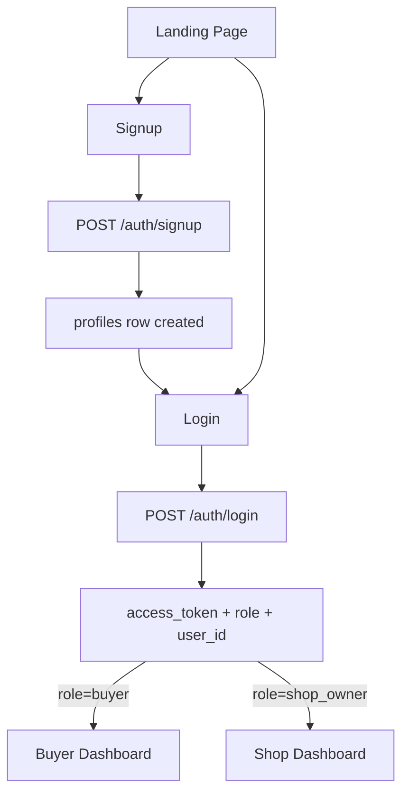
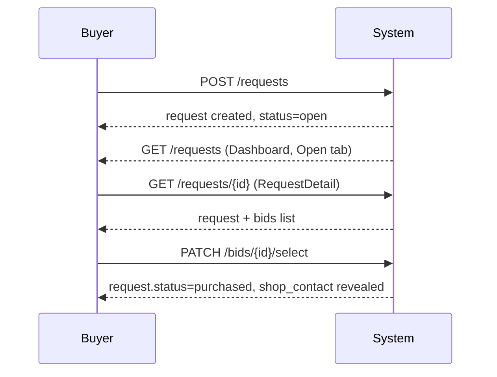
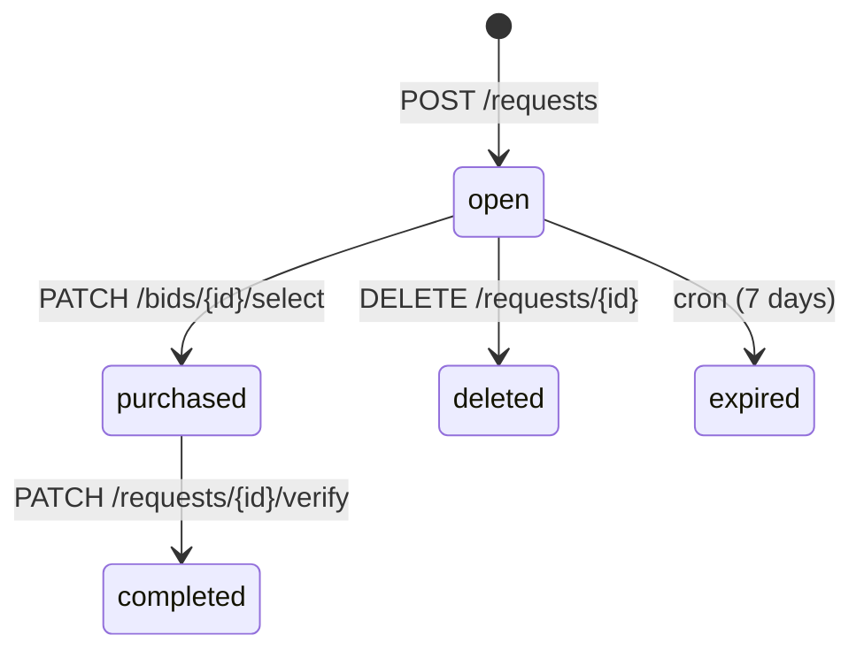
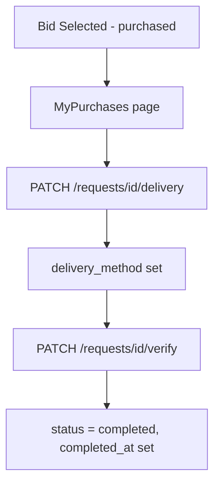
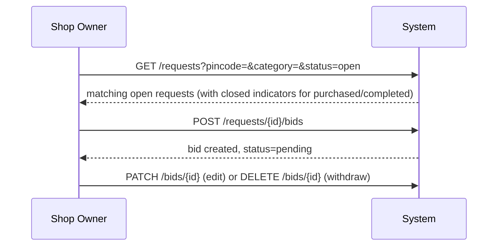
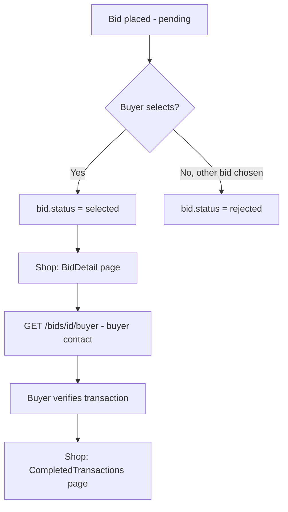
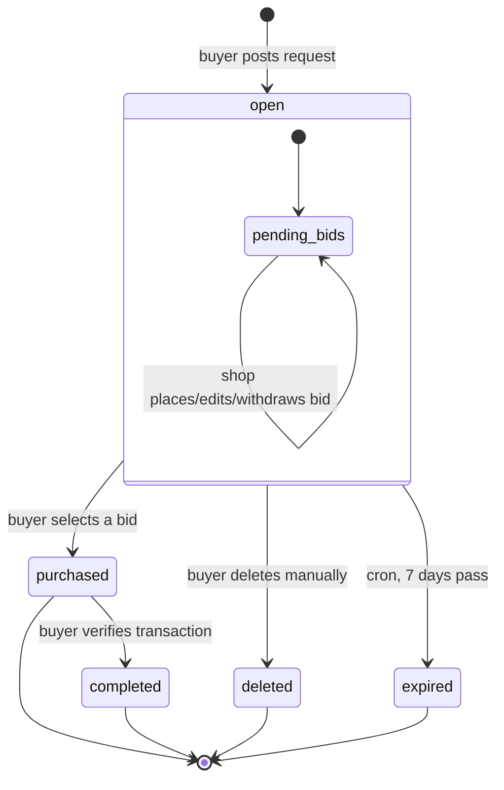
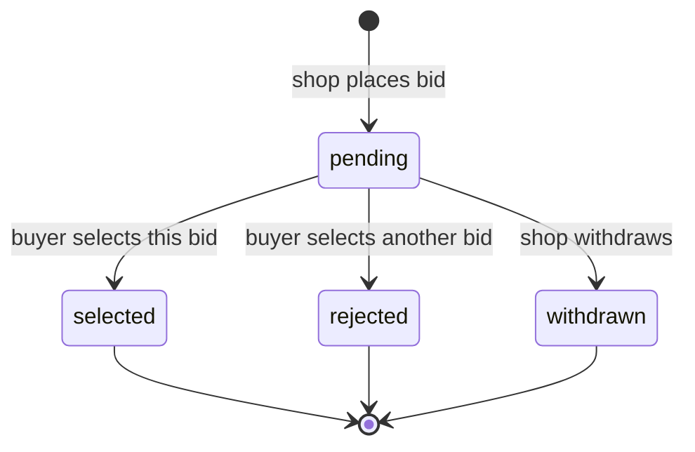

# MarketFlip — Full Flow Reference
### Diagrams + API Calls per Flow

---

## 1. Auth Flow

| Step | API |
|---|---|
| Signup | `POST /auth/signup` |
| Login | `POST /auth/login` |
| Get profile (any role) | `GET /auth/profiles/{id}` |

---

## 2. Buyer Flow — Post to Purchase

| Step | API |
|---|---|
| Create request | `POST /requests` |
| View own requests (tabs) | `GET /requests?status=open\|expired\|deleted` |
| Edit open request | `PATCH /requests/{id}` |
| Delete request | `DELETE /requests/{id}` |
| View request + bids | `GET /requests/{id}` |
| Select winning bid | `PATCH /bids/{id}/select` |

---

## 3. Buyer Flow — Purchase to Completion

| Step | API |
|---|---|
| View purchases | `GET /requests?status=purchased` |
| Set delivery method | `PATCH /requests/{id}/delivery` |
| Verify transaction | `PATCH /requests/{id}/verify` |

---

## 4. Shop Owner Flow — Browse to Bid

| Step | API |
|---|---|
| Browse open requests | `GET /requests?pincode=&category=&status=open` |
| Place bid | `POST /requests/{id}/bids` |
| Edit pending bid | `PATCH /bids/{id}` |
| Withdraw pending bid | `DELETE /bids/{id}` |
| View bids on a request | `GET /requests/{id}/bids` |

---

## 5. Shop Owner Flow — Bid to Transaction Complete

| Step | API |
|---|---|
| View own bids + status | `GET /bids?request_id=` |
| View buyer contact (selected bid) | `GET /bids/{id}/buyer` |
| View bid stats (KPI cards) | `GET /bids/stats` |
| View completed transactions | `GET /requests?status=completed` |

---

## 6. Full Combined Lifecycle

---

## 7. Full API Reference

| Method | Endpoint | Role | Used In Flow |
|---|---|---|---|
| POST | `/auth/signup` | ❌ | Auth |
| POST | `/auth/login` | ❌ | Auth |
| GET | `/auth/profiles/{id}` | Any | Auth, BidDetail |
| POST | `/requests` | Buyer | Post to Purchase |
| GET | `/requests?status=&pincode=&category=` | Any | Dashboard, Browse |
| GET | `/requests/{id}` | Any | RequestDetail |
| PATCH | `/requests/{id}` | Buyer | Edit Request |
| DELETE | `/requests/{id}` | Buyer | Delete Request |
| PATCH | `/requests/{id}/delivery` | Buyer | Purchase to Completion |
| PATCH | `/requests/{id}/verify` | Buyer | Purchase to Completion |
| POST | `/requests/{id}/bids` | Shop | Browse to Bid |
| GET | `/requests/{id}/bids` | Any | RequestDetail, Browse |
| GET | `/bids?request_id=` | Any | MyBids |
| PATCH | `/bids/{id}` | Shop | Edit Bid |
| DELETE | `/bids/{id}` | Shop | Withdraw Bid |
| PATCH | `/bids/{id}/select` | Buyer | Select Bid |
| GET | `/bids/{id}/buyer` | Shop | BidDetail |
| GET | `/bids/stats` | Shop | Shop Dashboard |