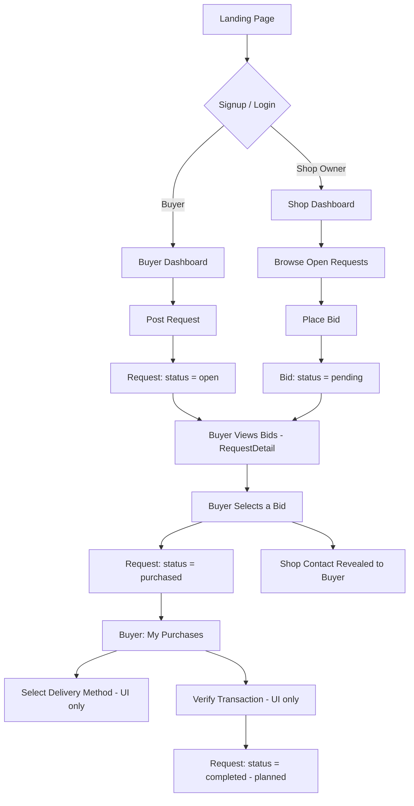
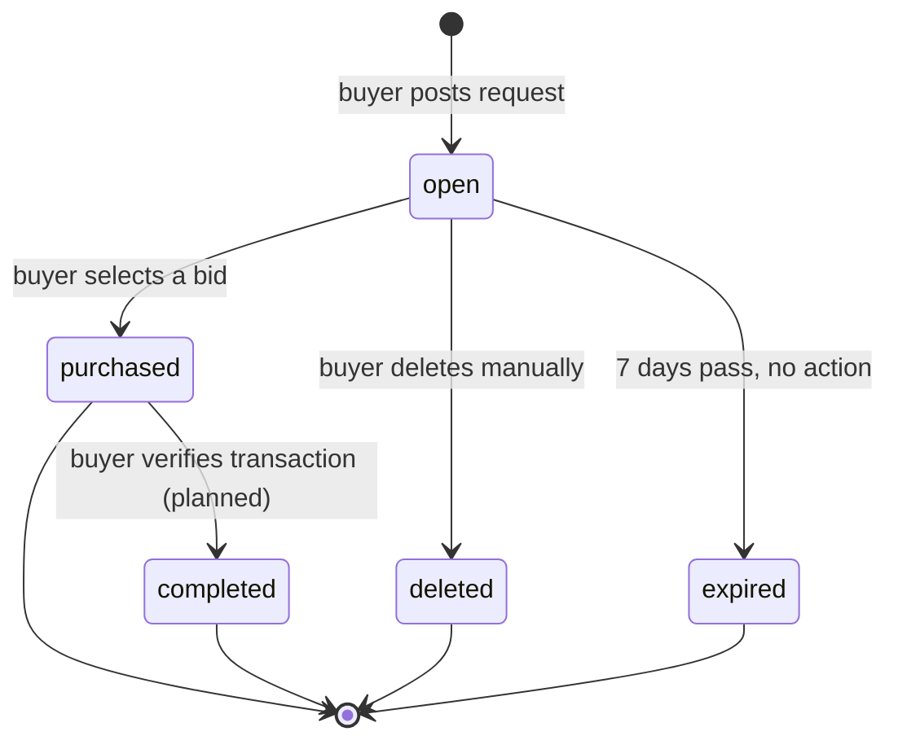

# MarketFlip
### Reverse Marketplace — POC Documentation (Merged)

| | |
|---|---|
| **Product** | MarketFlip |
| **Repository** | `mfx-core` (backend) · `mfx-web` (frontend) · `mfx-docs` (documentation) |
| **Status** | POC Complete — Core Flow + Transaction Completion |
| **Category (v1)** | Electronics |
| **Owner** | Prateek |
| **Version** | 0.3 |
| **Last Updated** | August 07, 2026 |

---

## 1. Overview

Buyer posts what they want to buy → Shop owners bid with their price → Buyer picks the best fit → Contact is revealed → Delivery method chosen → Transaction verified/completed. No payments, no in-app chat — the app connects the two sides; the deal itself happens offline.

**Problem it solves:** offline price discovery is inefficient — buyer has no way to compare prices across local shops before visiting them. This flips the model: sellers compete for the buyer instead of the buyer hunting shop to shop.

**Geographic scope (POC):** Bhilai, Chhattisgarh only. Only shop owners registered with a Bhilai address can bid.

**Location matching:** address collected at signup for credential/verification. Matching between buyers and shop owners is done via **pincode** (6-digit).

---

## 2. Core Flow — ✅ COMPLETE (built + tested end-to-end)

### 2.1 User Journey (as built)



### 2.2 Request Lifecycle (State Diagram — extended)



> **Note:** `completed` status and the verify step are planned/UI-scaffolded, not yet backend-functional. See Section 6 (Known Gaps).

---

## 3. Roles

| Role | Can do |
|---|---|
| **Buyer** | Post request, view own requests (Open/Completed/Expired/Deleted tabs), view bids, select a bid, delete a request, view purchases with shop contact, (planned) set delivery method, (planned) verify transaction |
| **Shop Owner** | Register with address, browse open requests, place bid, edit/withdraw pending bid, view own bids with status, (planned) view buyer contact on selected bid, (planned) view completed transactions |

---

## 4. Screens (as built)

1. `Landing.jsx`
2. `Login.jsx` / `Signup.jsx`
3. `buyer/Dashboard.jsx` — tabs: Open, Completed, Expired, Deleted
4. `buyer/PostRequest.jsx`
5. `buyer/RequestDetail.jsx` — bid list + select action + success card
6. `buyer/MyPurchases.jsx` — shop contact, delivery options (UI only), verify button (UI only)
7. `shop/Dashboard.jsx` — bid stats, nav buttons
8. `shop/BrowseRequests.jsx` — filters, clear filters, bid placement
9. `shop/MyBids.jsx` — bid list with status

**Planned, not yet built:** `shop/BidDetail.jsx`, `shop/CompletedTransactions.jsx`

---

## 5. API Contract (as built)

Base URL: `/api/v1` (or root, per your FastAPI setup)
Auth: Bearer token (Supabase JWT) in `Authorization` header for all routes except signup/login.

| Method | Endpoint | Description | Auth | Status |
|--------|----------|-------------|------|--------|
| POST | `/auth/signup` | Register user | ❌ | ✅ Built |
| POST | `/auth/login` | Login user | ❌ | ✅ Built |
| GET | `/auth/profiles/{id}` | Get user profile | ✅ | ✅ Built |
| POST | `/requests` | Create request | ✅ Buyer | ✅ Built |
| GET | `/requests?pincode=&category=&status=` | List requests (supports `status=all`) | ✅ All | ✅ Built |
| GET | `/requests/{id}` | Get request detail + bids | ✅ All | ✅ Built |
| DELETE | `/requests/{id}` | Soft-delete request | ✅ Buyer | ✅ Built |
| PATCH | `/requests/{id}` | Update request | ✅ Buyer | ⬜ Planned |
| PATCH | `/requests/{id}/delivery` | Update delivery method | ✅ Buyer | ⬜ Planned |
| PATCH | `/requests/{id}/verify` | Verify transaction → `completed` | ✅ Buyer | ⬜ Planned |
| POST | `/requests/{id}/bids` | Place bid | ✅ Shop | ✅ Built |
| GET | `/requests/{id}/bids` | Get bids for a request | ✅ All | ✅ Built |
| GET | `/bids?request_id=` | Get all bids (role-scoped) | ✅ All | ✅ Built |
| PATCH | `/bids/{id}` | Update pending bid | ✅ Shop | ✅ Built |
| DELETE | `/bids/{id}` | Withdraw pending bid | ✅ Shop | ✅ Built |
| PATCH | `/bids/{id}/select` | Select bid, reveal contact | ✅ Buyer | ✅ Built (enhanced) |
| GET | `/bids/{id}/buyer` | Get buyer details for selected bid | ✅ Shop | ⬜ Planned |
| GET | `/bids/stats` | Bid statistics for shop owner | ✅ Shop | ⬜ Planned |

### Sample: `PATCH /bids/{id}/select` (enhanced response, as built)
```json
{
  "bid_id": "uuid",
  "request_id": "uuid",
  "status": "selected",
  "selected_bid": {
    "id": "uuid",
    "price": 85000,
    "note": "Available in black, 1 year warranty",
    "status": "selected",
    "shop_name": "Tech Store",
    "shop_phone": "9876543211",
    "shop_address": "456 Market Road, New Delhi"
  },
  "shop_contact": {
    "shop_name": "Tech Store",
    "phone": "9876543211",
    "address": "456 Market Road, New Delhi"
  }
}
```

---

## 6. Database Schema (final, as built)

### `profiles`
```sql
id uuid PK, references auth.users(id)
role text check ('buyer','shop_owner')
shop_name text, nullable
address text
pincode text (6 chars)
phone text
created_at timestamptz default now()
```

### `requests`
```sql
id uuid PK default gen_random_uuid()
buyer_id uuid, FK -> profiles(id)
item_name text
description text, nullable
budget_min integer
budget_max integer
pincode text (6 chars)
category text default 'electronics'
reference_url text, nullable
reference_image text, nullable
status text default 'open', check ('open','purchased','completed','deleted','expired')
created_at timestamptz default now()
expires_at timestamptz default now() + 7 days
purchased_at timestamptz, nullable
completed_at timestamptz, nullable
selected_bid_id uuid, nullable, FK -> bids(id)
delivery_method text, nullable
delivery_address text, nullable
```

### `bids`
```sql
id uuid PK default gen_random_uuid()
request_id uuid, FK -> requests(id)
shop_id uuid, FK -> profiles(id)
price integer
note text, nullable
status text default 'pending', check ('pending','selected','rejected','withdrawn')
created_at timestamptz default now()
selected_at timestamptz, nullable
rejected_at timestamptz, nullable
withdrawn_at timestamptz, nullable
buyer_contact_viewed boolean default false
```

---

## 7. Project Structure

### Backend — `mfx-core` (FastAPI)
```
mfx-core/
├── main.py
├── config.py
├── auth/
│   ├── routes.py          # signup, login, profiles/{id}
│   └── dependencies.py    # get_current_user (JWT + role lookup)
├── requests/
│   ├── routes.py
│   ├── schemas.py
│   └── service.py
├── bids/
│   ├── routes.py
│   ├── schemas.py
│   └── service.py
├── jobs/
│   └── expire_requests.py     # ⬜ not yet implemented
└── requirements.txt
```

### Frontend — `mfx-web` (React + Vite)
```
mfx-web/src/
├── api/
│   └── client.js               # axios instance, Bearer header, 401 handling
├── context/
│   └── AuthContext.jsx         # token/role/user_id, login/logout
├── pages/
│   ├── Landing.jsx
│   ├── Login.jsx
│   ├── Signup.jsx
│   ├── buyer/
│   │   ├── Dashboard.jsx        ✅
│   │   ├── PostRequest.jsx      ✅
│   │   ├── RequestDetail.jsx    ✅
│   │   └── MyPurchases.jsx      ⚠️ UI complete, backend pending
│   └── shop/
│       ├── Dashboard.jsx        ✅
│       ├── BrowseRequests.jsx   ✅
│       ├── MyBids.jsx           ✅
│       ├── BidDetail.jsx        ❌ not built
│       └── CompletedTransactions.jsx ❌ not built
├── App.jsx
└── main.jsx
```

---

## 8. Stack (Free Tier Only)

| Layer | Tool | Tier |
|---|---|---|
| Frontend | React + Vite → Vercel | Free |
| Backend | FastAPI → Render | Free |
| DB / Auth / Storage | Supabase | Free |
| Cron | Supabase `pg_cron` / Edge Function | Free (not yet set up) |
| Styling | None yet — Tailwind planned | — |

---

## 9. Known Gaps / Next Steps

| Priority | Task |
|---|---|
| 🔴 High | DB migrations for delivery/completed fields (already written, run if not applied) |
| 🔴 High | `PATCH /requests/{id}/delivery` |
| 🔴 High | `PATCH /requests/{id}/verify` |
| 🔴 High | Make `MyPurchases.jsx` functional (currently UI-only) |
| 🟡 Medium | `GET /bids/{id}/buyer` |
| 🟡 Medium | `shop/BidDetail.jsx` |
| 🟡 Medium | `shop/Dashboard.jsx` stats cards |
| 🟢 Low | `shop/CompletedTransactions.jsx` |
| 🟢 Low | Tailwind CSS integration + styling pass |
| 🟢 Low | Pincode-based filtering on browse feed |
| 🟢 Low | Bid count badge on buyer's request card |
| 🟢 Low | "Closed" message to non-selected bidders |
| 🟢 Low | Auto-expire cron job |

---

## 10. Explicitly Out of Scope (POC)
Payments · In-app chat · Ratings/reviews · Shop verification · Push notifications · Multiple categories

---

## 11. Risk Assessment

| Risk | Type | Notes |
|---|---|---|
| Scope creep | Process | Transaction-completion flow (delivery/verify) was added after original Core Flow lock — tracked here to keep it from expanding further unchecked. |
| Chicken-egg problem | Product | No shops → empty requests → buyers leave. Manually onboard 5–10 shops before opening to buyers. |
| No trust/verification | Product | Buyer can't verify a shop before contact reveal. Acceptable for POC. |
| Free-tier cold starts | Technical | Render/Supabase free tier sleeps — expect slow first load in demo. |
| Cron job not yet built | Technical | Expired requests won't auto-transition until this exists. |
| No training data for ML feature | Data | Price-suggestion model has nothing to learn from until real closed requests exist. |

---

## 12. Setup Instructions

### Backend (`mfx-core`)
```bash
# activate venv
pip install -r requirements.txt
# create .env with: SUPABASE_URL, SUPABASE_ANON_KEY, SUPABASE_SERVICE_ROLE_KEY
uvicorn main:app --reload
```

### Frontend (`mfx-web`)
```bash
npm install
npm run dev
# api/client.js points to http://127.0.0.1:8000 by default
```

---

## 13. Suggested Build Order (updated)
1. ✅ DB schema
2. ✅ Auth + role redirect
3. ✅ Landing/Login/Signup
4. ✅ Post request (buyer)
5. ✅ Browse + bid (shop owner)
6. ✅ Review + select bid (buyer)
7. ✅ Contact reveal
8. ⬜ Delivery + verify + completed status
9. ⬜ Shop-side buyer contact + BidDetail + CompletedTransactions
10. ⬜ Auto-expire cron
11. ⬜ Tailwind + polish (badges, pincode filter, closed message)