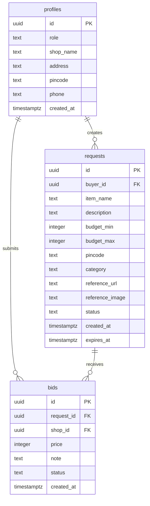

# Database Schema Documentation

## Tables Overview

### 1. profiles

User profile table linked to Supabase authentication.

| Column | Type | Constraints | Description |
|--------|------|-------------|-------------|
| `id` | UUID | PRIMARY KEY, REFERENCES auth.users(id) | User identifier |
| `role` | TEXT | NOT NULL, CHECK (role IN ('buyer','shop_owner')) | User role |
| `shop_name` | TEXT | NULLABLE | Store name (shop_owner only) |
| `address` | TEXT | NOT NULL | User address |
| `pincode` | TEXT | NOT NULL, CHECK (char_length(pincode) = 6) | 6-digit postal code |
| `phone` | TEXT | NOT NULL | Contact number |
| `created_at` | TIMESTAMPTZ | NOT NULL, DEFAULT now() | Record creation timestamp |

**RLS Policies:**
- Users can SELECT/UPDATE their own profile (id = auth.uid())
- Users can INSERT their own profile (id = auth.uid())

---

### 2. requests

Purchase requests posted by buyers.

| Column | Type | Constraints | Description |
|--------|------|-------------|-------------|
| `id` | UUID | PRIMARY KEY, DEFAULT gen_random_uuid() | Request identifier |
| `buyer_id` | UUID | NOT NULL, REFERENCES profiles(id) | Buyer who created the request |
| `item_name` | TEXT | NOT NULL | Product name |
| `description` | TEXT | NULLABLE | Product details |
| `budget_min` | INTEGER | NOT NULL | Minimum budget |
| `budget_max` | INTEGER | NOT NULL | Maximum budget |
| `pincode` | TEXT | NOT NULL, CHECK (char_length(pincode) = 6) | Buyer's pincode |
| `category` | TEXT | DEFAULT 'electronics' | Product category |
| `reference_url` | TEXT | NULLABLE | Product reference URL |
| `reference_image` | TEXT | NULLABLE | Product image URL |
| `status` | TEXT | NOT NULL, DEFAULT 'open', CHECK (status IN ('open','purchased','deleted','expired')) | Request status |
| `created_at` | TIMESTAMPTZ | NOT NULL, DEFAULT now() | Creation timestamp |
| `expires_at` | TIMESTAMPTZ | NOT NULL, DEFAULT now() + interval '7 days' | Expiry timestamp |

**RLS Policies:**
- Buyers can INSERT requests (buyer_id = auth.uid())
- Buyers can SELECT/UPDATE/DELETE their own requests (buyer_id = auth.uid())
- All authenticated users can SELECT open requests (status = 'open')

---

### 3. bids

Quotes submitted by shop owners in response to requests.

| Column | Type | Constraints | Description |
|--------|------|-------------|-------------|
| `id` | UUID | PRIMARY KEY, DEFAULT gen_random_uuid() | Bid identifier |
| `request_id` | UUID | NOT NULL, REFERENCES requests(id) | Associated request |
| `shop_id` | UUID | NOT NULL, REFERENCES profiles(id) | Shop owner who submitted the bid |
| `price` | INTEGER | NOT NULL | Quoted price |
| `note` | TEXT | NULLABLE | Additional notes |
| `status` | TEXT | NOT NULL, DEFAULT 'pending', CHECK (status IN ('pending','selected','rejected')) | Bid status |
| `created_at` | TIMESTAMPTZ | NOT NULL, DEFAULT now() | Submission timestamp |

**RLS Policies:**
- Shop owners can INSERT bids (shop_id = auth.uid())
- Shop owners can SELECT/UPDATE/DELETE their own bids (shop_id = auth.uid())
- Buyers can SELECT bids on their own requests (via EXISTS subquery on requests table)

---

## Database Relationships



---

## Row Level Security (RLS) Summary

| Table | Policy Type | Access Rule |
|-------|-------------|-------------|
| **profiles** | SELECT/UPDATE | auth.uid() = id |
| **profiles** | INSERT | auth.uid() = id |
| **requests** | INSERT | auth.uid() = buyer_id |
| **requests** | SELECT/UPDATE/DELETE | auth.uid() = buyer_id |
| **requests** | SELECT (open) | status = 'open' (all authenticated) |
| **bids** | INSERT | auth.uid() = shop_id |
| **bids** | SELECT/UPDATE/DELETE | auth.uid() = shop_id |
| **bids** | SELECT (buyer) | request belongs to auth.uid() |

---

## Setup Instructions

1. Run the SQL scripts in Supabase SQL Editor in the following order:
   - Create `profiles` table
   - Create `requests` table
   - Create `bids` table

2. RLS is automatically enabled with the provided policies

3. Insert test data:
   ```sql
   -- Insert a profile (replace UUID with actual auth.users id)
   INSERT INTO profiles (id, role, shop_name, address, pincode, phone)
   VALUES ('your-auth-user-id', 'buyer', NULL, '123 Main St', '110001', '9876543210');
   
   -- Insert a request
   INSERT INTO requests (buyer_id, item_name, budget_min, budget_max, pincode)
   VALUES ('profile-id', 'iPhone 15', 60000, 80000, '110001');
   
   -- Insert a bid
   INSERT INTO bids (request_id, shop_id, price, note)
   VALUES ('request-id', 'shop-profile-id', 75000, 'New piece with 1 year warranty');
   ```