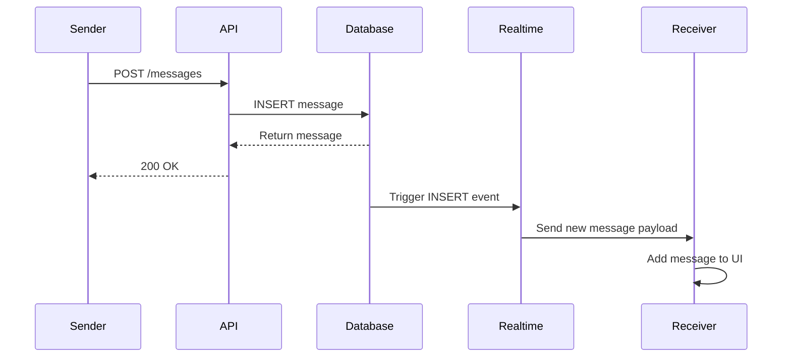
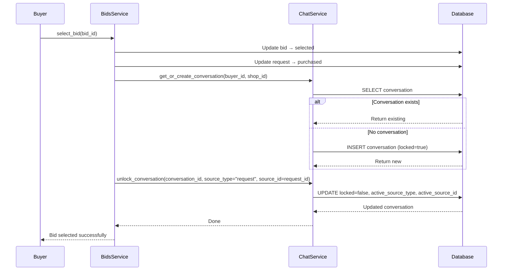
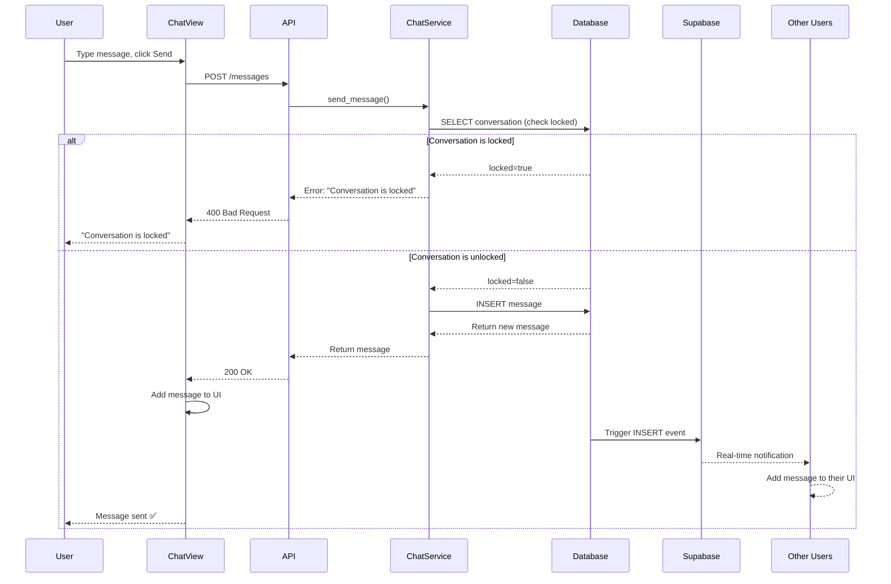
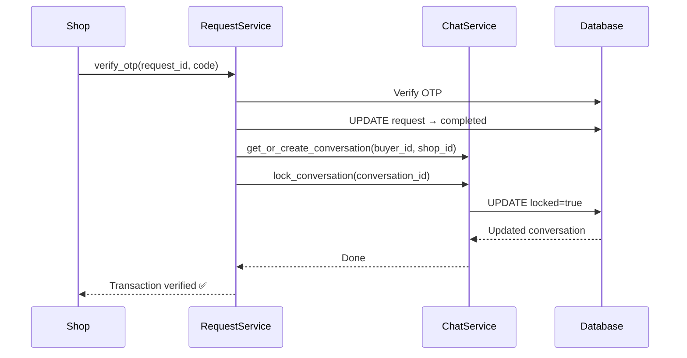

## 📄 In-App Chat Module - Complete Documentation

---

# MarketFlip In-App Chat Module

## Overview

The chat module enables real-time communication between buyers and shop owners after a transaction has been initiated. It follows a **WhatsApp-style** design with persistent conversations, lock/unlock states, and real-time message delivery.

---

## 1. Core Design Principles

### 1.1 Pair-Based Conversations

- **One conversation per (buyer_id, shop_id) pair**
- All past messages persist across multiple transactions
- No new conversation created for each transaction

### 1.2 Lock/Unlock Mechanism

| State | Description | User Actions |
|-------|-------------|--------------|
| **Locked** | Read-only mode | Can view messages, cannot send |
| **Active (Unlocked)** | Full interaction | Can send and receive messages |

### 1.3 Unlock Triggers

| Event | Source Type | Action |
|-------|-------------|--------|
| Bid selected | `request` | Unlock chat between buyer and selected shop |
| Auction won | `auction` | Unlock chat between winning buyer and shop |

### 1.4 Lock Triggers

| Event | Action |
|-------|--------|
| Transaction completed (OTP verified) | Lock chat |
| Transaction completed (buyer override) | Lock chat |

### 1.5 Pinned Product Header

When unlocked, the chat view shows the active transaction details:
- Item name
- Price
- Image (if available)
- Source type (Request or Auction)

---

## 2. Database Schema

### 2.1 Conversations Table

```sql
CREATE TABLE public.conversations (
    id uuid PRIMARY KEY DEFAULT gen_random_uuid(),
    buyer_id uuid NOT NULL REFERENCES public.profiles(id) ON DELETE CASCADE,
    shop_id uuid NOT NULL REFERENCES public.profiles(id) ON DELETE CASCADE,
    active_source_type text CHECK (active_source_type IN ('request', 'auction')),
    active_source_id uuid,
    locked boolean DEFAULT true,
    created_at timestamptz DEFAULT now(),
    updated_at timestamptz DEFAULT now(),
    CONSTRAINT unique_buyer_shop_pair UNIQUE (buyer_id, shop_id)
);
```

### 2.2 Messages Table

```sql
CREATE TABLE public.messages (
    id uuid PRIMARY KEY DEFAULT gen_random_uuid(),
    conversation_id uuid NOT NULL REFERENCES public.conversations(id) ON DELETE CASCADE,
    sender_id uuid NOT NULL REFERENCES public.profiles(id) ON DELETE CASCADE,
    content text NOT NULL,
    is_read boolean DEFAULT false,
    read_at timestamptz,
    created_at timestamptz DEFAULT now(),
    is_reported boolean DEFAULT false,
    is_blocked boolean DEFAULT false
);
```

### 2.3 RLS Policies

| Table | Policy | Description |
|-------|--------|-------------|
| `conversations` | SELECT | Users can read their own conversations |
| `conversations` | UPDATE | **Backend only** (service role) |
| `messages` | SELECT | Users can read messages in their conversations |
| `messages` | INSERT | Only if conversation is unlocked |
| `messages` | UPDATE | **Backend only** (service role) |

---

## 3. API Endpoints

### 3.1 Get Conversations

```
GET /chat/conversations
```

**Headers:** `Authorization: Bearer <token>`

**Response:**
```json
[
  {
    "id": "uuid",
    "buyer_id": "uuid",
    "shop_id": "uuid",
    "active_source_type": "request",
    "active_source_id": "uuid",
    "locked": false,
    "created_at": "2026-08-29T12:00:00Z",
    "updated_at": "2026-08-29T12:05:00Z",
    "buyer_name": "John Doe",
    "shop_name": "Tech Store",
    "last_message": "Hello, I'm interested!",
    "last_message_at": "2026-08-29T12:05:00Z",
    "unread_count": 2,
    "active_item_name": "iPhone 15 Pro",
    "active_item_price": 85000,
    "active_item_image": "https://..."
  }
]
```

### 3.2 Get Messages

```
GET /chat/conversations/{conversation_id}/messages?limit=50&offset=0
```

**Headers:** `Authorization: Bearer <token>`

**Response:**
```json
[
  {
    "id": "uuid",
    "conversation_id": "uuid",
    "sender_id": "uuid",
    "content": "Hello!",
    "is_read": true,
    "read_at": "2026-08-29T12:05:00Z",
    "created_at": "2026-08-29T12:00:00Z",
    "sender_name": "John Doe",
    "sender_role": "buyer"
  }
]
```

### 3.3 Send Message

```
POST /chat/conversations/{conversation_id}/messages
```

**Headers:** `Authorization: Bearer <token>`

**Body:**
```json
{
  "content": "Hello, I'm interested in this product!"
}
```

**Response:** Same as message object

### 3.4 Mark Messages as Read

```
PATCH /chat/conversations/{conversation_id}/read
```

**Headers:** `Authorization: Bearer <token>`

**Response:**
```json
{
  "message": "Marked 3 messages as read",
  "count": 3
}
```

### 3.5 Get Unread Count

```
GET /chat/unread-count
```

**Headers:** `Authorization: Bearer <token>`

**Response:**
```json
{
  "unread_count": 5
}
```

---

## 4. Frontend Architecture

### 4.1 File Structure

```
mfx-web/src/
├── hooks/
│   └── useChat.js              # Realtime subscription hook
├── pages/
│   └── chat/
│       ├── ChatList.jsx        # WhatsApp-style conversation list
│       └── ChatView.jsx        # Individual chat view
└── components/
    └── (future) Chat/
        ├── MessageBubble.jsx
        ├── ChatInput.jsx
        └── PinnedProductCard.jsx
```

### 4.2 useChat Hook

```jsx
const { newMessage, isSubscribed } = useChat(conversationId);
```

| Return Value | Type | Description |
|--------------|------|-------------|
| `newMessage` | `object \| null` | New message received via realtime |
| `isSubscribed` | `boolean` | Whether subscription is active |

### 4.3 ChatList Page

**Features:**
- WhatsApp-style conversation list
- Role-based display (buyer sees shops, shops see buyers)
- Lock/Unlock status badges
- Unread count badges
- Last message preview
- Active item name display
- Relative time formatting

**Navigation:**
```
Buyer: /buyer/chat
Shop: /shop/chat
```

### 4.4 ChatView Page

**Components:**
1. **Header**: Other party name, role, lock status
2. **Pinned Product Card**: Active transaction details (expandable)
3. **Message Thread**: Chronological messages with date separators
4. **Input**: Disabled when locked

**Navigation:**
```
Buyer: /buyer/chat/{conversation_id}
Shop: /shop/chat/{conversation_id}
```

---

## 5. Realtime Communication

### 5.1 Supabase Realtime

```javascript
const channel = supabase
  .channel(`messages:${conversationId}`)
  .on(
    'postgres_changes',
    {
      event: 'INSERT',
      schema: 'public',
      table: 'messages',
      filter: `conversation_id=eq.${conversationId}`
    },
    (payload) => {
      // Handle new message
    }
  )
  .subscribe();
```

### 5.2 Message Flow



---

## 6. Complete Flow Diagrams

### 6.1 Bid Selection → Chat Unlock



### 6.2 Sending a Message



### 6.3 Transaction Completion → Chat Lock



---

## 7. Edge Cases & Error Handling

### 7.1 Conversation Not Found

| Scenario | Response |
|----------|----------|
| User tries to access invalid conversation | `404: Conversation not found` |
| User tries to access someone else's conversation | `403: Not part of this conversation` |

### 7.2 Sending Messages

| Scenario | Response |
|----------|----------|
| Conversation is locked | `400: Conversation is locked` |
| Rate limit exceeded (2 seconds) | `429: Too many messages. Please wait.` |
| Message contains profanity | `400: Message contains prohibited content` |
| Empty message | `400: Content is required` |

### 7.3 Chat Unlock/Lock

| Scenario | Response |
|----------|----------|
| Attempt to unlock non-existent conversation | Error logged, transaction continues |
| Chat unlock fails | Transaction still succeeds, chat remains locked |
| Chat lock fails | Transaction still completes, chat stays unlocked |

---

## 8. Security & Authorization

### 8.1 Backend-First Authorization

- All chat operations are validated at the backend
- RLS acts as a secondary safety net
- Service role key used for state changes (lock/unlock)

### 8.2 RLS Policies

| Operation | Policy |
|-----------|--------|
| Read conversations | `auth.uid() IN (buyer_id, shop_id)` |
| Read messages | Via EXISTS on conversations |
| Insert messages | Only if conversation is unlocked |
| Update conversations | **Backend only** (no user policy) |
| Update messages | **Backend only** (no user policy) |

### 8.3 Rate Limiting

- **2 seconds** between messages from the same user
- Prevents spam and flooding

### 8.4 Profanity Filter

- Basic keyword filtering on message content
- Blocked words are rejected at the API level
- Extensible for future moderation

---

## 9. User Experience (UX)

### 9.1 Chat List Page

```
┌─────────────────────────────────────────┐
│  ← Chats                          🔄    │
├─────────────────────────────────────────┤
│  🏪 Tech Store          Active   2m ago │
│  Last message preview...                │
├─────────────────────────────────────────┤
│  🛍️ John Doe           Locked   Yesterday│
│  No messages yet                        │
├─────────────────────────────────────────┤
│  🏪 Gadget World       Active   5m ago  │
│  What's the delivery time?              │
└─────────────────────────────────────────┘
```

### 9.2 Chat View

```
┌─────────────────────────────────────────┐
│  ← John Doe        🟢 Active            │
│  📦 iPhone 15 Pro · ₹85,000             │
├─────────────────────────────────────────┤
│  Today                                  │
│  You →   Hello!                  12:00  │
│          I'm interested in this!        │
│  ← John Doe   Great!            12:05  │
│               Let me know if...         │
├─────────────────────────────────────────┤
│  [______________________] [Send]       │
│  💬 Messages are private between you    │
└─────────────────────────────────────────┘
```

---

## 10. Future Enhancements

### 10.1 Phase 5 (Current)
- ✅ Text-only messaging
- ✅ One-to-one conversations
- ✅ Lock/Unlock mechanism
- ✅ Realtime delivery
- ✅ Basic profanity filter
- ✅ Rate limiting

### 10.2 Phase 6 (Planned)
- Image attachments in chat
- Typing indicators
- Online/Offline status
- Message reactions (👍, ❤️, etc.)

### 10.3 Phase 7 (Future)
- Group chats (multi-party)
- Admin moderation panel
- Advanced spam detection (ML)
- End-to-end encryption

---

## 11. Troubleshooting Guide

### 11.1 Chat Not Appearing

| Check | Action |
|-------|--------|
| Is there an active transaction? | Select a bid or win an auction |
| Is the conversation unlocked? | Check `locked` field in database |
| Are you logged in as the right user? | Verify user role matches |

### 11.2 Messages Not Sending

| Check | Action |
|-------|--------|
| Is conversation locked? | Complete transaction or check lock status |
| Rate limit? | Wait 2 seconds between messages |
| Profanity? | Remove blocked words |

### 11.3 Realtime Not Working

| Check | Action |
|-------|--------|
| Supabase credentials in `.env` | Verify `VITE_SUPABASE_URL` and `VITE_SUPABASE_ANON_KEY` |
| Channel subscription | Check browser console for subscription logs |
| RLS policies | Verify `messages` INSERT policy allows the user |

### 11.4 Unread Count Not Updating

| Check | Action |
|-------|--------|
| Messages marked as read? | `PATCH /chat/conversations/{id}/read` endpoint called |
| Sender filter | Unread count excludes user's own messages |

---

## 12. API Error Codes

| Status Code | Description | Resolution |
|-------------|-------------|------------|
| 200 | Success | - |
| 400 | Bad Request | Check request body |
| 403 | Forbidden | User doesn't have permission |
| 404 | Not Found | Conversation/message not found |
| 429 | Too Many Requests | Rate limit exceeded, wait 2 seconds |
| 500 | Internal Server Error | Check backend logs |

---

## 13. Environment Variables

### Backend (`mfx-core/.env`)

```
SUPABASE_URL=...
SUPABASE_ANON_KEY=...
SUPABASE_SERVICE_ROLE_KEY=...
```

### Edge Function

```bash
supabase secrets set MARKETFLIP_API_URL=https://marketflip.onrender.com
```

### Frontend (`mfx-web/.env`)

```
VITE_API_URL=http://127.0.0.1:8000
VITE_SUPABASE_URL=https://sqmjzlwokdvtooqalnza.supabase.co
VITE_SUPABASE_ANON_KEY=...
```

---

## 14. Quick Reference

### Key Files

| File | Purpose |
|------|---------|
| `chat/routes.py` | API endpoints |
| `chat/services.py` | Business logic |
| `chat/schemas.py` | Pydantic schemas |
| `useChat.js` | Realtime hook |
| `ChatList.jsx` | Conversation list |
| `ChatView.jsx` | Individual chat |

### Key Endpoints

| Endpoint | Method | Purpose |
|----------|--------|---------|
| `/chat/conversations` | GET | List conversations |
| `/chat/conversations/{id}/messages` | GET | Get messages |
| `/chat/conversations/{id}/messages` | POST | Send message |
| `/chat/conversations/{id}/read` | PATCH | Mark as read |
| `/chat/unread-count` | GET | Get unread count |

---

## 15. Questions & Answers

### Q1: How do I start a new conversation?
**A:** Conversations are automatically created when a bid is selected or an auction is won. You don't manually start conversations.

### Q2: Why is my conversation locked?
**A:** The conversation locks when the transaction is completed. It stays locked until a new transaction is initiated.

### Q3: Can I see messages from previous transactions?
**A:** Yes! All messages persist in the conversation history. Even when locked, you can view past messages.

### Q4: How do I know if I have unread messages?
**A:** The "Chats" button on the dashboard shows a badge with the number of unread messages.

### Q5: What happens if I send a message to a locked conversation?
**A:** You'll get an error: "Conversation is locked". The input is disabled in the UI.

### Q6: Can I delete messages?
**A:** Not currently. Messages are permanent for audit and history purposes.

### Q7: How fast are messages delivered?
**A:** Messages are delivered in real-time via Supabase Realtime (typically < 1 second).

### Q8: Can a buyer chat with a shop before selecting a bid?
**A:** No. Chat only unlocks after a bid is selected or an auction is won.

### Q9: What if the shop never responds?
**A:** The conversation remains unlocked until the transaction is completed. Both parties can continue messaging.

### Q10: How are messages sorted?
**A:** Messages are displayed chronologically, newest at the bottom.

---

## 16. Changelog

### Version 1.0 (August 29, 2026)
- ✅ Initial chat implementation
- ✅ Pair-based conversations
- ✅ Lock/Unlock mechanism
- ✅ Realtime message delivery
- ✅ WhatsApp-style UI
- ✅ Chat List page
- ✅ Chat View page
- ✅ Unread count badges
- ✅ Basic moderation (profanity filter, rate limiting)
- ✅ RLS policies

---

**Document Version:** 1.0  
**Last Updated:** August 29, 2026  
**Status:** ✅ Production Ready

---
