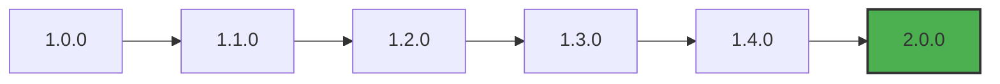
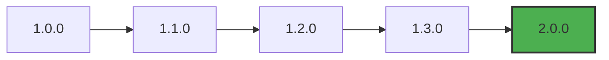
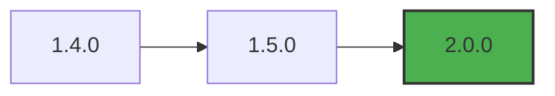
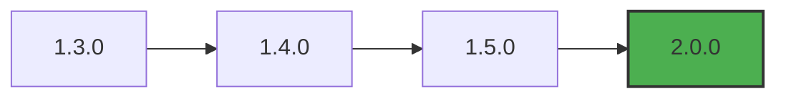
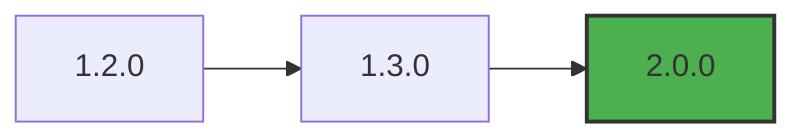
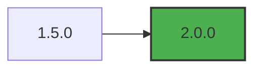
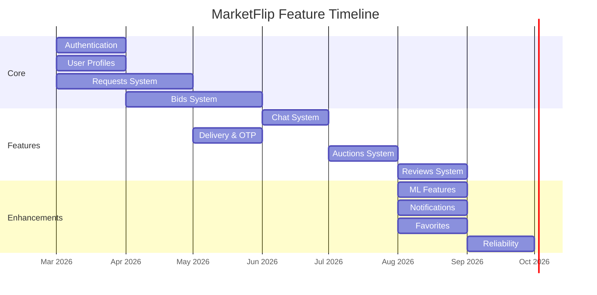

# MarketFlip Platform - Version Map

## Version History

| Version | Date | Status | Description |
|---------|------|--------|-------------|
| **2.0.0** | 2026-09-15 | Current | Major release with full feature set |
| 1.5.0 | 2026-08-01 | Deprecated | Added ML features |
| 1.4.0 | 2026-07-15 | Deprecated | Added auction system |
| 1.3.0 | 2026-06-01 | Deprecated | Added chat system |
| 1.2.0 | 2026-05-01 | Deprecated | Added delivery & OTP |
| 1.1.0 | 2026-04-01 | Deprecated | Added bidding system |
| 1.0.0 | 2026-03-01 | Deprecated | Initial release |

---

## Current Version: 2.0.0

### Release Date: September 15, 2026

### Status: Production Ready

### Key Features

| Feature | Status | Description |
|---------|--------|-------------|
| Authentication | ✅ Complete | JWT-based auth with Supabase |
| User Profiles | ✅ Complete | Buyer and shop owner profiles |
| Requests System | ✅ Complete | Create, browse, update, delete |
| Bids System | ✅ Complete | Place, update, select, reject |
| Auctions System | ✅ Complete | Create, bid, auto-close with sniping protection |
| Chat System | ✅ Complete | Real-time messaging with transaction-based locking |
| Delivery & OTP | ✅ Complete | Home delivery, pickup, OTP verification |
| Reviews System | ✅ Complete | Rate and review transactions |
| Notifications | ✅ Complete | Push notifications with read status |
| Favorites | ✅ Complete | Save favorite items |
| Saved Searches | ✅ Complete | Save and manage search queries |
| Shop Reliability | ✅ Complete | Performance scoring engine |
| Reports System | ✅ Complete | Content moderation |
| File Upload | ✅ Complete | Cloudinary integration |
| ML Features | ✅ Complete | Price suggestion, bid ranking, recommendations |

---

## Version Map by Component

### Authentication System



| Version | Changes |
|---------|---------|
| 1.0.0 | Basic signup/login with Supabase Auth |
| 1.1.0 | Added role-based access control |
| 1.2.0 | Profile management endpoints |
| 1.3.0 | JWT token validation middleware |
| 1.4.0 | Admin role support |
| **2.0.0** | **Full profile CRUD, email verification** |

---

### Requests & Bids System



| Version | Changes |
|---------|---------|
| 1.0.0 | Create and view requests |
| 1.1.0 | Place and view bids |
| 1.2.0 | Bid selection with chat unlock |
| 1.3.0 | Delivery method and OTP verification |
| **2.0.0** | **Full lifecycle with pickup/home delivery** |

---

### Auctions System



| Version | Changes |
|---------|---------|
| 1.4.0 | Initial auction release |
| 1.5.0 | Added reserve price and relist |
| **2.0.0** | **Sniping protection, OTP verification** |

---

### Chat System



| Version | Changes |
|---------|---------|
| 1.3.0 | Basic messaging |
| 1.4.0 | Transaction-based locking |
| 1.5.0 | Read receipts and unread count |
| **2.0.0** | **Rate limiting, active transaction tracking** |

---

### Delivery & OTP System



| Version | Changes |
|---------|---------|
| 1.2.0 | Basic delivery method selection |
| 1.3.0 | OTP verification with max attempts |
| **2.0.0** | **Shop confirm/deny, switch to pickup** |

---

### Reviews System



| Version | Changes |
|---------|---------|
| 1.5.0 | Initial reviews with rating and comment |
| **2.0.0** | **Review stats, delete reviews** |

---

## Version Compatibility

### Backend Requirements

| Version | Python | FastAPI | Supabase | Cloudinary |
|---------|--------|---------|----------|------------|
| 1.0.x | 3.8+ | 0.95+ | 1.0+ | - |
| 1.1.x | 3.8+ | 0.95+ | 1.0+ | - |
| 1.2.x | 3.9+ | 0.100+ | 2.0+ | - |
| 1.3.x | 3.9+ | 0.100+ | 2.0+ | - |
| 1.4.x | 3.9+ | 0.100+ | 2.0+ | 1.0+ |
| 1.5.x | 3.9+ | 0.100+ | 2.0+ | 1.0+ |
| **2.0.0** | **3.9+** | **0.100+** | **2.0+** | **1.0+** |

### Frontend Requirements

| Version | Node.js | React |
|---------|---------|-------|
| 1.0.x - 1.4.x | 14+ | 17+ |
| 1.5.x | 16+ | 18+ |
| **2.0.0** | **18+** | **18+** |

---

## Feature Timeline



---

## Migration Guide

### From 1.5.0 to 2.0.0

**Breaking Changes:**

| Change | Impact | Action Required |
|--------|--------|-----------------|
| OTP code length | 4 digits | Update verification logic |
| Chat locking | Active transactions table | Migrate existing chats |
| Delivery confirm/deny | New endpoints | Update API calls |
| Review stats | New endpoint | Update UI |
| ML endpoints | New endpoints | Update integration |

**Database Migrations:**

```sql
-- Add new columns for delivery
ALTER TABLE requests ADD COLUMN delivery_confirmed_by_shop BOOLEAN;
ALTER TABLE requests ADD COLUMN delivery_response_at TIMESTAMPTZ;

-- Add completed_at for auctions
ALTER TABLE auctions ADD COLUMN completed_at TIMESTAMPTZ;

-- Create active transactions table
CREATE TABLE conversation_active_transactions (
    id UUID PRIMARY KEY DEFAULT gen_random_uuid(),
    conversation_id UUID REFERENCES conversations(id),
    source_type TEXT NOT NULL,
    source_id UUID NOT NULL,
    item_name TEXT,
    status TEXT DEFAULT 'active',
    created_at TIMESTAMPTZ DEFAULT NOW(),
    completed_at TIMESTAMPTZ
);
```

---

## Deprecation Schedule

| Version | Deprecated Date | End of Life |
|---------|-----------------|-------------|
| 1.0.x | 2026-04-01 | 2026-06-01 |
| 1.1.x | 2026-05-01 | 2026-07-01 |
| 1.2.x | 2026-06-01 | 2026-08-01 |
| 1.3.x | 2026-07-01 | 2026-09-01 |
| 1.4.x | 2026-08-01 | 2026-10-01 |
| 1.5.x | 2026-09-15 | 2026-11-01 |
| **2.0.0** | - | **Active** |

---

## Release Notes

### Version 2.0.0

**New Features:**
- Complete OTP verification flow with max 5 attempts
- Shop confirm/deny delivery functionality
- Switch to pickup after delivery denial
- Buyer override after max OTP attempts
- Auction relist functionality
- Shop reliability scores
- Review statistics endpoint
- ML price suggestion and bid ranking
- Notifications system
- Favorites and saved searches

**Enhancements:**
- Improved chat locking with active transactions
- Sniping protection for auctions
- Rate limiting on messages
- Performance optimizations
- Enhanced error handling

**Bug Fixes:**
- Fixed OTP generation for pickup
- Fixed chat unlock after bid selection
- Fixed auction closing logic
- Fixed duplicate reports

---

## Version Support Policy

| Version | Support Level | Security Updates | Bug Fixes |
|---------|---------------|------------------|-----------|
| 2.0.0 | Full | Yes | Yes |
| 1.5.x | Limited | Critical only | Critical only |
| 1.4.x | End of Life | No | No |
| < 1.4.x | End of Life | No | No |

---

## Roadmap

### Next Release (2.1.0)

**Planned Features:**
- Advanced ML recommendations
- Multi-language support
- Export functionality
- Analytics dashboard
- Admin dashboard enhancements

**Estimated Release:** October 2026

---

## Changelog

| Version | Date | Changes |
|---------|------|---------|
| 2.0.0 | 2026-09-15 | Full production release |
| 1.5.0 | 2026-08-01 | Added ML features |
| 1.4.0 | 2026-07-15 | Added auction system |
| 1.3.0 | 2026-06-01 | Added chat system |
| 1.2.0 | 2026-05-01 | Added delivery & OTP |
| 1.1.0 | 2026-04-01 | Added bidding system |
| 1.0.0 | 2026-03-01 | Initial release |

---

*This document is maintained by the Owner*