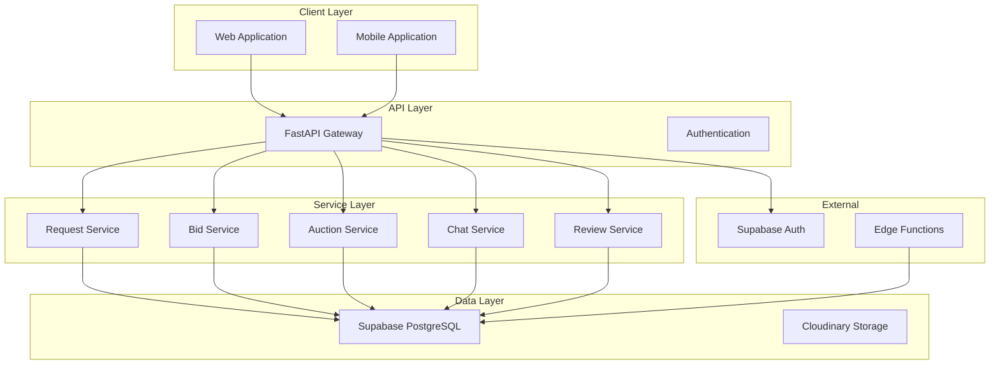
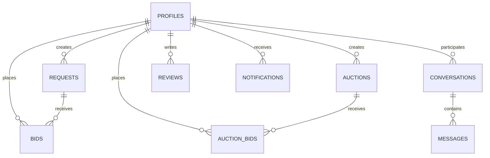
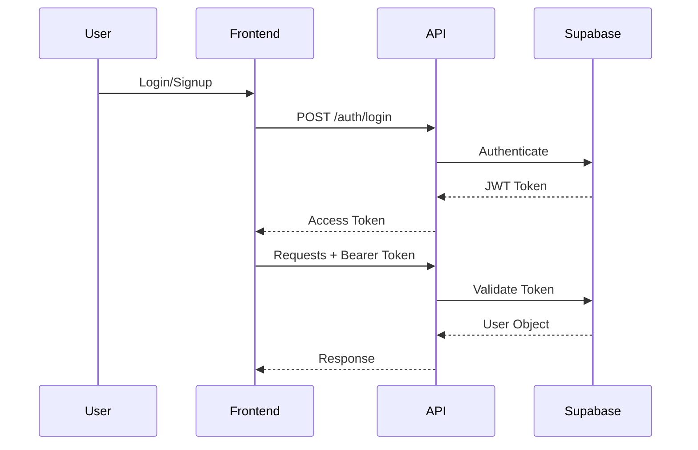
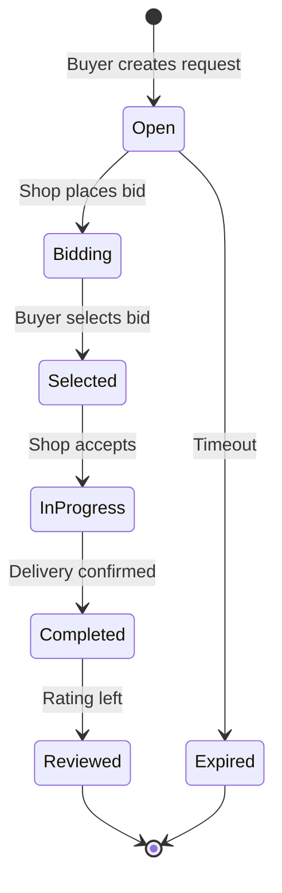
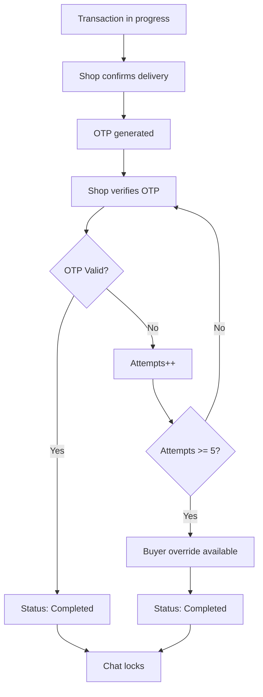

# MarketFlip Platform

## A Marketplace Connecting Buyers with Local Shop Owners

---

## Overview

MarketFlip is a comprehensive marketplace platform that connects buyers with local shop owners through a request-based bidding system and auctions. The platform facilitates seamless transactions, real-time communication, and reliable delivery verification.

---

## Features

### Core Functionality

| Feature | Description |
|---------|-------------|
| **Request-Based Bidding** | Buyers post needs, shop owners bid with prices |
| **Auction System** | Shop owners list items for competitive bidding |
| **Real-time Chat** | Direct communication between buyers and shops |
| **Delivery Management** | Home delivery and pickup with OTP verification |
| **Reviews & Ratings** | Trust-based reputation system |
| **Favorites & Saved Searches** | Personalized shopping experience |
| **Shop Reliability Scores** | Performance-based trust indicators |
| **Notifications** | Real-time updates for transactions |

---

## Tech Stack

### Backend

| Component | Technology |
|-----------|------------|
| **API Framework** | FastAPI (Python) |
| **Database** | Supabase (PostgreSQL) |
| **Authentication** | Supabase Auth |
| **File Storage** | Cloudinary |
| **Serverless Functions** | Supabase Edge Functions |
| **Deployment** | Render.com |

### Frontend

| Component | Technology |
|-----------|------------|
| **Framework** | React |
| **Deployment** | Vercel |

---

## System Architecture



---

## Key Modules

### 1. Authentication & Profiles
- User registration and login
- Profile management for buyers and shop owners
- Role-based access control (RBAC)
- JWT token authentication

### 2. Requests System
- Buyers create purchase requests
- Browse and filter open requests
- Update and delete requests
- Delivery method selection

### 3. Bids System
- Shop owners place bids on requests
- Buyers select winning bids
- Automatic rejection of other bids
- Chat unlocks on bid selection

### 4. Auctions System
- Shop owners create auction listings
- Buyers place competitive bids
- Automatic auction closing
- Sniping protection (5-minute extension)
- Reserve price support

### 5. Chat System
- Real-time messaging
- Transaction-based chat unlocking
- Message read receipts
- Rate limiting (1 message per 2 seconds)

### 6. Delivery & OTP Verification
- Home delivery and pickup options
- 4-digit OTP verification
- Max 5 verification attempts
- Buyer override after max attempts
- Automatic chat locking on completion

### 7. Reviews System
- Rate transactions (1-5 stars)
- Comment on experiences
- View review statistics
- Delete own reviews

### 8. Notifications System
- Real-time push notifications
- Mark as read/unread
- Notification types: auction won, delivery confirmed, transaction completed, etc.

### 9. Favorites & Saved Searches
- Save favorite items
- Create and manage saved searches
- Quick access to frequent searches

### 10. Reliability System
- Shop performance scoring
- Response time tracking
- Completion rate calculation
- Selection rate analysis

---

## Database Schema Highlights

### Core Tables

| Table | Purpose |
|-------|---------|
| `profiles` | User accounts (buyers & shop owners) |
| `requests` | Buyer purchase requests |
| `bids` | Shop owner bids on requests |
| `auctions` | Shop auction listings |
| `auction_bids` | Buyer bids on auctions |
| `conversations` | Chat conversations |
| `messages` | Individual messages |
| `reviews` | User reviews and ratings |
| `notifications` | User notifications |
| `reports` | Content moderation reports |
| `favorites` | Saved favorite items |
| `saved_searches` | Saved search queries |
| `shop_reliability_scores` | Shop performance metrics |

### Key Relationships



---

## Getting Started

### Prerequisites

```bash
# Required
- Python 3.9+
- Node.js 16+
- Supabase account
- Cloudinary account

# Optional
- Render.com account (for deployment)
- Vercel account (for frontend)
```

### Backend Setup

```bash
# Clone repository
git clone https://github.com/yourusername/marketflip.git
cd marketflip

# Create virtual environment
python -m venv venv
source venv/bin/activate  # On Windows: venv\Scripts\activate

# Install dependencies
pip install -r requirements.txt

# Set up environment variables
cp .env.example .env
# Edit .env with your credentials

# Run the application
uvicorn main:app --reload --host 0.0.0.0 --port 8000
```

### Environment Variables

```env
# Supabase Configuration
SUPABASE_URL=https://your-project.supabase.co
SUPABASE_ANON_KEY=your-anon-key
SUPABASE_SERVICE_ROLE_KEY=your-service-role-key

# Cloudinary Configuration
CLOUDINARY_CLOUD_NAME=your-cloud-name
CLOUDINARY_API_KEY=your-api-key
CLOUDINARY_API_SECRET=your-api-secret

# Optional
MARKETFLIP_API_URL=https://your-backend-url.com
```

### Frontend Setup

```bash
cd frontend
npm install
npm run dev
```

---

## API Documentation

### Authentication Endpoints

| Method | Endpoint | Description |
|--------|----------|-------------|
| POST | `/auth/signup` | Register new user |
| POST | `/auth/login` | User login |
| GET | `/auth/profiles/{user_id}` | Get user profile |
| PATCH | `/auth/profiles/{user_id}` | Update profile |

### Key Business Endpoints

| Method | Endpoint | Description |
|--------|----------|-------------|
| POST | `/requests` | Create request |
| GET | `/requests` | Get requests |
| POST | `/requests/{request_id}/bids` | Place bid |
| PATCH | `/bids/{bid_id}/select` | Select winning bid |
| POST | `/auctions` | Create auction |
| POST | `/auctions/{auction_id}/bids` | Place auction bid |
| GET | `/chat/conversations` | Get conversations |
| POST | `/chat/conversations/{id}/messages` | Send message |
| POST | `/reviews/` | Create review |

Full API documentation available at `/docs` when running the application.

---

## Authentication Flow



---

## Transaction Flow

### Request-to-Bid Lifecycle



### OTP Verification Flow



---

## Security

### Authentication
- JWT-based authentication
- Role-based access control (RBAC)
- Row Level Security (RLS) in database
- Password hashing via Supabase Auth

### Data Protection
- HTTPS encryption
- Secure API keys
- Environment variables for secrets
- Input validation and sanitization

### RLS Policies
- Users can only access their own data
- Shop owners manage their own bids/auctions
- Buyers manage their own requests
- Conversation participants only

---

## Deployment

### Backend (Render.com)

```bash
# Automatic deployment on push to main branch
# Render.com handles build and deployment

# Environment variables must be set in Render dashboard
```

### Edge Functions (Supabase)

```bash
# Deploy functions
supabase functions deploy close-auctions
supabase functions deploy expire-requests

# Functions run on schedule (every 5 minutes)
```

### Frontend (Vercel)

```bash
# Automatic deployment on push to main branch
# Build command: npm run build
# Output directory: dist
```

---

## Monitoring & Maintenance

### Health Checks

```bash
# API health check
curl https://marketflip.onrender.com/health

# Supabase health check
curl https://your-project.supabase.co/rest/v1/
```

### Logs

```bash
# Render logs
# Access via Render dashboard → Logs

# Edge function logs
supabase functions logs close-auctions
supabase functions logs expire-requests
```

### Cleanup Scripts

```bash
# Interactive cleanup
python scripts/cleanup.py

# Options include:
# - Clean old request_events
# - Clean expired requests
# - Clean orphan bids
# - Delete unused Cloudinary images
```

---

## Testing

### Backend Tests

```bash
# Run all tests
pytest

# Run specific test
pytest tests/test_requests.py

# Run with coverage
pytest --cov=. --cov-report=html
```

### API Testing

Access Swagger UI at: `http://localhost:8000/docs`

---

## Contributing

### Code Style
- Follow PEP 8 for Python
- Use type hints
- Write docstrings

### Pull Request Process
1. Fork the repository
2. Create a feature branch
3. Write tests for new features
4. Submit a pull request
5. Ensure all tests pass

---

## Support

### Documentation

| Resource | Location |
|----------|----------|
| API Documentation | `/docs` (Swagger UI) |
| System Reference | `/docs/system-reference.md` |
| Operations Guide | `/docs/operations.md` |
| Database Schema | `/docs/schema.md` |

### Contact

- **Backend Team:** backend@marketflip.com
- **Frontend Team:** frontend@marketflip.com
- **DevOps:** devops@marketflip.com

---

## License

Proprietary - All rights reserved.

---

## Acknowledgments

- FastAPI for the excellent Python framework
- Supabase for the amazing backend platform
- Cloudinary for reliable image hosting
- All contributors and maintainers

---

## Changelog

| Version | Date | Changes |
|---------|------|---------|
| 2.0.0 | 2026-09-15 | Initial release |

---
