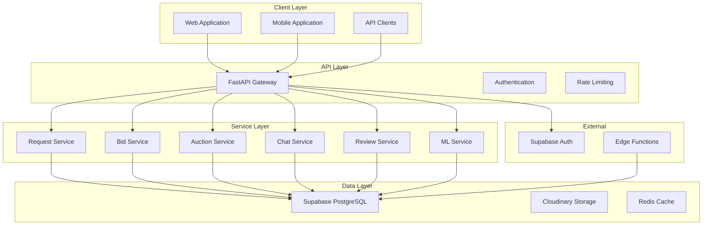
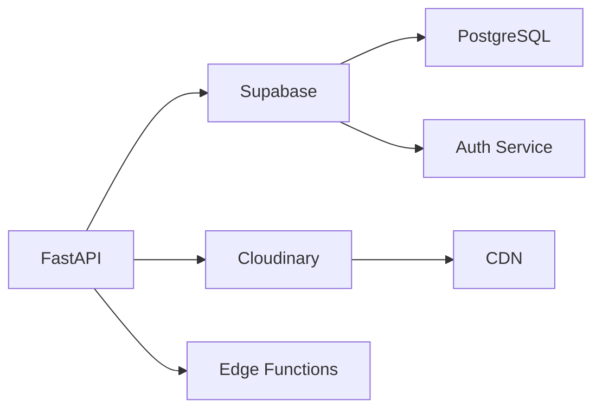
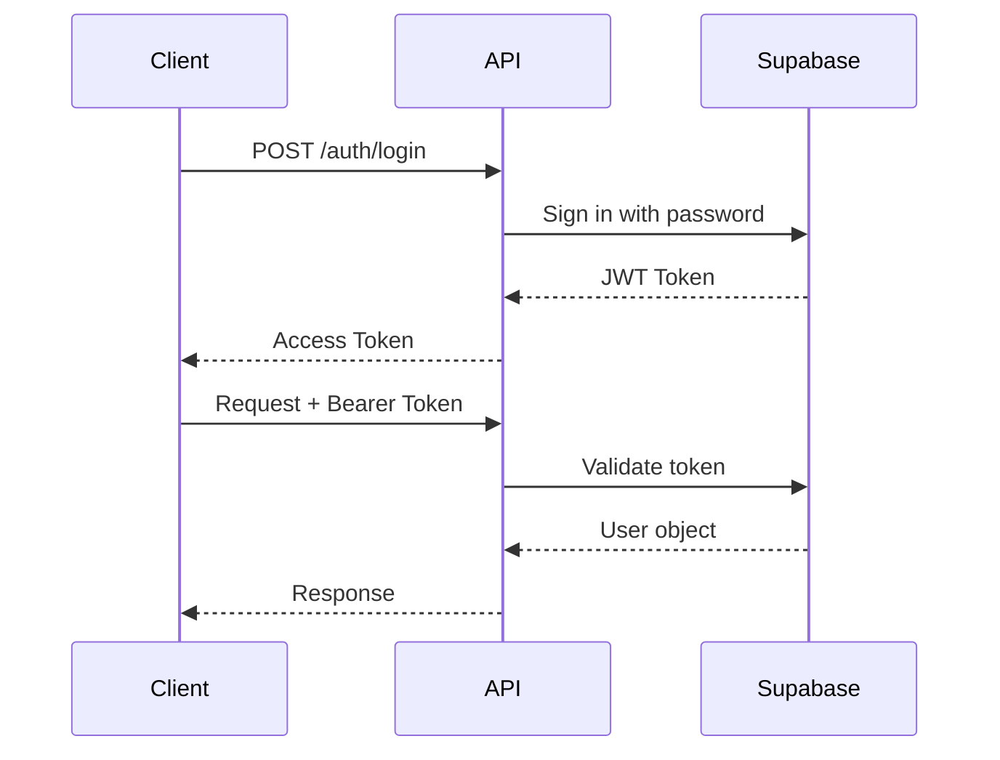
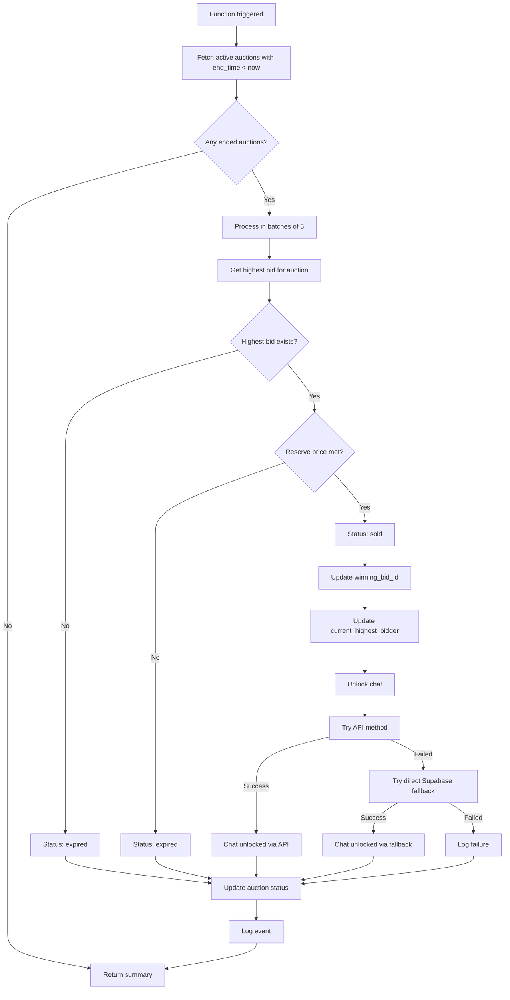

# MarketFlip Platform - System Reference Documentation

## Overview

This document provides a comprehensive reference for the MarketFlip platform's architecture, data models, API endpoints, and system configurations. It serves as the authoritative source for understanding the system's technical implementation.

---

## Table of Contents

- [System Architecture](#system-architecture)
- [Database Schema](#database-schema)
- [API Reference](#api-reference)
- [Authentication & Authorization](#authentication--authorization)
- [Edge Functions](#edge-functions)
- [File Storage](#file-storage)
- [Data Models](#data-models)
- [System Configuration](#system-configuration)
- [Error Codes](#error-codes)

---

## System Architecture

### High-Level Architecture



### Service Dependencies



---

## Database Schema

### Core Tables

#### 1. Profiles Table

Stores user account information for both buyers and shop owners.

| Column | Type | Constraints | Description |
|--------|------|-------------|-------------|
| `id` | `uuid` | Primary Key | User ID, references auth.users |
| `role` | `text` | NOT NULL | 'buyer' or 'shop_owner' |
| `shop_name` | `text` | Nullable | Shop name for shop owners |
| `full_name` | `text` | Nullable | User's full name |
| `address` | `text` | NOT NULL | Physical address |
| `pincode` | `text` | NOT NULL | 6-digit postal code |
| `phone` | `text` | NOT NULL | Contact phone number |
| `date_of_birth` | `date` | Nullable | User's date of birth |
| `gender` | `text` | Nullable | Gender |
| `profile_photo_url` | `text` | Nullable | Profile picture URL |
| `bio` | `text` | Nullable | User biography |
| `business_hours` | `jsonb` | Nullable | Shop operating hours |
| `years_in_business` | `int4` | Nullable | Years of operation |
| `preferred_categories` | `jsonb` | Nullable | Preferred categories |
| `avg_response_time_minutes` | `int4` | Nullable | Average response time |
| `total_transactions` | `int4` | Nullable | Total transactions count |
| `completed_transactions` | `int4` | Nullable | Completed transactions |
| `is_verified` | `bool` | Nullable | Verification status |
| `last_active_at` | `timestamptz` | Nullable | Last activity timestamp |
| `gst_number` | `text` | Nullable | GST registration number |
| `identity_number` | `text` | Nullable | Government ID number |
| `identity_type` | `text` | Nullable | Type of ID provided |
| `delivery_address` | `text` | Nullable | Default delivery address |
| `budget_range_preference` | `jsonb` | Nullable | Budget preferences |
| `notification_preferences` | `jsonb` | Nullable | Notification settings |
| `created_at` | `timestamp` | DEFAULT NOW() | Account creation timestamp |

**Indexes:**
```sql
CREATE INDEX idx_profiles_pincode ON profiles(pincode);
CREATE INDEX idx_profiles_role ON profiles(role);
CREATE INDEX idx_profiles_is_verified ON profiles(is_verified);
```

**RLS Policies:**
```sql
-- Users can view their own profile
CREATE POLICY "Users can view own profile" ON profiles
    FOR SELECT USING (auth.uid() = id);

-- Users can update their own profile
CREATE POLICY "Users can update own profile" ON profiles
    FOR UPDATE USING (auth.uid() = id) WITH CHECK (auth.uid() = id);
```

---

#### 2. Requests Table

Stores buyer-initiated requests for products or services.

| Column | Type | Constraints | Description |
|--------|------|-------------|-------------|
| `id` | `uuid` | Primary Key | Request ID |
| `buyer_id` | `uuid` | NOT NULL | References profiles.id |
| `item_name` | `text` | NOT NULL | Name of requested item |
| `description` | `text` | Nullable | Detailed description |
| `budget_min` | `int4` | NOT NULL | Minimum budget |
| `budget_max` | `int4` | NOT NULL | Maximum budget |
| `pincode` | `text` | NOT NULL | Location pincode |
| `category` | `text` | Nullable | Category (legacy) |
| `category_id` | `uuid` | Nullable | References categories.id |
| `reference_url` | `text` | Nullable | External reference URL |
| `reference_image` | `text` | Nullable | Reference image URL |
| `image_urls` | `jsonb` | Nullable | Multiple image URLs |
| `status` | `text` | NOT NULL | open/purchased/completed/deleted/expired |
| `created_at` | `timestamp` | NOT NULL | Creation timestamp |
| `expires_at` | `timestamp` | NOT NULL | Expiration timestamp |
| `purchased_at` | `timestamptz` | Nullable | Purchase timestamp |
| `selected_bid_id` | `uuid` | Nullable | Selected bid reference |
| `delivery_method` | `text` | Nullable | home_delivery/pickup |
| `delivery_address` | `text` | Nullable | Delivery address |
| `completed_at` | `timestamptz` | Nullable | Completion timestamp |
| `views_count` | `int4` | Nullable | Number of views |
| `urgency` | `text` | Nullable | Urgency level |
| `preferred_contact_time` | `text` | Nullable | Preferred contact time |
| `delivery_confirmed_by_shop` | `bool` | Nullable | Delivery confirmation |
| `delivery_response_at` | `timestamptz` | Nullable | Delivery response timestamp |
| `verification_code` | `text` | Nullable | OTP code |
| `verification_attempts` | `int4` | Nullable | OTP attempts count |
| `completed_via_override` | `bool` | Nullable | Admin override flag |
| `data_source` | `text` | Nullable | Data origin source |

**Indexes:**
```sql
CREATE INDEX idx_requests_status ON requests(status);
CREATE INDEX idx_requests_buyer_id ON requests(buyer_id);
CREATE INDEX idx_requests_pincode ON requests(pincode);
CREATE INDEX idx_requests_created_at ON requests(created_at DESC);
CREATE INDEX idx_requests_status_created ON requests(status, created_at DESC);
```

**RLS Policies:**
```sql
-- Anyone can view open requests
CREATE POLICY "Anyone can view open requests" ON requests
    FOR SELECT USING (status = 'open');

-- Buyers can manage their own requests
CREATE POLICY "Buyers can insert own requests" ON requests
    FOR INSERT WITH CHECK (auth.uid() = buyer_id);

CREATE POLICY "Buyers can update own requests" ON requests
    FOR UPDATE USING (auth.uid() = buyer_id) WITH CHECK (auth.uid() = buyer_id);

CREATE POLICY "Buyers can delete own requests" ON requests
    FOR DELETE USING (auth.uid() = buyer_id);
```

---

#### 3. Bids Table

Stores shop owner responses to buyer requests.

| Column | Type | Constraints | Description |
|--------|------|-------------|-------------|
| `id` | `uuid` | Primary Key | Bid ID |
| `request_id` | `uuid` | NOT NULL | References requests.id |
| `shop_id` | `uuid` | NOT NULL | References profiles.id |
| `price` | `int4` | NOT NULL | Bid price |
| `note` | `text` | Nullable | Additional notes |
| `status` | `text` | NOT NULL | pending/selected/rejected/withdrawn |
| `created_at` | `timestamptz` | NOT NULL | Creation timestamp |
| `selected_at` | `timestamptz` | Nullable | Selection timestamp |
| `rejected_at` | `timestamptz` | Nullable | Rejection timestamp |
| `withdrawn_at` | `timestamptz` | Nullable | Withdrawal timestamp |
| `buyer_contact_viewed` | `bool` | Nullable | Contact viewed flag |
| `is_negotiable` | `bool` | Nullable | Negotiation flag |
| `data_source` | `text` | Nullable | Data origin source |

**Indexes:**
```sql
CREATE INDEX idx_bids_request_id ON bids(request_id);
CREATE INDEX idx_bids_shop_id ON bids(shop_id);
CREATE INDEX idx_bids_status ON bids(status);
CREATE INDEX idx_bids_request_status ON bids(request_id, status);
```

**RLS Policies:**
```sql
-- Shop owners can manage their own bids
CREATE POLICY "Shop owners can insert own bids" ON bids
    FOR INSERT WITH CHECK (auth.uid() = shop_id);

CREATE POLICY "Shop owners can update own bids" ON bids
    FOR UPDATE USING (auth.uid() = shop_id) WITH CHECK (auth.uid() = shop_id);

CREATE POLICY "Shop owners can delete own bids" ON bids
    FOR DELETE USING (auth.uid() = shop_id);

-- Buyers can view bids on their requests
CREATE POLICY "Buyers can view bids on their requests" ON bids
    FOR SELECT USING (
        EXISTS (SELECT 1 FROM requests WHERE requests.id = bids.request_id AND requests.buyer_id = auth.uid())
    );
```

---

#### 4. Auctions Table

Stores shop-initiated auction listings.

| Column | Type | Constraints | Description |
|--------|------|-------------|-------------|
| `id` | `uuid` | Primary Key | Auction ID |
| `shop_id` | `uuid` | NOT NULL | References profiles.id |
| `item_name` | `text` | NOT NULL | Auction item name |
| `description` | `text` | Nullable | Item description |
| `starting_price` | `int4` | NOT NULL | Starting bid price |
| `reserve_price` | `int4` | Nullable | Reserve price |
| `current_highest_bid` | `int4` | Nullable | Current highest bid |
| `current_highest_bidder` | `uuid` | Nullable | Highest bidder ID |
| `winning_bid_id` | `uuid` | Nullable | Winning bid ID |
| `category` | `text` | Nullable | Category |
| `pincode` | `text` | NOT NULL | Location pincode |
| `image_urls` | `_text` | Nullable | Array of image URLs |
| `status` | `text` | NOT NULL | active/sold/completed/expired/cancelled |
| `end_time` | `timestamptz` | NOT NULL | Auction end time |
| `closed_at` | `timestamptz` | Nullable | Closure timestamp |
| `completed_at` | `timestamptz` | Nullable | Completion timestamp |
| `delivery_method` | `text` | Nullable | Delivery method |
| `delivery_address` | `text` | Nullable | Delivery address |
| `delivery_confirmed_by_shop` | `bool` | Nullable | Delivery confirmation |
| `delivery_response_at` | `timestamptz` | Nullable | Delivery response timestamp |
| `verification_code` | `text` | Nullable | OTP code |
| `verification_attempts` | `int4` | Nullable | OTP attempts count |
| `completed_via_override` | `bool` | Nullable | Admin override flag |
| `created_at` | `timestamptz` | DEFAULT NOW() | Creation timestamp |
| `data_source` | `text` | Nullable | Data origin source |

**Indexes:**
```sql
CREATE INDEX idx_auctions_status ON auctions(status);
CREATE INDEX idx_auctions_shop_id ON auctions(shop_id);
CREATE INDEX idx_auctions_pincode ON auctions(pincode);
CREATE INDEX idx_auctions_end_time ON auctions(end_time);
CREATE INDEX idx_auctions_status_end ON auctions(status, end_time) WHERE status = 'active';
```

**RLS Policies:**
```sql
-- Shop owners can manage their own auctions
CREATE POLICY "Shop owners can create auctions" ON auctions
    FOR INSERT WITH CHECK (
        EXISTS (SELECT 1 FROM profiles WHERE profiles.id = auth.uid() AND profiles.role = 'shop_owner') 
        AND shop_id = auth.uid()
    );

CREATE POLICY "Shop owners can update own auctions" ON auctions
    FOR UPDATE USING (shop_id = auth.uid()) WITH CHECK (shop_id = auth.uid());

-- Users can view auctions
CREATE POLICY "Users can view auctions" ON auctions
    FOR SELECT USING (true);
```

---

#### 5. Auction Bids Table

Stores bids placed on auctions.

| Column | Type | Constraints | Description |
|--------|------|-------------|-------------|
| `id` | `uuid` | Primary Key | Bid ID |
| `auction_id` | `uuid` | NOT NULL | References auctions.id |
| `buyer_id` | `uuid` | NOT NULL | References profiles.id |
| `bid_amount` | `int4` | NOT NULL | Bid amount |
| `created_at` | `timestamptz` | DEFAULT NOW() | Creation timestamp |
| `data_source` | `text` | Nullable | Data origin source |

**Indexes:**
```sql
CREATE INDEX idx_auction_bids_auction_id ON auction_bids(auction_id);
CREATE INDEX idx_auction_bids_buyer_id ON auction_bids(buyer_id);
CREATE INDEX idx_auction_bids_created ON auction_bids(created_at DESC);
```

---

#### 6. Conversations Table

Stores chat conversations between buyers and shop owners.

| Column | Type | Constraints | Description |
|--------|------|-------------|-------------|
| `id` | `uuid` | Primary Key | Conversation ID |
| `buyer_id` | `uuid` | NOT NULL | References profiles.id |
| `shop_id` | `uuid` | NOT NULL | References profiles.id |
| `active_source_type` | `text` | Nullable | request/auction |
| `active_source_id` | `uuid` | Nullable | Source entity ID |
| `locked` | `bool` | Nullable | Conversation lock status |
| `created_at` | `timestamptz` | DEFAULT NOW() | Creation timestamp |
| `updated_at` | `timestamptz` | DEFAULT NOW() | Last update timestamp |

**Indexes:**
```sql
CREATE INDEX idx_conversations_buyer_id ON conversations(buyer_id);
CREATE INDEX idx_conversations_shop_id ON conversations(shop_id);
CREATE INDEX idx_conversations_updated_at ON conversations(updated_at DESC);
```

---

#### 7. Messages Table

Stores individual messages within conversations.

| Column | Type | Constraints | Description |
|--------|------|-------------|-------------|
| `id` | `uuid` | Primary Key | Message ID |
| `conversation_id` | `uuid` | NOT NULL | References conversations.id |
| `sender_id` | `uuid` | NOT NULL | Sender user ID |
| `content` | `text` | NOT NULL | Message content |
| `is_read` | `bool` | DEFAULT FALSE | Read status |
| `read_at` | `timestamptz` | Nullable | Read timestamp |
| `created_at` | `timestamptz` | DEFAULT NOW() | Creation timestamp |
| `is_reported` | `bool` | DEFAULT FALSE | Reported flag |
| `is_blocked` | `bool` | DEFAULT FALSE | Blocked flag |

**Indexes:**
```sql
CREATE INDEX idx_messages_conversation_id ON messages(conversation_id);
CREATE INDEX idx_messages_created_at ON messages(created_at DESC);
CREATE INDEX idx_messages_sender_id ON messages(sender_id);
CREATE INDEX idx_messages_conversation_created ON messages(conversation_id, created_at DESC);
```

---

#### 8. Conversation Active Transactions Table

Tracks active transactions within conversations.

| Column | Type | Constraints | Description |
|--------|------|-------------|-------------|
| `id` | `uuid` | Primary Key | Transaction ID |
| `conversation_id` | `uuid` | NOT NULL | References conversations.id |
| `source_type` | `text` | NOT NULL | request/auction |
| `source_id` | `uuid` | NOT NULL | Source entity ID |
| `item_name` | `text` | Nullable | Item name |
| `status` | `text` | DEFAULT 'active' | active/completed |
| `created_at` | `timestamptz` | DEFAULT NOW() | Creation timestamp |
| `completed_at` | `timestamptz` | Nullable | Completion timestamp |

**Indexes:**
```sql
CREATE INDEX idx_active_transactions_conversation_id ON conversation_active_transactions(conversation_id);
CREATE INDEX idx_active_transactions_status ON conversation_active_transactions(status);
```

---

#### 9. Reviews Table

Stores user reviews and ratings.

| Column | Type | Constraints | Description |
|--------|------|-------------|-------------|
| `id` | `uuid` | Primary Key | Review ID |
| `reviewer_id` | `uuid` | NOT NULL | Reviewer user ID |
| `reviewed_id` | `uuid` | NOT NULL | Reviewed user ID |
| `target_type` | `text` | NOT NULL | request/auction/shop |
| `target_id` | `uuid` | NOT NULL | Target entity ID |
| `rating` | `int4` | NOT NULL | Rating (1-5) |
| `comment` | `text` | Nullable | Review comment |
| `created_at` | `timestamptz` | DEFAULT NOW() | Creation timestamp |

**Indexes:**
```sql
CREATE INDEX idx_reviews_reviewed_id ON reviews(reviewed_id);
CREATE INDEX idx_reviews_target ON reviews(target_type, target_id);
```

**Unique Constraints:**
```sql
-- One review per reviewer per target
CREATE UNIQUE INDEX idx_reviews_unique ON reviews(reviewer_id, target_type, target_id);
```

---

#### 10. Notifications Table

Stores user notifications.

| Column | Type | Constraints | Description |
|--------|------|-------------|-------------|
| `id` | `uuid` | Primary Key | Notification ID |
| `user_id` | `uuid` | NOT NULL | References profiles.id |
| `type` | `text` | NOT NULL | Notification type |
| `title` | `text` | NOT NULL | Notification title |
| `body` | `text` | NOT NULL | Notification body |
| `link` | `text` | Nullable | Action link |
| `read` | `bool` | DEFAULT FALSE | Read status |
| `created_at` | `timestamptz` | DEFAULT NOW() | Creation timestamp |

**Indexes:**
```sql
CREATE INDEX idx_notifications_user_id ON notifications(user_id);
CREATE INDEX idx_notifications_user_read ON notifications(user_id, read);
```

---

#### 11. Reports Table

Stores user reports for content moderation.

| Column | Type | Constraints | Description |
|--------|------|-------------|-------------|
| `id` | `uuid` | Primary Key | Report ID |
| `reporter_id` | `uuid` | NOT NULL | Reporting user ID |
| `target_type` | `text` | NOT NULL | request/auction/user/message |
| `target_id` | `uuid` | NOT NULL | Target entity ID |
| `reason` | `text` | NOT NULL | Report reason |
| `description` | `text` | Nullable | Detailed description |
| `status` | `text` | DEFAULT 'pending' | pending/reviewed/dismissed/action_taken |
| `created_at` | `timestamptz` | DEFAULT NOW() | Creation timestamp |
| `updated_at` | `timestamptz` | DEFAULT NOW() | Last update timestamp |

**Indexes:**
```sql
CREATE INDEX idx_reports_status ON reports(status);
CREATE INDEX idx_reports_target ON reports(target_type, target_id);
CREATE INDEX idx_reports_reporter_id ON reports(reporter_id);
```

---

#### 12. Favorites Table

Stores user favorited items.

| Column | Type | Constraints | Description |
|--------|------|-------------|-------------|
| `id` | `uuid` | Primary Key | Favorite ID |
| `user_id` | `uuid` | NOT NULL | References profiles.id |
| `target_type` | `text` | NOT NULL | request/auction/shop |
| `target_id` | `uuid` | NOT NULL | Target entity ID |
| `created_at` | `timestamptz` | DEFAULT NOW() | Creation timestamp |

**Indexes:**
```sql
CREATE INDEX idx_favorites_user_id ON favorites(user_id);
CREATE INDEX idx_favorites_target ON favorites(target_type, target_id);
CREATE INDEX idx_favorites_user_target ON favorites(user_id, target_type, target_id);
```

---

#### 13. Saved Searches Table

Stores user-saved search queries.

| Column | Type | Constraints | Description |
|--------|------|-------------|-------------|
| `id` | `uuid` | Primary Key | Search ID |
| `user_id` | `uuid` | NOT NULL | References profiles.id |
| `name` | `text` | NOT NULL | Saved search name |
| `search_params` | `jsonb` | NOT NULL | Search parameters |
| `created_at` | `timestamptz` | DEFAULT NOW() | Creation timestamp |
| `updated_at` | `timestamptz` | DEFAULT NOW() | Last update timestamp |

**Indexes:**
```sql
CREATE INDEX idx_saved_searches_user_id ON saved_searches(user_id);
```

---

#### 14. Shop Reliability Scores Table

Stores calculated reliability metrics for shop owners.

| Column | Type | Constraints | Description |
|--------|------|-------------|-------------|
| `id` | `uuid` | Primary Key | Score ID |
| `shop_id` | `uuid` | NOT NULL, Unique | References profiles.id |
| `avg_response_time_minutes` | `float8` | Nullable | Average response time |
| `completion_rate` | `float8` | Nullable | Completion rate |
| `selection_rate` | `float8` | Nullable | Selection rate |
| `reliability_score` | `float8` | Nullable | Overall reliability score |
| `response_score` | `float8` | Nullable | Response time score |
| `completion_score` | `float8` | Nullable | Completion score |
| `selection_score` | `float8` | Nullable | Selection score |
| `total_requests_handled` | `int4` | Nullable | Total requests handled |
| `total_bids_placed` | `int4` | Nullable | Total bids placed |
| `total_selected` | `int4` | Nullable | Total bids selected |
| `total_completed` | `int4` | Nullable | Total completed transactions |
| `calculated_at` | `timestamptz` | Nullable | Calculation timestamp |
| `updated_at` | `timestamptz` | Nullable | Last update timestamp |

**RLS Policies:**
```sql
-- Anyone can read reliability scores
CREATE POLICY "Anyone can read reliability scores" ON shop_reliability_scores
    FOR SELECT USING (true);
```

---

#### 15. Categories Table

Stores product and service categorization.

| Column | Type | Constraints | Description |
|--------|------|-------------|-------------|
| `id` | `uuid` | Primary Key | Category ID |
| `name` | `text` | NOT NULL | Category name |
| `parent_category_id` | `uuid` | Nullable | Self-referential parent |
| `field_schema` | `jsonb` | Nullable | Custom field schema |
| `created_at` | `timestamptz` | DEFAULT NOW() | Creation timestamp |

---

## API Reference

### Authentication Endpoints

| Method | Endpoint | Description | Auth Required |
|--------|----------|-------------|---------------|
| POST | `/auth/signup` | Register new user | No |
| POST | `/auth/login` | User login | No |
| GET | `/auth/profiles/{user_id}` | Get user profile | Yes |
| PATCH | `/auth/profiles/{user_id}` | Update user profile | Yes |

### Request Endpoints

| Method | Endpoint | Description | Auth Required |
|--------|----------|-------------|---------------|
| POST | `/requests` | Create request | Yes (Buyer) |
| GET | `/requests` | Get requests | Optional |
| GET | `/requests/{request_id}` | Get request detail | Yes |
| PATCH | `/requests/{request_id}` | Update request | Yes (Buyer) |
| DELETE | `/requests/{request_id}` | Delete request | Yes (Buyer) |
| PATCH | `/requests/{request_id}/delivery` | Set delivery method | Yes (Buyer) |
| PATCH | `/requests/{request_id}/delivery/confirm` | Confirm delivery | Yes (Shop) |
| PATCH | `/requests/{request_id}/delivery/deny` | Deny delivery | Yes (Shop) |
| PATCH | `/requests/{request_id}/switch-to-pickup` | Switch to pickup | Yes (Buyer) |
| POST | `/requests/{request_id}/verify-otp` | Verify OTP | Yes (Shop) |
| PATCH | `/requests/{request_id}/override-complete` | Override completion | Yes (Buyer) |

### Bid Endpoints

| Method | Endpoint | Description | Auth Required |
|--------|----------|-------------|---------------|
| POST | `/requests/{request_id}/bids` | Create bid | Yes (Shop) |
| GET | `/requests/{request_id}/bids` | Get bids for request | Yes |
| GET | `/bids` | Get bids | Yes |
| GET | `/bids/shop-bids` | Get shop's bids | Yes (Shop) |
| GET | `/bids/auction-bids` | Get auction bids | Yes (Buyer) |
| GET | `/bids/{bid_id}` | Get bid by ID | Yes |
| PATCH | `/bids/{bid_id}` | Update bid | Yes (Shop) |
| DELETE | `/bids/{bid_id}` | Delete bid | Yes (Shop) |
| PATCH | `/bids/{bid_id}/select` | Select bid | Yes (Buyer) |
| GET | `/bids/{bid_id}/buyer` | Get buyer details | Yes (Shop) |
| GET | `/bids/stats` | Get bid stats | Yes (Shop) |

### Auction Endpoints

| Method | Endpoint | Description | Auth Required |
|--------|----------|-------------|---------------|
| POST | `/auctions` | Create auction | Yes (Shop) |
| GET | `/auctions` | Get auctions | Yes |
| GET | `/auctions/{auction_id}` | Get auction detail | Yes |
| DELETE | `/auctions/{auction_id}` | Cancel auction | Yes (Shop) |
| POST | `/auctions/{auction_id}/bids` | Place bid | Yes (Buyer) |
| PATCH | `/auctions/{auction_id}/delivery` | Set delivery | Yes (Buyer) |
| PATCH | `/auctions/{auction_id}/delivery/confirm` | Confirm delivery | Yes (Shop) |
| PATCH | `/auctions/{auction_id}/delivery/deny` | Deny delivery | Yes (Shop) |
| PATCH | `/auctions/{auction_id}/switch-to-pickup` | Switch to pickup | Yes (Buyer) |
| POST | `/auctions/{auction_id}/verify-otp` | Verify OTP | Yes (Shop) |
| PATCH | `/auctions/{auction_id}/override-complete` | Override | Yes (Buyer) |
| POST | `/auctions/{auction_id}/relist` | Relist auction | Yes (Shop) |

### Chat Endpoints

| Method | Endpoint | Description | Auth Required |
|--------|----------|-------------|---------------|
| GET | `/chat/conversations` | Get conversations | Yes |
| GET | `/chat/conversations/{conversation_id}/messages` | Get messages | Yes |
| POST | `/chat/conversations/{conversation_id}/messages` | Send message | Yes |
| PATCH | `/chat/conversations/{conversation_id}/read` | Mark read | Yes |
| GET | `/chat/unread-count` | Get unread count | Yes |

### Review Endpoints

| Method | Endpoint | Description | Auth Required |
|--------|----------|-------------|---------------|
| POST | `/reviews/` | Create review | Yes |
| GET | `/reviews/profile/{profile_id}` | Get profile reviews | Yes |
| GET | `/reviews/my-reviews` | Get my reviews | Yes |
| GET | `/reviews/target/{target_type}/{target_id}` | Get target reviews | Yes |
| GET | `/reviews/check/{target_type}/{target_id}` | Check user reviewed | Yes |
| GET | `/reviews/stats/{profile_id}` | Get review stats | Yes |
| DELETE | `/reviews/{review_id}` | Delete review | Yes |

### Notification Endpoints

| Method | Endpoint | Description | Auth Required |
|--------|----------|-------------|---------------|
| GET | `/notifications` | Get notifications | Yes |
| GET | `/notifications/unread-count` | Get unread count | Yes |
| PATCH | `/notifications/{notification_id}/read` | Mark as read | Yes |
| PATCH | `/notifications/read-all` | Mark all as read | Yes |
| DELETE | `/notifications/{notification_id}` | Delete notification | Yes |

### Report Endpoints

| Method | Endpoint | Description | Auth Required |
|--------|----------|-------------|---------------|
| POST | `/reports` | Create report | Yes |
| GET | `/reports` | Get reports | Yes |
| GET | `/reports/my` | Get my reports | Yes |
| PATCH | `/reports/{report_id}` | Update report | Yes |

### Favorite Endpoints

| Method | Endpoint | Description | Auth Required |
|--------|----------|-------------|---------------|
| POST | `/favorites/toggle` | Toggle favorite | Yes |
| GET | `/favorites` | Get favorites | Yes |
| GET | `/favorites/check/{target_type}/{target_id}` | Check favorite | Yes |

### Saved Search Endpoints

| Method | Endpoint | Description | Auth Required |
|--------|----------|-------------|---------------|
| POST | `/saved-searches` | Create saved search | Yes |
| GET | `/saved-searches` | Get saved searches | Yes |
| PATCH | `/saved-searches/{search_id}` | Update saved search | Yes |
| DELETE | `/saved-searches/{search_id}` | Delete saved search | Yes |

### Reliability Endpoints

| Method | Endpoint | Description | Auth Required |
|--------|----------|-------------|---------------|
| GET | `/reliability/shop/{shop_id}` | Get shop reliability | Yes |
| GET | `/reliability/shops` | Get shops reliability | Yes |
| GET | `/reliability/top` | Get top shops | Yes |
| POST | `/reliability/refresh` | Refresh scores | Yes (Admin) |

### Upload Endpoints

| Method | Endpoint | Description | Auth Required |
|--------|----------|-------------|---------------|
| POST | `/upload/single` | Upload single image | Yes |
| POST | `/upload/multiple` | Upload multiple images | Yes |

### Health Endpoints

| Method | Endpoint | Description | Auth Required |
|--------|----------|-------------|---------------|
| GET | `/` | Root endpoint | No |
| GET | `/health` | Health check | No |

---

## Authentication & Authorization

### JWT Token Flow



### Role-Based Access Control

| Role | Permissions |
|------|-------------|
| **Buyer** | Create requests, select bids, leave reviews, chat, favorite items |
| **Shop Owner** | Create auctions, place bids, confirm delivery, verify OTP |
| **Admin** | Access all endpoints, manage reports, refresh reliability |

### RLS Policy Summary

| Table | Policy | Access |
|-------|--------|--------|
| `profiles` | Users can view/update own profile | SELECT/UPDATE |
| `requests` | Anyone can view open requests | SELECT |
| `requests` | Buyers can manage own requests | CRUD |
| `bids` | Shops can manage own bids | CRUD |
| `bids` | Buyers can view bids on their requests | SELECT |
| `auctions` | Users can view auctions | SELECT |
| `auctions` | Shops can manage own auctions | CRUD |
| `auction_bids` | Buyers can place bids | INSERT |
| `auction_bids` | Users can view auction bids | SELECT |
| `conversations` | Participants can view | SELECT |
| `messages` | Participants can send/read | INSERT/SELECT |
| `reviews` | Users can manage own reviews | INSERT/DELETE |
| `reviews` | Users can view reviews | SELECT |
| `notifications` | Users can manage own notifications | SELECT/UPDATE |
| `favorites` | Users can manage own favorites | CRUD |
| `saved_searches` | Users can manage own searches | CRUD |
| `reports` | Users can create/view own reports | INSERT/SELECT |
| `shop_reliability_scores` | Anyone can view | SELECT |

---

## Edge Functions

### Close Auctions Function

**Purpose:** Automatically closes auctions that have passed their end time.

**File:** `supabase/functions/close-auctions/index.ts`

**Schedule:** Every 5 minutes

**Configuration:**

| Setting | Value |
|---------|-------|
| Batch Size | 5 auctions per batch |
| Max Retries | 3 attempts |
| Retry Delay | Exponential backoff (1s, 2s, 4s) |
| Request Timeout | 15 seconds |
| Function Timeout | 60 seconds |
| Max Auctions per Run | 50 |

**Processing Logic:**



**Response:**
```json
{
  "success": true,
  "message": "Closed 10 auctions (7 sold, 3 expired)",
  "closed": 10,
  "sold": 7,
  "expired_no_bids": 2,
  "expired_reserve_not_met": 1,
  "chat_unlock_api": 6,
  "chat_unlock_fallback": 1,
  "chat_unlock_failed": 0
}
```

---

### Expire Requests Function

**Purpose:** Automatically expires open requests that have passed their expiration time.

**File:** `supabase/functions/expire-requests/index.ts`

**Schedule:** Every 5 minutes

**Processing Logic:**
1. Find open requests where `expires_at < NOW()`
2. Update status to `expired`
3. Return count and IDs

**Response:**
```json
{
  "success": true,
  "expired_count": 5,
  "expired_ids": ["uuid-1", "uuid-2"]
}
```

---

## File Storage

### Cloudinary Configuration

**Credentials:**
- `CLOUDINARY_CLOUD_NAME`: Cloud name
- `CLOUDINARY_API_KEY`: API key
- `CLOUDINARY_API_SECRET`: API secret

**File Limits:**

| Setting | Value |
|---------|-------|
| Max File Size | 5 MB |
| Max Files per Upload | 5 |
| Allowed Types | JPEG, PNG, WebP |
| Storage Folder | `marketflip/requests` |

**Upload Transformations:**
- Quality: auto
- Fetch Format: auto

**Upload Functions:**

```python
def upload_image(file, folder="marketflip"):
    """Upload a single image to Cloudinary"""
    return {
        "url": result["secure_url"],
        "public_id": result["public_id"],
        "width": result.get("width"),
        "height": result.get("height"),
        "format": result.get("format"),
        "bytes": result.get("bytes")
    }

def upload_multiple_images(files, folder="marketflip", max_images=5):
    """Upload multiple images to Cloudinary"""
    results = []
    for file in files[:max_images]:
        result = upload_image(file, folder)
        results.append(result)
    return results

def delete_image(public_id):
    """Delete an image from Cloudinary"""
    return cloudinary.uploader.destroy(public_id)
```

---

## Data Models

### Request Models

#### SignupRequest
```python
{
    "email": "string",      # Valid email
    "password": "string",   # User password
    "role": "string",       # buyer or shop_owner
    "address": "string",    # Physical address
    "pincode": "string",    # 6 digits
    "phone": "string",      # Phone number
    "shop_name": "string"   # Required for shop_owner
}
```

#### LoginRequest
```python
{
    "email": "string",    # User email
    "password": "string"  # User password
}
```

#### RequestCreate
```python
{
    "item_name": "string",          # 1-255 chars
    "description": "string",        # Optional
    "budget_min": 0,               # >0
    "budget_max": 0,               # >= budget_min
    "pincode": "string",           # 6 digits
    "category": "string",          # Default: electronics
    "reference_url": "string",     # Optional
    "reference_image": "string",   # Optional
    "delivery_method": "string",   # home_delivery or pickup
    "delivery_address": "string",  # Required for home_delivery
    "image_urls": []              # Optional
}
```

#### BidCreate
```python
{
    "price": 0,           # >0
    "note": "string"      # Optional
}
```

#### AuctionCreate
```python
{
    "item_name": "string",          # 1-255 chars
    "description": "string",        # Optional
    "starting_price": 0,           # >0
    "pincode": "string",           # 6 digits
    "category": "string",          # Default: electronics
    "end_time": "datetime",        # ISO format
    "image_urls": []              # Optional
}
```

#### MessageCreate
```python
{
    "content": "string"  # 1-2000 chars
}
```

#### ReviewCreate
```python
{
    "reviewed_id": "uuid",         # Counterparty ID
    "target_type": "string",       # request or auction
    "target_id": "uuid",           # Transaction target ID
    "rating": 0,                  # 1-5
    "comment": "string"           # Optional, max 1000 chars
}
```

#### ReportCreate
```python
{
    "target_type": "string",       # request/auction/user/message
    "target_id": "uuid",           # Target ID
    "reason": "string",            # 1-255 chars
    "description": "string"        # Optional, max 1000 chars
}
```

#### FavoriteCreate
```python
{
    "target_type": "string",       # request or auction
    "target_id": "uuid"            # Target ID
}
```

### Response Models

#### LoginResponse
```python
{
    "access_token": "string",
    "role": "string",
    "user_id": "uuid"
}
```

#### RequestResponse
```python
{
    "id": "uuid",
    "buyer_id": "uuid",
    "item_name": "string",
    "description": "string",
    "budget_min": 0,
    "budget_max": 0,
    "pincode": "string",
    "category": "string",
    "status": "string",
    "created_at": "datetime",
    "expires_at": "datetime",
    "delivery_method": "string",
    "delivery_address": "string",
    "delivery_confirmed_by_shop": "boolean",
    "verification_code": "string",
    "verification_attempts": 0,
    "completed_via_override": "boolean",
    "image_urls": []
}
```

#### BidResponse
```python
{
    "id": "uuid",
    "request_id": "uuid",
    "shop_id": "uuid",
    "price": 0,
    "note": "string",
    "status": "string",
    "created_at": "datetime"
}
```

#### AuctionResponse
```python
{
    "id": "uuid",
    "shop_id": "uuid",
    "shop_name": "string",
    "item_name": "string",
    "description": "string",
    "starting_price": 0,
    "current_highest_bid": 0,
    "category": "string",
    "pincode": "string",
    "image_urls": [],
    "status": "string",
    "end_time": "datetime",
    "bid_count": 0,
    "created_at": "datetime"
}
```

#### ConversationResponse
```python
{
    "id": "uuid",
    "buyer_id": "uuid",
    "shop_id": "uuid",
    "active_source_type": "string",
    "active_source_id": "uuid",
    "locked": "boolean",
    "created_at": "datetime",
    "updated_at": "datetime",
    "buyer_name": "string",
    "shop_name": "string",
    "last_message": "string",
    "last_message_at": "datetime",
    "unread_count": 0,
    "active_item_name": "string",
    "active_item_price": 0,
    "active_item_image": "string"
}
```

---

## System Configuration

### Environment Variables Reference

| Variable | Description | Default | Required By |
|----------|-------------|---------|-------------|
| `SUPABASE_URL` | Supabase project URL | - | All services |
| `SUPABASE_ANON_KEY` | Supabase anonymous key | - | Backend API |
| `SUPABASE_SERVICE_ROLE_KEY` | Supabase admin key | - | Backend API, Edge Functions |
| `CLOUDINARY_CLOUD_NAME` | Cloudinary cloud name | - | Upload service |
| `CLOUDINARY_API_KEY` | Cloudinary API key | - | Upload service |
| `CLOUDINARY_API_SECRET` | Cloudinary API secret | - | Upload service |
| `MARKETFLIP_API_URL` | Backend API URL | https://marketflip.onrender.com | Edge Functions |

### Deployment Configuration

**Render.com Configuration:**

| Setting | Value |
|---------|-------|
| Build Command | `pip install -r requirements.txt` |
| Start Command | `uvicorn main:app --host 0.0.0.0 --port $PORT` |
| Python Version | 3.9+ |
| Environment | Python |

**CORS Configuration:**

```python
allow_origins = [
    "http://localhost:5173",
    "http://127.0.0.1:5173",
    "https://marketflip-mauve.vercel.app",
    "https://marketflip.onrender.com",
]
```

---

## Error Codes

### HTTP Status Codes

| Status Code | Description | Usage |
|-------------|-------------|-------|
| 200 | Success | GET requests, successful operations |
| 201 | Created | POST requests (creation) |
| 204 | No Content | DELETE requests |
| 400 | Bad Request | Validation errors, invalid input |
| 401 | Unauthorized | Missing/invalid authentication |
| 403 | Forbidden | Insufficient permissions |
| 404 | Not Found | Resource not found |
| 429 | Too Many Requests | Rate limiting |
| 500 | Internal Server Error | Server-side errors |

### Business Error Codes

| Error Code | Description | HTTP Status |
|------------|-------------|-------------|
| `INVALID_PRICE` | Price must be greater than 0 | 400 |
| `REQUEST_NOT_OPEN` | Request is not open for bidding | 400 |
| `DUPLICATE_BID` | Already have a pending bid | 400 |
| `BID_NOT_PENDING` | Cannot update/delete non-pending bid | 400 |
| `AUCTION_NOT_ACTIVE` | Auction is not active | 400 |
| `AUCTION_ENDED` | Auction has ended | 400 |
| `BID_TOO_LOW` | Bid must exceed current highest | 400 |
| `MAX_ATTEMPTS_EXCEEDED` | Max OTP attempts reached | 400 |
| `NO_OTP_GENERATED` | No OTP exists for this transaction | 400 |
| `CONVERSATION_LOCKED` | Cannot send message in locked conversation | 400 |
| `INVALID_TARGET_TYPE` | target_type must be valid | 400 |
| `NOT_SHOP_OWNER` | User is not a shop owner | 403 |
| `NOT_BUYER` | User is not a buyer | 403 |
| `NOT_OWNER` | User does not own this resource | 403 |
| `NOT_WINNER` | User is not the winning buyer | 403 |
| `NOT_PARTICIPANT` | User is not part of this conversation | 403 |

### Error Response Format

```json
{
  "detail": "Error message description"
}
```

---

## Changelog

| Version | Date | Changes |
|---------|------|---------|
| 1.0.0 | 2026-09-15 | Initial system reference documentation |
| 1.1.0 | 2026-09-20 | Added full API reference |
| 1.2.0 | 2026-09-25 | Added data models and error codes |
| 1.3.0 | 2026-09-30 | Added RLS policies and edge functions |

---

*This documentation is maintained by the Owner*