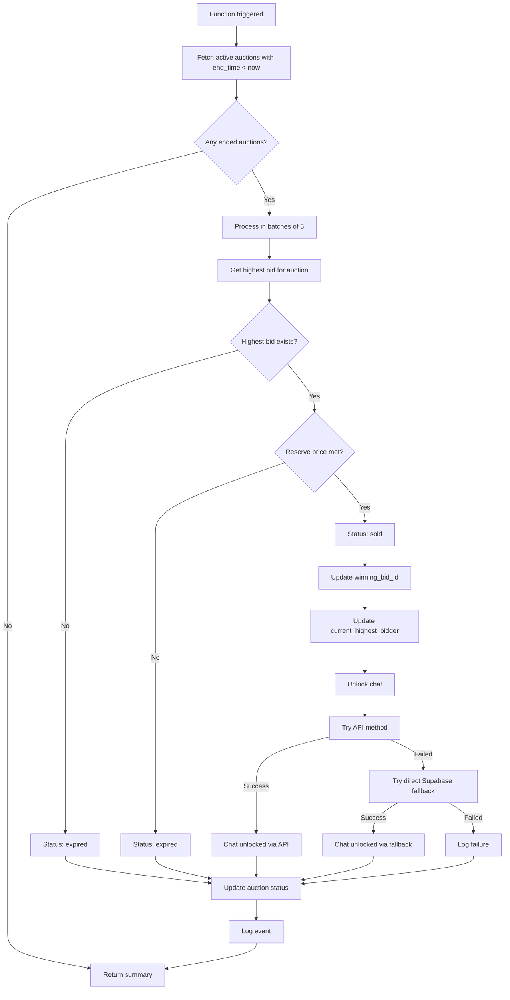
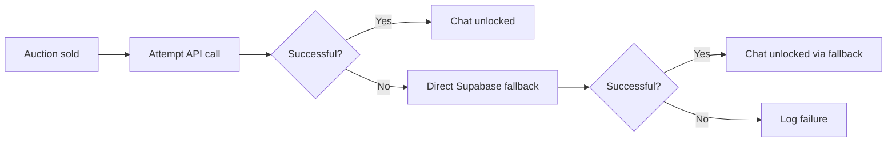
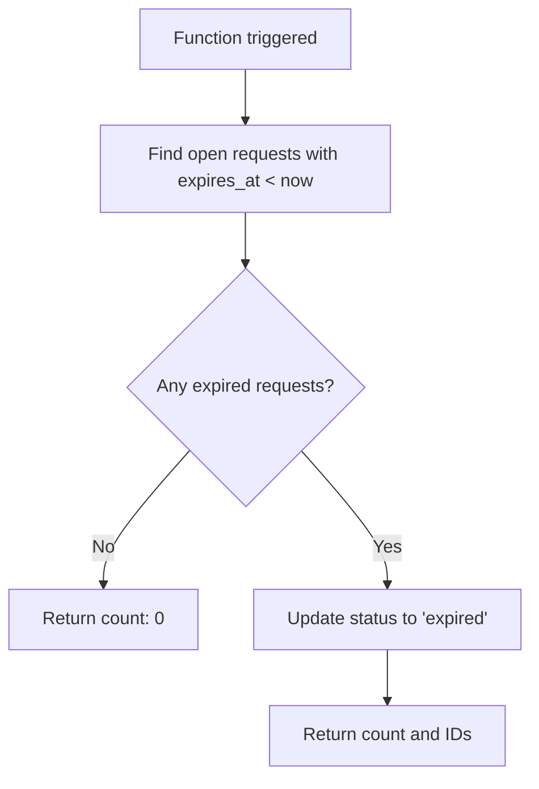
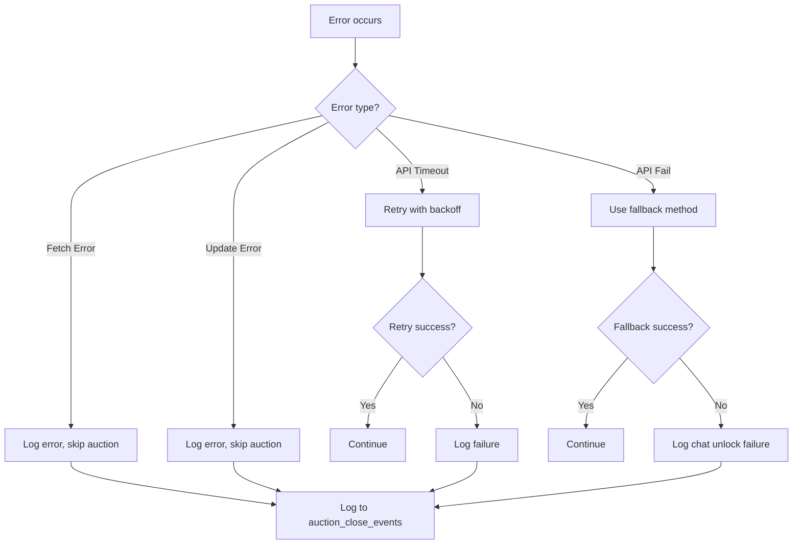

# Cron Functions Documentation

## Overview

The platform uses Supabase Edge Functions to automate scheduled tasks. These functions run at regular intervals to handle time-sensitive operations such as closing expired auctions and expiring open requests.

---

## Table of Contents

- [Close Auctions Function](#close-auctions-function)
- [Expire Requests Function](#expire-requests-function)
- [Deployment & Scheduling](#deployment--scheduling)
- [Error Handling](#error-handling)

---

## Close Auctions Function

### Purpose

Automatically closes auctions that have passed their end time. Determines winners, updates auction status, and unlocks chat for successful transactions.

### Location

`supabase/functions/close-auctions/index.ts`

### Process Flow



### Configuration

| Setting | Value |
|---------|-------|
| Batch Size | 5 auctions per batch |
| Max Retries | 3 attempts |
| Retry Delay | Exponential backoff (1s, 2s, 4s) |
| Request Timeout | 15 seconds |
| Function Timeout | 60 seconds |
| Max Auctions per Run | 50 |

### Auction Resolution Logic

| Scenario | Outcome |
|----------|---------|
| No bids | Status: `expired` |
| Bids exist, reserve not met | Status: `expired` |
| Bids exist, reserve met | Status: `sold` |
| Bids exist, no reserve | Status: `sold` (highest bid wins) |

### Chat Unlock Mechanism



**Primary Method:**
- Calls `POST /auctions/{id}/close-with-winner` on backend API

**Fallback Method:**
- Creates/get conversation directly in Supabase
- Inserts active transaction
- Unlocks conversation

### Response

```json
{
  "success": true,
  "message": "Closed 10 auctions (7 sold, 3 expired)",
  "closed": 10,
  "sold": 7,
  "expired_no_bids": 2,
  "expired_reserve_not_met": 1,
  "chat_unlock_api": 6,
  "chat_unlock_fallback": 1,
  "chat_unlock_failed": 0
}
```

---

## Expire Requests Function

### Purpose

Automatically expires open requests that have passed their expiration time.

### Location

`supabase/functions/expire-requests/index.ts`

### Process Flow



### Response

```json
{
  "success": true,
  "expired_count": 5,
  "expired_ids": ["uuid-1", "uuid-2"]
}
```

---

## Deployment & Scheduling

### Supabase Edge Functions

Both functions are deployed as Supabase Edge Functions.

**Deployment Command:**
```bash
supabase functions deploy close-auctions
supabase functions deploy expire-requests
```

### Scheduling

These functions are designed to be triggered by:

**Supabase Cron Jobs (Scheduled Functions):**
- `close-auctions`: Runs every 5 minutes or on a configured schedule
- `expire-requests`: Runs every 5 minutes or on a configured schedule

The scheduling is configured in the Supabase dashboard or via the `supabase/functions` configuration.

### Environment Variables

| Variable | Description | Used By |
|----------|-------------|---------|
| `SUPABASE_URL` | Supabase project URL | Both |
| `SUPABASE_SERVICE_ROLE_KEY` | Service role key for admin access | Both |
| `MARKETFLIP_API_URL` | Backend API URL | Close Auctions |

---

## Error Handling

### Close Auctions Error Handling



### Error Logging

**Close Auctions:**
- Uses `auction_close_events` table for logging
- Records status and error messages
- Falls back to console logging if table doesn't exist

**Expire Requests:**
- Logs errors to console
- Returns error response

### Rate Limiting Protection

- Batches processing to avoid hitting rate limits
- 100ms delay between batches
- Exponential backoff for retries

---

## Performance Considerations

### Optimization Strategies

| Strategy | Implementation |
|----------|----------------|
| Batch Processing | 5 auctions per batch |
| Concurrency Control | Process batches sequentially |
| Retry Logic | Exponential backoff with max 3 attempts |
| Timeout Protection | 15 second request timeout |
| Query Limiting | Max 50 auctions per run |

### Monitoring Metrics

| Metric | Description |
|--------|-------------|
| `closed` | Total auctions closed |
| `sold` | Auctions sold with winner |
| `expired_no_bids` | Expired without bids |
| `expired_reserve_not_met` | Expired due to reserve not met |
| `chat_unlock_api` | Chat unlocked via API |
| `chat_unlock_fallback` | Chat unlocked via fallback |
| `chat_unlock_failed` | Chat unlock failures |

---

## Testing

### Manual Trigger

Functions can be triggered manually for testing:

```bash
# Invoke close-auctions function
supabase functions invoke close-auctions

# Invoke expire-requests function
supabase functions invoke expire-requests
```

### Test Data Considerations

- Create auctions with `end_time` in the past
- Ensure `status = 'active'`
- Verify function processes them correctly

---

## Changelog

| Version | Date | Changes |
|---------|------|---------|
| 1.0.0 | 2026-09-15 | Initial documentation |

---

*This documentation is maintained by the Owner.*