# Marketplace Platform - Complete Database Schema Guide

> **Version:** 1.0.0 | **Last Updated:** September 2026 | **Status:** Production Ready

---

## Table of Contents

- [System Overview](#system-overview)
- [Entity Relationship Diagram](#entity-relationship-diagram)
- [Core Tables](#core-tables)
- [Transaction Flow](#transaction-flow)
- [Auction System](#auction-system)
- [Communication Layer](#communication-layer)
- [User Engagement](#user-engagement)
- [System Tables](#system-tables)
- [Row Level Security Policies](#row-level-security-policies)
- [Data Flow Diagrams](#data-flow-diagrams)
- [Performance Considerations](#performance-considerations)

---

## System Overview

### Architecture Summary

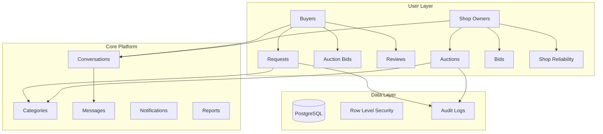

### Key Features

| Feature | Description | Tables Involved |
|---------|-------------|-----------------|
| Request-Based Bidding | Buyers post needs, shops bid | `requests`, `bids` |
| Auction System | Shops list items for auction | `auctions`, `auction_bids` |
| Real-time Chat | Direct buyer-seller communication | `conversations`, `messages` |
| Rating & Reviews | Trust & reputation system | `reviews` |
| Shop Reliability | Performance scoring engine | `shop_reliability_scores` |
| Content Moderation | Reporting system | `reports` |

---

## Entity Relationship Diagram

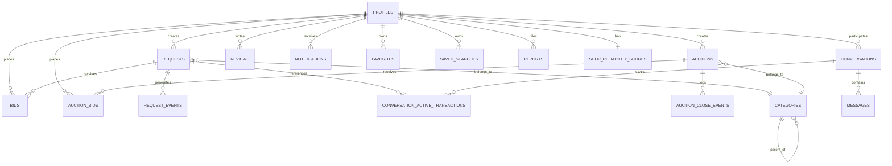

### Table Relationship Matrix

| Parent Table | Child Table | Relationship | Foreign Key |
|--------------|-------------|--------------|-------------|
| `profiles` | `requests` | One-to-Many | `buyer_id` |
| `profiles` | `bids` | One-to-Many | `shop_id` |
| `profiles` | `auctions` | One-to-Many | `shop_id` |
| `profiles` | `auction_bids` | One-to-Many | `buyer_id` |
| `profiles` | `conversations` | One-to-Many | `buyer_id`, `shop_id` |
| `profiles` | `messages` | One-to-Many | `sender_id` |
| `requests` | `bids` | One-to-Many | `request_id` |
| `requests` | `request_events` | One-to-Many | `request_id` |
| `auctions` | `auction_bids` | One-to-Many | `auction_id` |
| `auctions` | `auction_close_events` | One-to-Many | `auction_id` |
| `categories` | `categories` | Self-Reference | `parent_category_id` |
| `conversations` | `messages` | One-to-Many | `conversation_id` |
| `conversations` | `conversation_active_transactions` | One-to-Many | `conversation_id` |
| `profiles` | `shop_reliability_scores` | One-to-One | `shop_id` |

---

## Core Tables

### 1. `profiles` - User Management

```sql
CREATE TABLE profiles (
    id UUID PRIMARY KEY,
    role TEXT NOT NULL CHECK (role IN ('buyer', 'shop_owner')),
    shop_name TEXT,
    full_name TEXT,
    address TEXT NOT NULL,
    pincode TEXT NOT NULL,
    phone TEXT NOT NULL,
    date_of_birth DATE,
    gender TEXT,
    profile_photo_url TEXT,
    bio TEXT,
    business_hours JSONB,
    years_in_business INT,
    preferred_categories JSONB,
    avg_response_time_minutes INT,
    total_transactions INT DEFAULT 0,
    completed_transactions INT DEFAULT 0,
    is_verified BOOLEAN DEFAULT FALSE,
    last_active_at TIMESTAMPTZ,
    gst_number TEXT,
    identity_number TEXT,
    identity_type TEXT,
    delivery_address TEXT,
    budget_range_preference JSONB,
    notification_preferences JSONB,
    created_at TIMESTAMP DEFAULT NOW()
);
```

**Field Groups:**

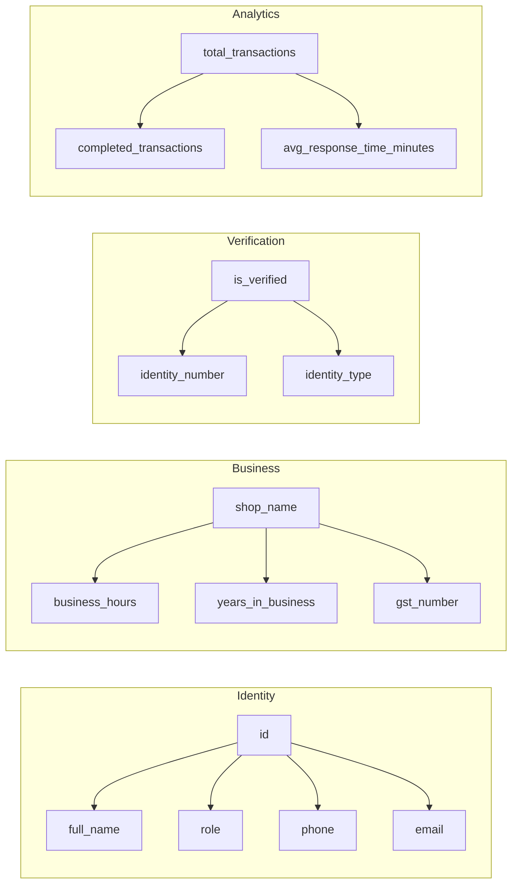

### 2. `categories` - Product Hierarchy

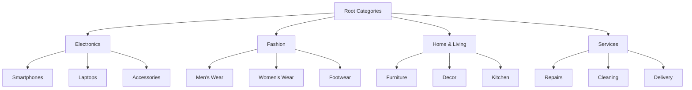

**Category Schema Structure:**
```json
{
  "fields": [
    {
      "name": "brand",
      "type": "text",
      "required": false
    },
    {
      "name": "model",
      "type": "text",
      "required": false
    },
    {
      "name": "specifications",
      "type": "jsonb",
      "required": false
    }
  ]
}
```

---

## Transaction Flow

### Request-to-Bid Lifecycle

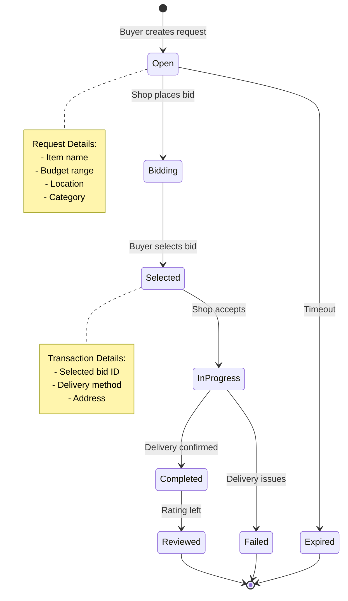

### `requests` Table Structure

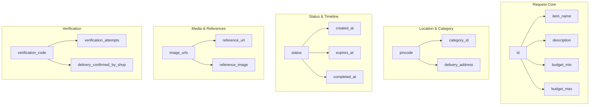

### `bids` Table Structure

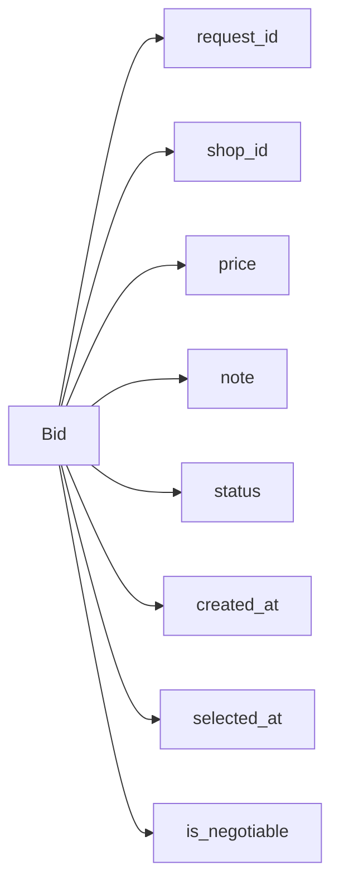

**Bid Status Flow:**
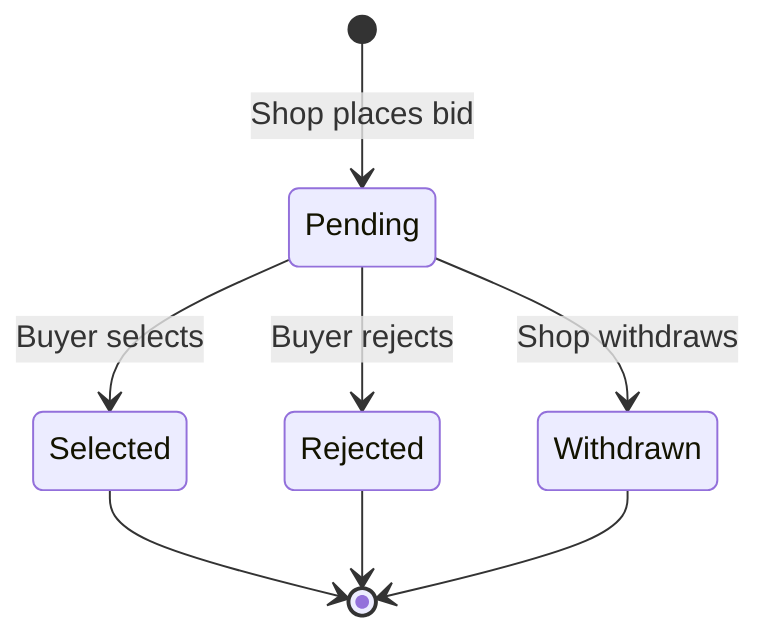

---

## Auction System

### Auction Lifecycle

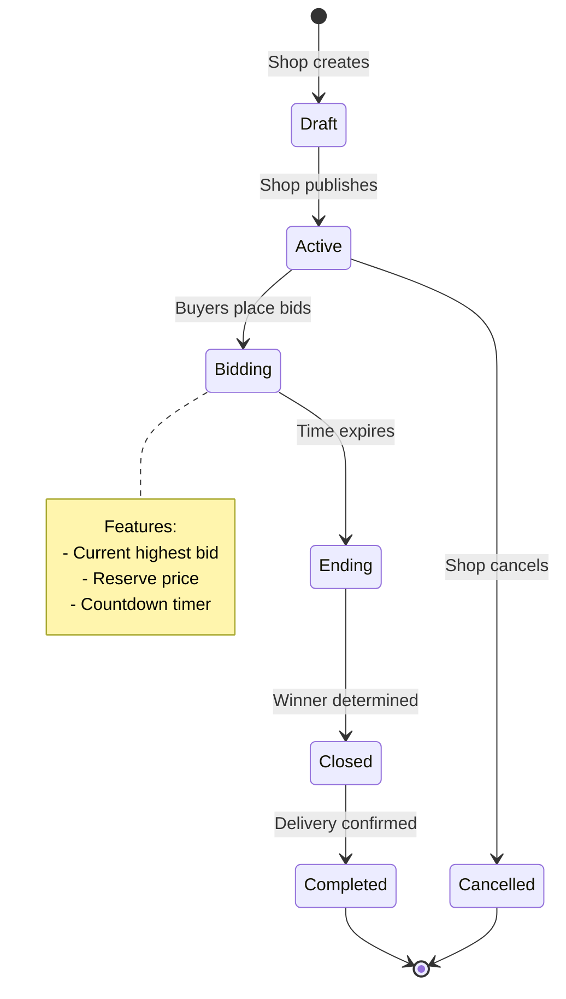

### `auctions` Table Structure

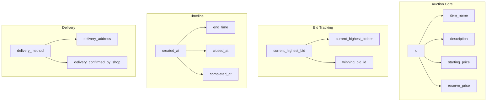

### Auction vs Request Comparison

| Feature | Requests | Auctions |
|---------|----------|----------|
| **Initiator** | Buyer | Shop Owner |
| **Pricing** | Buyer sets budget range | Shop sets starting price |
| **Bidding** | Shops bid downward | Buyers bid upward |
| **Selection** | Buyer selects bid | Highest bid wins |
| **Timeline** | Open until selection | Fixed end time |
| **Competition** | Shops compete for sale | Buyers compete for item |

---

## Communication Layer

### Conversation Flow

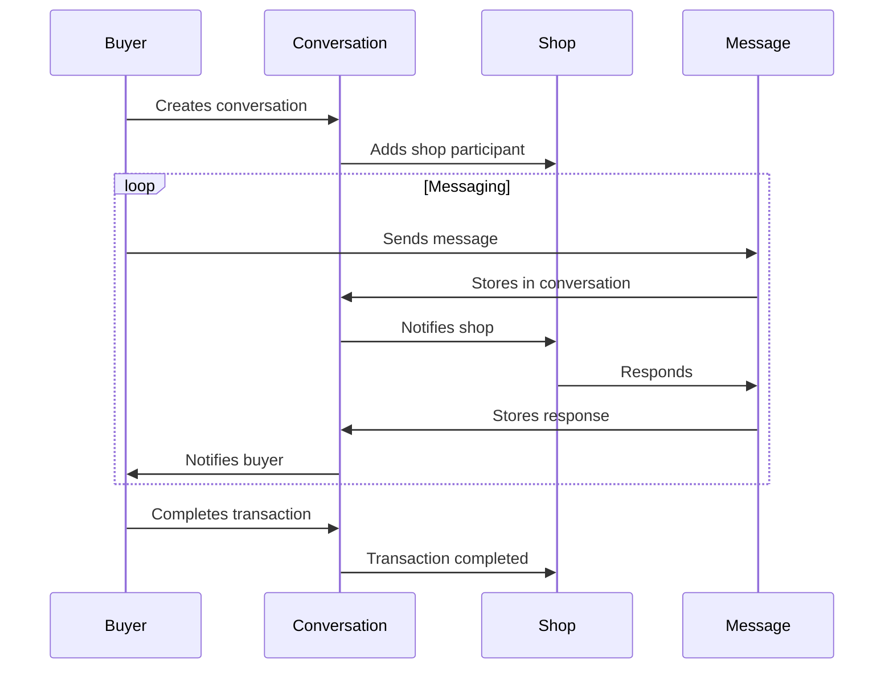

### Conversation Management

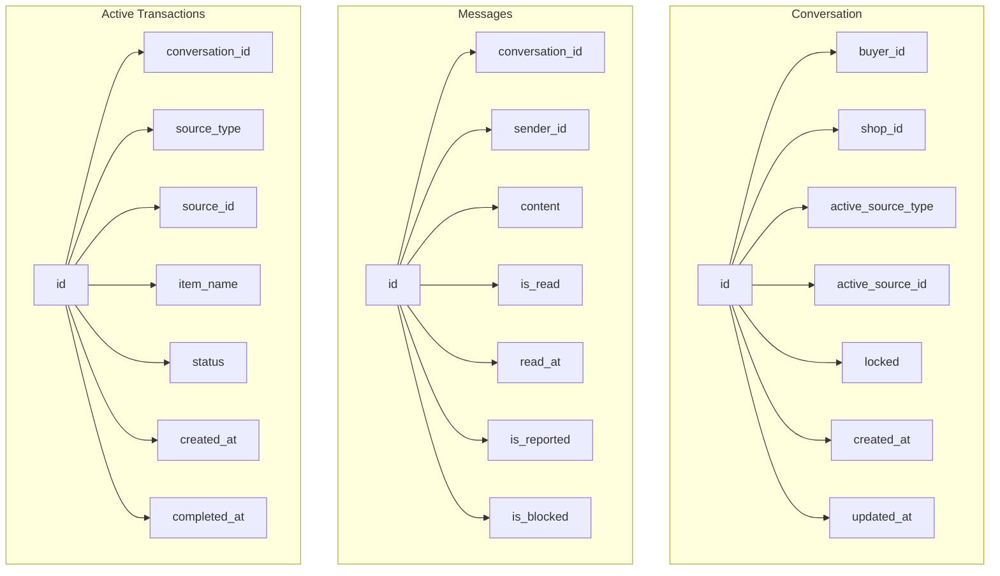

**Message Flow State Diagram:**
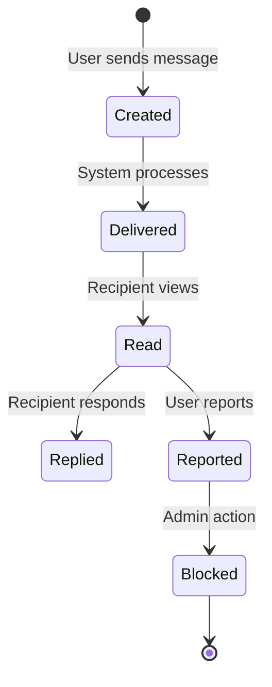

---

## User Engagement

### Review System

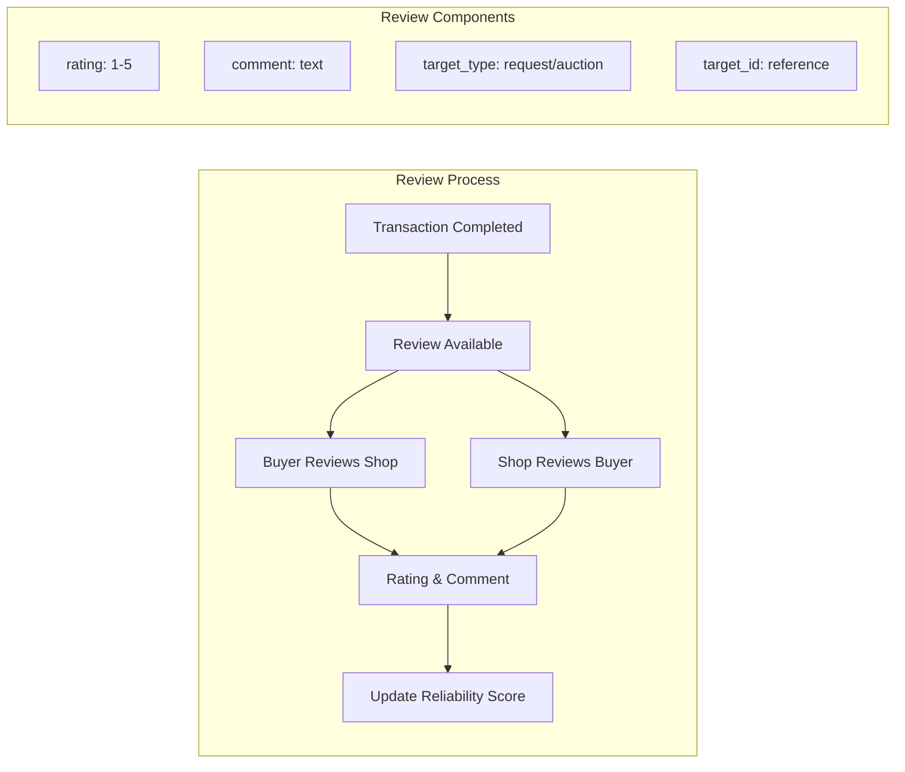

### Reliability Score Calculation

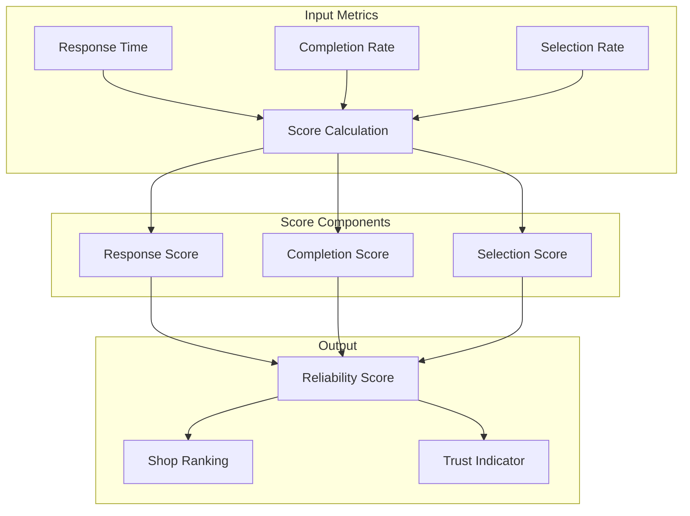

### `shop_reliability_scores` Metrics

| Metric | Formula | Weight |
|--------|---------|--------|
| Response Score | `1 / (1 + avg_response_time/60)` | 30% |
| Completion Score | `completed / total_requests` | 35% |
| Selection Score | `selected / total_bids` | 35% |
| Overall Score | `(response + completion + selection) / 3` | 100% |

---

## Row Level Security Policies

### Security Matrix

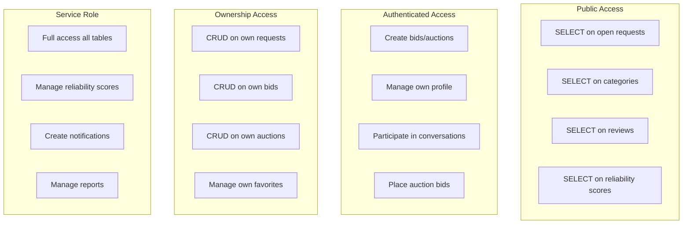

### Policy Enforcement Flow

```mermaid
flowchart TD
    A[User Request] --> B{Authenticated?}
    B -->|No| C[Public Policy Check]
    B -->|Yes| D{Role Check}
    
    C --> E[SELECT only]
    C --> F[Status = 'open']
    
    D -->|Buyer| G[Own requests]
    D -->|Shop| H[Own bids/auctions]
    D -->|Both| I[Conversation access]
    
    G --> J[CRUD where buyer_id = auth.uid()]
    H --> K[CRUD where shop_id = auth.uid()]
    I --> L[WHERE participant = auth.uid()]
    
    E --> M[Result]
    F --> M
    J --> M
    K --> M
    L --> M
```

### Security Policy Summary

| Table | Public Access | Authenticated Access | Ownership Access |
|-------|--------------|---------------------|------------------|
| `profiles` | No | No | Full CRUD |
| `requests` | SELECT (open) | No | Full CRUD |
| `bids` | No | No | Full CRUD |
| `auctions` | No | SELECT | Full CRUD |
| `auction_bids` | No | SELECT | INSERT |
| `conversations` | No | No | SELECT |
| `messages` | No | No | INSERT/SELECT |
| `reviews` | No | SELECT | INSERT/DELETE |
| `notifications` | No | No | SELECT/UPDATE |
| `favorites` | No | No | Full CRUD |
| `categories` | No | SELECT | No |
| `reports` | No | No | INSERT/SELECT |

---

## Data Flow Diagrams

### Request Creation Flow

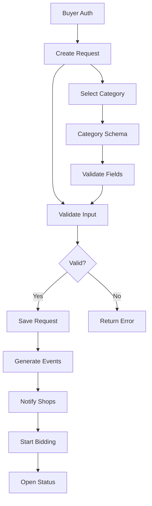

### Bid to Transaction Flow

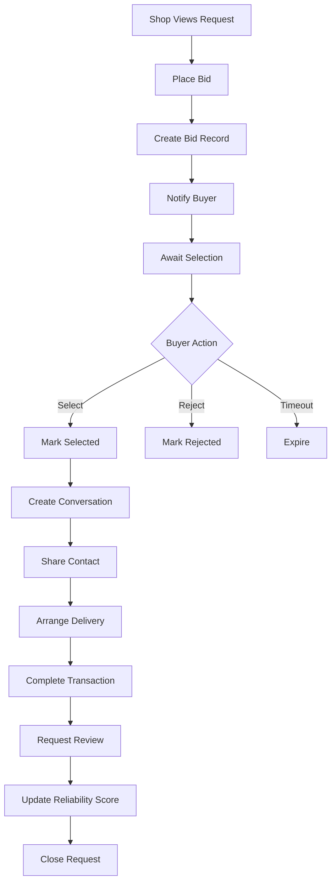

### Auction Lifecycle Flow

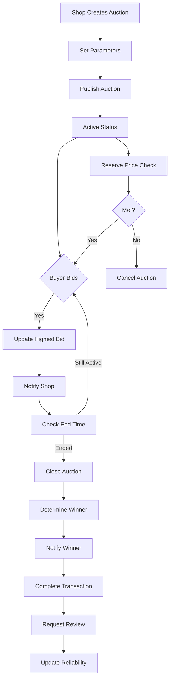

---

## Performance Considerations

### Indexing Strategy

| Table | Column(s) | Index Type | Use Case |
|-------|-----------|------------|----------|
| `requests` | `status`, `created_at` | BTREE | Filter open requests |
| `requests` | `buyer_id` | BTREE | User's requests |
| `requests` | `category_id` | BTREE | Category filtering |
| `bids` | `request_id` | BTREE | Request bids lookup |
| `bids` | `shop_id` | BTREE | Shop's bids |
| `auctions` | `status`, `end_time` | BTREE | Active auctions |
| `auctions` | `shop_id` | BTREE | Shop's auctions |
| `messages` | `conversation_id`, `created_at` | BTREE | Conversation messages |
| `conversations` | `buyer_id`, `shop_id` | BTREE | Participant lookup |
| `profiles` | `pincode` | BTREE | Location-based search |
| `profiles` | `role` | BTREE | Role filtering |
| `reviews` | `target_id`, `target_type` | BTREE | Target reviews |
| `notifications` | `user_id`, `read` | BTREE | Unread notifications |

### Query Optimization Tips

**1. Open Requests Query**
```sql
-- Optimized with composite index
SELECT * FROM requests 
WHERE status = 'open' 
AND created_at > NOW() - INTERVAL '7 days'
ORDER BY created_at DESC;
```

**2. Shop Reliability Calculation**
```sql
-- Materialized view for performance
CREATE MATERIALIZED VIEW shop_reliability_view AS
SELECT 
    shop_id,
    avg_response_time_minutes,
    completion_rate,
    reliability_score
FROM shop_reliability_scores
WHERE calculated_at > NOW() - INTERVAL '30 days';
```

**3. Active Auctions with End Times**
```sql
-- Use partial index
CREATE INDEX idx_active_auctions_end_time 
ON auctions(end_time) 
WHERE status = 'active';
```

---

## Monitoring Metrics

### Key Performance Indicators

| Metric | Target | Monitoring Table |
|--------|--------|------------------|
| Request Response Time | < 5 minutes | `profiles.avg_response_time_minutes` |
| Completion Rate | > 80% | `shop_reliability_scores.completion_rate` |
| Auction Success Rate | > 70% | `auctions.status = 'completed'` |
| User Retention | > 60% | `profiles.last_active_at` |
| Review Completion | > 50% | `reviews` count |
| Verification Rate | > 75% | `profiles.is_verified` |

### Growth Metrics

```mermaid
graph LR
    A[Daily Active Users] --> B[Transactions]
    B --> C[Revenue]
    A --> D[New Shops]
    A --> E[New Buyers]
    D --> F[Total Products]
    E --> G[Total Requests]
```

---

## Maintenance Operations

### Regular Cleanup Tasks

```sql
-- Archive completed requests older than 90 days
-- Archive inactive conversations
-- Purge unverified accounts after 30 days
-- Recalculate reliability scores weekly
-- Clean expired verification codes
```

### Backup Strategy

| Component | Frequency | Retention |
|-----------|-----------|-----------|
| Full Database Backup | Daily | 30 days |
| Incremental Backup | Every 6 hours | 7 days |
| WAL Archiving | Continuous | 7 days |
| Configuration Backup | On Change | 90 days |

---

## Appendix

### Field Naming Conventions

| Prefix | Meaning | Example |
|--------|---------|---------|
| `is_` | Boolean flag | `is_verified`, `is_read` |
| `_at` | Timestamp | `created_at`, `updated_at` |
| `_id` | Foreign key | `buyer_id`, `shop_id` |
| `_count` | Counter | `views_count`, `attempts_count` |
| `_preferences` | User settings | `notification_preferences` |

### State Constants

**Request Status:**
```python
REQUEST_STATUS = {
    'OPEN': 'open',
    'CLOSED': 'closed', 
    'COMPLETED': 'completed',
    'EXPIRED': 'expired'
}
```

**Bid Status:**
```python
BID_STATUS = {
    'PENDING': 'pending',
    'SELECTED': 'selected',
    'REJECTED': 'rejected',
    'WITHDRAWN': 'withdrawn'
}
```

**Auction Status:**
```python
AUCTION_STATUS = {
    'ACTIVE': 'active',
    'CLOSED': 'closed',
    'COMPLETED': 'completed',
    'CANCELLED': 'cancelled'
}
```

---

## Support

For schema-related questions or issues:
- **Database Team:** db@platform.com
- **API Documentation:** /api/docs
- **Migration Guide:** /docs/migrations

---

*This document is maintained by the owner. Last updated: September 2026*