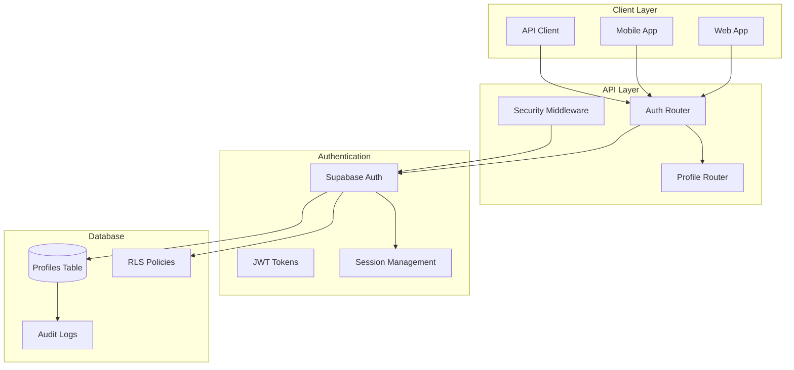
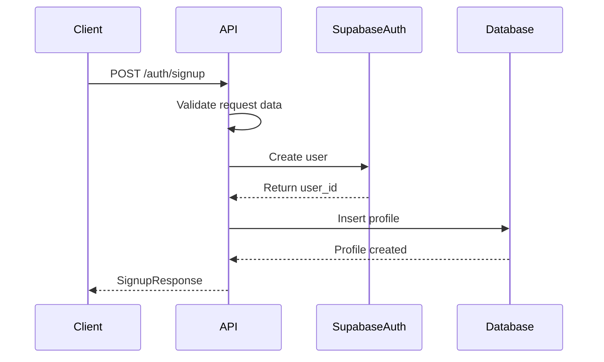
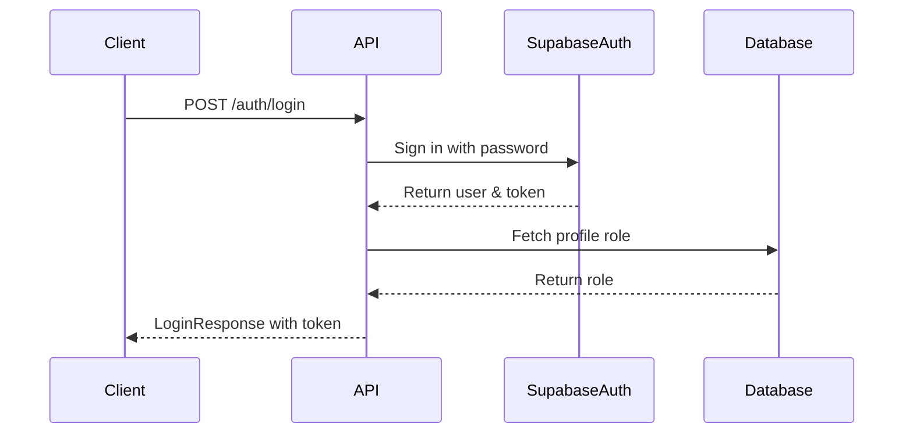
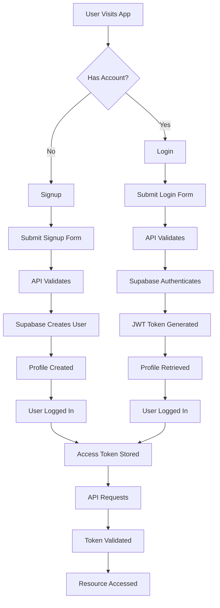
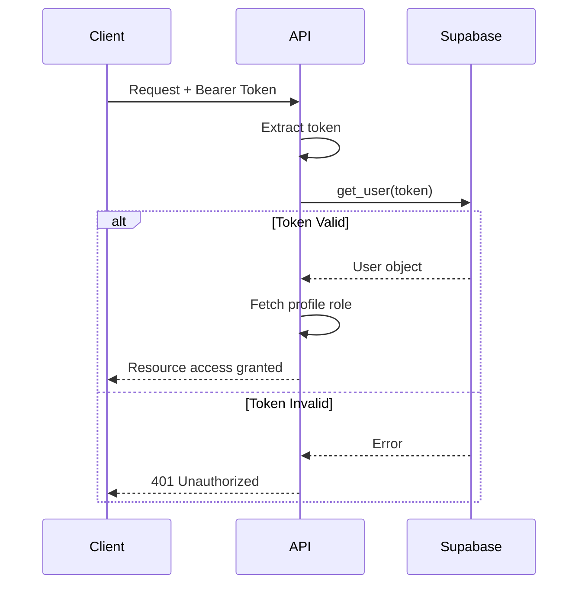

# Authentication & Profile System Documentation

## Overview

The Authentication & Profile System handles user registration, login, profile management, and authorization for the marketplace platform. It integrates with Supabase for authentication and uses Row Level Security (RLS) policies for data protection.

---

## Table of Contents

- [System Architecture](#system-architecture)
- [API Endpoints](#api-endpoints)
- [Data Models](#data-models)
- [Authentication Flow](#authentication-flow)
- [Dependencies & Middleware](#dependencies--middleware)
- [Security](#security)
- [Error Handling](#error-handling)
- [Profile Management](#profile-management)
- [Testing Guide](#testing-guide)

---

## System Architecture

### Component Diagram



### Directory Structure

```
auth/
├── __init__.py
├── router.py          # Authentication endpoints
├── dependencies.py    # Supabase clients & auth dependencies
├── models.py          # Pydantic models (optional)
└── utils.py           # Helper functions (optional)
```

---

## API Endpoints

### 1. User Signup

**POST** `/auth/signup`

Registers a new user and creates their profile.

**Request Body:**

```json
{
  "email": "john@example.com",
  "password": "SecurePassword123!",
  "role": "buyer",
  "address": "123 Main Street, Indiranagar",
  "pincode": "560001",
  "phone": "9876543210",
  "shop_name": "John's Electronics"  // Required only for shop_owner
}
```

**Validation Rules:**

| Field | Rule | Description |
|-------|------|-------------|
| `email` | EmailStr | Valid email format |
| `password` | string | Must meet minimum security requirements |
| `role` | enum | Must be 'buyer' or 'shop_owner' |
| `address` | string | Required, non-empty |
| `pincode` | string | Exactly 6 digits |
| `phone` | string | Required, valid phone number |
| `shop_name` | optional string | Required if role = 'shop_owner' |

**Response:**

```json
{
  "user_id": "123e4567-e89b-12d3-a456-426614174000",
  "email": "john@example.com",
  "role": "buyer",
  "pincode": "560001"
}
```

**Status Codes:**
- `201`: User created successfully
- `400`: Validation error or signup failed
- `500`: Server error

**Process Flow:**



---

### 2. User Login

**POST** `/auth/login`

Authenticates a user and returns access token.

**Request Body:**

```json
{
  "email": "john@example.com",
  "password": "SecurePassword123!"
}
```

**Response:**

```json
{
  "access_token": "eyJhbGciOiJIUzI1NiIsInR5cCI6IkpXVCJ9...",
  "role": "buyer",
  "user_id": "123e4567-e89b-12d3-a456-426614174000"
}
```

**Status Codes:**
- `200`: Login successful
- `401`: Invalid credentials
- `404`: Profile not found
- `500`: Server error

**Security:**
- Passwords are hashed by Supabase
- JWT tokens expire after configured duration
- Session management handled by Supabase

**Process Flow:**



---

### 3. Get Profile

**GET** `/auth/profiles/{user_id}`

Retrieves a user's profile information.

**Headers:**
```
Authorization: Bearer {access_token}
```

**Path Parameters:**
- `user_id`: UUID of the user

**Response:**

```json
{
  "id": "123e4567-e89b-12d3-a456-426614174000",
  "shop_name": "John's Electronics",
  "phone": "9876543210",
  "address": "123 Main Street, Indiranagar",
  "pincode": "560001",
  "role": "buyer",
  "full_name": "John Doe",
  "bio": "Electronics enthusiast",
  "profile_photo_url": "https://storage.example.com/photos/john.jpg",
  "date_of_birth": "1990-01-15",
  "gender": "male",
  "preferred_categories": ["electronics", "gadgets"],
  "business_hours": {
    "monday": "09:00-18:00",
    "tuesday": "09:00-18:00"
  },
  "years_in_business": 5,
  "gst_number": "22ABCDE1234F1Z5",
  "is_verified": true,
  "identity_number": "PAN123456789",
  "identity_type": "pan_card",
  "delivery_address": "123 Main Street, Indiranagar",
  "budget_range_preference": {
    "min": 100,
    "max": 10000
  },
  "notification_preferences": {
    "email": true,
    "sms": false,
    "push": true
  }
}
```

**Status Codes:**
- `200`: Profile retrieved
- `401`: Unauthorized
- `404`: Profile not found
- `400`: Invalid request

---

### 4. Update Profile

**PATCH** `/auth/profiles/{user_id}`

Updates a user's profile information.

**Headers:**
```
Authorization: Bearer {access_token}
```

**Path Parameters:**
- `user_id`: UUID of the user (must match authenticated user)

**Request Body:**

```json
{
  "full_name": "Johnathan Doe",
  "phone": "9876543211",
  "address": "456 New Street, Koramangala",
  "pincode": "560034",
  "bio": "Updated bio information",
  "profile_photo_url": "https://storage.example.com/photos/new_photo.jpg",
  "date_of_birth": "1990-01-15",
  "gender": "male",
  "preferred_categories": ["electronics", "computers", "accessories"],
  "business_hours": {
    "monday": "10:00-20:00",
    "tuesday": "10:00-20:00"
  },
  "years_in_business": 6,
  "gst_number": "22ABCDE1234F1Z5",
  "identity_number": "PAN123456789",
  "identity_type": "pan_card",
  "delivery_address": "456 New Street, Koramangala",
  "budget_range_preference": {
    "min": 200,
    "max": 15000
  },
  "notification_preferences": {
    "email": true,
    "sms": true,
    "push": true
  }
}
```

**Immutable Fields:**
These fields cannot be updated:

| Field | Reason |
|-------|--------|
| `id` | Primary key |
| `role` | User role cannot change |
| `created_at` | Creation timestamp |
| `total_transactions` | System calculated |
| `completed_transactions` | System calculated |
| `is_verified` | Admin controlled |

**Response:**

```json
{
  "message": "Profile updated successfully",
  "profile": {
    "id": "123e4567-e89b-12d3-a456-426614174000",
    "full_name": "Johnathan Doe",
    // ... all updated fields
  }
}
```

**Status Codes:**
- `200`: Profile updated
- `403`: Cannot update other user's profile
- `404`: Profile not found
- `400`: Validation error

**Security:**
- Users can only update their own profile
- Service role bypasses ownership check

---

## Data Models

### Request/Response Models

```python
class SignupRequest(BaseModel):
    """Signup request model"""
    email: EmailStr
    password: str
    role: str
    address: str
    pincode: str
    phone: str
    shop_name: Optional[str] = None
    
    @validator('role')
    def validate_role(cls, v):
        if v not in ['buyer', 'shop_owner']:
            raise ValueError('role must be either "buyer" or "shop_owner"')
        return v
    
    @validator('pincode')
    def validate_pincode(cls, v):
        if len(v) != 6 or not v.isdigit():
            raise ValueError('pincode must be 6 digits')
        return v

class SignupResponse(BaseModel):
    """Signup response model"""
    user_id: str
    email: str
    role: str
    pincode: str

class LoginRequest(BaseModel):
    """Login request model"""
    email: EmailStr
    password: str

class LoginResponse(BaseModel):
    """Login response model"""
    access_token: str
    role: str
    user_id: str
```

### Profile Response Model

```python
class ProfileResponse(BaseModel):
    """Complete profile response"""
    id: str
    shop_name: Optional[str]
    phone: str
    address: str
    pincode: str
    role: str
    full_name: Optional[str]
    bio: Optional[str]
    profile_photo_url: Optional[str]
    date_of_birth: Optional[str]
    gender: Optional[str]
    preferred_categories: Optional[List[str]]
    business_hours: Optional[Dict[str, str]]
    years_in_business: Optional[int]
    gst_number: Optional[str]
    is_verified: Optional[bool]
    identity_number: Optional[str]
    identity_type: Optional[str]
    delivery_address: Optional[str]
    budget_range_preference: Optional[Dict[str, int]]
    notification_preferences: Optional[Dict[str, bool]]
```

---

## Authentication Flow

### Complete Authentication Lifecycle



### Token Validation Flow



---

## Dependencies & Middleware

### Supabase Client Configuration

```python
import os
from supabase import create_client, Client
from fastapi import HTTPException
from fastapi.security import HTTPBearer, HTTPAuthorizationCredentials

# Initialize clients
supabase_anon: Client = create_client(SUPABASE_URL, SUPABASE_ANON_KEY)
supabase_admin: Client = create_client(SUPABASE_URL, SUPABASE_SERVICE_ROLE_KEY)

security = HTTPBearer()

async def get_current_user(
    credentials: HTTPAuthorizationCredentials = Depends(security)
) -> Dict[str, Any]:
    """
    Validate JWT token and return current user with role.
    """
    token = credentials.credentials
    
    try:
        user = supabase_anon.auth.get_user(token)
        
        if not user or not user.user:
            raise HTTPException(status_code=401, detail="Invalid token")
        
        # Fetch role from profiles
        profile = supabase_admin.table("profiles") \
            .select("role") \
            .eq("id", user.user.id) \
            .single() \
            .execute()
        
        if not profile.data:
            raise HTTPException(status_code=404, detail="Profile not found")
        
        return {
            "id": user.user.id,
            "email": user.user.email,
            "role": profile.data["role"]
        }
        
    except Exception as e:
        logger.error(f"Authentication error: {str(e)}")
        raise HTTPException(status_code=401, detail="Authentication failed")
```

### Client Usage

**Anonymous Client (`supabase_anon`):**
- Used for public operations
- Authentication (signup, login)
- Reading public data
- Subject to RLS policies

**Admin Client (`supabase_admin`):**
- Used for privileged operations
- Bypasses RLS policies
- Profile management
- Admin operations

---

## Security

### Row Level Security (RLS) Policies

**Profiles Table RLS:**

```sql
-- Users can view their own profile
CREATE POLICY "Users can view own profile"
    ON profiles FOR SELECT
    USING (auth.uid() = id);

-- Users can update their own profile
CREATE POLICY "Users can update own profile"
    ON profiles FOR UPDATE
    USING (auth.uid() = id)
    WITH CHECK (auth.uid() = id);

-- Service role can manage all profiles
CREATE POLICY "Service role can manage profiles"
    ON profiles FOR ALL
    USING (true)
    WITH CHECK (true);
```

### Security Headers

```python
# Recommended security headers
SECURITY_HEADERS = {
    "X-Content-Type-Options": "nosniff",
    "X-Frame-Options": "DENY",
    "X-XSS-Protection": "1; mode=block",
    "Strict-Transport-Security": "max-age=31536000; includeSubDomains"
}
```

### Token Security

| Security Measure | Implementation |
|------------------|----------------|
| Token Storage | HTTP-Only cookies or secure storage |
| Token Expiry | Configured in Supabase (default: 1 hour) |
| Refresh Tokens | Supported by Supabase |
| HTTPS Required | Enforced in production |
| CORS Policy | Restricted to trusted origins |

---

## Error Handling

### Error Codes

| Status Code | Error Type | Description |
|-------------|------------|-------------|
| 400 | `VALIDATION_ERROR` | Invalid input data |
| 401 | `UNAUTHORIZED` | Invalid or missing token |
| 403 | `FORBIDDEN` | Insufficient permissions |
| 404 | `NOT_FOUND` | Resource not found |
| 409 | `CONFLICT` | Email already exists |
| 429 | `RATE_LIMITED` | Too many requests |
| 500 | `SERVER_ERROR` | Internal server error |

### Error Response Format

```json
{
  "detail": "User creation failed",
  "status": 400,
  "timestamp": "2026-09-15T10:30:00Z",
  "path": "/auth/signup"
}
```

### Error Logging

```python
import logging

logger = logging.getLogger(__name__)

try:
    # Operation
except HTTPException:
    raise
except Exception as e:
    logger.error(f"Operation error: {str(e)}")
    raise HTTPException(status_code=400, detail=str(e))
```

---

## Profile Management

### Profile Update Validation

```python
# Immutable fields protection
immutable_fields = [
    "id", "role", "created_at", 
    "total_transactions", "completed_transactions", 
    "is_verified"
]

for field in immutable_fields:
    profile_data.pop(field, None)

# Date validation
if "date_of_birth" in profile_data and profile_data["date_of_birth"]:
    try:
        datetime.strptime(profile_data["date_of_birth"], "%Y-%m-%d")
    except ValueError:
        logger.warning(f"Invalid date format: {profile_data['date_of_birth']}")
        del profile_data["date_of_birth"]

# JSON field validation
if "preferred_categories" in profile_data:
    if isinstance(profile_data["preferred_categories"], list):
        update_dict["preferred_categories"] = profile_data["preferred_categories"]
    else:
        update_dict["preferred_categories"] = []
```

### Field Groups

**Personal Information:**
- `full_name`
- `date_of_birth`
- `gender`
- `bio`
- `profile_photo_url`

**Contact Information:**
- `phone`
- `address`
- `pincode`
- `delivery_address`

**Business Information (Shop Owners):**
- `shop_name`
- `business_hours`
- `years_in_business`
- `gst_number`

**Verification Information:**
- `identity_number`
- `identity_type`
- `is_verified`

**Preferences:**
- `preferred_categories`
- `budget_range_preference`
- `notification_preferences`

---

## Testing Guide

### Unit Tests

**1. Signup Tests**

```python
def test_signup_buyer():
    """Test buyer signup"""
    response = client.post("/auth/signup", json={
        "email": "buyer@example.com",
        "password": "Test123!",
        "role": "buyer",
        "address": "123 Test St",
        "pincode": "560001",
        "phone": "9876543210"
    })
    assert response.status_code == 201
    assert response.json()["role"] == "buyer"

def test_signup_shop_owner():
    """Test shop owner signup"""
    response = client.post("/auth/signup", json={
        "email": "shop@example.com",
        "password": "Test123!",
        "role": "shop_owner",
        "address": "456 Shop St",
        "pincode": "560002",
        "phone": "9876543211",
        "shop_name": "Test Shop"
    })
    assert response.status_code == 201
    assert response.json()["role"] == "shop_owner"

def test_signup_invalid_pincode():
    """Test signup with invalid pincode"""
    response = client.post("/auth/signup", json={
        "email": "test@example.com",
        "password": "Test123!",
        "role": "buyer",
        "address": "123 Test St",
        "pincode": "5600",  # Invalid (not 6 digits)
        "phone": "9876543210"
    })
    assert response.status_code == 400
    assert "pincode must be 6 digits" in str(response.json()["detail"])
```

**2. Login Tests**

```python
def test_login_success():
    """Test successful login"""
    # First signup
    client.post("/auth/signup", json={...})
    
    # Then login
    response = client.post("/auth/login", json={
        "email": "test@example.com",
        "password": "Test123!"
    })
    assert response.status_code == 200
    assert "access_token" in response.json()
    assert "role" in response.json()

def test_login_invalid_credentials():
    """Test login with invalid credentials"""
    response = client.post("/auth/login", json={
        "email": "wrong@example.com",
        "password": "WrongPassword"
    })
    assert response.status_code == 401
    assert "Invalid credentials" in str(response.json()["detail"])
```

**3. Profile Tests**

```python
def test_get_profile():
    """Test profile retrieval"""
    # Login to get token
    login_response = client.post("/auth/login", json={...})
    token = login_response.json()["access_token"]
    
    response = client.get(
        f"/auth/profiles/{user_id}",
        headers={"Authorization": f"Bearer {token}"}
    )
    assert response.status_code == 200
    assert response.json()["id"] == user_id

def test_update_profile():
    """Test profile update"""
    login_response = client.post("/auth/login", json={...})
    token = login_response.json()["access_token"]
    user_id = login_response.json()["user_id"]
    
    response = client.patch(
        f"/auth/profiles/{user_id}",
        headers={"Authorization": f"Bearer {token}"},
        json={"full_name": "Updated Name"}
    )
    assert response.status_code == 200
    assert response.json()["profile"]["full_name"] == "Updated Name"

def test_update_other_profile():
    """Test updating another user's profile (should fail)"""
    # Login as user A
    token_a = login_user("userA@example.com")
    
    # Try to update user B's profile
    response = client.patch(
        f"/auth/profiles/{user_b_id}",
        headers={"Authorization": f"Bearer {token_a}"},
        json={"full_name": "Hacked!"}
    )
    assert response.status_code == 403
```

### Integration Tests

```python
def test_full_auth_flow():
    """Test complete authentication flow"""
    # 1. Signup
    signup_response = client.post("/auth/signup", json={...})
    assert signup_response.status_code == 201
    
    # 2. Login
    login_response = client.post("/auth/login", json={...})
    assert login_response.status_code == 200
    token = login_response.json()["access_token"]
    
    # 3. Get profile
    profile_response = client.get(
        f"/auth/profiles/{login_response.json()['user_id']}",
        headers={"Authorization": f"Bearer {token}"}
    )
    assert profile_response.status_code == 200
    
    # 4. Update profile
    update_response = client.patch(
        f"/auth/profiles/{login_response.json()['user_id']}",
        headers={"Authorization": f"Bearer {token}"},
        json={"full_name": "Complete Flow Test"}
    )
    assert update_response.status_code == 200
    assert update_response.json()["profile"]["full_name"] == "Complete Flow Test"
```

### Mock Test Data

```python
# Test data fixtures
TEST_USERS = {
    "buyer": {
        "email": "buyer.test@example.com",
        "password": "TestPassword123!",
        "role": "buyer",
        "address": "123 Buyer Lane",
        "pincode": "560001",
        "phone": "9876543210"
    },
    "shop_owner": {
        "email": "shop.test@example.com",
        "password": "TestPassword123!",
        "role": "shop_owner",
        "address": "456 Shop Road",
        "pincode": "560002",
        "phone": "9876543211",
        "shop_name": "Test Shop"
    }
}

# Helper functions
def create_test_user(role: str = "buyer"):
    """Create a test user"""
    user_data = TEST_USERS[role]
    response = client.post("/auth/signup", json=user_data)
    return response.json()

def login_test_user(email: str, password: str):
    """Login test user and return token"""
    response = client.post("/auth/login", json={
        "email": email,
        "password": password
    })
    return response.json()["access_token"]
```

---

## Performance Considerations

### Database Indexes

```sql
-- Essential indexes for auth tables
CREATE INDEX idx_profiles_id ON profiles(id);
CREATE INDEX idx_profiles_role ON profiles(role);
CREATE INDEX idx_profiles_pincode ON profiles(pincode);
CREATE INDEX idx_profiles_email ON profiles(email);
```

### Query Optimization

```python
# Use select with specific columns instead of *
profile = supabase_admin.table("profiles") \
    .select("id, role, full_name, shop_name") \
    .eq("id", user_id) \
    .single() \
    .execute()

# Use count queries for efficiency
total_shops = supabase_admin.table("profiles") \
    .select("id", count="exact") \
    .eq("role", "shop_owner") \
    .execute()
```

### Caching Strategy

| Data | Cache TTL | Cache Key |
|------|-----------|-----------|
| User profile | 5 minutes | `profile:{user_id}` |
| Role lookup | 5 minutes | `role:{user_id}` |
| Shop list | 1 minute | `shops:{pincode}` |

---

## Appendix

### Environment Variables

```env
# Supabase Configuration
SUPABASE_URL=https://your-project.supabase.co
SUPABASE_ANON_KEY=your-anon-key
SUPABASE_SERVICE_ROLE_KEY=your-service-role-key

# Optional Configuration
JWT_EXPIRY=3600  # seconds
SALT_ROUNDS=10
```

### Constants

```python
# User Roles
ROLES = {
    'BUYER': 'buyer',
    'SHOP_OWNER': 'shop_owner'
}

# Validation Constants
PINCODE_LENGTH = 6
MAX_PHONE_LENGTH = 15
MIN_PASSWORD_LENGTH = 8

# Default Values
DEFAULT_PAGINATION = {
    'limit': 20,
    'offset': 0
}
```

---

## Changelog

| Version | Date | Changes |
|---------|------|---------|
| 1.0.0 | 2026-09-15 | Initial documentation |
| 1.1.0 | 2026-09-20 | Added profile update endpoint |
| 1.2.0 | 2026-09-25 | Added field validation and sanitization |
| 1.3.0 | 2026-09-30 | Added security policies and testing guide |

---

*This documentation is maintained by the owner.*