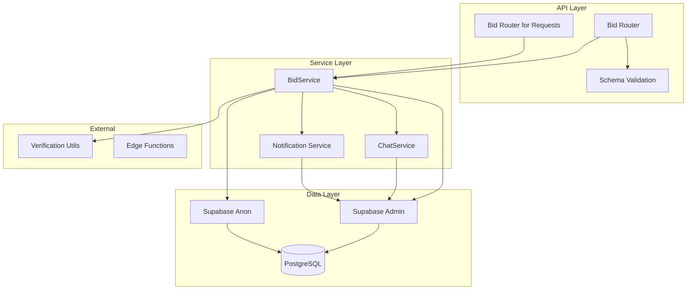
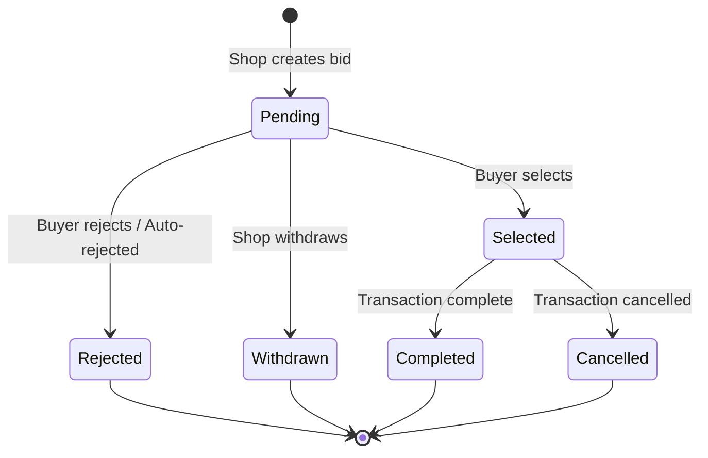
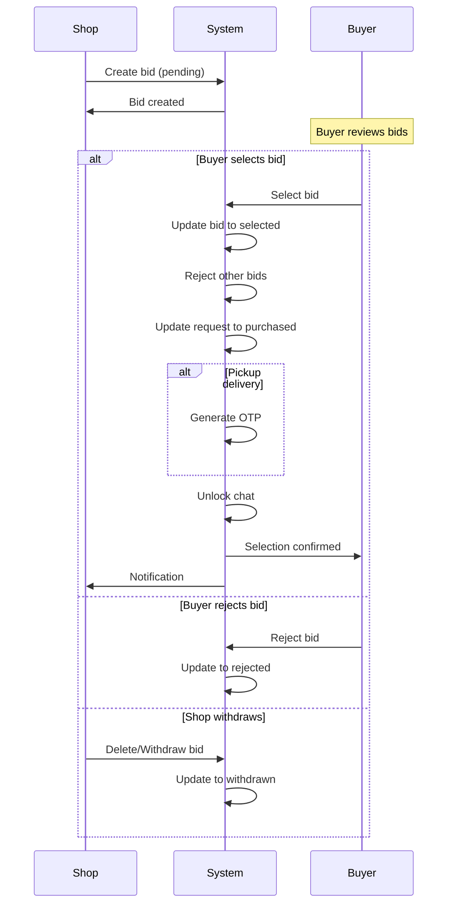
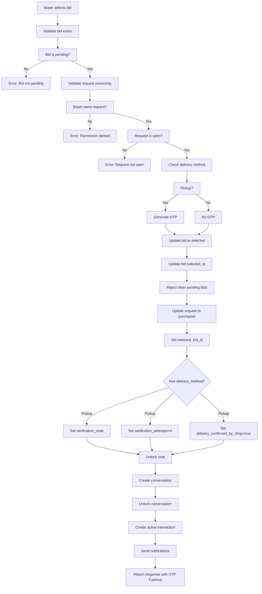
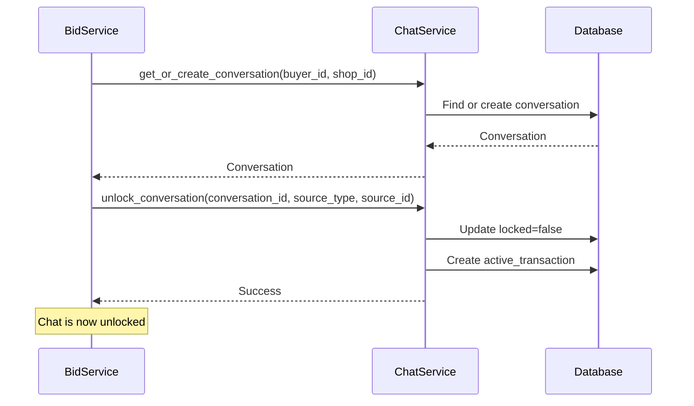

# Bid System Documentation

## Overview

The Bid System enables shop owners to place bids on buyer requests and facilitates the selection process. It includes full lifecycle management from bid creation to selection, with integrated chat unlocking and OTP generation for pickup transactions.

---

## Table of Contents

- [System Architecture](#system-architecture)
- [API Endpoints](#api-endpoints)
- [Data Models](#data-models)
- [Service Layer](#service-layer)
- [Bid Lifecycle](#bid-lifecycle)
- [Bid Selection Flow](#bid-selection-flow)
- [Security & Permissions](#security--permissions)
- [Error Handling](#error-handling)
- [Testing Guide](#testing-guide)

---

## System Architecture

### Component Diagram



### Directory Structure

```
bids/
├── __init__.py
├── router.py          # API endpoints
├── schemas.py         # Pydantic models
├── services.py        # Business logic
└── dependencies.py    # Dependencies (optional)
```

---

## API Endpoints

### Request-Based Bid Endpoints

#### 1. Create Bid

**POST** `/requests/{request_id}/bids`

Places a bid on an open request.

**Request Body:**
```json
{
  "price": 1500,
  "note": "I can deliver within 2 hours"
}
```

**Permissions:** Shop owner only

**Response:**
```json
{
  "id": "uuid",
  "request_id": "uuid",
  "shop_id": "uuid",
  "price": 1500,
  "note": "I can deliver within 2 hours",
  "status": "pending",
  "created_at": "2026-09-15T10:30:00Z"
}
```

**Error Codes:**
- `403`: User is not a shop owner
- `404`: Request not found
- `400`: Request not open for bidding
- `400`: Already have pending bid on this request

---

#### 2. Get Bids for Request

**GET** `/requests/{request_id}/bids`

Retrieves all bids for a specific request.

**Permissions:** 
- Buyers can see all bids on their requests
- Shop owners can only see their own bids

**Response:**
```json
[
  {
    "id": "uuid",
    "request_id": "uuid",
    "shop_id": "uuid",
    "price": 1500,
    "note": "I can deliver within 2 hours",
    "status": "pending",
    "created_at": "2026-09-15T10:30:00Z",
    "profiles": {
      "shop_name": "John's Electronics",
      "phone": "9876543210",
      "address": "123 Main St"
    }
  }
]
```

---

### Bid Management Endpoints

#### 3. Get Shop Owner's Bids

**GET** `/bids/shop-bids`

Retrieves all bids placed by the current shop owner.

**Permissions:** Shop owner only

**Response:**
```json
[
  {
    "id": "uuid",
    "request_id": "uuid",
    "shop_id": "uuid",
    "price": 1500,
    "note": "I can deliver within 2 hours",
    "status": "pending",
    "created_at": "2026-09-15T10:30:00Z",
    "requests": {
      "item_name": "Vintage Camera",
      "buyer_id": "uuid",
      "status": "open"
    }
  }
]
```

---

#### 4. Get Buyer's Auction Bids

**GET** `/bids/auction-bids`

Retrieves all auction bids placed by the current buyer.

**Permissions:** Buyer only

**Response:**
```json
[
  {
    "id": "uuid",
    "auction_id": "uuid",
    "buyer_id": "uuid",
    "bid_amount": 7500,
    "created_at": "2026-09-15T10:30:00Z"
  }
]
```

---

#### 5. Get Single Bid

**GET** `/bids/{bid_id}`

Retrieves a single bid by ID.

**Permissions:** Shop owner who owns the bid

**Response:**
```json
{
  "id": "uuid",
  "request_id": "uuid",
  "shop_id": "uuid",
  "price": 1500,
  "note": "I can deliver within 2 hours",
  "status": "pending",
  "created_at": "2026-09-15T10:30:00Z",
  "requests": {
    "id": "uuid",
    "item_name": "Vintage Camera",
    "description": "Rare film camera",
    "budget_min": 1000,
    "budget_max": 2000,
    "status": "open"
  }
}
```

**Error Codes:**
- `403`: User doesn't own this bid
- `404`: Bid not found

---

#### 6. Update Bid

**PATCH** `/bids/{bid_id}`

Updates a pending bid.

**Request Body:**
```json
{
  "price": 1600,
  "note": "Updated note"
}
```

**Permissions:** Shop owner who owns the bid

**Conditions:**
- Bid must be in `pending` status

**Error Codes:**
- `403`: User doesn't own this bid
- `400`: Cannot update non-pending bid
- `404`: Bid not found

---

#### 7. Delete Bid

**DELETE** `/bids/{bid_id}`

Withdraws a pending bid.

**Permissions:** Shop owner who owns the bid

**Conditions:**
- Bid must be in `pending` status

**Response:** `204 No Content`

**Error Codes:**
- `403`: User doesn't own this bid
- `400`: Cannot delete non-pending bid
- `404`: Bid not found

---

#### 8. Select Bid

**PATCH** `/bids/{bid_id}/select`

Selects a bid for purchase.

**Permissions:** Buyer who owns the request

**Actions:**
1. Updates bid status to `selected`
2. Rejects all other pending bids
3. Updates request status to `purchased`
4. Generates OTP for pickup requests
5. Unlocks chat between buyer and shop
6. Creates notification

**Response (Home Delivery):**
```json
{
  "status": "selected",
  "request_status": "purchased",
  "bid_id": "uuid",
  "request_id": "uuid",
  "selected_bid": {
    "id": "uuid",
    "price": 1500,
    "note": "I can deliver within 2 hours",
    "status": "selected",
    "selected_at": "2026-09-15T10:30:00Z",
    "shop_name": "John's Electronics",
    "phone": "9876543210",
    "shop_address": "123 Main St"
  },
  "shop_contact": {
    "name": "John's Electronics",
    "phone": "9876543210",
    "address": "123 Main St"
  },
  "buyer_contact": {
    "name": "buyer",
    "phone": "9876543211",
    "address": "456 Buyer Lane"
  },
  "request_details": {
    "item_name": "Vintage Camera",
    "description": "Rare film camera",
    "budget_min": 1000,
    "budget_max": 2000,
    "pincode": "560001",
    "category": "electronics",
    "created_at": "2026-09-14T10:30:00Z"
  },
  "message": "Bid selected successfully! The request is now purchased"
}
```

**Response (Pickup with OTP):**
```json
{
  "status": "selected",
  "request_status": "purchased",
  "bid_id": "uuid",
  "request_id": "uuid",
  "selected_bid": {...},
  "verification_code": "123456",
  "message": "Bid selected successfully! Pickup OTP code generated. Share it with the shop."
}
```

---

#### 9. Get Bid Stats

**GET** `/bids/stats`

Retrieves bid statistics for the shop owner.

**Permissions:** Shop owner only

**Response:**
```json
{
  "pending": 5,
  "selected": 3,
  "rejected": 2,
  "completed": 1,
  "total": 11
}
```

---

#### 10. Get Buyer Details

**GET** `/bids/{bid_id}/buyer`

Retrieves buyer details for a selected bid.

**Permissions:** Shop owner who owns the bid

**Conditions:**
- Bid must be in `selected` status

**Response:**
```json
{
  "bid": {
    "id": "uuid",
    "price": 1500,
    "note": "I can deliver within 2 hours",
    "status": "selected",
    "created_at": "2026-09-15T10:30:00Z",
    "selected_at": "2026-09-15T10:35:00Z"
  },
  "request": {
    "id": "uuid",
    "buyer_id": "uuid",
    "item_name": "Vintage Camera",
    "description": "Rare film camera",
    "budget_min": 1000,
    "budget_max": 2000,
    "pincode": "560001",
    "status": "purchased",
    "delivery_method": "home_delivery",
    "delivery_address": "123 Buyer Lane",
    "completed_at": null,
    "delivery_confirmed_by_shop": false,
    "verification_code": null,
    "verification_attempts": 0
  },
  "buyer": {
    "id": "uuid",
    "phone": "9876543211",
    "address": "456 Buyer Lane",
    "pincode": "560001"
  },
  "message": "Buyer, bid and request has been sent to shop_owner side successfully"
}
```

---

## Data Models

### Request/Response Models

```python
class BidCreate(BaseModel):
    """Create bid request"""
    price: int = Field(..., gt=0)
    note: Optional[str] = None
    
    @field_validator('price')
    @classmethod
    def validate_price(cls, v: int) -> int:
        if v <= 0:
            raise ValueError('price must be greater than 0')
        return v

class BidUpdate(BaseModel):
    """Update bid request"""
    price: Optional[int] = Field(None, gt=0)
    note: Optional[str] = None
    
    @field_validator('price')
    @classmethod
    def validate_price(cls, v: Optional[int]) -> Optional[int]:
        if v is not None and v <= 0:
            raise ValueError('price must be greater than 0')
        return v

class BidResponse(BaseModel):
    """Bid response"""
    id: UUID
    request_id: UUID
    shop_id: UUID
    price: int
    note: Optional[str]
    status: str
    created_at: datetime

class BidDetailResponse(BidResponse):
    """Detailed bid response with shop info"""
    shop_name: Optional[str] = None
    shop_phone: Optional[str] = None
    shop_address: Optional[str] = None

class BidSelectionResponse(BaseModel):
    """Bid selection response"""
    bid_id: UUID
    request_id: UUID
    status: str
    selected_bid: BidDetailResponse
    shop_contact: dict
    buyer_contact: dict
    request_details: dict
    message: str
    verification_code: Optional[str] = None
```

---

## Service Layer

### BidService Class

#### Initialization

```python
class BidService:
    def __init__(self, supabase_admin: Client, supabase_anon: Client):
        self.supabase_admin = supabase_admin
        self.supabase_anon = supabase_anon
```

#### Core Methods

| Method | Description |
|--------|-------------|
| `create_bid()` | Creates a new bid on a request |
| `update_bid()` | Updates a pending bid |
| `delete_bid()` | Withdraws a pending bid |
| `select_bid()` | Selects a bid and processes transaction |

#### Method Details

**create_bid()**
```python
def create_bid(self, request_id: str, shop_id: str, price: int, note: Optional[str] = None) -> Dict[str, Any]:
    """
    Create a new bid on a request
    
    Validations:
    - Request must exist
    - Request must be in 'open' status
    - Shop must not have a pending bid on this request
    """
```

**select_bid()**
```python
def select_bid(self, bid_id: str, buyer_id: str) -> Dict[str, Any]:
    """
    Select a bid and process transaction
    
    Actions:
    1. Validate bid exists and is pending
    2. Validate request belongs to buyer
    3. Validate request is open
    4. Generate OTP for pickup requests
    5. Update bid status to 'selected'
    6. Reject all other pending bids
    7. Update request status to 'purchased'
    8. Unlock chat between buyer and shop
    """
```

---

## Bid Lifecycle

### State Diagram



### Status Definitions

| Status | Description | Next States |
|--------|-------------|-------------|
| `pending` | Bid awaiting buyer decision | `selected`, `rejected`, `withdrawn` |
| `selected` | Bid chosen by buyer | `completed`, `cancelled` |
| `rejected` | Bid rejected by buyer | - |
| `withdrawn` | Shop withdrew bid | - |
| `completed` | Transaction finalized | - |

### Bid Lifecycle Flow



---

## Bid Selection Flow

### Complete Selection Process



### Chat Unlock Integration



---

## Security & Permissions

### Role-Based Access Control

| Action | Buyer | Shop Owner |
|--------|-------|------------|
| Create Bid | No | Yes |
| View Bid Details | No | Yes (own) |
| Update Bid | No | Yes (own) |
| Delete/Withdraw Bid | No | Yes (own) |
| Select Bid | Yes | No |
| View Bids on Request | Yes | Yes (own only) |
| View Shop Bids | No | Yes |
| View Auction Bids | Yes | No |
| Get Bid Stats | No | Yes |
| Get Buyer Details | No | Yes (selected) |

### Permission Enforcement

```python
# Shop owner checks
if current_user.get("role") != "shop_owner":
    raise HTTPException(status_code=403, detail="Only shop owners can place bids")

# Ownership checks
if str(bid["shop_id"]) != shop_id:
    raise Exception("You don't have permission to update this bid")

# Buyer checks
if current_user.get("role") != "buyer":
    raise HTTPException(status_code=403, detail="Only buyers can select bids")

if str(request["buyer_id"]) != buyer_id:
    raise Exception("You don't have permission to select this bid")

# Status checks
if bid["status"] != "pending":
    raise Exception("Cannot select a bid that is not pending")

if request["status"] != "open":
    raise Exception("Cannot select a bid on a request that is not open")
```

---

## Error Handling

### Error Codes

| Status Code | Error Type | Description |
|-------------|------------|-------------|
| 400 | `INVALID_PRICE` | Price must be greater than 0 |
| 400 | `REQUEST_NOT_OPEN` | Request is not open for bidding |
| 400 | `DUPLICATE_BID` | Already have a pending bid |
| 400 | `BID_NOT_PENDING` | Cannot update/delete non-pending bid |
| 400 | `REQUEST_NOT_OPEN` | Cannot select bid on closed request |
| 403 | `NOT_SHOP_OWNER` | User is not a shop owner |
| 403 | `NOT_BUYER` | User is not a buyer |
| 403 | `BID_OWNERSHIP` | User doesn't own this bid |
| 403 | `REQUEST_OWNERSHIP` | User doesn't own this request |
| 404 | `REQUEST_NOT_FOUND` | Request ID doesn't exist |
| 404 | `BID_NOT_FOUND` | Bid ID doesn't exist |

### Error Response Format

```json
{
  "detail": "You already have a pending bid on this request"
}
```

---

## Testing Guide

### Test Scenarios

**1. Create Bid Tests**

```python
def test_create_bid():
    """Test successful bid creation"""
    # Login as shop owner
    token = login_test_user("shop@example.com")
    
    # Create bid
    response = client.post(
        f"/requests/{request_id}/bids",
        headers={"Authorization": f"Bearer {token}"},
        json={"price": 1500, "note": "Test bid"}
    )
    assert response.status_code == 201
    assert response.json()["status"] == "pending"

def test_create_bid_duplicate():
    """Test duplicate bid creation"""
    # Create first bid
    create_bid(request_id, price=1500)
    
    # Try to create second bid
    response = client.post(
        f"/requests/{request_id}/bids",
        headers={"Authorization": f"Bearer {token}"},
        json={"price": 1600, "note": "Second bid"}
    )
    assert response.status_code == 400
    assert "already have a pending bid" in response.json()["detail"]

def test_create_bid_not_shop_owner():
    """Test bid creation by non-shop-owner"""
    # Login as buyer
    token = login_test_user("buyer@example.com")
    
    response = client.post(
        f"/requests/{request_id}/bids",
        headers={"Authorization": f"Bearer {token}"},
        json={"price": 1500}
    )
    assert response.status_code == 403
    assert "Only shop owners can place bids" in response.json()["detail"]
```

**2. Select Bid Tests**

```python
def test_select_bid():
    """Test successful bid selection"""
    # Create bid as shop owner
    bid = create_bid(request_id, price=1500)
    
    # Login as buyer who owns request
    token = login_test_user("buyer@example.com")
    
    # Select bid
    response = client.patch(
        f"/bids/{bid['id']}/select",
        headers={"Authorization": f"Bearer {token}"}
    )
    assert response.status_code == 200
    assert response.json()["status"] == "selected"
    assert response.json()["request_status"] == "purchased"

def test_select_bid_pickup_otp():
    """Test bid selection with pickup OTP generation"""
    # Create request with pickup delivery method
    request = create_request(
        delivery_method="pickup"
    )
    
    # Create bid
    bid = create_bid(request['id'], price=1500)
    
    # Login as buyer
    token = login_test_user("buyer@example.com")
    
    # Select bid
    response = client.patch(
        f"/bids/{bid['id']}/select",
        headers={"Authorization": f"Bearer {token}"}
    )
    assert response.status_code == 200
    assert "verification_code" in response.json()
    assert len(response.json()["verification_code"]) == 6

def test_select_bid_not_owner():
    """Test selecting bid by non-owner"""
    # Create bid on someone else's request
    bid = create_bid(request_id, price=1500)
    
    # Login as different buyer
    token = login_test_user("other_buyer@example.com")
    
    response = client.patch(
        f"/bids/{bid['id']}/select",
        headers={"Authorization": f"Bearer {token}"}
    )
    assert response.status_code == 403
    assert "don't have permission" in response.json()["detail"]
```

**3. Update Bid Tests**

```python
def test_update_bid():
    """Test updating a pending bid"""
    # Create bid
    bid = create_bid(request_id, price=1500)
    
    # Login as shop owner
    token = login_test_user("shop@example.com")
    
    # Update bid
    response = client.patch(
        f"/bids/{bid['id']}",
        headers={"Authorization": f"Bearer {token}"},
        json={"price": 1600, "note": "Updated note"}
    )
    assert response.status_code == 200
    assert response.json()["price"] == 1600
    assert response.json()["note"] == "Updated note"

def test_update_selected_bid():
    """Test updating a selected bid (should fail)"""
    # Create and select bid
    bid = create_and_select_bid()
    
    # Try to update selected bid
    response = client.patch(
        f"/bids/{bid['id']}",
        headers={"Authorization": f"Bearer {token}"},
        json={"price": 1700}
    )
    assert response.status_code == 400
    assert "Cannot update a bid that is not pending" in response.json()["detail"]
```

**4. Delete Bid Tests**

```python
def test_delete_bid():
    """Test deleting a pending bid"""
    # Create bid
    bid = create_bid(request_id, price=1500)
    
    # Login as shop owner
    token = login_test_user("shop@example.com")
    
    # Delete bid
    response = client.delete(
        f"/bids/{bid['id']}",
        headers={"Authorization": f"Bearer {token}"}
    )
    assert response.status_code == 204
```

---

## Performance Considerations

### Database Indexes

```sql
-- Essential indexes for bid queries
CREATE INDEX idx_bids_request_id ON bids(request_id);
CREATE INDEX idx_bids_shop_id ON bids(shop_id);
CREATE INDEX idx_bids_status ON bids(status);
CREATE INDEX idx_bids_created_at ON bids(created_at DESC);

-- Composite indexes for common queries
CREATE INDEX idx_bids_request_status ON bids(request_id, status);
CREATE INDEX idx_bids_shop_status ON bids(shop_id, status);
```

### Query Optimization

**1. Get Bids with Shop Info:**
```python
# Use join to avoid N+1 queries
query = supabase_admin.table("bids") \
    .select("*, profiles!shop_id(shop_name, phone, address)") \
    .eq("request_id", request_id)
```

**2. Get Bid Stats:**
```python
# Use single query with grouping
response = supabase_admin.table("bids") \
    .select("status") \
    .eq("shop_id", shop_id) \
    .execute()
# Group by status in application code
```

**3. Reject All Pending Bids:**
```python
# Use batch update
self.supabase_admin.table("bids") \
    .update({"status": "rejected", "rejected_at": datetime.now().isoformat()}) \
    .eq("request_id", request_id) \
    .eq("status", "pending") \
    .neq("id", bid_id) \
    .execute()
```

---

## Appendix

### Constants

```python
# Bid Status
BID_STATUS = {
    'PENDING': 'pending',
    'SELECTED': 'selected',
    'REJECTED': 'rejected',
    'WITHDRAWN': 'withdrawn',
    'COMPLETED': 'completed'
}

# Request Status
REQUEST_STATUS = {
    'OPEN': 'open',
    'PURCHASED': 'purchased',
    'COMPLETED': 'completed',
    'EXPIRED': 'expired'
}

# Delivery Methods
DELIVERY_METHODS = {
    'HOME_DELIVERY': 'home_delivery',
    'PICKUP': 'pickup'
}
```

---

## Changelog

| Version | Date | Changes |
|---------|------|---------|
| 1.0.0 | 2026-09-15 | Initial documentation |
| 1.1.0 | 2026-09-20 | Added OTP generation for pickup |
| 1.2.0 | 2026-09-25 | Added chat unlock integration |
| 1.3.0 | 2026-09-30 | Added buyer details endpoint |

---

*This documentation is maintained by the owner.*