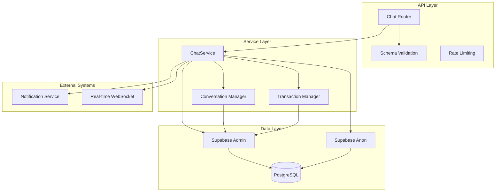
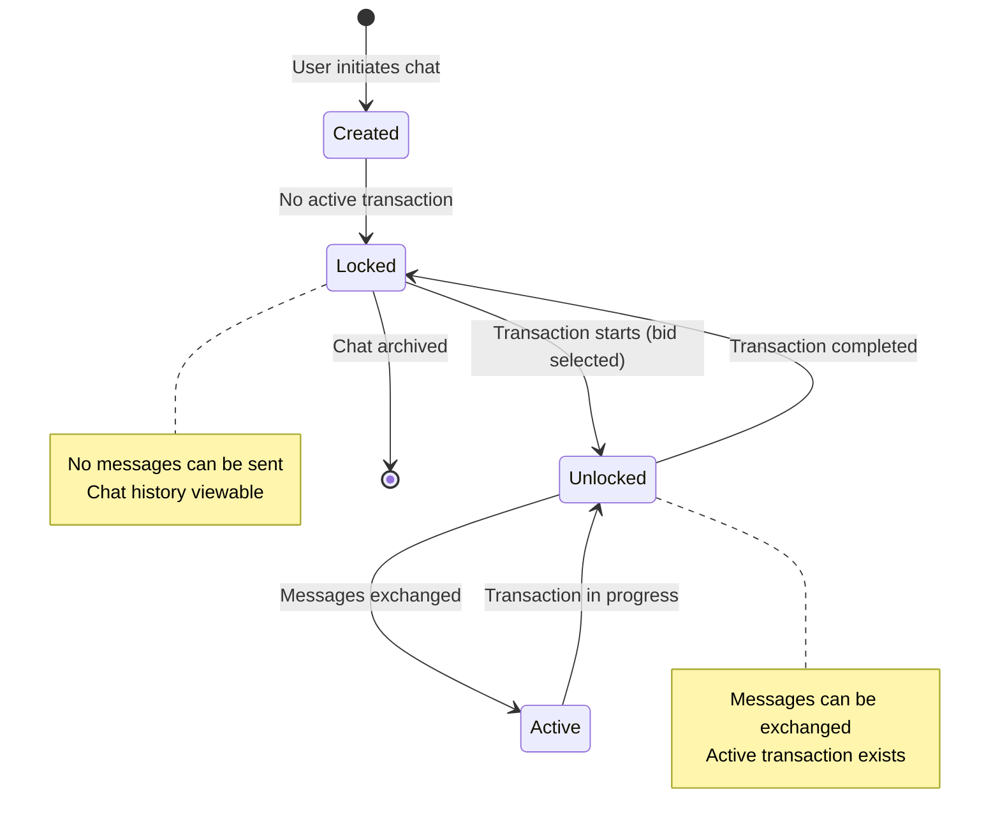
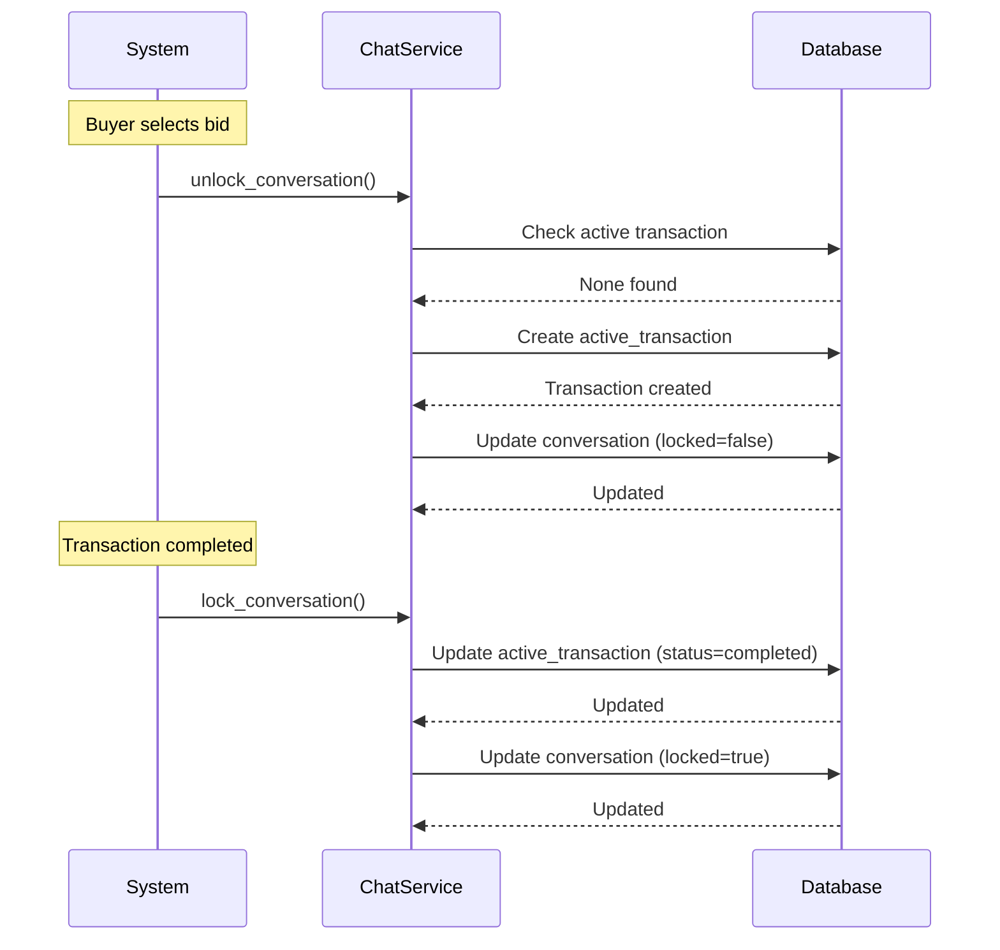
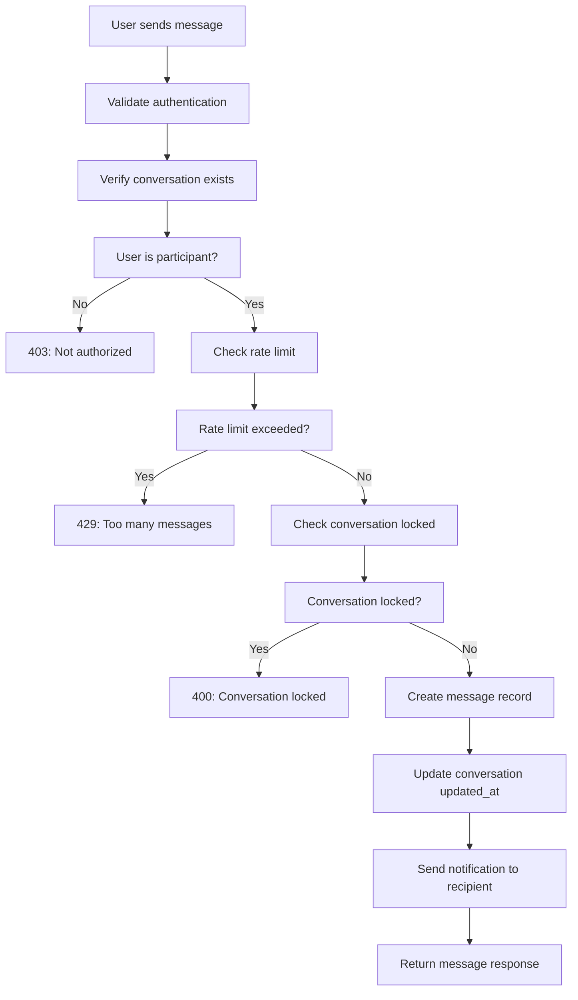
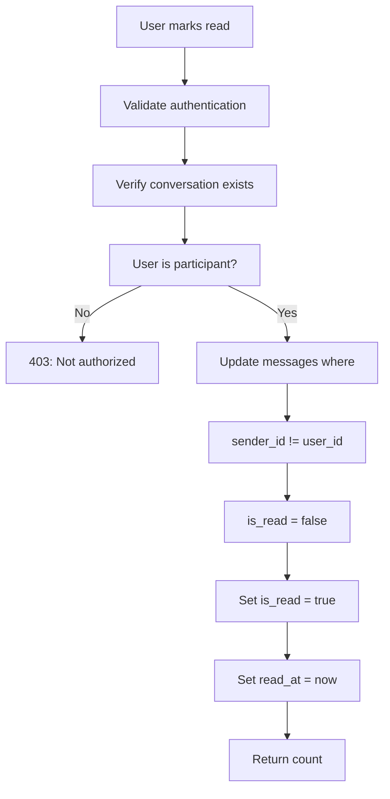

# Chat System Documentation

## Overview

The Chat System enables real-time communication between buyers and shop owners. It manages conversations, messages, and transaction-based chat locking/unlocking. The system ensures that chat is only available when there is an active transaction between participants.

---

## Table of Contents

- [System Architecture](#system-architecture)
- [API Endpoints](#api-endpoints)
- [Data Models](#data-models)
- [Service Layer](#service-layer)
- [Conversation Lifecycle](#conversation-lifecycle)
- [Message Flow](#message-flow)
- [Security & Permissions](#security--permissions)
- [Error Handling](#error-handling)
- [Testing Guide](#testing-guide)

---

## System Architecture

### Component Diagram



### Directory Structure

```
chat/
├── __init__.py
├── router.py          # API endpoints
├── schemas.py         # Pydantic models
├── services.py        # Business logic
└── dependencies.py    # Dependencies (optional)
```

---

## API Endpoints

### 1. Get Conversations

**GET** `/chat/conversations`

Retrieves all conversations for the current user.

**Headers:**
```
Authorization: Bearer {access_token}
```

**Response:**
```json
[
  {
    "id": "uuid",
    "buyer_id": "uuid",
    "shop_id": "uuid",
    "active_source_type": "request",
    "active_source_id": "uuid",
    "locked": false,
    "created_at": "2026-09-15T10:30:00Z",
    "updated_at": "2026-09-15T11:00:00Z",
    "buyer_name": "John Doe",
    "shop_name": "John's Electronics",
    "last_message": "When can you deliver?",
    "last_message_at": "2026-09-15T11:00:00Z",
    "unread_count": 2,
    "active_item_name": "Vintage Camera",
    "active_item_price": 1500,
    "active_item_image": "https://storage.example.com/camera.jpg"
  }
]
```

**Permissions:** Authenticated users (buyer or shop owner)

**Error Codes:**
- `403`: Invalid role
- `400`: Server error

---

### 2. Get Messages

**GET** `/chat/conversations/{conversation_id}/messages`

Retrieves messages for a specific conversation.

**Path Parameters:**
- `conversation_id`: UUID of the conversation

**Query Parameters:**
| Parameter | Type | Description | Default |
|-----------|------|-------------|---------|
| `limit` | integer | Messages per page (1-100) | 50 |
| `offset` | integer | Pagination offset | 0 |

**Response:**
```json
[
  {
    "id": "uuid",
    "conversation_id": "uuid",
    "sender_id": "uuid",
    "content": "When can you deliver?",
    "is_read": true,
    "read_at": "2026-09-15T11:05:00Z",
    "created_at": "2026-09-15T11:00:00Z",
    "sender_name": "John Doe",
    "sender_role": "buyer"
  }
]
```

**Permissions:** User must be part of the conversation

**Error Codes:**
- `403`: Not part of conversation
- `404`: Conversation not found
- `400`: Server error

---

### 3. Send Message

**POST** `/chat/conversations/{conversation_id}/messages`

Sends a message in a conversation.

**Path Parameters:**
- `conversation_id`: UUID of the conversation

**Request Body:**
```json
{
  "content": "I can deliver tomorrow morning"
}
```

**Rate Limiting:**
- Maximum 1 message per 2 seconds per user per conversation

**Response:**
```json
{
  "id": "uuid",
  "conversation_id": "uuid",
  "sender_id": "uuid",
  "content": "I can deliver tomorrow morning",
  "is_read": false,
  "read_at": null,
  "created_at": "2026-09-15T11:10:00Z"
}
```

**Permissions:** User must be part of the conversation

**Conditions:**
- Conversation must be unlocked (active transaction exists)
- User must be buyer or shop owner in the conversation

**Error Codes:**
- `400`: Conversation is locked
- `403`: Not part of conversation
- `404`: Conversation not found
- `429`: Rate limit exceeded

---

### 4. Mark Messages Read

**PATCH** `/chat/conversations/{conversation_id}/read`

Marks all messages in a conversation as read.

**Path Parameters:**
- `conversation_id`: UUID of the conversation

**Response:**
```json
{
  "message": "Marked 5 messages as read",
  "count": 5
}
```

**Permissions:** User must be part of the conversation

---

### 5. Get Unread Count

**GET** `/chat/unread-count`

Gets total unread message count for the current user.

**Response:**
```json
{
  "unread_count": 8
}
```

**Permissions:** Authenticated users

---

## Data Models

### Conversation Models

```python
class ConversationResponse(BaseModel):
    """Conversation response model"""
    id: UUID
    buyer_id: UUID
    shop_id: UUID
    active_source_type: Optional[str] = None
    active_source_id: Optional[UUID] = None
    locked: bool = True
    created_at: datetime
    updated_at: datetime
    
    # Optional joined fields
    buyer_name: Optional[str] = None
    shop_name: Optional[str] = None
    last_message: Optional[str] = None
    last_message_at: Optional[datetime] = None
    unread_count: Optional[int] = 0
    active_item_name: Optional[str] = None
    active_item_price: Optional[int] = None
    active_item_image: Optional[str] = None

class ConversationCreate(BaseModel):
    """Create conversation request"""
    buyer_id: UUID
    shop_id: UUID
```

### Message Models

```python
class MessageCreate(BaseModel):
    """Create message request"""
    content: str = Field(..., min_length=1, max_length=2000)
    
    @field_validator('content')
    @classmethod
    def validate_content(cls, v: str) -> str:
        v_clean = v.strip()
        if not v_clean:
            raise ValueError('Message content cannot be empty')
        return v_clean

class MessageResponse(BaseModel):
    """Message response model"""
    id: UUID
    conversation_id: UUID
    sender_id: UUID
    content: str
    is_read: bool = False
    read_at: Optional[datetime] = None
    created_at: datetime
    
    # Optional joined fields
    sender_name: Optional[str] = None
    sender_role: Optional[str] = None
```

---

## Service Layer

### ChatService Class

#### Initialization

```python
class ChatService:
    def __init__(self, supabase_admin: Client, supabase_anon: Client):
        self.supabase_admin = supabase_admin
        self.supabase_anon = supabase_anon
```

#### Core Methods

| Method | Description |
|--------|-------------|
| `get_or_create_conversation()` | Gets or creates a conversation pair |
| `is_conversation_locked()` | Checks if conversation has active transaction |
| `get_active_transaction()` | Gets current active transaction |
| `unlock_conversation()` | Unlocks conversation by creating active transaction |
| `lock_conversation()` | Locks conversation by completing transactions |
| `send_message()` | Sends a message in a conversation |
| `get_conversations_for_user()` | Gets all conversations for a user |
| `get_messages()` | Gets messages for a conversation |
| `mark_messages_read()` | Marks messages as read |
| `get_unread_count()` | Gets total unread count |

---

## Conversation Lifecycle

### State Diagram



### Conversation Flow



---

## Message Flow

### Send Message Flow



### Mark Read Flow



---

## Security & Permissions

### Role-Based Access Control

| Action | Buyer | Shop Owner |
|--------|-------|------------|
| View Conversations | Yes | Yes |
| View Messages | Yes (own convs) | Yes (own convs) |
| Send Message | Yes (unlocked) | Yes (unlocked) |
| Mark Read | Yes (own convs) | Yes (own convs) |
| Get Unread Count | Yes | Yes |

### Permission Enforcement

```python
# Verify user is part of conversation
conv_response = supabase_admin.table("conversations") \
    .select("buyer_id, shop_id, locked") \
    .eq("id", str(conversation_id)) \
    .execute()

conv = conv_response.data[0]
if conv["buyer_id"] != current_user["id"] and conv["shop_id"] != current_user["id"]:
    raise HTTPException(status_code=403, detail="Not part of this conversation")

# Verify conversation is unlocked
if conv.get("locked", True):
    raise HTTPException(status_code=400, detail="Conversation is locked")
```

### Rate Limiting

```python
# Simple rate limiting per user per conversation
last_msg_response = supabase_admin.table("messages") \
    .select("created_at") \
    .eq("conversation_id", str(conversation_id)) \
    .eq("sender_id", current_user["id"]) \
    .order("created_at", desc=True) \
    .limit(1) \
    .execute()

if last_msg_response.data:
    last_time = datetime.fromisoformat(last_msg_response.data[0]["created_at"])
    time_diff = (datetime.now().astimezone() - last_time).total_seconds()
    if time_diff < 2:  # 2 second rate limit
        raise HTTPException(status_code=429, detail="Too many messages. Please wait.")
```

---

## Transaction-Based Locking

### Unlock Conversation

```python
def unlock_conversation(
    self,
    conversation_id: str,
    source_type: str,  # 'request' or 'auction'
    source_id: str,
    item_name: str = None
) -> Dict[str, Any]:
    """
    Unlock a conversation by adding an active transaction.
    Called when a bid is selected or auction is won.
    """
    # Check if already has active transaction
    existing = self.get_active_transaction(conversation_id)
    if existing:
        return existing
    
    # Insert active transaction
    data = {
        "conversation_id": conversation_id,
        "source_type": source_type,
        "source_id": source_id,
        "item_name": item_name,
        "status": "active"
    }
    
    response = self.supabase_admin.table("conversation_active_transactions") \
        .insert(data) \
        .execute()
    
    # Update conversation
    self.supabase_admin.table("conversations") \
        .update({
            "updated_at": datetime.utcnow().isoformat(),
            "locked": False
        }) \
        .eq("id", conversation_id) \
        .execute()
    
    return response.data[0]
```

### Lock Conversation

```python
def lock_conversation(self, conversation_id: str) -> Dict[str, Any]:
    """
    Lock a conversation by completing all active transactions.
    Called when transaction is completed.
    """
    # Update all active transactions to completed
    response = self.supabase_admin.table("conversation_active_transactions") \
        .update({
            "status": "completed",
            "completed_at": datetime.utcnow().isoformat()
        }) \
        .eq("conversation_id", conversation_id) \
        .eq("status", "active") \
        .execute()
    
    # Update conversation
    self.supabase_admin.table("conversations") \
        .update({
            "updated_at": datetime.utcnow().isoformat(),
            "locked": True
        }) \
        .eq("id", conversation_id) \
        .execute()
    
    return {"completed_count": len(response.data) if response.data else 0}
```

---

## Integration with Other Systems

### Bid Selection Integration

```python
# In BidService.select_bid()
def select_bid(self, bid_id: str, buyer_id: str) -> Dict[str, Any]:
    # ... bid selection logic ...
    
    # Unlock chat
    try:
        chat_service = ChatService(self.supabase_admin, self.supabase_anon)
        conversation = chat_service.get_or_create_conversation(
            buyer_id=buyer_id,
            shop_id=shop_id
        )
        chat_service.unlock_conversation(
            conversation_id=conversation["id"],
            source_type="request",
            source_id=request_id,
            item_name=request.get("item_name")
        )
    except Exception as e:
        logger.error(f"Error unlocking chat: {e}")
        # Don't fail the bid selection if chat fails
    
    return response_data
```

### Auction Win Integration

```python
# In AuctionService.close_auction_with_winner()
def close_auction_with_winner(self, auction_id: str, winner_buyer_id: str) -> Dict[str, Any]:
    # ... auction closing logic ...
    
    # Unlock chat
    try:
        chat_service = ChatService(self.supabase_admin, self.supabase_anon)
        conversation = chat_service.get_or_create_conversation(
            buyer_id=winner_buyer_id,
            shop_id=shop_id
        )
        chat_service.unlock_conversation(
            conversation_id=conversation["id"],
            source_type="auction",
            source_id=auction_id,
            item_name=auction.get("item_name")
        )
    except Exception as e:
        logger.error(f"Error unlocking chat: {e}")
    
    return result
```

### Transaction Completion Integration

```python
# In OTP verification or delivery confirmation
def verify_otp(self, auction_id: str, shop_id: str, verification_code: str) -> Dict[str, Any]:
    # ... OTP verification logic ...
    
    if is_valid:
        # Lock chat
        try:
            chat_service = ChatService(self.supabase_admin, self.supabase_anon)
            conversation = chat_service.get_or_create_conversation(
                buyer_id=auction["current_highest_bidder"],
                shop_id=shop_id
            )
            chat_service.lock_conversation(conversation["id"])
        except Exception as e:
            logger.error(f"Error locking chat: {e}")
    
    return result
```

---

## Error Handling

### Error Codes

| Status Code | Error Type | Description |
|-------------|------------|-------------|
| 400 | `CONVERSATION_LOCKED` | Cannot send message in locked conversation |
| 403 | `NOT_PARTICIPANT` | User is not part of this conversation |
| 404 | `CONVERSATION_NOT_FOUND` | Conversation ID doesn't exist |
| 429 | `RATE_LIMITED` | Too many messages sent |
| 500 | `SERVER_ERROR` | Internal server error |

### Error Response Format

```json
{
  "detail": "Conversation is locked"
}
```

---

## Testing Guide

### Test Scenarios

**1. Conversation Tests**

```python
def test_get_conversations():
    """Test getting conversations for a user"""
    # Login as buyer
    token = login_test_user("buyer@example.com")
    
    response = client.get(
        "/chat/conversations",
        headers={"Authorization": f"Bearer {token}"}
    )
    assert response.status_code == 200
    assert isinstance(response.json(), list)

def test_get_conversations_unauthorized():
    """Test getting conversations without auth"""
    response = client.get("/chat/conversations")
    assert response.status_code == 401
```

**2. Message Tests**

```python
def test_send_message():
    """Test sending a message in unlocked conversation"""
    # Create conversation
    conv = create_test_conversation()
    
    # Unlock conversation
    unlock_conversation(conv["id"])
    
    # Login as buyer
    token = login_test_user("buyer@example.com")
    
    response = client.post(
        f"/chat/conversations/{conv['id']}/messages",
        headers={"Authorization": f"Bearer {token}"},
        json={"content": "Test message"}
    )
    assert response.status_code == 200
    assert response.json()["content"] == "Test message"

def test_send_message_locked():
    """Test sending message in locked conversation (should fail)"""
    # Create conversation
    conv = create_test_conversation()
    
    # Login as buyer
    token = login_test_user("buyer@example.com")
    
    response = client.post(
        f"/chat/conversations/{conv['id']}/messages",
        headers={"Authorization": f"Bearer {token}"},
        json={"content": "Test message"}
    )
    assert response.status_code == 400
    assert "locked" in response.json()["detail"]

def test_rate_limiting():
    """Test rate limiting on messages"""
    # Unlock conversation
    conv = unlock_test_conversation()
    
    # Login as buyer
    token = login_test_user("buyer@example.com")
    
    # Send multiple messages quickly
    for i in range(3):
        response = client.post(
            f"/chat/conversations/{conv['id']}/messages",
            headers={"Authorization": f"Bearer {token}"},
            json={"content": f"Message {i}"}
        )
        if i == 0:
            assert response.status_code == 200
        else:
            # May hit rate limit
            if response.status_code == 429:
                assert "Too many messages" in response.json()["detail"]
                break
```

**3. Read Tests**

```python
def test_mark_read():
    """Test marking messages as read"""
    # Create conversation with messages
    conv = create_test_conversation()
    send_test_messages(conv["id"], count=3)
    
    # Login as shop owner
    token = login_test_user("shop@example.com")
    
    response = client.patch(
        f"/chat/conversations/{conv['id']}/read",
        headers={"Authorization": f"Bearer {token}"}
    )
    assert response.status_code == 200
    assert response.json()["count"] > 0

def test_unread_count():
    """Test getting unread count"""
    # Create conversations with unread messages
    create_test_messages_for_user("buyer@example.com")
    
    # Login as buyer
    token = login_test_user("buyer@example.com")
    
    response = client.get(
        "/chat/unread-count",
        headers={"Authorization": f"Bearer {token}"}
    )
    assert response.status_code == 200
    assert "unread_count" in response.json()
```

### Mock Test Data

```python
# Test fixtures
def create_test_conversation(buyer_id="buyer-123", shop_id="shop-456"):
    """Create a test conversation"""
    response = supabase_admin.table("conversations").insert({
        "buyer_id": buyer_id,
        "shop_id": shop_id,
        "locked": True
    }).execute()
    return response.data[0]

def unlock_test_conversation(conversation_id):
    """Unlock a test conversation"""
    response = supabase_admin.table("conversation_active_transactions").insert({
        "conversation_id": conversation_id,
        "source_type": "request",
        "source_id": "test-request-123",
        "item_name": "Test Item",
        "status": "active"
    }).execute()
    
    supabase_admin.table("conversations") \
        .update({"locked": False}) \
        .eq("id", conversation_id) \
        .execute()
    
    return response.data[0]

def send_test_messages(conversation_id, count=3):
    """Send test messages in a conversation"""
    for i in range(count):
        supabase_admin.table("messages").insert({
            "conversation_id": conversation_id,
            "sender_id": "buyer-123",
            "content": f"Test message {i+1}",
            "is_read": False
        }).execute()
```

---

## Performance Considerations

### Database Indexes

```sql
-- Essential indexes for chat queries
CREATE INDEX idx_conversations_buyer_id ON conversations(buyer_id);
CREATE INDEX idx_conversations_shop_id ON conversations(shop_id);
CREATE INDEX idx_conversations_updated_at ON conversations(updated_at DESC);

-- Message indexes
CREATE INDEX idx_messages_conversation_id ON messages(conversation_id);
CREATE INDEX idx_messages_created_at ON messages(created_at DESC);
CREATE INDEX idx_messages_sender_id ON messages(sender_id);
CREATE INDEX idx_messages_is_read ON messages(is_read);

-- Active transaction indexes
CREATE INDEX idx_active_transactions_conversation_id 
    ON conversation_active_transactions(conversation_id);
CREATE INDEX idx_active_transactions_status 
    ON conversation_active_transactions(status);
```

### Query Optimization

**1. Get Conversations with Unread Count:**
```python
# Use subquery for unread count
response = supabase_admin.table("conversations") \
    .select("*, messages!left(id, count)") \
    .eq("buyer_id", user_id) \
    .execute()
```

**2. Get Messages with Pagination:**
```python
# Use range for efficient pagination
response = supabase_admin.table("messages") \
    .select("*") \
    .eq("conversation_id", conversation_id) \
    .order("created_at", desc=True) \
    .range(offset, offset + limit - 1) \
    .execute()
```

**3. Mark Messages Read:**
```python
# Batch update for efficiency
response = supabase_admin.table("messages") \
    .update({"is_read": True, "read_at": datetime.utcnow().isoformat()}) \
    .eq("conversation_id", conversation_id) \
    .neq("sender_id", user_id) \
    .eq("is_read", False) \
    .execute()
```

---

## Appendix

### Constants

```python
# Message limits
MAX_MESSAGE_LENGTH = 2000
MIN_MESSAGE_LENGTH = 1
RATE_LIMIT_SECONDS = 2

# Transaction status
TRANSACTION_STATUS = {
    'ACTIVE': 'active',
    'COMPLETED': 'completed'
}

# Source types
SOURCE_TYPES = {
    'REQUEST': 'request',
    'AUCTION': 'auction'
}
```

### Database Schema Reference

```sql
-- Conversations table
CREATE TABLE conversations (
    id UUID PRIMARY KEY,
    buyer_id UUID REFERENCES profiles(id),
    shop_id UUID REFERENCES profiles(id),
    active_source_type TEXT,
    active_source_id UUID,
    locked BOOLEAN DEFAULT TRUE,
    created_at TIMESTAMPTZ DEFAULT NOW(),
    updated_at TIMESTAMPTZ DEFAULT NOW()
);

-- Messages table
CREATE TABLE messages (
    id UUID PRIMARY KEY,
    conversation_id UUID REFERENCES conversations(id),
    sender_id UUID REFERENCES profiles(id),
    content TEXT NOT NULL,
    is_read BOOLEAN DEFAULT FALSE,
    read_at TIMESTAMPTZ,
    created_at TIMESTAMPTZ DEFAULT NOW(),
    is_reported BOOLEAN DEFAULT FALSE,
    is_blocked BOOLEAN DEFAULT FALSE
);

-- Active transactions table
CREATE TABLE conversation_active_transactions (
    id UUID PRIMARY KEY,
    conversation_id UUID REFERENCES conversations(id),
    source_type TEXT NOT NULL,
    source_id UUID NOT NULL,
    item_name TEXT,
    status TEXT DEFAULT 'active',
    created_at TIMESTAMPTZ DEFAULT NOW(),
    completed_at TIMESTAMPTZ
);
```

---

## Changelog

| Version | Date | Changes |
|---------|------|---------|
| 1.0.0 | 2026-09-15 | Initial documentation |
| 1.1.0 | 2026-09-20 | Added transaction-based locking |
| 1.2.0 | 2026-09-25 | Added rate limiting |
| 1.3.0 | 2026-09-30 | Added unread count and mark read |

---

*This documentation is maintained by the Owner.*