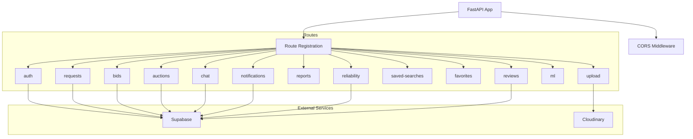

# Main Application Documentation

## Overview

The Main Application file serves as the entry point for the FastAPI backend. It initializes the application, configures middleware, imports and registers all route modules, and performs startup health checks for external services.

---

## Table of Contents

- [Application Configuration](#application-configuration)
- [Middleware](#middleware)
- [Route Registration](#route-registration)
- [Startup Events](#startup-events)
- [Health Endpoints](#health-endpoints)
- [Environment Variables](#environment-variables)

---

## Application Configuration

### FastAPI Instance

```python
app = FastAPI(
    title="MarketFlip API",
    version="2.0.0",
    redirect_slashes=False
)
```

| Setting | Value | Description |
|---------|-------|-------------|
| `title` | MarketFlip API | API display name |
| `version` | 2.0.0 | Current API version |
| `redirect_slashes` | False | Disables automatic slash redirection |

---

## Middleware

### CORS Configuration

```python
app.add_middleware(
    CORSMiddleware,
    allow_origins=[
        "http://localhost:5173",
        "http://127.0.0.1:5173",
        "https://marketflip-mauve.vercel.app",
        "https://marketflip.onrender.com",
    ],
    allow_credentials=True,
    allow_methods=["*"],
    allow_headers=["*"],
)
```

**Allowed Origins:**

| Origin | Environment |
|--------|-------------|
| `http://localhost:5173` | Local development |
| `http://127.0.0.1:5173` | Local development |
| `https://marketflip-mauve.vercel.app` | Frontend deployment |
| `https://marketflip.onrender.com` | Backend deployment |

**CORS Settings:**
- `allow_credentials`: True (allows cookies/auth headers)
- `allow_methods`: All methods (GET, POST, PUT, DELETE, etc.)
- `allow_headers`: All headers

---

## Route Registration

### Imported Routers

| Module | Router Variable | Prefix |
|--------|-----------------|--------|
| `auth.routes` | `auth_router` | `/auth` |
| `requests.routes` | `requests_router` | `/requests` |
| `bids.routes` | `bids_router`, `bid_router` | `/requests`, `/bids` |
| `routes.upload` | `upload_router` | `/upload` |
| `auctions.routes` | `auctions_router` | `/auctions` |
| `chat.routes` | `chat_router` | `/chat` |
| `reports.routes` | `reports_router` | `/reports` |
| `notifications.routes` | `notifications_router` | `/notifications` |
| `saved_searches.routes` | `saved_searches_router` | `/saved-searches` |
| `favorites.routes` | `favorites_router` | `/favorites` |
| `reliability.routes` | `reliability_router` | `/reliability` |
| `ml.routes` | `ml_router` | `/ml` |
| `reviews` | `reviews_router` | `/reviews` |

### Router Registration

```python
app.include_router(auth_router)
app.include_router(requests_router)
app.include_router(bids_router)
app.include_router(bid_router)
app.include_router(upload_router)
app.include_router(auctions_router)
app.include_router(chat_router)
app.include_router(reports_router)
app.include_router(notifications_router)
app.include_router(saved_searches_router)
app.include_router(favorites_router)
app.include_router(reliability_router)
app.include_router(ml_router)
app.include_router(reviews_router)
```

---

## Startup Events

### Startup Health Checks

The application performs connection verification on startup:

**Supabase Connection Check:**
- Verifies ANON client can query `profiles` table
- Verifies SERVICE ROLE client can query `profiles` table
- Logs success or failure

**Cloudinary Connection Check:**
- Verifies Cloudinary credentials are configured
- Checks `cloud_name` is present
- Logs configuration status

### Startup Logging

```
INFO - All routers imported successfully
INFO - All routers included successfully
INFO - Supabase ANON connection successful
INFO - Supabase SERVICE ROLE connection successful
INFO - Cloudinary configured with cloud name: your-cloud-name
INFO - Cloudinary connection verified
```

---

## Health Endpoints

### Root Endpoint

**GET** `/`

Returns basic API information.

**Response:**
```json
{
  "message": "MarketFlip API is running",
  "version": "2.0.0",
  "status": "healthy"
}
```

### Health Check Endpoint

**GET** `/health`

Used for monitoring and uptime checks.

**Response:**
```json
{
  "status": "healthy"
}
```

**Usage:**
- Used by Supabase Edge Functions for warm-up
- Used by monitoring services
- Used by load balancers

---

## Environment Variables

### Required Variables

| Variable | Description |
|----------|-------------|
| `SUPABASE_URL` | Supabase project URL |
| `SUPABASE_ANON_KEY` | Supabase anonymous key |
| `SUPABASE_SERVICE_ROLE_KEY` | Supabase service role key |
| `CLOUDINARY_CLOUD_NAME` | Cloudinary cloud name |
| `CLOUDINARY_API_KEY` | Cloudinary API key |
| `CLOUDINARY_API_SECRET` | Cloudinary API secret |

### Optional Variables

| Variable | Description |
|----------|-------------|
| Any additional environment variables for other services | - |

---

## Running the Application

### Development

```bash
uvicorn main:app --reload --host 0.0.0.0 --port 8000
```

### Production

```bash
uvicorn main:app --host 0.0.0.0 --port 8000
```

### Render Deployment

The application is configured for deployment on Render.com with the following settings:
- **Build Command:** `pip install -r requirements.txt`
- **Start Command:** `uvicorn main:app --host 0.0.0.0 --port $PORT`

---

## Application Architecture



---

## Changelog

| Version | Date | Changes |
|---------|------|---------|
| 2.0.0 | 2026-09-15 | Initial documentation |
| 2.0.0 | Current | CORS updated for production domains |

---

*This documentation is maintained by the Owner.*