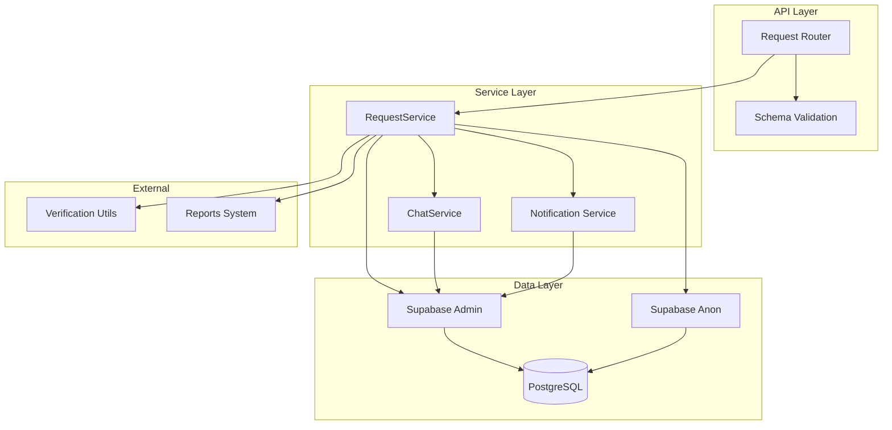
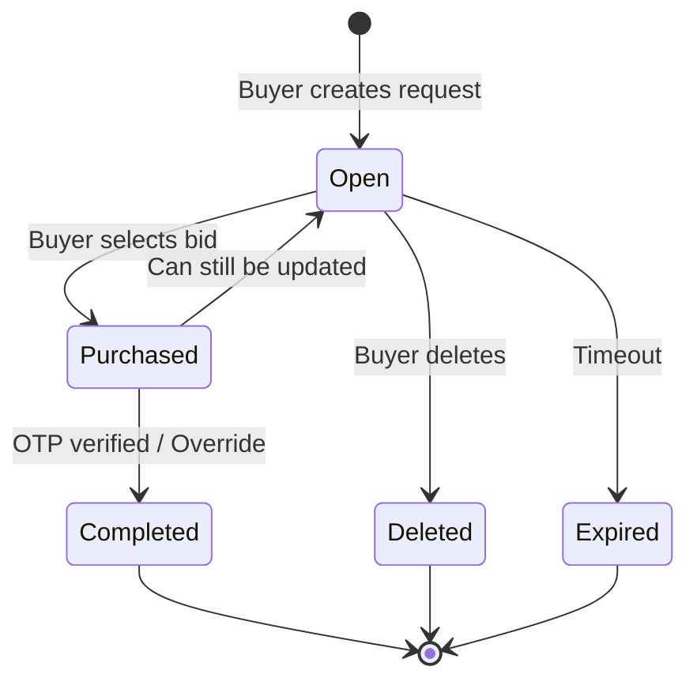
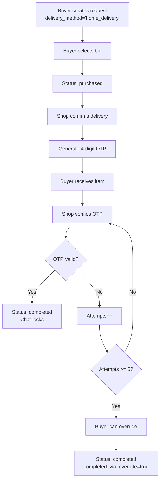
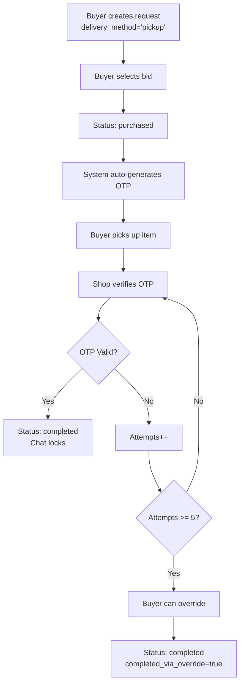
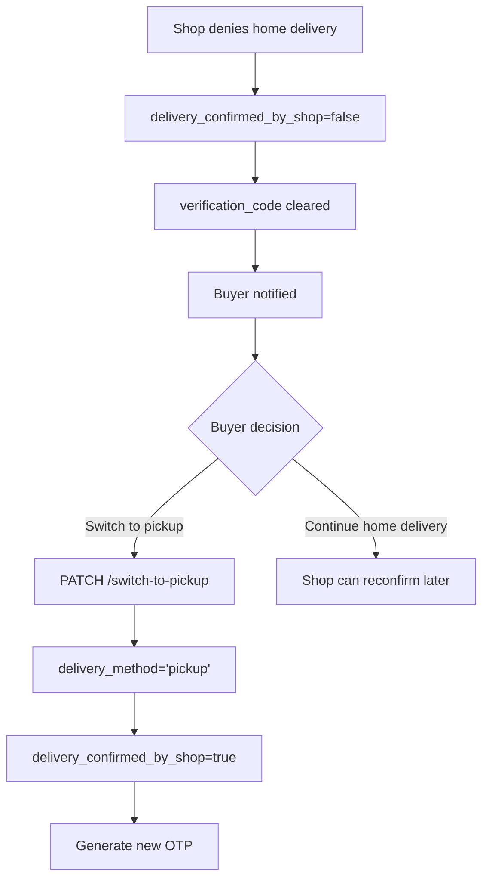
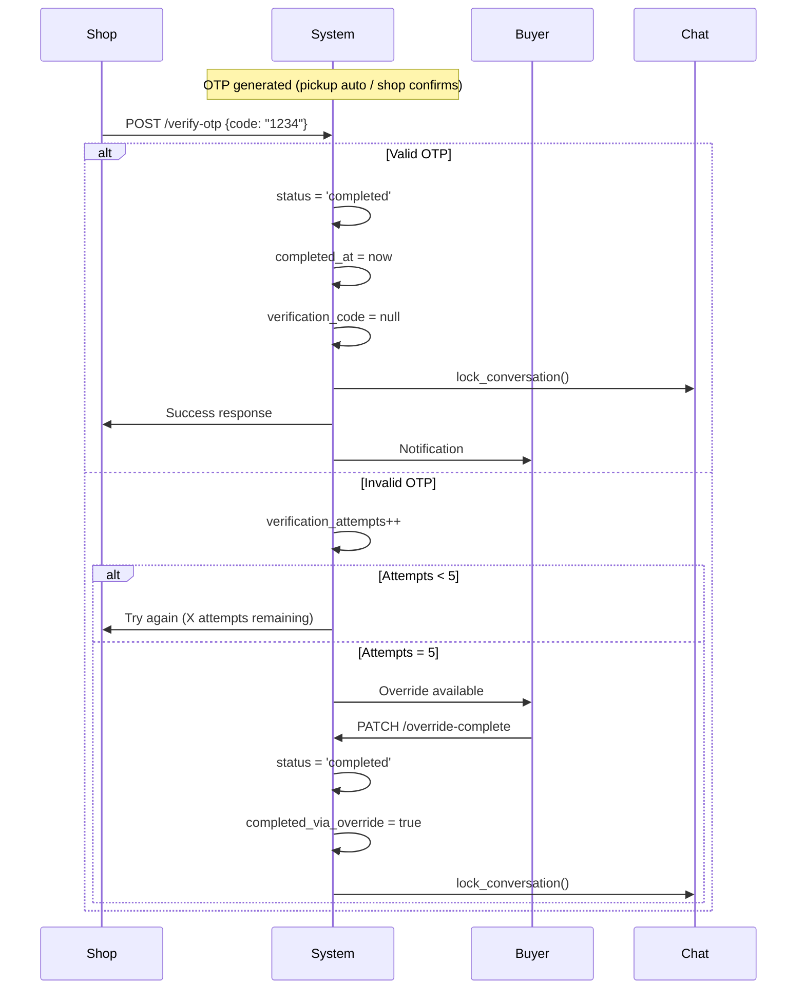

# Requests System Documentation

## Overview

The Requests System enables buyers to create purchase requests for products or services. Shop owners can place bids on these requests, and buyers can select a bid to initiate a transaction. The system includes delivery management and OTP verification for transaction completion.

---

## Table of Contents

- [System Architecture](#system-architecture)
- [API Endpoints](#api-endpoints)
- [Data Models](#data-models)
- [Service Layer](#service-layer)
- [Request Lifecycle](#request-lifecycle)
- [Delivery & OTP Flow](#delivery--otp-flow)
- [Security & Permissions](#security--permissions)
- [Error Handling](#error-handling)

---

## System Architecture



---

## API Endpoints

### 1. Create Request

**POST** `/requests`

Creates a new purchase request.

**Request Body:**

| Field | Type | Description |
|-------|------|-------------|
| `item_name` | string | Name of the item (1-255 chars) |
| `description` | string | Optional description |
| `budget_min` | integer | Minimum budget (>0) |
| `budget_max` | integer | Maximum budget (>= budget_min) |
| `pincode` | string | 6-digit pincode |
| `category` | string | Category (default: electronics) |
| `reference_url` | string | Optional reference URL |
| `reference_image` | string | Optional reference image |
| `delivery_method` | string | home_delivery or pickup |
| `delivery_address` | string | Required for home_delivery |
| `image_urls` | array | Optional list of image URLs |

**Permissions:** Buyer only

---

### 2. Get Requests

**GET** `/requests`

Retrieves requests with filters and excludes flagged items.

**Query Parameters:**

| Parameter | Type | Description |
|-----------|------|-------------|
| `status` | string | open, purchased, completed, deleted, expired, all |
| `pincode` | string | Filter by pincode |
| `category` | string | Filter by category |
| `sort` | string | newest, price_asc, price_desc, most_bids |
| `limit` | integer | Results per page (default 100) |
| `offset` | integer | Pagination offset |

**Behavior:**
- Buyers see only their own requests
- Public users see open requests only
- Flagged requests are excluded from feed

---

### 3. Get Request Detail

**GET** `/requests/{request_id}`

Retrieves detailed request information with bids (if user is buyer).

**Permissions:** Authenticated users

**Behavior:**
- Bids are shown only to the buyer who owns the request
- All delivery fields are included in response
- Flag filter bypassed for detail page

---

### 4. Update Request

**PATCH** `/requests/{request_id}`

Updates an open request.

**Permissions:** Buyer who owns the request

**Conditions:**
- Request must be in `open` status
- Only open requests can be updated

---

### 5. Delete Request

**DELETE** `/requests/{request_id}`

Soft deletes a request (sets status to 'deleted').

**Permissions:** Buyer who owns the request

---

### 6. Set Delivery Method

**PATCH** `/requests/{request_id}/delivery`

Sets delivery method for a purchased request.

**Permissions:** Buyer who owns the request

**Conditions:**
- Request must be in `purchased` status
- delivery_method must be 'home_delivery' or 'pickup'

**Pickup Behavior:**
- Auto-confirms delivery
- Generates verification code
- Sets verification_attempts to 0

---

### 7. Confirm Delivery (Shop)

**PATCH** `/requests/{request_id}/delivery/confirm`

Shop confirms home delivery for a request.

**Permissions:** Shop owner whose bid was selected

**Conditions:**
- Request must be in `purchased` status
- Delivery method must be 'home_delivery'
- Generates 4-digit verification code
- Sets verification_attempts to 0

---

### 8. Deny Delivery (Shop)

**PATCH** `/requests/{request_id}/delivery/deny`

Shop denies home delivery for a request.

**Permissions:** Shop owner whose bid was selected

**Conditions:**
- Request must be in `purchased` status
- Delivery method must be 'home_delivery'
- Clears verification code and resets attempts

---

### 9. Switch to Pickup

**PATCH** `/requests/{request_id}/switch-to-pickup`

Buyer switches from home_delivery to pickup.

**Permissions:** Buyer who owns the request

**Conditions:**
- Request must be in `purchased` status
- Current delivery_method must be 'home_delivery'
- Auto-confirms delivery and generates verification code

---

### 10. Verify OTP (Shop)

**POST** `/requests/{request_id}/verify-otp`

Shop verifies transaction with OTP code.

**Request Body:**
```json
{
  "code": "1234"
}
```

**Permissions:** Shop owner whose bid was selected

**Rules:**
- Code must be 4 digits
- Max 5 attempts
- On success: status becomes 'completed', chat locks
- On failure: increments verification_attempts

---

### 11. Override Complete (Buyer)

**PATCH** `/requests/{request_id}/override-complete`

Buyer manually marks transaction as completed after max attempts.

**Permissions:** Buyer who owns the request

**Conditions:**
- Request must be in `purchased` status
- verification_attempts must be >= 5
- Sets completed_via_override = true

---

## Data Models

### Request Create

| Field | Type | Description |
|-------|------|-------------|
| `item_name` | str | 1-255 characters |
| `description` | Optional[str] | Description |
| `budget_min` | int | >0 |
| `budget_max` | int | >= budget_min |
| `pincode` | str | 6 digits |
| `category` | Optional[str] | Default: electronics |
| `reference_url` | Optional[str] | Reference URL |
| `reference_image` | Optional[str] | Reference image |
| `delivery_method` | Optional[str] | Default: home_delivery |
| `delivery_address` | Optional[str] | Required for home_delivery |
| `image_urls` | Optional[List[str]] | Image URLs |

### Request Response

| Field | Type | Description |
|-------|------|-------------|
| `id` | UUID | Request ID |
| `buyer_id` | UUID | Buyer who created it |
| `item_name` | string | Item name |
| `description` | string | Description |
| `budget_min` | integer | Minimum budget |
| `budget_max` | integer | Maximum budget |
| `pincode` | string | Pincode |
| `category` | string | Category |
| `status` | string | Current status |
| `created_at` | datetime | Creation timestamp |
| `expires_at` | datetime | Expiration timestamp |
| `delivery_method` | string | home_delivery or pickup |
| `delivery_address` | string | Delivery address |
| `delivery_confirmed_by_shop` | boolean | Shop confirmation |
| `verification_code` | string | OTP code |
| `verification_attempts` | integer | Attempts count |
| `completed_via_override` | boolean | Override flag |
| `image_urls` | List[str] | Image URLs |

### Delivery Confirm Response

| Field | Type | Description |
|-------|------|-------------|
| `request_id` | UUID | Request ID |
| `delivery_confirmed_by_shop` | boolean | Confirmation status |
| `delivery_response_at` | datetime | Response timestamp |
| `verification_code` | string | Generated OTP |

---

## Service Layer

### RequestService

**Initialization:**
- Requires `supabase_admin` and `supabase_anon` clients

**Core Methods:**

| Method | Description |
|--------|-------------|
| `create_request()` | Creates a new request |
| `get_requests()` | Gets requests with filters (excludes flagged) |
| `get_request_by_id()` | Gets request with bids (if buyer) |
| `delete_request()` | Soft deletes a request |
| `confirm_delivery()` | Shop confirms delivery, generates OTP |
| `deny_delivery()` | Shop denies delivery, clears OTP |
| `select_bid_with_pickup_otp()` | Generates OTP for pickup |

### Helper Methods

**`_create_notification()`**
- Creates notifications in the database
- Used for various events (delivery confirmed/denied, bid selected)

**`_get_flagged_targets()`**
- Gets IDs of targets with pending reports
- Used to exclude flagged items from feeds

---

## Request Lifecycle

### State Diagram



### Status Definitions

| Status | Description | Next States |
|--------|-------------|-------------|
| `open` | Request open for bidding | `purchased`, `deleted`, `expired` |
| `purchased` | Bid selected, transaction in progress | `completed` |
| `completed` | Transaction finalized | - |
| `deleted` | Soft deleted by buyer | - |
| `expired` | Request timed out | - |

---

## Delivery & OTP Flow

### Home Delivery Flow



### Pickup Flow



### Delivery Denial & Switch to Pickup



### OTP Verification Process



### OTP Rules

| Rule | Value |
|------|-------|
| Code Length | 4 digits |
| Max Attempts | 5 |
| Generated On | delivery_method = pickup (auto) or shop confirms delivery |
| Verification By | Shop owner |
| Override By | Buyer after 5 failed attempts |
| Chat Lock | On successful verification or override |

---

## Security & Permissions

### Role-Based Access Control

| Action | Buyer | Shop Owner |
|--------|-------|------------|
| Create Request | Yes | No |
| View Own Requests | Yes | No |
| View Open Requests | Yes | Yes |
| Update Open Request | Yes (own) | No |
| Delete Request | Yes (own) | No |
| Set Delivery Method | Yes (own) | No |
| Confirm Delivery | No | Yes (selected) |
| Deny Delivery | No | Yes (selected) |
| Switch to Pickup | Yes (own) | No |
| Verify OTP | No | Yes (selected) |
| Override Complete | Yes (own) | No |

### Permission Enforcement

```python
# Buyer check
if current_user.get("role") != "buyer":
    raise HTTPException(status_code=403, detail="Only buyers can create requests")

# Ownership check
if str(request["buyer_id"]) != current_user["id"]:
    raise HTTPException(status_code=403, detail="You don't own this request")

# Shop verification for delivery
bid_result = supabase_admin.table("bids")\
    .select("shop_id")\
    .eq("id", request["selected_bid_id"])\
    .execute()

if bid_result.data[0]["shop_id"] != current_user["id"]:
    raise HTTPException(status_code=403, detail="Only the selected shop can confirm delivery")
```

### Flagged Content Filtering

- Requests with pending reports are excluded from browse feeds
- `_get_flagged_targets()` retrieves IDs of reported targets
- Detail pages bypass the flag filter

---

## Error Handling

### Common Error Codes

| Status Code | Description |
|-------------|-------------|
| 400 | Invalid input, status, or delivery method |
| 403 | Permission denied |
| 404 | Request not found |
| 500 | Server error |

### Common Error Messages

| Error | Cause |
|-------|-------|
| "Only buyers can create requests" | Non-buyer trying to create |
| "Request must be in purchased state" | Wrong status for action |
| "Only the selected shop can confirm delivery" | Wrong shop |
| "Maximum verification attempts exceeded" | 5 failed OTP attempts |
| "Incorrect code. X attempt(s) remaining" | Invalid OTP |
| "No verification code generated" | Delivery not confirmed yet |

---

## Database Schema Reference

### Requests Table

| Column | Type | Description |
|--------|------|-------------|
| `id` | UUID | Primary key |
| `buyer_id` | UUID | References profiles.id |
| `item_name` | TEXT | Item name |
| `description` | TEXT | Description |
| `budget_min` | INT | Minimum budget |
| `budget_max` | INT | Maximum budget |
| `pincode` | TEXT | Location pincode |
| `category` | TEXT | Category |
| `status` | TEXT | open, purchased, completed, deleted, expired |
| `delivery_method` | TEXT | home_delivery or pickup |
| `delivery_address` | TEXT | Delivery address |
| `delivery_confirmed_by_shop` | BOOLEAN | Shop confirmation status |
| `delivery_response_at` | TIMESTAMPTZ | Response timestamp |
| `verification_code` | TEXT | OTP code |
| `verification_attempts` | INT | Attempts count (max 5) |
| `completed_via_override` | BOOLEAN | Override flag |
| `completed_at` | TIMESTAMPTZ | Completion timestamp |
| `created_at` | TIMESTAMP | Creation timestamp |
| `expires_at` | TIMESTAMP | Expiration timestamp |

---

## Changelog

| Version | Date | Changes |
|---------|------|---------|
| 1.0.0 | 2026-09-15 | Initial documentation |

---

*This documentation is maintained by the Owner.*