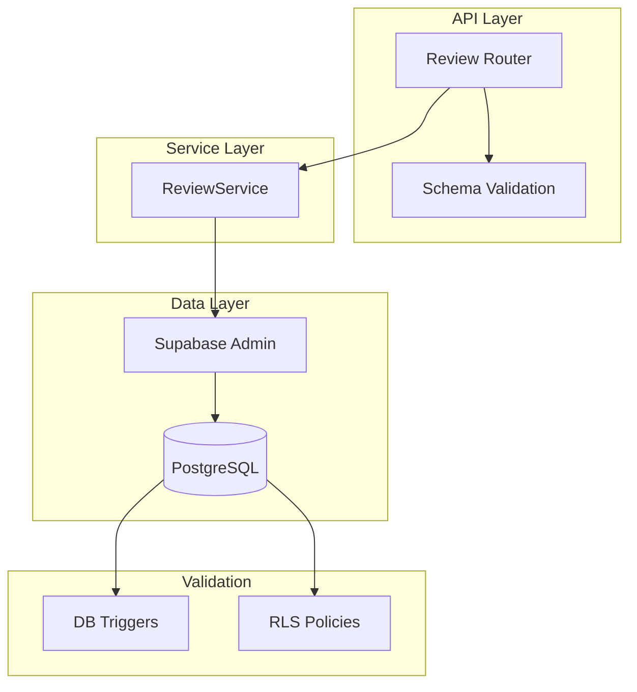
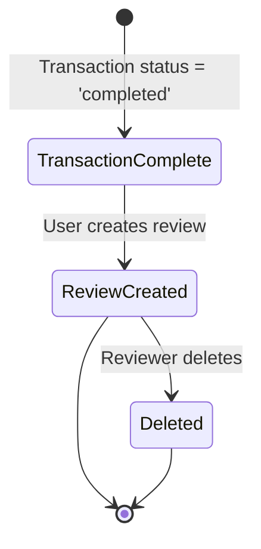
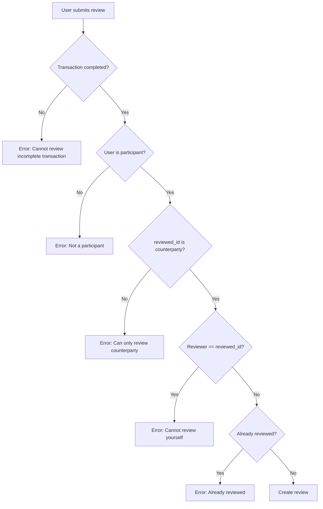
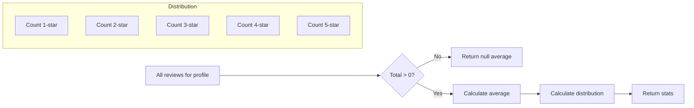

# Reviews System Documentation

## Overview

The Reviews System enables users to rate and review transactions after completion. Reviews can be left for both buyers and shop owners, providing valuable reputation data for the platform. The system enforces validation rules at the database level to ensure only legitimate reviews are created.

---

## Table of Contents

- [System Architecture](#system-architecture)
- [API Endpoints](#api-endpoints)
- [Data Models](#data-models)
- [Service Layer](#service-layer)
- [Review Lifecycle](#review-lifecycle)
- [Security & Permissions](#security--permissions)
- [Error Handling](#error-handling)

---

## System Architecture



---

## API Endpoints

### 1. Create Review

**POST** `/reviews/`

Creates a new review for a completed transaction.

**Request Body:**

| Field | Type | Description |
|-------|------|-------------|
| `reviewed_id` | UUID | The counterparty being reviewed |
| `target_type` | string | 'request' or 'auction' |
| `target_id` | UUID | ID of the transaction target |
| `rating` | integer | 1 to 5 |
| `comment` | string | Optional (max 1000 chars) |

**Validations (DB-Level):**
- Transaction must be 'completed'
- User must be a participant in the transaction
- reviewed_id must be the counterparty
- One review per (reviewer, target)

**Permissions:** Authenticated users

**Error Responses:**
- 400: Transaction not completed
- 403: User is not a participant
- 400: Cannot review yourself
- 400: Already reviewed this transaction

---

### 2. Get Reviews for Profile

**GET** `/reviews/profile/{profile_id}`

Retrieves all reviews received by a profile.

**Query Parameters:**

| Parameter | Type | Description |
|-----------|------|-------------|
| `limit` | integer | Results per page (1-100) |
| `offset` | integer | Pagination offset |

**Permissions:** Authenticated users

---

### 3. Get My Reviews

**GET** `/reviews/my-reviews`

Retrieves all reviews given by the current user.

**Query Parameters:**

| Parameter | Type | Description |
|-----------|------|-------------|
| `limit` | integer | Results per page (1-100) |
| `offset` | integer | Pagination offset |

**Permissions:** Authenticated users

---

### 4. Get Reviews for Target

**GET** `/reviews/target/{target_type}/{target_id}`

Retrieves all reviews for a specific transaction target.

**Path Parameters:**

| Parameter | Type | Description |
|-----------|------|-------------|
| `target_type` | string | 'request' or 'auction' |
| `target_id` | UUID | ID of the target |

**Permissions:** Authenticated users

**Error Codes:**
- 400: Invalid target_type

---

### 5. Check User Reviewed

**GET** `/reviews/check/{target_type}/{target_id}`

Checks if the current user has already reviewed a target.

**Path Parameters:**

| Parameter | Type | Description |
|-----------|------|-------------|
| `target_type` | string | 'request' or 'auction' |
| `target_id` | UUID | ID of the target |

**Response:**
```json
{
  "has_reviewed": true,
  "review_id": "uuid"
}
```

**Permissions:** Authenticated users

**Error Codes:**
- 400: Invalid target_type

---

### 6. Get Review Stats

**GET** `/reviews/stats/{profile_id}`

Retrieves review statistics for a profile.

**Path Parameters:**

| Parameter | Type | Description |
|-----------|------|-------------|
| `profile_id` | UUID | ID of the profile |

**Response:**
```json
{
  "average_rating": 4.5,
  "total_reviews": 10,
  "rating_distribution": {
    "1": 0,
    "2": 1,
    "3": 2,
    "4": 3,
    "5": 4
  }
}
```

**Permissions:** Authenticated users

---

### 7. Delete Review

**DELETE** `/reviews/{review_id}`

Deletes a review. Only the reviewer can delete their own.

**Path Parameters:**
- `review_id`: UUID of the review

**Permissions:** Reviewer only

**Response:** `204 No Content`

**Error Codes:**
- 404: Review not found or permission denied

---

## Data Models

### Request Models

**ReviewCreate**
| Field | Type | Description |
|-------|------|-------------|
| `reviewed_id` | UUID | The counterparty being reviewed |
| `target_type` | Literal | 'request' or 'auction' |
| `target_id` | UUID | ID of the transaction target |
| `rating` | int | 1 to 5 |
| `comment` | Optional[str] | Max 1000 chars |

### Response Models

**ReviewResponse**
| Field | Type | Description |
|-------|------|-------------|
| `id` | UUID | Review ID |
| `reviewer_id` | UUID | User who wrote the review |
| `reviewed_id` | UUID | User being reviewed |
| `target_type` | string | 'request' or 'auction' |
| `target_id` | UUID | Transaction target ID |
| `rating` | int | 1 to 5 |
| `comment` | Optional[str] | Review comment |
| `created_at` | datetime | Creation timestamp |

**ReviewCheckResponse**
| Field | Type | Description |
|-------|------|-------------|
| `has_reviewed` | bool | Whether user has reviewed |
| `review_id` | Optional[UUID] | Review ID if exists |

**ReviewStatsResponse**
| Field | Type | Description |
|-------|------|-------------|
| `average_rating` | Optional[float] | Average rating (null if no reviews) |
| `total_reviews` | int | Total number of reviews |
| `rating_distribution` | dict | Distribution of ratings (1-5) |

---

## Service Layer

### ReviewService

**Initialization:**
- Requires `supabase` admin client

**Core Methods:**

| Method | Description |
|--------|-------------|
| `create_review()` | Creates a new review with DB-level validation |
| `get_reviews_for_profile()` | Gets reviews received by a profile |
| `get_reviews_given_by_user()` | Gets reviews given by a user |
| `get_reviews_for_target()` | Gets reviews for a transaction target |
| `check_user_reviewed_target()` | Checks if user has reviewed a target |
| `get_review_stats()` | Gets review statistics for a profile |
| `delete_review()` | Deletes a review (reviewer only) |

---

## Review Lifecycle



### Validation Flow



### Stats Calculation



---

## Security & Permissions

### Role-Based Access Control

| Action | Buyer | Shop Owner |
|--------|-------|------------|
| Create Review | Yes | Yes |
| Get Profile Reviews | Yes | Yes |
| Get My Reviews | Yes | Yes |
| Get Target Reviews | Yes | Yes |
| Check Reviewed | Yes | Yes |
| Get Review Stats | Yes | Yes |
| Delete Review | Yes (own) | Yes (own) |

### RLS Policies

Based on the database schema:
- Users can insert their own reviews
- Users can select all reviews
- Users can delete their own reviews
- Users cannot update reviews

### Enforcement Methods

| Validation | Enforcement Level |
|------------|-------------------|
| Transaction completed | Database Trigger |
| User is participant | Database Trigger |
| reviewed_id is counterparty | Database Trigger |
| Cannot review yourself | Database Trigger |
| One review per target | Database Unique Constraint |
| Rating range (1-5) | Schema Validation |

---

## Error Handling

### Error Codes

| Status Code | Description |
|-------------|-------------|
| 201 | Review created |
| 400 | Invalid input, validation failed |
| 403 | Permission denied |
| 404 | Review not found |
| 500 | Server error |

### Error Messages

| Error | Cause |
|-------|-------|
| "Cannot review an incomplete transaction" | Transaction not completed |
| "User is not a participant" | User not in transaction |
| "You can only review the other participant" | Wrong reviewed_id |
| "Cannot review yourself" | reviewed_id equals reviewer_id |
| "You have already reviewed this transaction" | Duplicate review |

### Error Handling Pattern

```python
try:
    review = service.create_review(...)
    return review
except Exception as e:
    error_msg = str(e)
    if "Cannot review an incomplete transaction" in error_msg:
        raise HTTPException(400, "Transaction must be completed")
    elif "User is not a participant" in error_msg:
        raise HTTPException(403, "Not a participant")
    elif "duplicate key value violates unique constraint" in error_msg:
        raise HTTPException(400, "Already reviewed")
    else:
        raise HTTPException(500, f"Failed to create review: {error_msg}")
```

---

## Database Schema

### Reviews Table

| Column | Type | Description |
|--------|------|-------------|
| `id` | UUID | Primary key |
| `reviewer_id` | UUID | References profiles.id |
| `reviewed_id` | UUID | References profiles.id |
| `target_type` | TEXT | 'request' or 'auction' |
| `target_id` | UUID | ID of the transaction target |
| `rating` | INT | 1 to 5 |
| `comment` | TEXT | Optional review comment |
| `created_at` | TIMESTAMPTZ | Creation timestamp |

**Constraints:**
- Unique constraint on (reviewer_id, target_type, target_id)
- Rating must be between 1 and 5
- Database triggers enforce transaction validation

---

## RLS Policies

Based on the source files:

| Policy | Command | USING | WITH CHECK |
|--------|---------|-------|------------|
| `reviews_delete_self` | DELETE | `reviewer_id = auth.uid()` | — |
| `reviews_insert_self` | INSERT | — | `reviewer_id = auth.uid()` |
| `reviews_no_update` | UPDATE | `false` | — |
| `reviews_select_authenticated` | SELECT | `true` | — |

---

## Changelog

| Version | Date | Changes |
|---------|------|---------|
| 1.0.0 | 2026-09-15 | Initial documentation |

---

*This documentation is maintained by the Owner.*