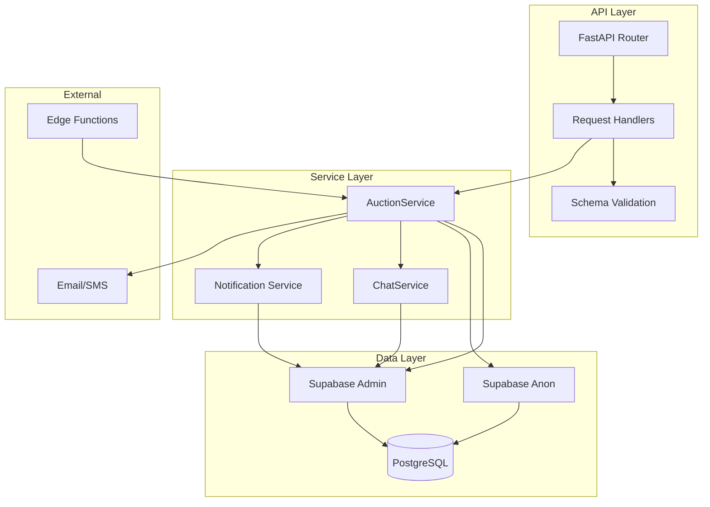
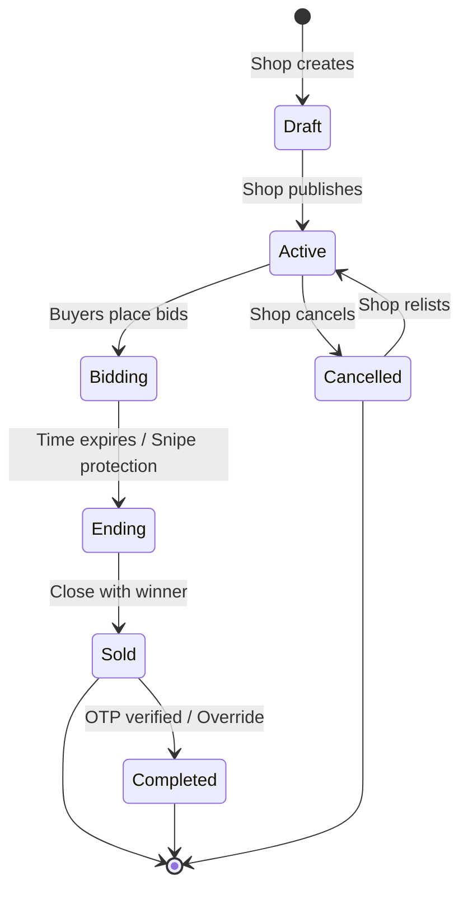
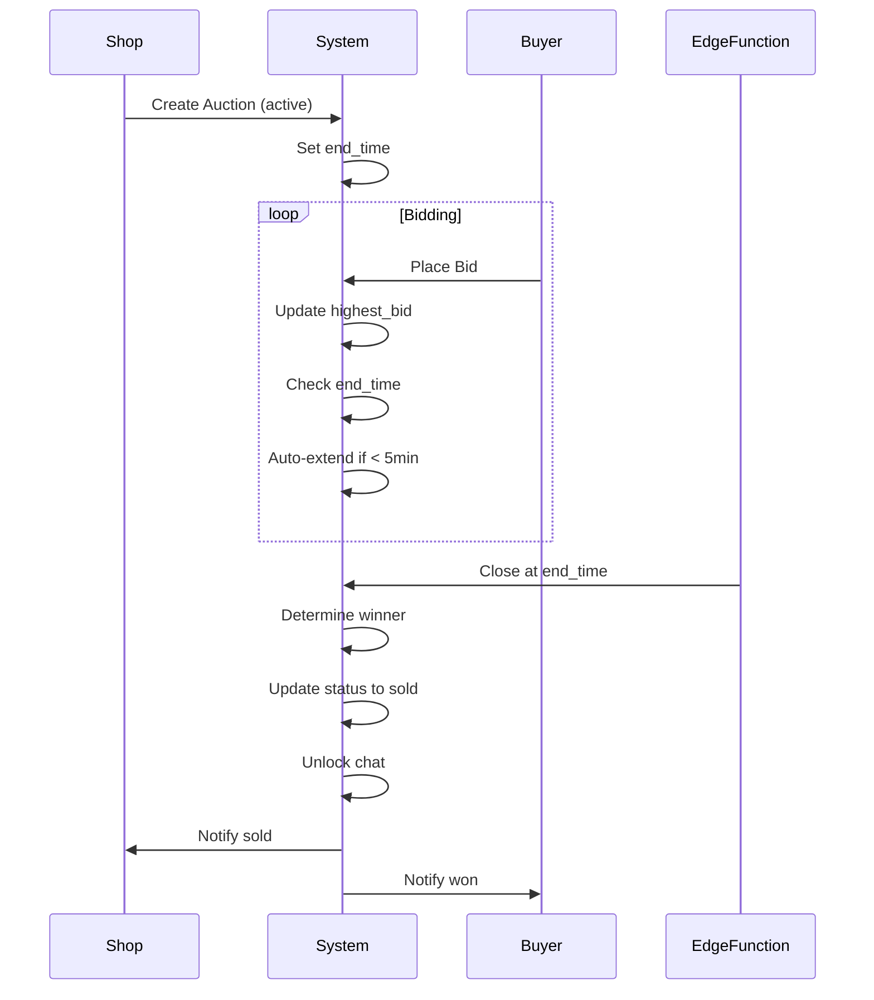
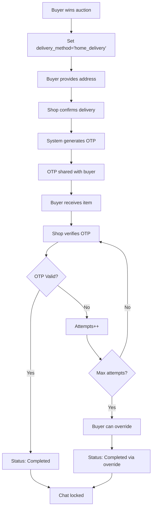
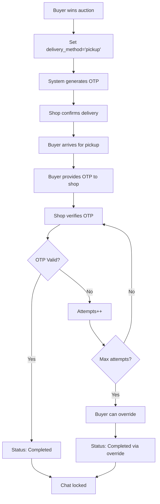
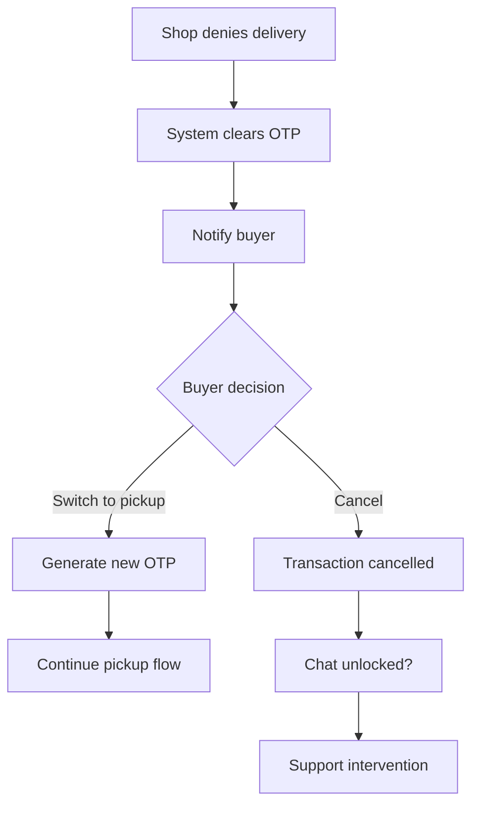
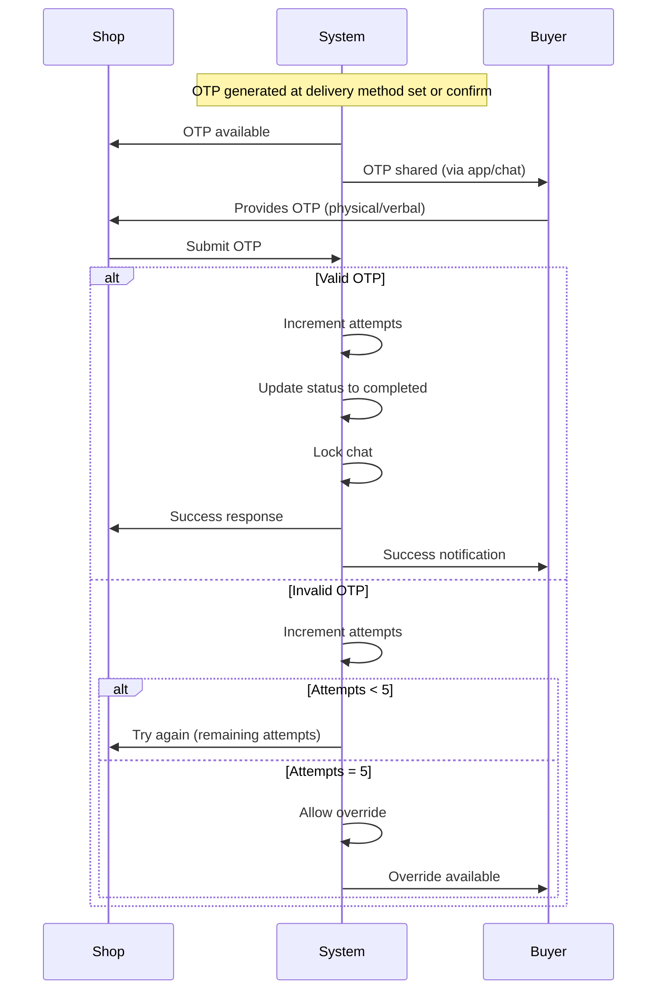

# Auction System Documentation

## Overview

The Auction System enables shop owners to list items for competitive bidding by buyers. It includes full lifecycle management from creation to completion, with integrated chat, notification, and delivery/OTP verification flows.

---

## Table of Contents

- [System Architecture](#system-architecture)
- [API Endpoints](#api-endpoints)
- [Data Models](#data-models)
- [Service Layer](#service-layer)
- [Auction Lifecycle](#auction-lifecycle)
- [Post-Sale Delivery Flow](#post-sale-delivery-flow)
- [OTP Verification System](#otp-verification-system)
- [Security & Permissions](#security--permissions)
- [Error Handling](#error-handling)
- [Performance Considerations](#performance-considerations)
- [Testing Guide](#testing-guide)

---

## System Architecture

### Component Diagram



### Directory Structure

```
auctions/
├── __init__.py
├── router.py          # API endpoints
├── schemas.py         # Pydantic models
├── service.py         # Business logic
└── dependencies.py    # Dependencies (optional)
```

---

## API Endpoints

### 1. Create Auction

**POST** `/auctions`

Creates a new auction listing.

**Request Body:**
```json
{
  "item_name": "Vintage Camera",
  "description": "Rare 1970s film camera in excellent condition",
  "starting_price": 5000,
  "pincode": "560001",
  "category": "electronics",
  "end_time": "2026-10-15T18:00:00Z",
  "image_urls": [
    "https://storage.example.com/camera1.jpg",
    "https://storage.example.com/camera2.jpg"
  ]
}
```

**Response:**
```json
{
  "id": "123e4567-e89b-12d3-a456-426614174000",
  "shop_id": "987fcdeb-51a2-43d3-a456-426614174000",
  "item_name": "Vintage Camera",
  "description": "Rare 1970s film camera in excellent condition",
  "starting_price": 5000,
  "current_highest_bid": 5000,
  "status": "active",
  "end_time": "2026-10-15T18:00:00Z",
  "created_at": "2026-09-15T10:30:00Z"
}
```

**Permissions:** Shop owner only

**Error Codes:**
- `403`: User is not a shop owner
- `400`: Invalid input (pincode format, price, etc.)
- `500`: Server error

---

### 2. Get Auctions

**GET** `/auctions`

Retrieves a list of auctions with filters.

**Query Parameters:**

| Parameter | Type | Description | Default |
|-----------|------|-------------|---------|
| `pincode` | string | Filter by pincode (6 digits) | None |
| `category` | string | Filter by category | None |
| `status` | string | active/sold/completed/expired/cancelled/all | active |
| `sort` | string | newest/price_asc/price_desc/most_bids/ending_soon | newest |
| `limit` | integer | Results per page (1-500) | 100 |
| `offset` | integer | Pagination offset | 0 |

**Sorting Options:**

| Sort Value | Description |
|------------|-------------|
| `newest` | Most recently created first |
| `price_asc` | Lowest price first |
| `price_desc` | Highest price first |
| `most_bids` | Most bid activity first |
| `ending_soon` | Earliest end time first |

**Response:**
```json
[
  {
    "id": "uuid",
    "item_name": "Vintage Camera",
    "starting_price": 5000,
    "current_highest_bid": 7500,
    "bid_count": 5,
    "status": "active",
    "end_time": "2026-10-15T18:00:00Z",
    "shop_name": "Classic Camera Shop"
  }
]
```

**Security:**
- Excludes flagged auctions from the feed
- Flagged items have pending reports

---

### 3. Get Auction Detail

**GET** `/auctions/{auction_id}`

Retrieves detailed information about a specific auction.

**Path Parameters:**
- `auction_id`: UUID of the auction

**Response:**
```json
{
  "id": "uuid",
  "shop_id": "uuid",
  "shop_name": "Classic Camera Shop",
  "item_name": "Vintage Camera",
  "description": "Rare 1970s film camera",
  "starting_price": 5000,
  "current_highest_bid": 7500,
  "winning_bid_id": "uuid",
  "category": "electronics",
  "pincode": "560001",
  "image_urls": ["url1", "url2"],
  "status": "sold",
  "end_time": "2026-10-15T18:00:00Z",
  "closed_at": "2026-10-15T18:05:00Z",
  "bid_count": 5,
  "bids": [
    {
      "id": "uuid",
      "buyer_id": "uuid",
      "buyer_name": "John Doe",
      "bid_amount": 7500,
      "created_at": "2026-10-15T17:45:00Z"
    }
  ]
}
```

**Error Codes:**
- `404`: Auction not found
- `400`: Invalid request

---

### 4. Place Bid

**POST** `/auctions/{auction_id}/bids`

Places a bid on an active auction.

**Request Body:**
```json
{
  "bid_amount": 7500
}
```

**Rules:**
- Bid must be higher than current highest bid
- Bidder cannot be the current highest bidder
- Auction must be active
- Auction must not have ended

**Sniping Protection:**
- If bid is placed within 5 minutes of end time, auction extends by 5 minutes
- Prevents last-second bid sniping

**Response:**
```json
{
  "id": "uuid",
  "auction_id": "uuid",
  "buyer_id": "uuid",
  "bid_amount": 7500,
  "created_at": "2026-10-15T17:30:00Z"
}
```

**Error Codes:**
- `403`: User is not a buyer
- `400`: Bid too low, auction not active, auction ended
- `500`: Server error

---

### 5. Cancel Auction

**DELETE** `/auctions/{auction_id}`

Cancels an active auction.

**Path Parameters:**
- `auction_id`: UUID of the auction

**Permissions:** Shop owner only

**Conditions:**
- Auction must be in `active` status
- User must be the shop owner

**Response:** `204 No Content`

**Error Codes:**
- `403`: User is not the shop owner
- `400`: Auction cannot be cancelled (wrong status)

---

### 6. Close Auction with Winner (Internal)

**POST** `/auctions/{auction_id}/close-with-winner`

Internal endpoint called by Edge Function to close an auction.

**Request Body:**
```json
{
  "winner_buyer_id": "uuid"
}
```

**Actions:**
1. Updates auction status to `sold`
2. Records `closed_at` timestamp
3. Unlocks chat between buyer and shop
4. Sends notifications to both parties

**Security:** Protected by service token

---

### 7. Set Delivery Method

**PATCH** `/auctions/{auction_id}/delivery`

Buyer sets delivery method after winning the auction.

**Request Body:**
```json
{
  "delivery_method": "home_delivery",  // or "pickup"
  "delivery_address": "123 Main St, Bangalore 560001"  // Required for home_delivery
}
```

**Validation:**
- `home_delivery` requires `delivery_address`
- `pickup` does not require address

**Automatic OTP Generation:**
- If `delivery_method` is `pickup`, OTP is generated immediately
- OTP will be needed for handoff verification

**Notifications:**
- Shop is notified that buyer has set delivery method

**Error Codes:**
- `403`: User is not the winning buyer
- `400`: Missing address for home delivery, wrong status

---

### 8. Confirm Delivery

**PATCH** `/auctions/{auction_id}/delivery/confirm`

Shop confirms delivery arrangement.

**Actions:**
- Sets `delivery_confirmed_by_shop` to `true`
- Records `delivery_response_at` timestamp
- Generates OTP for `home_delivery` method
- Notifies buyer

**Response:**
```json
{
  "auction_id": "uuid",
  "status": "sold",
  "delivery_confirmed_by_shop": true,
  "delivery_response_at": "2026-10-16T10:00:00Z",
  "verification_code": "123456",
  "message": "Delivery confirmed successfully"
}
```

---

### 9. Deny Delivery

**PATCH** `/auctions/{auction_id}/delivery/deny`

Shop denies delivery arrangement.

**Actions:**
- Sets `delivery_confirmed_by_shop` to `false`
- Records `delivery_response_at` timestamp
- Clears any existing OTP
- Resets verification attempts
- Notifies buyer

**Effect:**
- Buyer can switch to pickup
- Buyer cannot proceed with home delivery

---

### 10. Switch to Pickup

**PATCH** `/auctions/{auction_id}/switch-to-pickup`

Buyer switches from home delivery to pickup after denial.

**Actions:**
- Changes `delivery_method` to `pickup`
- Clears `delivery_address`
- Generates new OTP
- Resets verification attempts
- Notifies shop

**Conditions:**
- Must be the winning buyer
- Auction must be in `sold` status
- Shop must not have confirmed delivery

---

### 11. Verify OTP

**POST** `/auctions/{auction_id}/verify-otp`

Shop verifies OTP code submitted by buyer.

**Request Body:**
```json
{
  "verification_code": "123456"
}
```

**Rules:**
- Maximum 5 attempts
- On success: status changes to `completed`
- On success: chat is locked
- On failure: attempts counter increments

**Response (Success):**
```json
{
  "auction_id": "uuid",
  "status": "completed",
  "verification_attempts": 1,
  "max_attempts": 5,
  "completed": true,
  "message": "OTP verified successfully. Transaction completed."
}
```

**Response (Failure):**
```json
{
  "auction_id": "uuid",
  "status": "sold",
  "verification_attempts": 2,
  "max_attempts": 5,
  "completed": false,
  "message": "Invalid OTP. Attempts remaining: 3"
}
```

**Error Codes:**
- `403`: User is not the shop owner
- `400`: No OTP generated, max attempts exceeded, wrong status

---

### 12. Override Complete

**PATCH** `/auctions/{auction_id}/override-complete`

Buyer overrides completion after max OTP attempts.

**Conditions:**
- Must be the winning buyer
- Auction must be in `sold` status
- OTP attempts must have reached maximum (5)

**Actions:**
- Changes status to `completed`
- Sets `completed_via_override` flag
- Records `completed_at` timestamp
- Locks chat
- Notifies shop

---

### 13. Relist Auction

**POST** `/auctions/{auction_id}/relist`

Shop relists a cancelled auction.

**Conditions:**
- Must be the shop owner
- Auction must be in `cancelled` status

**Actions:**
- Creates new auction with copied data
- Generates new end time (7 days from now)
- Returns both original and new auction IDs

**Response:**
```json
{
  "original_auction_id": "uuid",
  "new_auction_id": "uuid",
  "status": "success",
  "message": "Auction relisted successfully"
}
```

---

## Data Models

### Auction Schema

```python
class AuctionCreate(BaseModel):
    """Create auction request"""
    item_name: str = Field(..., min_length=1, max_length=255)
    description: Optional[str] = None
    starting_price: int = Field(..., gt=0)
    pincode: str = Field(..., min_length=6)
    category: Optional[str] = "electronics"
    end_time: datetime
    image_urls: Optional[List[str]] = []

class AuctionResponse(BaseModel):
    """Auction response"""
    id: UUID
    shop_id: UUID
    shop_name: Optional[str] = None
    item_name: str
    description: Optional[str] = None
    starting_price: int
    current_highest_bid: Optional[int] = None
    winning_bid_id: Optional[UUID] = None
    category: Optional[str] = None
    pincode: str
    image_urls: Optional[List[str]] = []
    status: str
    end_time: datetime
    closed_at: Optional[datetime] = None
    bid_count: Optional[int] = 0
    created_at: datetime

class AuctionDetailResponse(AuctionResponse):
    """Detailed auction response with bids"""
    bids: List[AuctionBidResponse] = []
    delivery_method: Optional[str] = None
    delivery_address: Optional[str] = None
    delivery_confirmed_by_shop: Optional[bool] = None
    delivery_response_at: Optional[datetime] = None
    verification_code: Optional[str] = None
    verification_attempts: Optional[int] = 0
    completed_via_override: Optional[bool] = False
```

### Bid Schema

```python
class AuctionBidCreate(BaseModel):
    """Place bid request"""
    bid_amount: int = Field(..., gt=0)

class AuctionBidResponse(BaseModel):
    """Bid response"""
    id: UUID
    auction_id: UUID
    buyer_id: UUID
    buyer_name: Optional[str] = None
    bid_amount: int
    created_at: datetime
```

### Delivery Schemas

```python
class AuctionSetDeliveryRequest(BaseModel):
    """Set delivery method request"""
    delivery_method: str = Field(..., pattern="^(home_delivery|pickup)$")
    delivery_address: Optional[str] = None

class AuctionVerifyOTPRequest(BaseModel):
    """Verify OTP request"""
    verification_code: str = Field(..., min_length=6, max_length=6)

class AuctionDeliveryConfirmResponse(BaseModel):
    """Delivery confirm response"""
    auction_id: UUID
    status: str
    delivery_confirmed_by_shop: bool
    delivery_response_at: datetime
    verification_code: Optional[str] = None
    message: str

class AuctionVerifyOTPResponse(BaseModel):
    """OTP verification response"""
    auction_id: UUID
    status: str
    verification_attempts: int
    max_attempts: int = 5
    completed: bool
    message: str
```

---

## Service Layer

### AuctionService Class

#### Initialization

```python
class AuctionService:
    def __init__(self, supabase_admin: Client, supabase_anon: Client):
        self.supabase_admin = supabase_admin
        self.supabase_anon = supabase_anon
```

#### Core Methods

| Method | Description |
|--------|-------------|
| `createAuction()` | Creates new auction listing |
| `getAuctions()` | Retrieves filtered auction list |
| `getAuctionById()` | Gets detailed auction info |
| `placeBid()` | Places bid on active auction |
| `cancelAuction()` | Cancels active auction |
| `close_auction_with_winner()` | Closes auction with winner |

#### Delivery Methods

| Method | Description |
|--------|-------------|
| `set_delivery_method()` | Buyer sets delivery method |
| `confirm_delivery()` | Shop confirms delivery |
| `deny_delivery()` | Shop denies delivery |
| `switch_to_pickup()` | Buyer switches to pickup |
| `verify_otp()` | Shop verifies OTP |
| `override_complete()` | Buyer overrides completion |
| `relist_auction()` | Shop relists cancelled auction |

#### Helper Methods

```python
def _generate_verification_code(self) -> str:
    """Generate 6-digit OTP"""
    return ''.join(random.choices(string.digits, k=6))

def _create_notification(self, user_id: str, notification_type: str, 
                         title: str, body: str, link: str = None):
    """Create real notification in database"""

def _get_flagged_targets(self, target_type: str) -> List[str]:
    """Get IDs of targets with pending reports"""
```

---

## Auction Lifecycle

### State Diagram



### Status Definitions

| Status | Description | Next States |
|--------|-------------|-------------|
| `active` | Auction open for bidding | `sold`, `cancelled`, `expired` |
| `sold` | Winner determined, awaiting delivery | `completed`, `cancelled` |
| `completed` | Transaction finalized | - |
| `cancelled` | Shop cancelled or expired | `active` (relist) |
| `expired` | End time passed with no winner | `cancelled` |

### Timeline Events



---

## Post-Sale Delivery Flow

### Home Delivery Flow



### Pickup Flow



### Delivery Denial Flow



---

## OTP Verification System

### Code Generation

```python
def _generate_verification_code(self) -> str:
    """Generate a 6-digit OTP"""
    return ''.join(random.choices(string.digits, k=6))
```

### Verification Flow



### Attempts Tracking

| Field | Description | Default |
|-------|-------------|---------|
| `verification_code` | Current valid OTP | None |
| `verification_attempts` | Number of attempts made | 0 |
| `max_attempts` | Maximum allowed attempts | 5 |

### Override Mechanism

**Purpose:** Allow transaction completion when shop cannot verify OTP

**Conditions:**
1. `verification_attempts` = 5
2. Auction status = `sold`
3. User is winning buyer

**Effect:**
- Status changes to `completed`
- `completed_via_override` = true
- Chat locked
- Shop notified

---

## Security & Permissions

### Role-Based Access Control

| Action | Buyer | Shop Owner | Service |
|--------|-------|------------|---------|
| Create Auction | No | Yes | No |
| View Auctions | Yes | Yes | Yes |
| Place Bid | Yes | No | No |
| Cancel Auction | No | Yes | No |
| Set Delivery | Yes | No | No |
| Confirm/Deny Delivery | No | Yes | No |
| Verify OTP | No | Yes | No |
| Override Complete | Yes | No | No |
| Relist Auction | No | Yes | No |

### Policy Enforcement

```python
# Example: Shop owner check
if current_user.get("role") != "shop_owner":
    raise HTTPException(status_code=403, detail="Only shop owners can create auctions")

# Example: Ownership check
if auction["shop_id"] != shop_id:
    raise ValueError("You don't own this auction")

# Example: Buyer check
if current_user.get("role") != "buyer":
    raise HTTPException(status_code=403, detail="Only buyers can place bids")
```

### Flagged Content Filtering

```python
def _get_flagged_targets(self, target_type: str) -> List[str]:
    """
    Get IDs of targets with pending reports.
    Used to exclude flagged items from browse feeds.
    """
    response = self.supabase_admin.table("reports") \
        .select("target_id") \
        .eq("target_type", target_type) \
        .eq("status", "pending") \
        .execute()
    
    return [str(r["target_id"]) for r in response.data]
```

---

## Error Handling

### Exception Types

| Exception | Status Code | Description |
|-----------|-------------|-------------|
| `HTTPException` | 400 | Validation error |
| `HTTPException` | 403 | Permission denied |
| `HTTPException` | 404 | Resource not found |
| `HTTPException` | 500 | Server error |
| `ValueError` | 400 | Business logic error |

### Common Error Messages

| Error | Cause | Resolution |
|-------|-------|------------|
| "Only shop owners can create auctions" | Wrong role | Verify user role |
| "Bid must be higher than current highest bid" | Bid too low | Check current price |
| "Auction is not active" | Wrong status | Check auction status |
| "Maximum OTP attempts exceeded" | Too many failed attempts | Use override |
| "No OTP has been generated" | OTP not created | Set delivery first |
| "Delivery address is required for home delivery" | Missing field | Provide address |

### Logging

```python
logger = logging.getLogger(__name__)

try:
    # Operation
except ValueError as e:
    logger.error(f"Error in operation: {str(e)}")
    raise HTTPException(status_code=400, detail=str(e))
except Exception as e:
    logger.error(f"Unexpected error: {str(e)}")
    raise HTTPException(status_code=500, detail="Internal server error")
```

---

## Performance Considerations

### Database Indexes

```sql
-- Essential indexes for auction queries
CREATE INDEX idx_auctions_status_created ON auctions(status, created_at);
CREATE INDEX idx_auctions_shop_id ON auctions(shop_id);
CREATE INDEX idx_auctions_pincode ON auctions(pincode);
CREATE INDEX idx_auctions_category ON auctions(category);
CREATE INDEX idx_auctions_end_time ON auctions(end_time) WHERE status = 'active';

-- Bid queries
CREATE INDEX idx_auction_bids_auction_id ON auction_bids(auction_id);
CREATE INDEX idx_auction_bids_buyer_id ON auction_bids(buyer_id);
CREATE INDEX idx_auction_bids_created ON auction_bids(created_at DESC);
```

### Query Optimization

**1. Filtered Auction List:**
```python
# Use composite index (status, created_at)
query = table.select("*").eq("status", "active").order("created_at", desc=True)
```

**2. Bid Count:**
```python
# Use count query instead of fetching all bids
bid_count = table.select("id", count="exact").eq("auction_id", auction_id).execute()
auction["bid_count"] = len(bid_count.data)
```

**3. Shop Name Join:**
```python
# Use join instead of separate query where possible
auction_response = table.select("*, profiles!shop_id(shop_name)").execute()
```

### Caching Strategy

| Data | Cache TTL | Cache Key |
|------|-----------|-----------|
| Auction list (feed) | 30 seconds | `auctions:list:{params}` |
| Auction detail | 60 seconds | `auctions:detail:{id}` |
| Bid count | 10 seconds | `auctions:bids:count:{id}` |
| Shop reliability | 5 minutes | `shop:reliability:{shop_id}` |

### Rate Limiting

```python
# Suggested rate limits
BID_RATE_LIMIT = 10  # bids per minute per user
CREATE_RATE_LIMIT = 5  # auctions per minute per shop
```

---

## Testing Guide

### Test Scenarios

**1. Auction Creation**
```python
def test_create_auction():
    # Create shop owner
    # Create auction
    # Verify auction created with correct status
    # Verify error for non-shop users
```

**2. Bidding**
```python
def test_place_bid():
    # Create auction
    # Place valid bid
    # Verify highest bid updated
    # Place invalid bid (too low)
    # Verify error
    # Place bid when auction ended
    # Verify error
```

**3. Sniping Protection**
```python
def test_sniping_protection():
    # Create auction ending in 3 minutes
    # Place bid
    # Verify end_time extended by 5 minutes
```

**4. Delivery Flow**
```python
def test_delivery_flow():
    # Close auction with winner
    # Set delivery method
    # Confirm delivery (shop)
    # Verify OTP generated
    # Verify OTP (shop)
    # Verify status changed to completed
```

**5. OTP Verification**
```python
def test_otp_verification():
    # Set delivery method (pickup)
    # Attempt invalid OTP 5 times
    # Verify max attempts exceeded
    # Override completion
    # Verify status completed via override
```

### Mock Data

```python
# Example test data
TEST_SHOP = {
    "id": "shop-123",
    "role": "shop_owner",
    "shop_name": "Test Shop"
}

TEST_BUYER = {
    "id": "buyer-456",
    "role": "buyer",
    "full_name": "Test Buyer"
}

TEST_AUCTION = {
    "item_name": "Test Item",
    "starting_price": 1000,
    "pincode": "560001",
    "category": "electronics",
    "end_time": datetime.now() + timedelta(days=7)
}
```

---

## API Error Reference

| Status Code | Error | Description |
|-------------|-------|-------------|
| 400 | `BID_TOO_LOW` | Bid amount must be higher than current highest bid |
| 400 | `AUCTION_NOT_ACTIVE` | Auction must be in active status |
| 400 | `AUCTION_ENDED` | Auction end time has passed |
| 400 | `MAX_ATTEMPTS_EXCEEDED` | Maximum OTP attempts (5) reached |
| 400 | `NO_OTP_GENERATED` | No OTP exists for this auction |
| 400 | `INVALID_STATUS` | Action not allowed for current status |
| 403 | `NOT_SHOP_OWNER` | User is not a shop owner |
| 403 | `NOT_BUYER` | User is not a buyer |
| 403 | `NOT_OWNER` | User does not own this auction |
| 403 | `NOT_WINNER` | User is not the winning buyer |
| 404 | `AUCTION_NOT_FOUND` | Auction ID does not exist |

---

## Appendix

### Constants

```python
# Auction Status
AUCTION_STATUS = {
    'DRAFT': 'draft',
    'ACTIVE': 'active',
    'SOLD': 'sold',
    'COMPLETED': 'completed',
    'CANCELLED': 'cancelled',
    'EXPIRED': 'expired'
}

# Delivery Methods
DELIVERY_METHODS = {
    'HOME_DELIVERY': 'home_delivery',
    'PICKUP': 'pickup'
}

# OTP Configuration
OTP_CONFIG = {
    'LENGTH': 6,
    'MAX_ATTEMPTS': 5,
    'SNIPE_PROTECTION_SECONDS': 300  # 5 minutes
}

# Pagination
PAGINATION = {
    'DEFAULT_LIMIT': 100,
    'MAX_LIMIT': 500
}
```

### Database Schema Reference

```sql
-- Auctions table
CREATE TABLE auctions (
    id UUID PRIMARY KEY,
    shop_id UUID REFERENCES profiles(id),
    item_name TEXT NOT NULL,
    description TEXT,
    starting_price INT NOT NULL,
    current_highest_bid INT,
    current_highest_bidder UUID REFERENCES profiles(id),
    winning_bid_id UUID REFERENCES auction_bids(id),
    category TEXT,
    pincode TEXT NOT NULL,
    image_urls TEXT[],
    status TEXT DEFAULT 'active',
    end_time TIMESTAMPTZ NOT NULL,
    closed_at TIMESTAMPTZ,
    completed_at TIMESTAMPTZ,
    delivery_method TEXT,
    delivery_address TEXT,
    delivery_confirmed_by_shop BOOLEAN,
    delivery_response_at TIMESTAMPTZ,
    verification_code TEXT,
    verification_attempts INT DEFAULT 0,
    completed_via_override BOOLEAN DEFAULT FALSE,
    reserve_price INT,
    created_at TIMESTAMPTZ DEFAULT NOW()
);

-- Auction bids table
CREATE TABLE auction_bids (
    id UUID PRIMARY KEY,
    auction_id UUID REFERENCES auctions(id),
    buyer_id UUID REFERENCES profiles(id),
    bid_amount INT NOT NULL,
    created_at TIMESTAMPTZ DEFAULT NOW()
);
```

---

## Changelog

| Version | Date | Changes |
|---------|------|---------|
| 1.0.0 | 2026-09-15 | Initial documentation |
| 1.1.0 | 2026-09-20 | Added OTP verification flow |
| 1.2.0 | 2026-09-25 | Added override and relist functionality |
| 1.3.0 | 2026-09-30 | Added sniping protection |

---

*This documentation is maintained by the owner.*