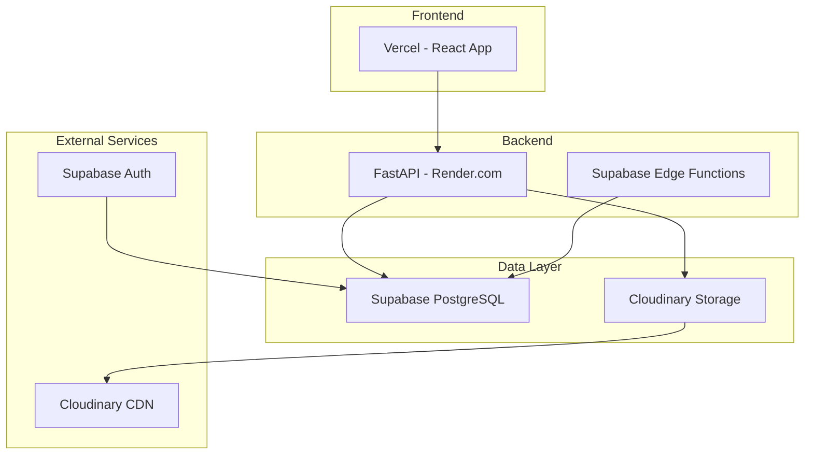

# MarketFlip Platform - Operations Documentation

## Overview

This document provides comprehensive operational guidance for the MarketFlip marketplace platform. It covers system architecture, deployment, monitoring, maintenance, troubleshooting, and recovery procedures.

---

## Table of Contents

- [System Architecture](#system-architecture)
- [Deployment](#deployment)
- [Database Operations](#database-operations)
- [Cron Jobs & Scheduled Tasks](#cron-jobs--scheduled-tasks)
- [Monitoring & Alerts](#monitoring--alerts)
- [Maintenance Procedures](#maintenance-procedures)
- [Backup & Recovery](#backup--recovery)
- [Troubleshooting Guide](#troubleshooting-guide)
- [Security Operations](#security-operations)
- [Performance Optimization](#performance-optimization)
- [Runbooks](#runbooks)

---

## System Architecture

### Component Overview



### Service Dependencies

| Component | Service | Purpose |
|-----------|---------|---------|
| **Backend API** | Render.com | FastAPI application server |
| **Database** | Supabase | PostgreSQL with auth |
| **File Storage** | Cloudinary | Image uploads & CDN |
| **Frontend** | Vercel | React application |
| **Auth** | Supabase Auth | User authentication |

### Environment Variables

| Variable | Description | Required By |
|----------|-------------|-------------|
| `SUPABASE_URL` | Supabase project URL | All services |
| `SUPABASE_ANON_KEY` | Supabase anonymous key | Backend API |
| `SUPABASE_SERVICE_ROLE_KEY` | Supabase admin key | Backend API, Edge Functions |
| `CLOUDINARY_CLOUD_NAME` | Cloudinary cloud name | Upload service |
| `CLOUDINARY_API_KEY` | Cloudinary API key | Upload service |
| `CLOUDINARY_API_SECRET` | Cloudinary API secret | Upload service |
| `MARKETFLIP_API_URL` | Backend API URL | Edge Functions |

---

## Deployment

### Backend API (Render.com)

**Deployment Configuration:**

| Setting | Value |
|---------|-------|
| **Build Command** | `pip install -r requirements.txt` |
| **Start Command** | `uvicorn main:app --host 0.0.0.0 --port $PORT` |
| **Python Version** | 3.9+ |
| **Environment** | Python |

**Deployment Steps:**

```bash
# 1. Push to main branch
git push origin main

# 2. Render automatically deploys
# 3. Verify deployment
curl https://marketflip.onrender.com/health
```

**Rollback Procedure:**
1. Navigate to Render.com dashboard
2. Select MarketFlip service
3. Click "Deploy" → "Deploy latest commit" or select previous version
4. Confirm rollback

---

### Edge Functions (Supabase)

**Deploy Edge Functions:**

```bash
# Deploy close-auctions function
supabase functions deploy close-auctions

# Deploy expire-requests function
supabase functions deploy expire-requests

# Verify deployment
supabase functions list
```

**Environment Variables for Edge Functions:**
- Set in Supabase Dashboard → Edge Functions → Environment Variables
- Required: `SUPABASE_URL`, `SUPABASE_SERVICE_ROLE_KEY`, `MARKETFLIP_API_URL`

---

### Frontend (Vercel)

**Deployment Configuration:**

| Setting | Value |
|---------|-------|
| **Framework** | React/Vite |
| **Build Command** | `npm run build` |
| **Output Directory** | `dist` |
| **Environment Variables** | VITE_API_URL, VITE_SUPABASE_URL, etc. |

---

## Database Operations

### Table Counts & Monitoring

```sql
-- Check table sizes
SELECT 
    schemaname,
    tablename,
    pg_size_pretty(pg_total_relation_size(schemaname||'.'||tablename)) AS size
FROM pg_tables
WHERE schemaname = 'public'
ORDER BY pg_total_relation_size(schemaname||'.'||tablename) DESC;

-- Check row counts
SELECT 'profiles' as table_name, COUNT(*) FROM profiles UNION ALL
SELECT 'requests', COUNT(*) FROM requests UNION ALL
SELECT 'bids', COUNT(*) FROM bids UNION ALL
SELECT 'auctions', COUNT(*) FROM auctions UNION ALL
SELECT 'messages', COUNT(*) FROM messages;
```

### Index Maintenance

```sql
-- Reindex tables periodically
REINDEX TABLE requests;
REINDEX TABLE bids;
REINDEX TABLE messages;

-- Analyze tables for query optimization
ANALYZE requests;
ANALYZE bids;
ANALYZE auctions;
```

### Data Archival

```sql
-- Archive completed requests older than 90 days
INSERT INTO archived_requests SELECT * FROM requests 
WHERE status = 'completed' AND completed_at < NOW() - INTERVAL '90 days';

DELETE FROM requests 
WHERE status = 'completed' AND completed_at < NOW() - INTERVAL '90 days';
```

---

## Cron Jobs & Scheduled Tasks

### Edge Function Schedule

| Function | Schedule | Purpose |
|----------|----------|---------|
| `close-auctions` | Every 5 minutes | Close ended auctions |
| `expire-requests` | Every 5 minutes | Expire open requests |

**Configuration:**
- Functions are triggered via Supabase cron jobs
- Configured in Supabase Dashboard → Edge Functions → Schedules

### Manual Trigger

```bash
# Invoke close-auctions function
supabase functions invoke close-auctions

# Invoke expire-requests function
supabase functions invoke expire-requests
```

---

## Monitoring & Alerts

### Health Checks

**Endpoint Health Check:**
```bash
curl https://marketflip.onrender.com/health
# Expected: {"status":"healthy"}
```

**Supabase Health Check:**
```bash
curl https://[project].supabase.co/rest/v1/
# Expected: 200 OK
```

### Logging

**Backend Logs (Render.com):**
- Access via Render.com dashboard → Logs
- View real-time and historical logs
- Filter by severity level

**Edge Function Logs (Supabase):**
```bash
supabase functions logs close-auctions
supabase functions logs expire-requests
```

### Monitoring Metrics

| Metric | Target | Alert Threshold |
|--------|--------|-----------------|
| API Response Time | < 500ms | > 2s |
| Error Rate | < 1% | > 5% |
| Database Connections | < 50 | > 80% of limit |
| Cloudinary Storage | < 80% | > 90% |
| Unread Notifications | - | Monitor for spikes |
| Failed OTP Attempts | < 100/day | > 500/day |

---

## Maintenance Procedures

### Database Cleanup

**Using Cleanup Script:**

```bash
# Run interactive cleanup
python scripts/cleanup.py

# Available options:
# - Clean old request_events (> 30 days)
# - Clean expired requests (> 30 days)
# - Clean orphan bids
# - Clean duplicate profiles
# - Find and delete unused Cloudinary images
```

**Automated Cleanup Recommendations:**

| Task | Frequency | Script Option |
|------|-----------|---------------|
| Clean request_events | Weekly | Option 2 |
| Clean expired requests | Monthly | Option 3 |
| Clean orphan bids | Monthly | Option 4 |
| Clean unused images | Monthly | Option 9 |

### Cloudinary Storage Management

**Check Storage Usage:**
```bash
# Using cleanup script
python scripts/cleanup.py
# Select option 7: Show Cloudinary storage usage
```

**Delete Unused Images:**
```bash
python scripts/cleanup.py
# Select option 8 (dry run) then option 9 (actual)
```

---

## Backup & Recovery

### Database Backups

**Supabase Automated Backups:**
- Daily backups retained for 7 days
- Point-in-time recovery available (last 24 hours)

**Manual Backup:**

```bash
# Download database dump
supabase db dump --db-url postgresql://... > backup_$(date +%Y%m%d).sql

# Restore database
psql -f backup_20260101.sql
```

### Critical Tables to Back Up

| Priority | Tables | Backup Frequency |
|----------|--------|------------------|
| High | `profiles`, `requests`, `bids` | Daily |
| High | `auctions`, `auction_bids` | Daily |
| Medium | `messages`, `conversations` | Daily |
| Medium | `reviews`, `reports` | Weekly |
| Low | `request_events`, `notifications` | Weekly |

### Recovery Procedures

**Full Database Recovery:**
1. Stop application
2. Restore from latest backup
3. Apply point-in-time changes if needed
4. Verify data integrity
5. Start application

**Partial Recovery:**
1. Identify affected tables
2. Restore specific tables from backup
3. Verify consistency with related tables

---

## Troubleshooting Guide

### Common Issues & Solutions

#### 1. Authentication Failures

**Symptoms:** 401 Unauthorized errors, login failures

**Check:**
```bash
# Verify Supabase auth service
curl https://[project].supabase.co/auth/v1/health

# Check environment variables
echo $SUPABASE_ANON_KEY
echo $SUPABASE_SERVICE_ROLE_KEY
```

**Resolution:**
- Regenerate API keys in Supabase dashboard
- Update environment variables
- Restart the application

---

#### 2. Database Connection Issues

**Symptoms:** 500 errors, timeout errors

**Check:**
```bash
# Test Supabase connection
curl https://[project].supabase.co/rest/v1/profiles?limit=1

# Check connection pool
SELECT count(*) FROM pg_stat_activity;
```

**Resolution:**
- Increase connection pool limits
- Restart Supabase project
- Check network connectivity

---

#### 3. Cloudinary Upload Failures

**Symptoms:** 400 errors on upload endpoints, broken images

**Check:**
```bash
# Verify Cloudinary credentials
python scripts/cleanup.py
# Select option 7 to check storage

# Check Cloudinary account status
```

**Resolution:**
- Verify API keys
- Check storage quota
- Regenerate credentials if needed

---

#### 4. Edge Function Failures

**Symptoms:** Auctions not closing, requests not expiring

**Check:**
```bash
# View function logs
supabase functions logs close-auctions

# Verify function deployment
supabase functions list
```

**Resolution:**
- Redeploy function
- Check environment variables
- Verify function timeout settings

---

#### 5. Chat Not Unlocking

**Symptoms:** Buyers can't message shops after selection

**Check:**
```sql
-- Check conversation state
SELECT * FROM conversations WHERE id = 'conversation_id';
SELECT * FROM conversation_active_transactions WHERE conversation_id = 'conversation_id';

-- Verify active transaction exists
SELECT * FROM conversation_active_transactions 
WHERE source_id = 'transaction_id' AND status = 'active';
```

**Resolution:**
- Manually unlock conversation
- Check OTP verification status
- Verify transaction completion

---

## Security Operations

### User Management

**Create Admin User:**
```sql
-- Insert admin role (if admin table exists)
INSERT INTO admins (user_id, role) VALUES ('user_uuid', 'admin');
```

**Disable User Account:**
```sql
-- Soft disable via profile
UPDATE profiles SET is_verified = false WHERE id = 'user_uuid';

-- Hard disable via auth (Supabase)
-- Use Supabase Dashboard → Authentication → Users → Disable
```

**Delete User Data (GDPR):**
```bash
# Use cleanup script with caution
python scripts/cleanup.py
# Select option 6 for DELETE ALL DATA
```

### Security Monitoring

**Check for Suspicious Activity:**
```sql
-- Unusual number of failed login attempts
SELECT * FROM auth.audit_log_entries 
WHERE action = 'login_failed' 
AND created_at > NOW() - INTERVAL '1 hour';

-- Multiple reports on same target
SELECT target_id, target_type, COUNT(*) 
FROM reports 
WHERE status = 'pending' 
GROUP BY target_id, target_type 
HAVING COUNT(*) > 5;
```

---

## Performance Optimization

### Database Index Recommendations

```sql
-- Essential indexes for query performance
CREATE INDEX CONCURRENTLY IF NOT EXISTS idx_requests_status_created 
    ON requests(status, created_at DESC);

CREATE INDEX CONCURRENTLY IF NOT EXISTS idx_bids_request_status 
    ON bids(request_id, status);

CREATE INDEX CONCURRENTLY IF NOT EXISTS idx_auctions_status_end 
    ON auctions(status, end_time) WHERE status = 'active';

CREATE INDEX CONCURRENTLY IF NOT EXISTS idx_messages_conversation_created 
    ON messages(conversation_id, created_at DESC);
```

### Query Optimization

**Slow Query Detection:**
```sql
-- Check slow queries
SELECT query, calls, total_time, mean_time 
FROM pg_stat_statements 
ORDER BY mean_time DESC 
LIMIT 10;
```

**Caching Strategy:**

| Data Type | Cache TTL | Method |
|-----------|-----------|--------|
| Auctions list | 30 seconds | Application memory |
| Request list | 30 seconds | Application memory |
| User profile | 5 minutes | Application memory |
| Shop reliability | 5 minutes | Materialized view |

---

## Runbooks

### Runbook: Service Outage

**Symptoms:** Application inaccessible, 500 errors

**Steps:**

1. **Check Render.com Status**
   - Visit https://status.render.com
   - Check if service is running

2. **Restart Service**
   - Render dashboard → Service → Manual Deploy
   - Wait for deployment complete

3. **Check Logs**
   - Render dashboard → Logs
   - Look for errors

4. **Verify Database**
   ```bash
   curl https://[project].supabase.co/rest/v1/health
   ```

5. **If Unresolved**
   - Rollback to previous version
   - Contact support

---

### Runbook: High Error Rate

**Symptoms:** Error rate > 5%, users reporting issues

**Steps:**

1. **Check Recent Deployments**
   - Review latest changes
   - Rollback if needed

2. **Check Database Load**
   ```sql
   SELECT * FROM pg_stat_activity WHERE state = 'active';
   ```

3. **Check Edge Functions**
   ```bash
   supabase functions logs close-auctions
   supabase functions logs expire-requests
   ```

4. **Check External Services**
   - Cloudinary status
   - Supabase status

5. **Scale Resources**
   - Increase Render instance size
   - Increase Supabase compute

---

### Runbook: Data Corruption

**Symptoms:** Missing data, incorrect data, duplicate records

**Steps:**

1. **Identify Affected Tables**
   ```sql
   -- Check for anomalies
   SELECT COUNT(*), MIN(created_at), MAX(created_at) FROM affected_table;
   ```

2. **Restore from Backup**
   ```bash
   psql -f backup_20260101.sql
   ```

3. **Verify Restoration**
   ```sql
   -- Compare counts
   SELECT COUNT(*) FROM affected_table;
   ```

4. **Re-seed Missing Data**
   ```bash
   python scripts/seed_data.py
   ```

5. **Root Cause Analysis**
   - Review recent changes
   - Check audit logs

---

### Runbook: Edge Function Failure

**Symptoms:** Auctions not closing, requests not expiring

**Steps:**

1. **Check Function Logs**
   ```bash
   supabase functions logs close-auctions --tail
   ```

2. **Verify Scheduling**
   - Supabase dashboard → Edge Functions → Schedules
   - Ensure schedule is active

3. **Redeploy Function**
   ```bash
   supabase functions deploy close-auctions
   ```

4. **Manual Trigger**
   ```bash
   supabase functions invoke close-auctions
   ```

5. **Verify Results**
   ```sql
   -- Check auction statuses
   SELECT id, status, end_time, closed_at 
   FROM auctions 
   WHERE status = 'active' AND end_time < NOW();
   ```

---

### Runbook: Chat System Malfunction

**Symptoms:** Messages not sending, conversations not unlocking

**Steps:**

1. **Check Conversation Status**
   ```sql
   SELECT * FROM conversations WHERE id = 'conversation_id';
   SELECT * FROM conversation_active_transactions 
   WHERE conversation_id = 'conversation_id' AND status = 'active';
   ```

2. **Verify Active Transaction**
   ```sql
   -- Check if transaction exists
   SELECT * FROM conversation_active_transactions 
   WHERE source_id = 'source_id' AND source_type = 'source_type';
   ```

3. **Manually Unlock**
   ```sql
   -- Insert active transaction if missing
   INSERT INTO conversation_active_transactions 
   (conversation_id, source_type, source_id, item_name, status) 
   VALUES ('conv_id', 'request', 'request_id', 'Item Name', 'active');

   -- Unlock conversation
   UPDATE conversations SET locked = false WHERE id = 'conv_id';
   ```

4. **Check Message Integrity**
   ```sql
   SELECT COUNT(*), MIN(created_at), MAX(created_at) 
   FROM messages WHERE conversation_id = 'conv_id';
   ```

---

### Runbook: OTP Verification Failures

**Symptoms:** Users unable to complete transactions, OTP not working

**Steps:**

1. **Check OTP Status**
   ```sql
   -- Request OTP status
   SELECT id, verification_code, verification_attempts, status, delivery_method 
   FROM requests WHERE id = 'request_id';

   -- Auction OTP status
   SELECT id, verification_code, verification_attempts, status, delivery_method 
   FROM auctions WHERE id = 'auction_id';
   ```

2. **Verify OTP Generation**
   - Check delivery_method is set
   - Verify verification_code is not null
   - Check verification_attempts count

3. **Reset OTP if Needed**
   ```sql
   -- Reset OTP for request
   UPDATE requests SET 
       verification_code = NULL, 
       verification_attempts = 0 
   WHERE id = 'request_id';

   -- Or generate new code
   UPDATE requests SET 
       verification_code = '1234', 
       verification_attempts = 0 
   WHERE id = 'request_id';
   ```

4. **Force Complete if Necessary**
   ```sql
   -- Force complete request
   UPDATE requests SET 
       status = 'completed', 
       completed_at = NOW(),
       completed_via_override = true 
   WHERE id = 'request_id';
   ```

---

### Runbook: Cloudinary Storage Full

**Symptoms:** Upload failures, 400 errors

**Steps:**

1. **Check Storage Usage**
   ```bash
   python scripts/cleanup.py
   # Select option 7
   ```

2. **Find Unused Images**
   ```bash
   python scripts/cleanup.py
   # Select option 8 (dry run)
   ```

3. **Delete Unused Images**
   ```bash
   python scripts/cleanup.py
   # Select option 9
   ```

4. **Delete Old Images**
   ```bash
   python scripts/cleanup.py
   # Select option 10 (dry run) then option 11
   ```

5. **Monitor Free Space**
   - Check Cloudinary dashboard
   - Set up alerts for storage limits

---

## Operational Metrics Dashboard

### Key Metrics to Monitor

| Category | Metric | Target |
|----------|--------|--------|
| **API** | Response Time | < 500ms |
| **API** | Error Rate | < 1% |
| **API** | Daily Requests | - |
| **Database** | Connections | < 50 |
| **Database** | Query Time | < 100ms |
| **Storage** | Cloudinary Usage | < 80% |
| **Business** | Daily Active Users | - |
| **Business** | New Requests | - |
| **Business** | Completed Transactions | - |
| **Business** | Success Rate | > 80% |

### Custom Queries for Metrics

```sql
-- Daily active users
SELECT COUNT(DISTINCT user_id) 
FROM auth.sessions 
WHERE created_at > NOW() - INTERVAL '24 hours';

-- New requests in last 24 hours
SELECT COUNT(*) 
FROM requests 
WHERE created_at > NOW() - INTERVAL '24 hours';

-- Completed transactions rate
SELECT 
    COUNT(CASE WHEN status = 'completed' THEN 1 END) * 100.0 / COUNT(*) as completion_rate
FROM requests 
WHERE created_at > NOW() - INTERVAL '7 days';

-- Average OTP verification time
SELECT AVG(EXTRACT(EPOCH FROM (completed_at - delivery_response_at)) / 3600) as avg_hours
FROM requests 
WHERE status = 'completed' 
AND delivery_confirmed_by_shop = true 
AND delivery_response_at IS NOT NULL;
```

---

## Escalation Contacts

| Level | Contact | Response Time |
|-------|---------|---------------|
| Level 1 | DevOps Engineer | < 30 minutes |
| Level 2 | Backend Lead | < 1 hour |
| Level 3 | Platform Architect | < 2 hours |
| Level 4 | Database Admin | < 4 hours |
| Critical | Engineering Manager | < 15 minutes |

---

## Appendix

### Useful SQL Queries

```sql
-- Check for orphan records
SELECT COUNT(*) FROM bids WHERE request_id NOT IN (SELECT id FROM requests);

-- Check for duplicate notifications
SELECT user_id, type, title, COUNT(*) 
FROM notifications 
GROUP BY user_id, type, title 
HAVING COUNT(*) > 10;

-- Check pending reports
SELECT target_type, COUNT(*) 
FROM reports 
WHERE status = 'pending' 
GROUP BY target_type;

-- Check active auctions count
SELECT COUNT(*) FROM auctions WHERE status = 'active' AND end_time > NOW();
```

### Useful Command References

```bash
# Restart backend service
curl -X POST https://api.render.com/v1/services/[service-id]/restart

# Clear Cloudinary cache
# Use Cloudinary dashboard or API

# Sync seeding
python scripts/seed_data.py

# Check environment variables
render env list
```

---

## Changelog

| Version | Date | Changes |
|---------|------|---------|
| 1.0.0 | 2026-09-15 | Initial operations documentation |
| 1.1.0 | 2026-09-20 | Added runbooks for OTP and chat |
| 1.2.0 | 2026-09-25 | Added Cloudinary runbook |
| 1.3.0 | 2026-09-30 | Added operational metrics queries |

---

*This documentation is maintained by the Owner.*