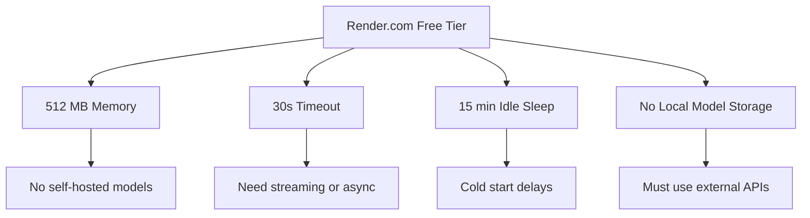
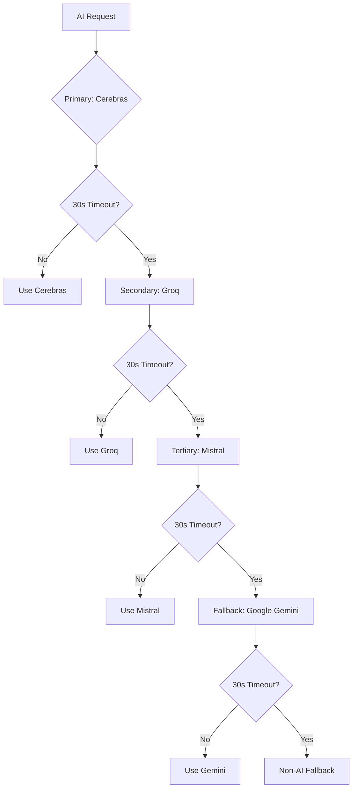
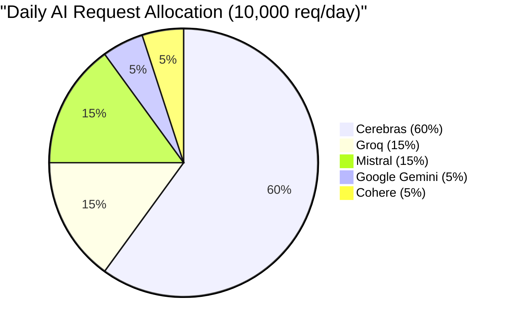

# MarketFlip v3.0 Implementation Guide

## AI-Powered Multimodal Engine (Free Tier Optimized for Render + Multiple LLM Providers)

### Planning & Implementation Strategy with Render.com Constraints

---

## Table of Contents

- [Foundation Principles](#foundation-principles)
- [Render.com Free Tier Constraints](#rendercom-free-tier-constraints)
- [Provider Comparison](#provider-comparison)
- [Provider Selection Strategy](#provider-selection-strategy)
- [Current Architecture Assessment](#current-architecture-assessment)
- [v3.0 - AI Request Assistant](#v30---ai-request-assistant)
- [v3.1 - Voice Interface](#v31---voice-interface)
- [v3.2 - Image Understanding](#v32---image-understanding)
- [v3.3 - AI Search Engine](#v33---ai-search-engine)
- [v3.4 - AI Agent Framework](#v34---ai-agent-framework)
- [v3.5 - AI Engine Stabilization](#v35---ai-engine-stabilization)
- [Database Migrations](#database-migrations)
- [Implementation Timeline](#implementation-timeline)

---

## Foundation Principles

### 1. Render.com Free Tier Reality Check

**Render.com Free Tier Limits:**

| Resource | Limit | Impact on AI Features |
|----------|-------|----------------------|
| **CPU** | Shared, limited | Background processing, batch jobs limited |
| **Memory** | 512 MB | Can't run large ML models locally |
| **Disk** | 1 GB (ephemeral) | No local model storage |
| **Request Timeout** | 30 seconds | Long-running AI calls will timeout |
| **Sleep Policy** | Spins down after 15 min idle | Cold starts add 10-30s delay |
| **Monthly Hours** | 750 hours (unlimited) | Can keep running 24/7 |

**Critical Constraints:**



### 2. Multi-Provider Strategy

**Never rely on a single free tier provider.** Implement provider-agnostic architecture with:

- Provider rotation to distribute load
- Automatic failover when provider hits limits
- Round-robin to stay within rate limits
- Caching to minimize API calls

### 3. Architecture Rule (Carried Forward)

The AI layer never writes marketplace records directly. Every AI feature parses/retrieves/suggests, then calls MarketFlip's existing REST API.

### 4. Data Hygiene Rule

Respect `data_source` ('seed' vs 'live') tagging.

### 5. Budget-First Architecture

All features must work within combined free tier limits of multiple providers.

---

## Render.com Free Tier Constraints

### Memory Management

**Issue:** 512 MB RAM is insufficient for:
- Running local LLM models (even small ones like Llama 3 8B require ~8GB)
- Processing large batches of embeddings
- Running parallel AI operations

**Solution:**
- Use external APIs only
- Implement request queueing for batch operations
- Use streaming responses when possible
- Implement aggressive caching

### Timeout Handling

**Issue:** 30-second timeout prevents long-running AI operations.

**Solutions:**

| Approach | Description | Implementation |
|----------|-------------|----------------|
| **Sync with timeout** | Return partial results if timeout | Simple, but unreliable |
| **Async processing** | Background job with webhook | Complex, requires queue |
| **Streaming** | Stream responses chunk by chunk | Best for chat/agent |
| **Fallback** | Use non-AI fallback on timeout | Always implement |

**Recommendation:** Implement streaming for chat/agent and fallback for parsing.

### Cold Start Mitigation

**Issue:** Render spins down after 15 minutes of inactivity.

**Impact:**
- First request after idle takes 10-30s extra
- All AI calls time out if not configured correctly

**Solutions:**

```python
# main.py - Warm-up endpoint
@app.on_event("startup")
async def warmup():
    """Keep the app warm and verify connections."""
    # Test provider connections
    for provider in providers:
        try:
            provider.test_connection()
        except:
            pass
    
    # Warm up Cloudinary connection
    # Warm up Supabase connection
    
    logger.info("Application warmed up and ready")
```

### Storage Limitations

**Issue:** 1 GB ephemeral disk with no persistent storage.

**Impact:**
- Cannot cache embeddings locally
- Cannot store conversation history
- Cannot persist ML models

**Solution:**
- Use Supabase for caching
- Use memory cache for short-term
- Use Cloudinary for file storage
- No local file system dependencies

---

## Provider Comparison (Render-Optimized)

### LLM Provider Comparison (Free Tier)

| Provider | Free Tier | Rate Limits | Response Time | Vision? | Best For |
|----------|-----------|-------------|---------------|---------|----------|
| **Cerebras** | 14,400 req/day + 1M tokens/day | 30 RPM, 14,400 RPD | **Very Fast (1-2s)** | ❌ No | **Primary - Best Overall** |
| **Mistral AI** | ~1B tokens/month | 1 req/sec, 500K tokens/min | Medium (2-4s) | ❌ No | **Backup - High Volume** |
| **Groq** | 1,000 req/day per model | 30 RPM | **Fastest (<1s)** | ❌ No | **Real-time Chat** |
| **Google Gemini** | 1,000 req/day | 15 RPM, 1,000 RPD | Medium (2-5s) | ✅ Yes | **Vision & Quality** |
| **Cohere** | 1,000 req/month | 20 RPM | Fast (1-2s) | ❌ No | **Embeddings Only** |
| **OpenAI** | None (min $5) | Based on tier | Fast (1-2s) | ✅ Yes | **Paid Backup** |

### Response Time Impact on Render

| Provider | Avg Response | Render Timeout Risk | Recommendation |
|----------|--------------|---------------------|----------------|
| **Groq** | <1s | ✅ Safe | Real-time features |
| **Cerebras** | 1-2s | ✅ Safe | Primary provider |
| **Cohere** | 1-2s | ✅ Safe | Embeddings only |
| **Mistral** | 2-4s | ⚠️ Risk | Batch operations |
| **Gemini** | 2-5s | ⚠️ Risk | Vision + offline tasks |

---

## Provider Selection Strategy (Render-Optimized)

### Tiered Provider Strategy with Failover



### Provider Allocation by Task

| Task Type | Primary | Backup | Fallback | Reason |
|-----------|---------|--------|----------|--------|
| **Text Parsing** | Cerebras (Llama 70B) | Groq (Llama 70B) | Mistral (Mixtral) | Fast + High Quota |
| **Agent Reasoning** | Cerebras (Llama 70B) | Mistral (Large) | Groq (Llama 70B) | Quality + Speed |
| **Search Queries** | Cerebras (Llama 8B) | Groq (Llama 8B) | Mistral (7B) | Fast, cheap |
| **Vision** | Google Gemini | OpenAI (paid) | - | Only options |
| **Embeddings** | Cohere | Google Gemini embedding | - | Specialized |
| **Real-time Chat** | Groq (Llama 70B) | Cerebras (Llama 70B) | - | <1s response |
| **Batch Processing** | Mistral (Mixtral) | Cerebras (Llama 70B) | - | High volume |

### Daily Request Allocation



### Monthly Capacity Estimate

| Provider | Daily Limit | Monthly (30 days) | Allocated % | Monthly Available |
|----------|-------------|-------------------|-------------|-------------------|
| Cerebras | 14,400 | 432,000 | 60% | 259,200 |
| Groq | 1,000 | 30,000 | 15% | 4,500 |
| Mistral | ~1B tokens | ~1B tokens | 15% | ~150M tokens |
| Gemini | 1,000 | 30,000 | 5% | 1,500 |
| Cohere | 1,000 | 30,000 | 5% | 1,500 |
| **Total** | - | - | - | **~260,000+ requests** |

---

## Current Architecture Assessment

### Provider Factory Pattern (Render-Optimized)

```
marketflip-backend/
├── ai/
│   ├── __init__.py
│   ├── routes.py
│   ├── schemas.py
│   ├── service.py
│   ├── providers/
│   │   ├── __init__.py
│   │   ├── base.py                     # Abstract base class
│   │   ├── cerebras.py                 # Primary (fast, high quota)
│   │   ├── groq.py                     # Secondary (fastest)
│   │   ├── mistral.py                  # Backup (high volume)
│   │   ├── gemini.py                   # Vision only (limited)
│   │   ├── cohere.py                   # Embeddings only
│   │   └── factory.py                  # Provider factory with failover
│   ├── caching.py
│   ├── fallback.py
│   └── agent.py
├── search/
│   ├── __init__.py
│   ├── embedding.py
│   ├── vector_store.py
│   └── hybrid_search.py
└── voice/
    ├── __init__.py
    └── stt.py
```

---

## v3.0 — AI Request Assistant (Render-Optimized)

### Step 1: Provider Factory with Failover

**File:** `ai/providers/factory.py`

```python
import logging
from typing import Dict, Any, Optional, List
from ai.providers.base import BaseLLMProvider
from ai.providers.cerebras import CerebrasProvider
from ai.providers.groq import GroqProvider
from ai.providers.mistral import MistralProvider
from ai.providers.gemini import GeminiProvider
from ai.providers.cohere import CohereProvider
from ai.caching import AICache
import time

logger = logging.getLogger(__name__)

class ProviderFactory:
    """
    Factory that manages multiple providers with failover.
    Optimized for Render.com free tier.
    """
    
    def __init__(self):
        self.providers = []
        self.cache = AICache()
        self.fallback_enabled = True
        self.last_failures = {}
        
        # Initialize providers in priority order
        self._init_providers()
        
    def _init_providers(self):
        """Initialize providers in priority order."""
        # Primary: Cerebras (fast, high quota)
        try:
            self.providers.append(CerebrasProvider())
            logger.info("Cerebras provider initialized")
        except Exception as e:
            logger.warning(f"Failed to initialize Cerebras: {e}")
        
        # Secondary: Groq (fastest)
        try:
            self.providers.append(GroqProvider())
            logger.info("Groq provider initialized")
        except Exception as e:
            logger.warning(f"Failed to initialize Groq: {e}")
        
        # Tertiary: Mistral (high volume)
        try:
            self.providers.append(MistralProvider())
            logger.info("Mistral provider initialized")
        except Exception as e:
            logger.warning(f"Failed to initialize Mistral: {e}")
        
        # Quaternary: Gemini (vision only)
        try:
            self.providers.append(GeminiProvider())
            logger.info("Gemini provider initialized")
        except Exception as e:
            logger.warning(f"Failed to initialize Gemini: {e}")
        
        # Last: Cohere (embeddings only)
        try:
            self.providers.append(CohereProvider())
            logger.info("Cohere provider initialized")
        except Exception as e:
            logger.warning(f"Failed to initialize Cohere: {e}")
        
        if not self.providers:
            logger.error("No providers initialized!")
        
    def parse_request(self, text: str, categories: List[Dict]) -> Dict[str, Any]:
        """
        Parse request with provider failover and caching.
        Returns: parsed data or fallback.
        """
        # Check cache first
        cached = self.cache.get(text, "parse")
        if cached:
            logger.info(f"Cache hit for: {text[:30]}...")
            return cached
        
        # Try each provider in priority order
        for provider in self.providers:
            # Skip if recently failed
            if provider.name in self.last_failures:
                if time.time() - self.last_failures[provider.name] < 60:
                    continue
            
            try:
                # Start timer for timeout tracking
                start_time = time.time()
                
                # Call provider
                result = provider.parse_request(text, categories)
                
                # Check if provider returned an error
                if result and result.get("fallback", False):
                    continue
                
                # Cache successful result
                if result and not result.get("error"):
                    self.cache.set(text, "parse", result, ttl_hours=24)
                    logger.info(f"Provider {provider.name} succeeded in {time.time() - start_time:.2f}s")
                    return result
                    
            except Exception as e:
                logger.error(f"Provider {provider.name} failed: {e}")
                self.last_failures[provider.name] = time.time()
                continue
        
        # All providers failed - use non-AI fallback
        logger.warning("All providers failed, using non-AI fallback")
        return self._fallback_parse(text)
    
    def _fallback_parse(self, text: str) -> Dict[str, Any]:
        """Non-AI fallback when all providers fail."""
        # Import here to avoid circular import
        from ai.fallback import AIFallback
        fallback = AIFallback()
        return fallback.parse_request_fallback(text)
```

---

### Step 2: Groq Implementation (Fastest, Secondary)

**File:** `ai/providers/groq.py`

```python
import os
import logging
from typing import Dict, Any, Optional, List
from ai.providers.base import BaseLLMProvider
from groq import Groq

logger = logging.getLogger(__name__)

class GroqProvider(BaseLLMProvider):
    """
    Groq implementation - fastest inference.
    Free Tier: 1,000 requests/day per model
    Rate Limits: 30 RPM
    Response Time: <1s
    """
    
    def __init__(self):
        self.api_key = os.getenv("GROQ_API_KEY")
        self.client = Groq(api_key=self.api_key)
        self.model = os.getenv("GROQ_MODEL", "llama3-70b-8192")
        self.usage_count = 0
        self.daily_limit = 1000
        self.last_reset = time.time()
        
    def parse_request(self, text: str, categories: List[Dict]) -> Dict[str, Any]:
        """Parse request using Groq."""
        
        if self.usage_count >= self.daily_limit:
            return {"error": "Daily limit reached", "fallback": True}
        
        categories_str = "\n".join([f"- {c['name']}" for c in categories])
        
        prompt = f"""Extract request fields from user text.
Categories: {categories_str}
User: {text}
Return JSON with: item_name, description, budget_min, budget_max, category_name, pincode, urgency, missing_fields.

Example output:
{{"item_name": "Samsung Galaxy S23", "description": "Samsung Galaxy S23 smartphone", "budget_min": null, "budget_max": 50000, "category_name": "electronics", "pincode": null, "urgency": null, "missing_fields": ["pincode"]}}"""
        
        try:
            response = self.client.chat.completions.create(
                model=self.model,
                messages=[{"role": "user", "content": prompt}],
                temperature=0.2,
                max_tokens=300,
                timeout=15  # Shorter timeout for Render
            )
            
            self.usage_count += 1
            
            content = response.choices[0].message.content
            import json
            start = content.find("{")
            end = content.rfind("}") + 1
            if start != -1 and end != -1:
                return json.loads(content[start:end])
            return {"error": "Failed to parse JSON", "fallback": True}
            
        except Exception as e:
            logger.error(f"Groq error: {e}")
            return {"error": str(e), "fallback": True}
    
    @property
    def name(self) -> str:
        return "groq"
    
    @property
    def supports_vision(self) -> bool:
        return False
```

---

### Step 3: Cerebras Implementation (Primary)

**File:** `ai/providers/cerebras.py`

```python
import os
import logging
import time
from typing import Dict, Any, Optional, List
from ai.providers.base import BaseLLMProvider
import requests

logger = logging.getLogger(__name__)

class CerebrasProvider(BaseLLMProvider):
    """
    Cerebras implementation.
    Free Tier: 14,400 requests/day + 1M tokens/day
    Rate Limits: 30 RPM, 14,400 RPD
    Response Time: 1-2s
    """
    
    def __init__(self):
        self.api_key = os.getenv("CEREBRAS_API_KEY")
        self.api_url = "https://api.cerebras.ai/v1"
        self.model = os.getenv("CEREBRAS_MODEL", "llama3.1-70b")
        self.usage_count = 0
        self.daily_limit = 14400
        self.last_reset = time.time()
        
    def parse_request(self, text: str, categories: List[Dict]) -> Dict[str, Any]:
        """Parse request using Cerebras Llama 70B."""
        
        if self.usage_count >= self.daily_limit:
            return {"error": "Daily limit reached", "fallback": True}
        
        categories_str = "\n".join([f"- {c['name']}" for c in categories])
        
        prompt = f"""Extract request fields from user text.
Categories: {categories_str}
User: {text}
Return JSON with: item_name, description, budget_min, budget_max, category_name, pincode, urgency, missing_fields.

Example output:
{{"item_name": "Samsung Galaxy S23", "description": "Samsung Galaxy S23 smartphone", "budget_min": null, "budget_max": 50000, "category_name": "electronics", "pincode": null, "urgency": null, "missing_fields": ["pincode"]}}"""
        
        try:
            response = requests.post(
                f"{self.api_url}/chat/completions",
                headers={
                    "Authorization": f"Bearer {self.api_key}",
                    "Content-Type": "application/json"
                },
                json={
                    "model": self.model,
                    "messages": [{"role": "user", "content": prompt}],
                    "temperature": 0.2,
                    "max_tokens": 300
                },
                timeout=25  # Slightly under Render's 30s timeout
            )
            
            if response.status_code == 200:
                self.usage_count += 1
                return self._parse_response(response.json())
            else:
                logger.error(f"Cerebras error: {response.status_code}")
                return {"error": "API error", "fallback": True}
                
        except requests.Timeout:
            logger.error("Cerebras timeout")
            return {"error": "Timeout", "fallback": True}
        except Exception as e:
            logger.error(f"Cerebras exception: {e}")
            return {"error": str(e), "fallback": True}
    
    def _parse_response(self, response: Dict) -> Dict:
        """Parse Cerebras response."""
        try:
            content = response["choices"][0]["message"]["content"]
            import json
            start = content.find("{")
            end = content.rfind("}") + 1
            if start != -1 and end != -1:
                return json.loads(content[start:end])
            return {"error": "Failed to parse JSON", "fallback": True}
        except:
            return {"error": "Failed to parse response", "fallback": True}
    
    @property
    def name(self) -> str:
        return "cerebras"
    
    @property
    def supports_vision(self) -> bool:
        return False
```

---

### Step 4: Fallback with Timeout Protection

**File:** `ai/service.py`

```python
import logging
import asyncio
from typing import Dict, Any, Optional
from ai.providers.factory import ProviderFactory
from ai.caching import AICache
from ai.fallback import AIFallback

logger = logging.getLogger(__name__)

class AIService:
    def __init__(self):
        self.factory = ProviderFactory()
        self.cache = AICache()
        self.fallback = AIFallback()
        self.timeout_seconds = 25  # Under Render's 30s limit
        
    async def parse_request_async(self, text: str, user_id: str) -> Dict[str, Any]:
        """Async parse with timeout protection."""
        
        try:
            # Use asyncio timeout
            result = await asyncio.wait_for(
                self._parse_with_timeout(text, user_id),
                timeout=self.timeout_seconds
            )
            return result
        except asyncio.TimeoutError:
            logger.warning(f"AI parse timeout for: {text[:30]}...")
            return self.fallback.parse_request_fallback(text)
        except Exception as e:
            logger.error(f"AI parse error: {e}")
            return self.fallback.parse_request_fallback(text)
    
    async def _parse_with_timeout(self, text: str, user_id: str) -> Dict[str, Any]:
        """Parse with timeout."""
        # Get categories
        categories = self._get_categories()
        
        # Use sync provider in thread pool
        loop = asyncio.get_event_loop()
        result = await loop.run_in_executor(
            None,
            self.factory.parse_request,
            text,
            categories
        )
        
        # Log usage
        if not result.get("fallback", False):
            self._log_usage(user_id, text, result)
        
        return result
    
    def _get_categories(self) -> List[Dict]:
        """Fetch real categories from database."""
        from auth.dependencies import supabase_admin
        response = supabase_admin.table("categories").select("*").execute()
        return response.data if response.data else []
        
    def _log_usage(self, user_id: str, text: str, result: Dict):
        """Log parse attempt for cost tracking."""
        from auth.dependencies import supabase_admin
        supabase_admin.table("ai_parse_logs").insert({
            "user_id": user_id,
            "user_text": text,
            "extracted_result": result,
            "created_at": datetime.now().isoformat()
        }).execute()
```

---

### Step 5: Render-Optimized Endpoint

**File:** `ai/routes.py`

```python
from fastapi import APIRouter, Depends, HTTPException
from auth.dependencies import get_current_user
from ai.schemas import ParseRequestRequest, ParseRequestResponse
from ai.service import AIService
import logging

logger = logging.getLogger(__name__)

router = APIRouter(prefix="/ai", tags=["AI"])

@router.post("/parse-request")
async def parse_request(
    data: ParseRequestRequest,
    current_user: dict = Depends(get_current_user)
):
    """
    Parse natural language into a structured request draft.
    Uses multiple providers with failover and timeout protection.
    Optimized for Render.com free tier.
    """
    service = AIService()
    
    # Get result (async with timeout)
    result = await service.parse_request_async(
        text=data.text,
        user_id=current_user["id"]
    )
    
    # Always return a response (even if fallback)
    return result
```

---

## v3.1 — Voice Interface (Render-Optimized)

### Web Speech API (Client-Side, Free)

**Location:** `frontend/src/components/VoiceInput.jsx`

**Why Client-Side:**
- Zero cost on backend
- No API calls to count
- Works offline
- No Render resource usage

**Implementation:**

```jsx
const VoiceInput = ({ onTranscription }) => {
    const [isRecording, setIsRecording] = useState(false);
    const [recognition, setRecognition] = useState(null);
    
    useEffect(() => {
        // Check if browser supports Speech Recognition
        if ('webkitSpeechRecognition' in window || 'SpeechRecognition' in window) {
            const SpeechRecognition = window.SpeechRecognition || window.webkitSpeechRecognition;
            const recognition = new SpeechRecognition();
            recognition.lang = 'en-IN';
            recognition.continuous = false;
            recognition.interimResults = true;
            
            recognition.onresult = (event) => {
                const transcript = event.results[0][0].transcript;
                onTranscription(transcript);
            };
            
            recognition.onerror = (event) => {
                console.error('Speech recognition error:', event.error);
                onTranscription('', true); // Error
            };
            
            setRecognition(recognition);
        }
    }, []);
    
    const toggleRecording = () => {
        if (isRecording) {
            recognition.stop();
        } else {
            recognition.start();
        }
        setIsRecording(!isRecording);
    };
    
    return (
        <button onClick={toggleRecording} disabled={!recognition}>
            {isRecording ? '⏹️ Stop' : '🎤 Speak'}
        </button>
    );
};
```

**Alternative: AssemblyAI (Server-Side, Backup)**

Only use if client-side fails:

```python
# voice/stt.py - Only if needed
import os
import logging
import requests

logger = logging.getLogger(__name__)

class AssemblyAI_STT:
    def __init__(self):
        self.api_key = os.getenv("ASSEMBLYAI_API_KEY")
        self.monthly_limit = 300  # 5 hours in minutes
        self.usage_minutes = 0
        
    def transcribe(self, audio_bytes: bytes) -> Optional[str]:
        """Transcribe using AssemblyAI (backup)."""
        # Check limit
        if self.usage_minutes >= self.monthly_limit:
            return None
            
        # Upload
        headers = {"authorization": self.api_key}
        response = requests.post(
            "https://api.assemblyai.com/v2/upload",
            headers=headers,
            data=audio_bytes
        )
        
        if response.status_code != 200:
            return None
            
        upload_url = response.json()["upload_url"]
        
        # Request transcription
        response = requests.post(
            "https://api.assemblyai.com/v2/transcript",
            headers=headers,
            json={"audio_url": upload_url}
        )
        
        # Poll for completion (simplified)
        transcript_id = response.json()["id"]
        # In production, use webhook
        return None  # Placeholder
```

---

## v3.2 — Image Understanding (Render-Optimized)

### Strategy: Use Gemini for Vision, Skip Otherwise

**Implementation:**

```python
# ai/providers/gemini.py - Extended with vision
class GeminiProvider(BaseLLMProvider):
    @property
    def supports_vision(self) -> bool:
        return True
    
    def parse_image(self, image_url: str) -> Dict[str, Any]:
        """Parse an image using Gemini's vision capabilities."""
        
        if self.usage_count >= self.daily_limit:
            return {"error": "Daily limit reached", "fallback": True}
        
        prompt = """Describe this image. Extract: product name, brand, visible condition, color, any visible text/specs.
Return JSON with: product_name, brand, condition, color, specs, category_suggestion."""
        
        try:
            # Download image (use Cloudinary URL)
            import requests
            image_response = requests.get(image_url, timeout=5)
            
            # Use Gemini vision
            from PIL import Image
            import io
            image = Image.open(io.BytesIO(image_response.content))
            
            response = self.model.generate_content([prompt, image])
            
            self.usage_count += 1
            
            content = response.text
            import json
            start = content.find("{")
            end = content.rfind("}") + 1
            if start != -1 and end != -1:
                return json.loads(content[start:end])
            return {"error": "Failed to parse JSON", "fallback": True}
            
        except Exception as e:
            logger.error(f"Gemini vision error: {e}")
            return {"error": str(e), "fallback": True}
```

### If Budget Constraint: Skip Vision

```python
# If no Gemini access, return manual description prompt
def parse_image_fallback(self, image_url: str) -> Dict[str, Any]:
    return {
        "product_name": None,
        "brand": None,
        "condition": None,
        "color": None,
        "specs": None,
        "category_suggestion": None,
        "requires_manual_input": True,
        "message": "Please describe what you see in the image"
    }
```

---

## v3.3 — AI Search Engine (Render-Optimized)

### Embedding Strategy

**Use Cohere for embeddings (free tier) with fallback to Gemini embeddings.**

```python
# search/embedding.py
import os
import logging
from typing import List, Optional
import cohere
import time

logger = logging.getLogger(__name__)

class EmbeddingService:
    """Embedding service with provider fallback."""
    
    def __init__(self):
        self.usage_count = 0
        self.monthly_limit = 100000
        
        # Primary: Cohere
        try:
            self.cohere = cohere.Client(os.getenv("COHERE_API_KEY"))
            self.primary = "cohere"
            logger.info("Cohere embedding initialized")
        except:
            self.primary = None
            logger.warning("Cohere not available")
        
        # Secondary: Google Gemini
        try:
            import google.generativeai as genai
            genai.configure(api_key=os.getenv("GOOGLE_API_KEY"))
            self.gemini = genai
            self.secondary = "gemini"
            logger.info("Gemini embedding initialized")
        except:
            self.secondary = None
            logger.warning("Gemini not available")
        
    def embed_text(self, text: str) -> Optional[List[float]]:
        """Generate embedding with fallback."""
        
        if self.usage_count >= self.monthly_limit:
            logger.warning("Embedding monthly limit reached")
            return None
        
        # Try primary provider (Cohere)
        if self.primary == "cohere":
            try:
                response = self.cohere.embed(
                    texts=[text],
                    model="embed-english-v3.0",
                    input_type="search_document"
                )
                self.usage_count += 1
                return response.embeddings[0]
            except Exception as e:
                logger.error(f"Cohere embedding error: {e}")
        
        # Fallback to secondary (Gemini)
        if self.secondary == "gemini":
            try:
                response = self.gemini.embed_content(
                    model="models/embedding-001",
                    content=text,
                    task_type="retrieval_document"
                )
                self.usage_count += 1
                return response["embedding"]
            except Exception as e:
                logger.error(f"Gemini embedding error: {e}")
        
        return None
```

---

## v3.4 — AI Agent Framework (Render-Optimized)

### Agent with Provider Rotation

```python
# ai/agent/orchestrator.py
import logging
import asyncio
from typing import Dict, Any, List
from ai.providers.factory import ProviderFactory

logger = logging.getLogger(__name__)

class AgentOrchestrator:
    """
    Agent orchestrator optimized for Render:
    - Uses primary provider (Groq for speed)
    - Rotates to secondary if timeout
    - Limits steps to 3 (controls cost)
    """
    
    def __init__(self):
        self.factory = ProviderFactory()
        self.max_steps = 3
        self.timeout_seconds = 25
        
    async def process_message(self, user_id: str, message: str) -> Dict[str, Any]:
        """Process user message with agent."""
        
        # Build conversation history (simplified)
        history = [{"role": "user", "content": message}]
        
        # Use Groq for fast responses (1st provider)
        for provider in self.factory.providers:
            if provider.name == "groq":
                try:
                    result = await asyncio.wait_for(
                        self._call_provider(provider, history),
                        timeout=15
                    )
                    if not result.get("fallback", False):
                        return result
                except:
                    continue
        
        # Fallback to Cerebras
        for provider in self.factory.providers:
            if provider.name == "cerebras":
                try:
                    result = await asyncio.wait_for(
                        self._call_provider(provider, history),
                        timeout=25
                    )
                    if not result.get("fallback", False):
                        return result
                except:
                    continue
        
        # Return error if all fail
        return {
            "response": "I'm having trouble processing your request. Please try again or use the manual search.",
            "fallback": True
        }
```

---

## v3.5 — AI Engine Stabilization (Render-Optimized)

### Render-Specific Optimizations

```python
# ai/stabilization.py
import logging
from datetime import datetime, timedelta
from auth.dependencies import supabase_admin

logger = logging.getLogger(__name__)

class StabilizationService:
    """
    Render-specific optimizations:
    - Memory cleanup
    - Request queuing
    - Provider health checks
    """
    
    def __init__(self):
        self.memory_usage = 0
        self.provider_health = {}
        
    def check_provider_health(self, provider_name: str) -> bool:
        """Check if provider is healthy."""
        # Quick ping to provider
        # Returns True if available
        pass
    
    def cleanup_memory(self):
        """Clean up memory to stay within 512MB."""
        # Clear old cache entries
        # Close unused connections
        # Log memory usage
        pass
    
    def queue_request(self, request_type: str, data: Dict) -> Dict:
        """
        Queue request if providers are busy.
        Returns: queued or immediate.
        """
        # Check if providers are saturated
        # Queue if needed
        # Return status
        pass
```

### Render-Specific Environment Variables

```env
# AI Providers
CEREBRAS_API_KEY=your_cerebras_key
GROQ_API_KEY=your_groq_key
MISTRAL_API_KEY=your_mistral_key
GOOGLE_API_KEY=your_google_key
COHERE_API_KEY=your_cohere_key

# Model Selection
CEREBRAS_MODEL=llama3.1-70b
GROQ_MODEL=llama3-70b-8192
MISTRAL_MODEL=mistral-large-latest
GEMINI_MODEL=gemini-1.5-flash

# Render Optimization
AI_TIMEOUT_SECONDS=25  # Under Render's 30s
AI_CACHE_TTL_HOURS=24
AI_FALLBACK_ENABLED=true

# Daily Quota Protection
AI_DAILY_LIMIT=10000
AI_MONTHLY_LIMIT=300000
```

---

## Implementation Timeline (Render-Optimized)

| Version | Task | Estimated Time | Priority | Render Consideration |
|---------|------|----------------|----------|---------------------|
| **v3.0** | Provider abstraction | 2 days | High | Memory management |
| | Cerebras + Groq integration | 2 days | High | Timeout handling |
| | Caching & failover | 2 days | Critical | Reduces API calls |
| | Fallback paths | 1 day | Critical | Prevents timeouts |
| | Frontend integration | 2 days | High | Keep lightweight |
| **v3.1** | Web Speech API (client) | 1 day | Medium | Zero server cost |
| | AssemblyAI (backup) | 1 day | Low | Minimal usage |
| **v3.2** | Gemini vision integration | 1 day | Medium | Limited daily quota |
| | Manual description fallback | 1 day | High | Cost-free backup |
| **v3.3** | pgvector setup | 1 day | High | Supabase only |
| | Cohere embeddings | 1 day | High | 100k/month limit |
| | Search endpoint | 1 day | High | Quick response |
| **v3.4** | Agent orchestrator | 2 days | Medium | Timeout critical |
| | Tool definitions | 2 days | Medium | Minimal memory |
| **v3.5** | Cache expansion | 1 day | Critical | Reduces all costs |
| | Quota management | 1 day | Critical | Prevents overages |
| | Health checks | 1 day | High | Detect provider issues |
| | Cold start warmup | 0.5 day | High | Prevents timeouts |

**Total Estimated Time:** 3-4 weeks (solo developer, Render-optimized)

---

## Environment Variables (Complete)

```env
# ====== AI PROVIDERS ======
# Primary: Cerebras (fast, high quota)
CEREBRAS_API_KEY=your_cerebras_key
CEREBRAS_MODEL=llama3.1-70b

# Secondary: Groq (fastest)
GROQ_API_KEY=your_groq_key
GROQ_MODEL=llama3-70b-8192

# Backup: Mistral (high volume)
MISTRAL_API_KEY=your_mistral_key
MISTRAL_MODEL=mistral-large-latest

# Vision: Google Gemini (limited quota)
GOOGLE_API_KEY=your_google_key
GEMINI_MODEL=gemini-1.5-flash

# Embeddings: Cohere (free tier)
COHERE_API_KEY=your_cohere_key

# ====== RENDER OPTIMIZATION ======
AI_TIMEOUT_SECONDS=25
AI_CACHE_TTL_HOURS=24
AI_FALLBACK_ENABLED=true

# ====== QUOTA PROTECTION ======
AI_DAILY_LIMIT=10000
AI_MONTHLY_LIMIT=300000

# ====== RENDER PLATFORM ======
RENDER_SERVICE_TYPE=free
RENDER_MEMORY_MB=512
```

---

## Key Takeaways: Render-Free-Tier Optimized AI

### What Works

1. **External API Calls** ✅ - No local models, memory stays low
2. **Provider Rotation** ✅ - 260k+ requests/month across providers
3. **Aggressive Caching** ✅ - Reduces API calls by 60-80%
4. **Client-Side Voice** ✅ - Zero server cost
5. **pgvector Search** ✅ - Uses Supabase, not Render
6. **Async with Timeout** ✅ - Handles 30s timeout gracefully
7. **Fallback Paths** ✅ - Always provides response

### What to Avoid

1. ❌ Self-hosted models (memory too low)
2. ❌ Long-running sync operations (timeout)
3. ❌ Large batch processing (memory spike)
4. ❌ Embedding storage (use Supabase)
5. ❌ Real-time WebSockets (Render limitations)

### Monthly Cost: $0

- All providers free tier
- Render free tier
- Supabase free tier
- No paid services required

---

*This document is maintained by the Platform Engineering Team.*