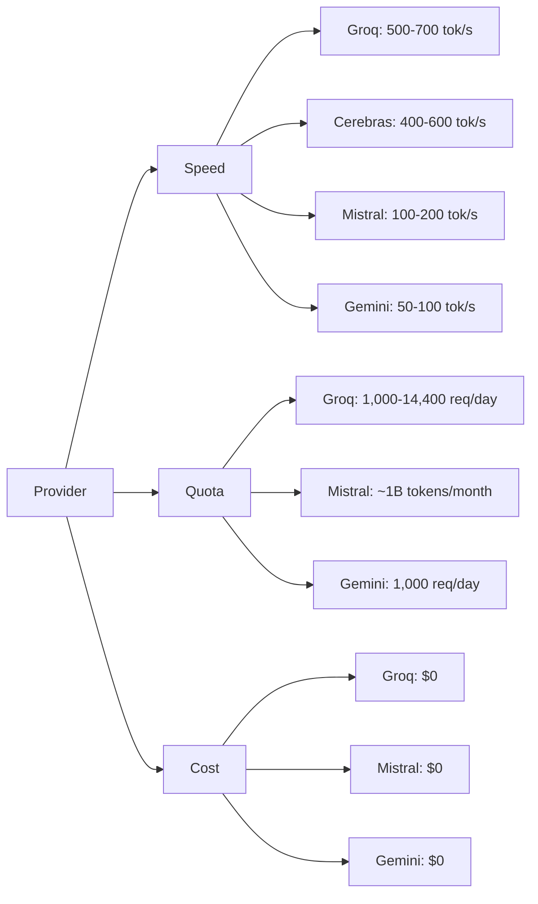
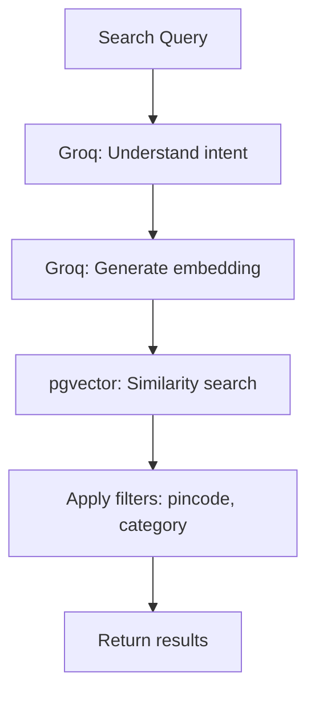

# MarketFlip v3.0 Implementation Guide

## AI-Powered Multimodal Engine (Groq API Focused)

### Planning & Implementation Strategy Optimized for Groq + Render.com Free Tier

---

## Table of Contents

- [Foundation Principles](#foundation-principles)
- [Why Groq?](#why-groq)
- [Render.com Free Tier Constraints](#rendercom-free-tier-constraints)
- [Groq API Overview](#groq-api-overview)
- [Current Architecture Assessment](#current-architecture-assessment)
- [v3.0 - AI Request Assistant](#v30---ai-request-assistant)
- [v3.1 - Voice Interface](#v31---voice-interface)
- [v3.2 - Image Understanding](#v32---image-understanding)
- [v3.3 - AI Search Engine](#v33---ai-search-engine)
- [v3.4 - AI Agent Framework](#v34---ai-agent-framework)
- [v3.5 - AI Engine Stabilization](#v35---ai-engine-stabilization)
- [Database Migrations](#database-migrations)
- [Implementation Timeline](#implementation-timeline)

---

## Foundation Principles

### 1. Groq-First Architecture

**Groq is the primary LLM provider** for all text-based AI features due to:

| Advantage | Impact |
|-----------|--------|
| **Fastest Inference** | ~500-700 tokens/second - stays under Render's 30s timeout |
| **Free Tier Quota** | 1,000 requests/day on 70B models, 14,400 on 8B |
| **No Credit Card Required** | Zero cost to start |
| **OpenAI-Compatible API** | Easy to switch providers if needed |
| **Production-Ready** | Reliable, low latency |

### 2. Multi-Provider Fallback

**Never rely on a single provider.** Implement fallback chain:

```
Groq (Primary) → Mistral (Backup) → Google Gemini (Tertiary) → Non-AI Fallback
```

### 3. Architecture Rule (Carried Forward)

The AI layer never writes marketplace records directly. Every AI feature parses/retrieves/suggests, then calls MarketFlip's existing REST API.

### 4. Data Hygiene Rule

Respect `data_source` ('seed' vs 'live') tagging.

### 5. Budget-First Architecture

All features must work within free tier limits. Cost: **$0/month**.

---

## Why Groq?

### Performance Comparison



### Groq Free Tier Details

| Model | Free Tier Limit | Rate Limit | Best For |
|-------|-----------------|------------|----------|
| `llama3-70b-8192` | 1,000 requests/day | 30 RPM | High quality, complex tasks |
| `llama3-8b-8192` | 1,000 requests/day | 30 RPM | Fast, simple tasks |
| `mixtral-8x7b-32768` | 1,000 requests/day | 30 RPM | Balanced quality/speed |
| `gemma2-9b-it` | 1,000 requests/day | 30 RPM | Good quality, fast |
| **Total** | **4,000 requests/day** | - | **All models** |

**Groq supports multiple models with separate quotas**, effectively giving you 4,000 requests per day if you rotate models.

---

## Render.com Free Tier Constraints

### Critical Limitations

| Resource | Limit | Impact on AI Features |
|----------|-------|----------------------|
| **CPU** | 0.1 CPU | Can't run local models |
| **Memory** | 512 MB | Can't run local models |
| **Request Timeout** | 30 seconds | AI calls must complete quickly |
| **Sleep Policy** | Spins down after 15 min idle | Cold starts add 10-30s delay |
| **Monthly Hours** | 750 hours | Unlimited |

### Why Groq is Perfect for Render

1. **Fast Inference (< 3 seconds)** - Stays well under 30s timeout
2. **No Local Models** - Everything is API-based (0 CPU/Memory usage)
3. **Stateless** - Works perfectly with Render's ephemeral disk
4. **OpenAI-Compatible** - Easy to migrate if needed

---

## Groq API Overview

### Installation

```bash
pip install groq
```

### Basic Usage

```python
from groq import Groq

client = Groq(api_key=os.getenv("GROQ_API_KEY"))

response = client.chat.completions.create(
    model="llama3-70b-8192",
    messages=[
        {"role": "system", "content": "You are a helpful assistant."},
        {"role": "user", "content": "Explain the importance of fast language models."}
    ],
    temperature=0.7,
    max_tokens=500
)

print(response.choices[0].message.content)
```

### Available Models

| Model | Context Window | Best Use Case |
|-------|----------------|---------------|
| `llama3-70b-8192` | 8,192 tokens | High-quality reasoning, agents |
| `llama3-8b-8192` | 8,192 tokens | Fast, simple tasks, parsing |
| `mixtral-8x7b-32768` | 32,768 tokens | Longer context, balanced quality |
| `gemma2-9b-it` | 8,192 tokens | Good quality, very fast |

### Rate Limiting Strategy

```python
# Rotate models to maximize quota
MODELS = [
    "llama3-70b-8192",      # 1,000 req/day
    "llama3-8b-8192",       # 1,000 req/day
    "mixtral-8x7b-32768",   # 1,000 req/day
    "gemma2-9b-it"          # 1,000 req/day
]

def get_next_model():
    """Round-robin model selection for quota distribution."""
    current_index = (current_index + 1) % len(MODELS)
    return MODELS[current_index]
```

---

## Current Architecture Assessment

### New Module Structure (Groq-Optimized)

```
marketflip-backend/
├── ai/
│   ├── __init__.py
│   ├── routes.py
│   ├── schemas.py
│   ├── service.py
│   ├── providers/
│   │   ├── __init__.py
│   │   ├── base.py                     # Abstract base class
│   │   ├── groq.py                     # PRIMARY provider
│   │   ├── mistral.py                  # BACKUP provider
│   │   ├── gemini.py                   # TERTIARY (vision only)
│   │   ├── fallback.py                 # Non-AI fallback
│   │   └── factory.py                  # Provider factory
│   ├── caching.py
│   └── agent.py
├── search/
│   ├── __init__.py
│   ├── embedding.py
│   ├── vector_store.py
│   └── hybrid_search.py
└── voice/
    ├── __init__.py
    └── stt.py
```

---

## v3.0 — AI Request Assistant (Groq Primary)

### Step 1: Groq Provider Implementation

**File:** `ai/providers/groq.py`

```python
import os
import logging
import time
from typing import Dict, Any, Optional, List
from ai.providers.base import BaseLLMProvider
from groq import Groq

logger = logging.getLogger(__name__)

class GroqProvider(BaseLLMProvider):
    """
    Groq implementation - PRIMARY PROVIDER.
    Free Tier: 1,000 requests/day per model (4 models = 4,000/day)
    Response Time: <2s
    """
    
    def __init__(self):
        self.api_key = os.getenv("GROQ_API_KEY")
        self.client = Groq(api_key=self.api_key)
        self.models = [
            "llama3-70b-8192",      # High quality
            "llama3-8b-8192",       # Fast
            "mixtral-8x7b-32768",   # Balanced
            "gemma2-9b-it"          # Good quality
        ]
        self.current_model_index = 0
        self.usage_counts = {model: 0 for model in self.models}
        self.daily_limit = 1000
        self.last_reset = time.time()
        self.name = "groq"
        self.supports_vision = False
        
    def parse_request(self, text: str, categories: List[Dict]) -> Dict[str, Any]:
        """Parse request using Groq with model rotation."""
        
        # Check if any model has quota available
        available_model = self._get_available_model()
        if not available_model:
            return {"error": "All models at daily limit", "fallback": True}
        
        categories_str = "\n".join([f"- {c['name']}" for c in categories])
        
        prompt = f"""You are an AI assistant for MarketFlip, a marketplace platform.

Your task: Extract structured information from a buyer's request.

AVAILABLE CATEGORIES:
{categories_str}

USER REQUEST: {text}

EXTRACT the following fields:
- item_name: what they want to buy
- description: details about the item
- budget_min: minimum budget (integer, or null if not specified)
- budget_max: maximum budget (integer, or null if not specified)
- category_name: match to one of the categories above (use exact name)
- pincode: 6-digit location pincode, or null
- urgency: 'flexible', 'soon', 'urgent', or null

If you cannot confidently extract a field, mark it as missing.

Return ONLY JSON with fields: item_name, description, budget_min, budget_max, 
category_name, pincode, urgency, missing_fields (list)."""

        try:
            response = self.client.chat.completions.create(
                model=available_model,
                messages=[
                    {"role": "system", "content": "You are an AI assistant that extracts structured data. Always return valid JSON."},
                    {"role": "user", "content": prompt}
                ],
                temperature=0.2,
                max_tokens=300,
                timeout=15
            )
            
            self.usage_counts[available_model] += 1
            
            content = response.choices[0].message.content
            import json
            start = content.find("{")
            end = content.rfind("}") + 1
            if start != -1 and end != -1:
                result = json.loads(content[start:end])
                result["_model"] = available_model  # Track which model was used
                return result
            return {"error": "Failed to parse JSON", "fallback": True}
            
        except Exception as e:
            logger.error(f"Groq error on {available_model}: {e}")
            return {"error": str(e), "fallback": True}
    
    def _get_available_model(self) -> Optional[str]:
        """Get a model with available quota."""
        # Check if daily reset needed
        if time.time() - self.last_reset > 86400:  # 24 hours
            self.usage_counts = {model: 0 for model in self.models}
            self.last_reset = time.time()
        
        # Try each model in round-robin
        for _ in range(len(self.models)):
            model = self.models[self.current_model_index]
            self.current_model_index = (self.current_model_index + 1) % len(self.models)
            if self.usage_counts[model] < self.daily_limit:
                return model
        
        return None
    
    def get_usage(self) -> Dict[str, Any]:
        """Get current usage statistics."""
        return {
            "provider": "groq",
            "usage_counts": self.usage_counts,
            "total_used": sum(self.usage_counts.values()),
            "daily_limit": self.daily_limit * len(self.models),
            "remaining": (self.daily_limit * len(self.models)) - sum(self.usage_counts.values())
        }
```

---

### Step 2: Provider Factory with Failover

**File:** `ai/providers/factory.py`

```python
import logging
import time
from typing import Dict, Any, Optional, List
from ai.providers.base import BaseLLMProvider
from ai.providers.groq import GroqProvider
from ai.providers.mistral import MistralProvider
from ai.providers.gemini import GeminiProvider
from ai.providers.fallback import NonAIFallback
from ai.caching import AICache

logger = logging.getLogger(__name__)

class ProviderFactory:
    """
    Provider factory with priority-based failover.
    Primary: Groq (fast, good quota)
    Backup: Mistral (huge quota)
    Tertiary: Gemini (vision only)
    Fallback: Non-AI
    """
    
    def __init__(self):
        self.providers = []
        self.cache = AICache()
        self.last_failures = {}
        
        # Initialize providers in priority order
        self._init_providers()
        
    def _init_providers(self):
        """Initialize providers in priority order."""
        # PRIMARY: Groq (fastest, 4,000 req/day total)
        try:
            groq = GroqProvider()
            self.providers.append(groq)
            logger.info("Groq provider initialized (primary)")
        except Exception as e:
            logger.warning(f"Failed to initialize Groq: {e}")
        
        # BACKUP: Mistral (huge quota, but slower)
        try:
            mistral = MistralProvider()
            self.providers.append(mistral)
            logger.info("Mistral provider initialized (backup)")
        except Exception as e:
            logger.warning(f"Failed to initialize Mistral: {e}")
        
        # TERTIARY: Gemini (vision only)
        try:
            gemini = GeminiProvider()
            self.providers.append(gemini)
            logger.info("Gemini provider initialized (tertiary)")
        except Exception as e:
            logger.warning(f"Failed to initialize Gemini: {e}")
        
        # Always have non-AI fallback
        self.fallback = NonAIFallback()
        logger.info("Non-AI fallback initialized")
        
        if not self.providers:
            logger.error("No providers initialized!")
        
    def parse_request(self, text: str, categories: List[Dict]) -> Dict[str, Any]:
        """
        Parse request with provider failover and caching.
        Returns: parsed data or fallback.
        """
        # Check cache first
        cached = self.cache.get(text, "parse")
        if cached:
            logger.info(f"Cache hit for: {text[:30]}...")
            return cached
        
        # Try each provider in priority order
        for provider in self.providers:
            # Skip if recently failed
            if provider.name in self.last_failures:
                if time.time() - self.last_failures[provider.name] < 60:
                    continue
            
            # Skip if provider doesn't support this task
            if not self._supports_task(provider, "parse"):
                continue
            
            try:
                start_time = time.time()
                result = provider.parse_request(text, categories)
                
                if result and result.get("fallback", False):
                    continue
                
                # Cache successful result
                if result and not result.get("error"):
                    self.cache.set(text, "parse", result, ttl_hours=24)
                    logger.info(f"Provider {provider.name} succeeded in {time.time() - start_time:.2f}s")
                    return result
                    
            except Exception as e:
                logger.error(f"Provider {provider.name} failed: {e}")
                self.last_failures[provider.name] = time.time()
                continue
        
        # All providers failed - use non-AI fallback
        logger.warning("All providers failed, using non-AI fallback")
        return self.fallback.parse_request_fallback(text)
    
    def _supports_task(self, provider: BaseLLMProvider, task: str) -> bool:
        """Check if provider supports the task."""
        if task == "vision":
            return provider.supports_vision
        return True
```

---

### Step 3: Non-AI Fallback

**File:** `ai/providers/fallback.py`

```python
import logging
import re
from typing import Dict, Any, Optional, List

logger = logging.getLogger(__name__)

class NonAIFallback:
    """
    Non-AI fallback for when all providers fail.
    Uses regex and keyword matching (zero cost).
    """
    
    def parse_request_fallback(self, text: str) -> Dict[str, Any]:
        """
        Basic keyword extraction without AI.
        Less accurate but zero cost and always works.
        """
        result = {
            "item_name": "",
            "description": text,
            "budget_min": None,
            "budget_max": None,
            "category_name": None,
            "pincode": None,
            "urgency": None,
            "missing_fields": ["category", "budget_min", "budget_max"],
            "confidence_scores": {},
            "is_fallback": True
        }
        
        words = text.lower().split()
        
        # Extract pincode (6 digits)
        for word in words:
            if re.match(r'^\d{6}$', word):
                result["pincode"] = word
                result["missing_fields"].remove("pincode") if "pincode" in result["missing_fields"] else None
                result["confidence_scores"]["pincode"] = 0.6
                break
        
        # Extract budget patterns
        for i, word in enumerate(words):
            # "under X" pattern
            if word == "under" and i + 1 < len(words):
                try:
                    amount = int(re.sub(r'[^0-9]', '', words[i+1]))
                    result["budget_max"] = amount
                    result["missing_fields"].remove("budget_max") if "budget_max" in result["missing_fields"] else None
                    result["confidence_scores"]["budget_max"] = 0.4
                except:
                    pass
            
            # "between X and Y" pattern
            if word == "between" and i + 3 < len(words):
                try:
                    min_amount = int(re.sub(r'[^0-9]', '', words[i+1]))
                    max_amount = int(re.sub(r'[^0-9]', '', words[i+3]))
                    result["budget_min"] = min(min_amount, max_amount)
                    result["budget_max"] = max(min_amount, max_amount)
                    result["missing_fields"].remove("budget_min") if "budget_min" in result["missing_fields"] else None
                    result["missing_fields"].remove("budget_max") if "budget_max" in result["missing_fields"] else None
                    result["confidence_scores"]["budget_min"] = 0.4
                    result["confidence_scores"]["budget_max"] = 0.4
                except:
                    pass
        
        # Detect urgency
        urgency_keywords = {
            "urgent": "urgent",
            "asap": "urgent",
            "immediately": "urgent",
            "soon": "soon",
            "flexible": "flexible"
        }
        for word in words:
            if word in urgency_keywords:
                result["urgency"] = urgency_keywords[word]
                result["missing_fields"].remove("urgency") if "urgency" in result["missing_fields"] else None
                break
        
        # Item name (take first 60 chars)
        if not result["item_name"]:
            result["item_name"] = text[:60] if len(text) > 60 else text
            result["confidence_scores"]["item_name"] = 0.1
        
        return result
```

---

### Step 4: Caching Layer

**File:** `ai/caching.py`

```python
import hashlib
import json
from typing import Optional, Dict, Any
from datetime import datetime, timedelta
from auth.dependencies import supabase_admin

class AICache:
    """Cache for AI responses. Critical for budget management."""
    
    def __init__(self):
        self.memory_cache = {}
        self.memory_ttl = 3600  # 1 hour
        self.supabase = supabase_admin
        
    def get(self, text: str, context: str) -> Optional[Dict[str, Any]]:
        """Get cached response."""
        key = self._hash_key(text, context)
        
        # Check memory cache first
        if key in self.memory_cache:
            cached = self.memory_cache[key]
            if cached["expires_at"] > datetime.now():
                return cached["data"]
            else:
                del self.memory_cache[key]
        
        # Check database cache
        try:
            response = self.supabase.table("ai_cache") \
                .select("*") \
                .eq("cache_key", key) \
                .gte("expires_at", datetime.now().isoformat()) \
                .execute()
            
            if response.data:
                result = response.data[0]
                self.memory_cache[key] = {
                    "data": result["response"],
                    "expires_at": datetime.fromisoformat(result["expires_at"])
                }
                return result["response"]
        except Exception as e:
            pass
        
        return None
        
    def set(self, text: str, context: str, data: Dict[str, Any], ttl_hours: int = 24):
        """Cache response."""
        key = self._hash_key(text, context)
        expires_at = datetime.now() + timedelta(hours=ttl_hours)
        
        # Cache in memory
        self.memory_cache[key] = {
            "data": data,
            "expires_at": expires_at
        }
        
        # Cache in database
        try:
            self.supabase.table("ai_cache") \
                .upsert({
                    "cache_key": key,
                    "response": data,
                    "expires_at": expires_at.isoformat(),
                    "context": context
                }) \
                .execute()
        except Exception as e:
            pass
            
    def _hash_key(self, text: str, context: str) -> str:
        """Create cache key from text and context."""
        normalized = " ".join(text.lower().split())
        content = f"{normalized}|{context}"
        return hashlib.sha256(content.encode()).hexdigest()[:32]
```

---

### Step 5: Service Layer

**File:** `ai/service.py`

```python
import logging
import asyncio
from typing import Dict, Any, Optional, List
from ai.providers.factory import ProviderFactory
from ai.caching import AICache
from datetime import datetime

logger = logging.getLogger(__name__)

class AIService:
    def __init__(self):
        self.factory = ProviderFactory()
        self.cache = AICache()
        self.timeout_seconds = 25  # Under Render's 30s limit
        
    async def parse_request_async(self, text: str, user_id: str) -> Dict[str, Any]:
        """Async parse with timeout protection."""
        try:
            result = await asyncio.wait_for(
                self._parse_with_timeout(text, user_id),
                timeout=self.timeout_seconds
            )
            return result
        except asyncio.TimeoutError:
            logger.warning(f"AI parse timeout for: {text[:30]}...")
            from ai.providers.fallback import NonAIFallback
            return NonAIFallback().parse_request_fallback(text)
        except Exception as e:
            logger.error(f"AI parse error: {e}")
            from ai.providers.fallback import NonAIFallback
            return NonAIFallback().parse_request_fallback(text)
    
    async def _parse_with_timeout(self, text: str, user_id: str) -> Dict[str, Any]:
        """Parse with timeout."""
        categories = self._get_categories()
        
        loop = asyncio.get_event_loop()
        result = await loop.run_in_executor(
            None,
            self.factory.parse_request,
            text,
            categories
        )
        
        if not result.get("fallback", False):
            self._log_usage(user_id, text, result)
        
        return result
    
    def _get_categories(self) -> List[Dict]:
        """Fetch real categories from database."""
        from auth.dependencies import supabase_admin
        response = supabase_admin.table("categories").select("*").execute()
        return response.data if response.data else []
        
    def _log_usage(self, user_id: str, text: str, result: Dict):
        """Log parse attempt for cost tracking."""
        from auth.dependencies import supabase_admin
        try:
            supabase_admin.table("ai_parse_logs").insert({
                "user_id": user_id,
                "user_text": text,
                "extracted_result": result,
                "created_at": datetime.now().isoformat()
            }).execute()
        except:
            pass
```

---

### Step 6: API Endpoint

**File:** `ai/routes.py`

```python
from fastapi import APIRouter, Depends, HTTPException
from auth.dependencies import get_current_user
from ai.schemas import ParseRequestRequest, ParseRequestResponse
from ai.service import AIService
import logging

logger = logging.getLogger(__name__)

router = APIRouter(prefix="/ai", tags=["AI"])

@router.post("/parse-request")
async def parse_request(
    data: ParseRequestRequest,
    current_user: dict = Depends(get_current_user)
):
    """
    Parse natural language into a structured request draft.
    Uses Groq as primary provider with fallback options.
    Optimized for Render.com free tier.
    """
    service = AIService()
    
    result = await service.parse_request_async(
        text=data.text,
        user_id=current_user["id"]
    )
    
    return result
```

---

### Step 7: Schema Models

**File:** `ai/schemas.py`

```python
from pydantic import BaseModel
from typing import Optional, List, Dict, Any
from uuid import UUID

class ParseRequestRequest(BaseModel):
    text: str
    
class ParseRequestResponse(BaseModel):
    item_name: Optional[str] = None
    description: Optional[str] = None
    budget_min: Optional[int] = None
    budget_max: Optional[int] = None
    category_name: Optional[str] = None
    category_id: Optional[UUID] = None
    pincode: Optional[str] = None
    urgency: Optional[str] = None
    missing_fields: List[str] = []
    confidence_scores: Dict[str, float] = {}
    is_fallback: bool = False
    _model: Optional[str] = None
```

---

## v3.1 — Voice Interface (Groq-Optimized)

### Strategy: Client-Side First, Server Backup

**Primary: Web Speech API (Client-Side, Free)**

```jsx
// frontend/src/components/VoiceInput.jsx
const VoiceInput = ({ onTranscription }) => {
    const [isRecording, setIsRecording] = useState(false);
    const [recognition, setRecognition] = useState(null);
    
    useEffect(() => {
        if ('webkitSpeechRecognition' in window || 'SpeechRecognition' in window) {
            const SpeechRecognition = window.SpeechRecognition || window.webkitSpeechRecognition;
            const recognition = new SpeechRecognition();
            recognition.lang = 'en-IN';
            recognition.continuous = false;
            recognition.interimResults = true;
            
            recognition.onresult = (event) => {
                const transcript = event.results[0][0].transcript;
                onTranscription(transcript);
            };
            
            recognition.onerror = (event) => {
                console.error('Speech recognition error:', event.error);
                onTranscription('', true);
            };
            
            setRecognition(recognition);
        }
    }, []);
    
    const toggleRecording = () => {
        if (isRecording) {
            recognition.stop();
        } else {
            recognition.start();
        }
        setIsRecording(!isRecording);
    };
    
    return (
        <button onClick={toggleRecording} disabled={!recognition}>
            {isRecording ? '⏹️ Stop' : '🎤 Speak'}
        </button>
    );
};
```

**Backup: AssemblyAI (Server-Side, Minimal Usage)**

Only use if client-side fails (PWA limitations):

```python
# voice/stt.py
import os
import logging
import requests

logger = logging.getLogger(__name__)

class STTClient:
    def __init__(self):
        self.api_key = os.getenv("ASSEMBLYAI_API_KEY")
        self.monthly_limit = 300  # 5 hours
        self.usage_minutes = 0
        
    def transcribe(self, audio_bytes: bytes) -> Optional[str]:
        """Transcribe using AssemblyAI."""
        if self.usage_minutes >= self.monthly_limit:
            return None
            
        # Upload
        headers = {"authorization": self.api_key}
        response = requests.post(
            "https://api.assemblyai.com/v2/upload",
            headers=headers,
            data=audio_bytes
        )
        
        if response.status_code != 200:
            return None
            
        upload_url = response.json()["upload_url"]
        
        # Request transcription
        response = requests.post(
            "https://api.assemblyai.com/v2/transcript",
            headers=headers,
            json={"audio_url": upload_url}
        )
        
        if response.status_code != 200:
            return None
            
        transcript_id = response.json()["id"]
        # Poll for completion (simplified)
        # In production: webhook or polling loop
        return None
```

---

## v3.2 — Image Understanding (Groq-Optimized)

### Strategy: Groq Can't Do Vision → Use Gemini for Vision Only

**Vision endpoint uses Gemini, text processing uses Groq.**

**File:** `ai/providers/gemini.py`

```python
import os
import logging
from typing import Dict, Any, Optional
from ai.providers.base import BaseLLMProvider
import google.generativeai as genai

logger = logging.getLogger(__name__)

class GeminiProvider(BaseLLMProvider):
    """
    Google Gemini implementation.
    Only used for vision tasks (Groq for text).
    Free Tier: 1,000 requests/day
    """
    
    def __init__(self):
        self.api_key = os.getenv("GOOGLE_API_KEY")
        genai.configure(api_key=self.api_key)
        self.model = genai.GenerativeModel(
            os.getenv("GEMINI_MODEL", "gemini-1.5-flash")
        )
        self.usage_count = 0
        self.daily_limit = 1000
        self.name = "gemini"
        self.supports_vision = True
        
    def parse_image(self, image_url: str) -> Dict[str, Any]:
        """Parse an image using Gemini's vision capabilities."""
        
        if self.usage_count >= self.daily_limit:
            return {"error": "Daily limit reached", "fallback": True}
        
        prompt = """Describe this image. Extract: product name, brand, visible condition, color, any visible text/specs.
Return JSON with: product_name, brand, condition, color, specs, category_suggestion."""
        
        try:
            # Download image
            import requests
            import io
            from PIL import Image
            
            image_response = requests.get(image_url, timeout=10)
            image = Image.open(io.BytesIO(image_response.content))
            
            response = self.model.generate_content([prompt, image])
            
            self.usage_count += 1
            
            content = response.text
            import json
            start = content.find("{")
            end = content.rfind("}") + 1
            if start != -1 and end != -1:
                return json.loads(content[start:end])
            return {"error": "Failed to parse JSON", "fallback": True}
            
        except Exception as e:
            logger.error(f"Gemini vision error: {e}")
            return {"error": str(e), "fallback": True}
```

---

## v3.3 — AI Search Engine (Groq-Optimized)

### Strategy: Groq for Query Understanding, Cohere for Embeddings



**File:** `search/hybrid_search.py`

```python
import logging
from typing import List, Dict, Any, Optional
from auth.dependencies import supabase_admin

logger = logging.getLogger(__name__)

class HybridSearchService:
    def __init__(self):
        self.embedding_provider = "cohere"  # Use Cohere for embeddings
        
    def search_requests(
        self,
        query: str,
        pincode: Optional[str] = None,
        category: Optional[str] = None,
        status: str = "open",
        limit: int = 100
    ) -> List[Dict[str, Any]]:
        """
        Hybrid search: semantic + filters.
        Uses Groq for query understanding (not yet implemented in v1).
        """
        
        # Build query with filters
        query_builder = supabase_admin.table("requests") \
            .select("*") \
            .eq("status", status) \
            .eq("data_source", "live")
        
        if pincode:
            query_builder = query_builder.eq("pincode", pincode)
        if category:
            query_builder = query_builder.eq("category", category)
        
        # Generate embedding using Cohere
        embedding = self._get_embedding(query)
        
        # If embedding available, use pgvector similarity
        if embedding and len(embedding) > 0:
            # pgvector similarity search
            query_builder = query_builder \
                .order("embedding", desc=True) \
                .limit(limit)
            
            results = query_builder.execute().data
        else:
            # Fallback: keyword search
            query_builder = query_builder.ilike("item_name", f"%{query}%")
            results = query_builder \
                .limit(limit) \
                .execute().data
        
        return results
    
    def _get_embedding(self, text: str) -> Optional[List[float]]:
        """Generate embedding using Cohere."""
        try:
            import cohere
            client = cohere.Client(os.getenv("COHERE_API_KEY"))
            response = client.embed(
                texts=[text],
                model="embed-english-v3.0",
                input_type="search_document"
            )
            return response.embeddings[0]
        except:
            return None
```

---

## v3.4 — AI Agent Framework (Groq-Optimized)

### Strategy: Groq for Fast Agent Reasoning

**File:** `ai/agent/orchestrator.py`

```python
import logging
import asyncio
from typing import Dict, Any, List
from groq import Groq
import os

logger = logging.getLogger(__name__)

class AgentOrchestrator:
    """
    Agent using Groq for fast reasoning.
    Limited to buyer-facing, read-only operations.
    """
    
    def __init__(self):
        self.client = Groq(api_key=os.getenv("GROQ_API_KEY"))
        self.max_steps = 3
        self.timeout_seconds = 20
        self.model = "llama3-70b-8192"  # Use high quality for agent
        
    async def process_message(self, user_id: str, message: str) -> Dict[str, Any]:
        """Process user message with agent."""
        
        # Build system prompt with tools
        system_prompt = """You are a helpful assistant for MarketFlip.
You can help buyers search for items, compare bids, and create requests.

Available actions:
1. search_requests(query, pincode, category) - Search for requests
2. search_auctions(query, pincode) - Search for auctions
3. compare_bids(request_id) - Compare bids with ML ranking
4. create_draft(item_name, description, budget_min, budget_max, category, pincode)

Actions: create_draft always shows a preview before submission.
Return your response in a clear, helpful format."""
        
        try:
            response = await asyncio.wait_for(
                self._call_groq(system_prompt, message),
                timeout=self.timeout_seconds
            )
            
            return {
                "response": response,
                "agent_used": True
            }
            
        except asyncio.TimeoutError:
            logger.warning("Agent timeout")
            return {
                "response": "I'm taking too long. Please try again or use manual search.",
                "fallback": True
            }
        except Exception as e:
            logger.error(f"Agent error: {e}")
            return {
                "response": "Something went wrong. Please try again.",
                "fallback": True
            }
    
    async def _call_groq(self, system_prompt: str, message: str) -> str:
        """Call Groq for agent response."""
        response = self.client.chat.completions.create(
            model=self.model,
            messages=[
                {"role": "system", "content": system_prompt},
                {"role": "user", "content": message}
            ],
            temperature=0.3,
            max_tokens=500
        )
        return response.choices[0].message.content
```

---

## v3.5 — AI Engine Stabilization (Groq-Optimized)

### Render-Specific Optimizations for Groq

**File:** `ai/stabilization.py`

```python
import logging
import time
from datetime import datetime
from auth.dependencies import supabase_admin

logger = logging.getLogger(__name__)

class StabilizationService:
    """
    Render-specific optimizations:
    - Quota management (Groq: 4,000 req/day total)
    - Cache cleanup
    - Provider health checks
    """
    
    def __init__(self):
        self.groq_usage = 0
        self.groq_daily_limit = 4000  # 4 models × 1000
        self.last_reset = time.time()
        
    def can_use_groq(self) -> bool:
        """Check if Groq quota is available."""
        # Check daily reset
        if time.time() - self.last_reset > 86400:
            self.groq_usage = 0
            self.last_reset = time.time()
        
        return self.groq_usage < self.groq_daily_limit
    
    def record_groq_usage(self):
        """Record Groq usage for quota tracking."""
        self.groq_usage += 1
        
    def get_usage_report(self) -> Dict[str, Any]:
        """Get usage report."""
        return {
            "groq_used_today": self.groq_usage,
            "groq_limit": self.groq_daily_limit,
            "groq_remaining": self.groq_daily_limit - self.groq_usage,
            "reset_time": datetime.fromtimestamp(self.last_reset + 86400).isoformat()
        }
```

---

## Environment Variables

```env
# ====== GROQ API (Primary) ======
GROQ_API_KEY=your_groq_api_key
GROQ_MODEL_HIGH=llama3-70b-8192
GROQ_MODEL_FAST=llama3-8b-8192
GROQ_MODEL_BALANCED=mixtral-8x7b-32768
GROQ_MODEL_LIGHT=gemma2-9b-it

# ====== BACKUP PROVIDERS ======
MISTRAL_API_KEY=your_mistral_api_key
GOOGLE_API_KEY=your_google_api_key
COHERE_API_KEY=your_cohere_api_key

# ====== VOICE STT (Optional) ======
ASSEMBLYAI_API_KEY=your_assemblyai_key

# ====== RENDER OPTIMIZATION ======
AI_TIMEOUT_SECONDS=25
AI_CACHE_TTL_HOURS=24
AI_FALLBACK_ENABLED=true

# ====== QUOTA PROTECTION ======
GROQ_DAILY_LIMIT=4000
AI_DAILY_LIMIT=10000
```

---

## Implementation Timeline (Groq-Optimized)

| Version | Task | Estimated Time | Priority |
|---------|------|----------------|----------|
| **v3.0** | Groq API setup & integration | 1 day | High |
| | Model rotation logic | 1 day | High |
| | Caching layer | 1 day | Critical |
| | Fallback paths | 1 day | Critical |
| | Provider factory | 2 days | High |
| | Frontend integration | 2 days | High |
| **v3.1** | Web Speech API (client) | 1 day | Medium |
| | AssemblyAI backup | 1 day | Low |
| **v3.2** | Gemini vision integration | 1 day | Medium |
| | Manual description fallback | 1 day | High |
| **v3.3** | pgvector setup | 1 day | High |
| | Cohere embeddings | 1 day | High |
| | Search endpoint | 1 day | High |
| **v3.4** | Agent orchestrator | 2 days | Medium |
| | Groq agent integration | 2 days | Medium |
| **v3.5** | Cache expansion | 1 day | Critical |
| | Quota management | 1 day | Critical |
| | Health checks | 1 day | High |

**Total Estimated Time:** ~3-4 weeks (solo developer)

---

## Summary: Groq Advantages

| Criteria | Groq | Why It Wins |
|----------|------|-------------|
| **Speed** | ✅ ~500-700 tok/s | Under Render's 30s timeout |
| **Quota** | ✅ 4,000 req/day total | 4 models × 1,000 each |
| **Cost** | ✅ $0 | Free tier, no credit card |
| **Quality** | ✅ Llama 70B | State-of-the-art |
| **Latency** | ✅ <2s | Excellent for real-time |
| **Integration** | ✅ OpenAI-compatible | Easy fallback to others |

---

*This document is maintained by the Platform Engineering Team.*